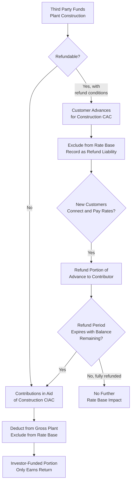

## Contributions in Aid of Construction and Customer Advances

### Definition and Purpose

Contributions in Aid of Construction (CIAC) and Customer Advances for Construction (CAC) are rate base offset items representing capital contributed by third parties — typically customers, developers, or governmental entities — toward the cost of utility plant, rather than capital supplied by the utility's investors. Because this capital was not supplied by investors expecting a return, its presence in the utility's plant accounts must be recognized as a reduction to rate base; otherwise, investors would earn a return on capital they never actually provided. This item closes out the chapter's coverage of rate base components by addressing these deduction items, which operate as a direct counterpart to the additive components (plant, working capital, materials and supplies) covered in preceding items.

### Contributions in Aid of Construction (CIAC)

**Key Points**

- CIAC represents non-refundable payments or property transfers made by customers, developers, or other third parties to help fund the construction of utility plant that will primarily or exclusively serve them
- Common in situations where extending service to a new customer or development requires plant investment exceeding what the utility would normally undertake based on expected revenue from that customer alone (e.g., a long service line extension to a remote location, or oversized infrastructure to serve a large new subdivision)
- Because the contributing party does not expect the funds back and is not an investor entitled to a return, the contributed amount is deducted from gross plant (or otherwise excluded from rate base) so that ratepayers as a whole are not required to pay a return on plant that was substantially or entirely funded by the specific customer or developer who benefits from it

**Typical CIAC scenarios**:

1. **Line extension contributions**: A developer or individual customer pays for some or all of the cost of extending distribution lines to a new subdivision or remote property, where the utility's standard line extension policy would otherwise require the customer to bear costs exceeding a defined allowance
2. **Government or third-party grants**: Federal, state, or local government grants or other third-party contributions toward specific infrastructure projects (e.g., broadband expansion grants for a combination utility, or economic development incentive grants tied to specific plant construction)
3. **Developer-installed infrastructure transferred to the utility**: A real estate developer constructs distribution infrastructure within a new development at its own expense and transfers ownership of that completed infrastructure to the utility, which then operates and maintains it

**Example**

A distribution utility is asked to extend service to a new industrial customer located 3 miles from the nearest existing distribution line. Under the utility's standard line extension policy, it will fund line extension costs up to $150,000 (based on the customer's expected revenue), with the customer required to contribute any cost above that threshold. The total line extension cost is $400,000. The customer contributes $250,000 (the amount above the utility's standard allowance) as CIAC. The utility's gross plant reflects the full $400,000 investment, but rate base is reduced by the $250,000 CIAC, since only the $150,000 investor-funded portion should earn a return through rates paid by the general customer base.

$$RateBaseInclusion = TotalPlantCost - CIAC = 400{,}000 - 250{,}000 = \$150{,}000$$

### Accounting Treatment of CIAC

**Key Points**

- CIAC is typically recorded as a credit (contra) balance against gross plant, or in some accounting frameworks as a deferred credit amortized over the life of the associated asset, rather than being recognized immediately as revenue
- The associated depreciation expense on CIAC-funded plant is likewise generally excluded from operating expense (or offset by amortization of the CIAC credit), since the utility should not both exclude the contributed capital from rate base and simultaneously charge ratepayers the full depreciation expense on that same contributed portion
- Federal tax treatment of CIAC has historically varied and been subject to legislative change (including periods where certain CIAC was treated as taxable income to the utility upon receipt), which can create a associated deferred tax consideration requiring coordination with the Accumulated Deferred Income Tax rate base component discussed elsewhere in this chapter

**[Inference]** Because federal and state tax treatment of CIAC has been subject to legislative change over time and can differ based on the type of contributing party (e.g., government versus private developer) and the specific utility sector, the currently applicable tax treatment for a specific CIAC transaction should be confirmed against current federal and state tax law rather than assumed to follow historical treatment.

### Customer Advances for Construction (CAC)

**Key Points**

- Distinguished from CIAC in that a Customer Advance is a **refundable** payment: the customer or developer advances funds to the utility for construction, with an expectation of partial or full refund over time, typically as new customers connect to the extended facilities and begin generating revenue for the utility
- Common in developer-funded line extensions for new subdivisions, where the developer advances the full extension cost, and the utility refunds a portion of the advance to the developer as each new lot connects to service and begins paying rates, up to a defined refund period or cap
- Because CAC is refundable, it is generally treated similarly to CIAC for rate base purposes while advanced (excluded from rate base, since it does not represent investor capital), but the utility must track the refund obligation as a liability and reduce that liability as refunds are made

**Example**

A developer advances $500,000 to a water utility to construct distribution mains and service connections for a 100-lot subdivision. Under the utility's tariff, the utility refunds the developer $5,000 for each new lot that connects and begins paying rates, up to the full $500,000 advance, over a refund period of up to 10 years, after which any unrefunded balance converts to non-refundable CIAC. During the test year, 30 lots have connected, and the utility has refunded $150,000 to the developer; the remaining $350,000 advance balance continues to be excluded from rate base until either refunded or converted to CIAC at the end of the refund period.

### Comparative Table: CIAC vs. CAC

| Dimension | Contributions in Aid of Construction (CIAC) | Customer Advances for Construction (CAC) |
| --- | --- | --- |
| Refundability | Non-refundable | Refundable (in whole or part, subject to conditions) |
| Rate base treatment | Deducted from gross plant / excluded from rate base | Excluded from rate base while advance is outstanding |
| Balance sheet classification | Contra-plant account or deferred credit | Liability (refund obligation) |
| Typical triggering scenario | Line extensions beyond standard allowance, grants, developer-donated infrastructure | Developer-funded subdivision infrastructure with per-connection refund mechanism |
| Conversion | Generally permanent | May convert to CIAC if unrefunded balance remains after the refund period expires |

### Rate Base Deduction Flow

### Policy Rationale and Cross-Subsidization Concerns

**Key Points**

- The core policy rationale underlying CIAC and CAC treatment is preventing cross-subsidization: without these mechanisms, the general body of existing ratepayers would bear the cost (through the return component of the revenue requirement) of extending service to new customers or developments whose own expected revenue does not justify the full investment
- Utility line extension policies, which establish the specific allowance thresholds triggering CIAC or CAC requirements, are themselves often subject to commission approval and periodic review, balancing the goal of preventing cross-subsidization against broader policy objectives such as encouraging economic development, rural electrification, or specific infrastructure expansion goals (e.g., broadband or electric vehicle charging infrastructure extension policies)
- Disputes can arise over whether a specific extension allowance policy correctly balances these considerations, and over the correct classification of a specific contribution as CIAC versus CAC versus fully investor-funded plant

**[Inference]** Because specific line extension allowance policies, refund period lengths, and per-connection refund amounts are typically established through utility tariffs subject to commission approval and can vary considerably by utility, jurisdiction, and utility sector (electric, gas, water), the applicable policy for a specific utility should be confirmed against that utility's currently effective, commission-approved tariff rather than assumed to follow a general industry standard.

### Interaction with the Broader Rate Base Framework

Incorporating CIAC and CAC as deduction items completes the general rate base formula introduced in this chapter's overview and refined through the subsequent items on plant, depreciation, CWIP, AFUDC, and working capital:

$$RB = NetPlant + CWIP_{(if\ included)} + WorkingCapital + MaterialsAndSupplies + Prepayments - AccumulatedDeferredIncomeTaxes - CIAC - CAC_{(outstanding)} \pm OtherAdjustments$$

As with every other rate base component examined in this chapter, correct classification and quantification of CIAC and CAC amounts is subject to the same underlying original cost, used-and-useful, and prudence principles, ensuring that the final rate base figure accurately reflects only the capital investors have supplied and are entitled to earn a return upon.

### Related Topics

- Rate Base, Expenses, and Return Components Overview
- Plant in Service and Gross Utility Plant
- Working Capital Allowance and Lead-Lag Studies
- Materials, Supplies, and Prepayments
- Accumulated Deferred Income Taxes (ADIT) in Rate Base
- Used and Useful Standard for Rate Base Inclusion
- Line Extension Policies and Tariff Design
- Cross-Subsidization and Cost Causation Principles in Ratemaking