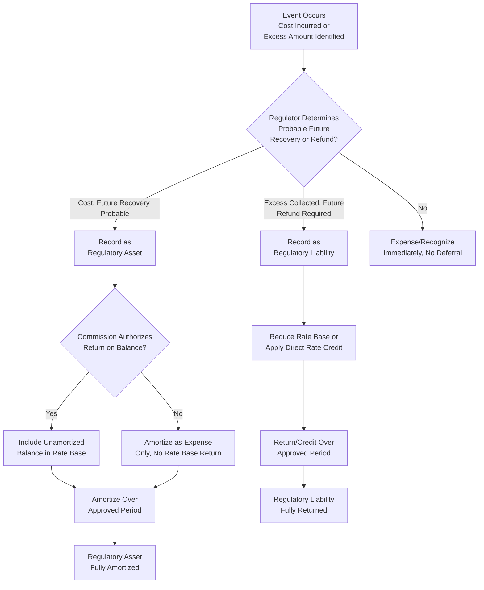

## Regulatory Assets and Liabilities in Rate Base

### Definition and Purpose

Regulatory Assets and Regulatory Liabilities are specialized balance sheet items arising specifically from the ratemaking process itself, created when a regulator's actions cause the timing of cost or revenue recognition for accounting purposes to diverge from the timing of cash recovery through rates. These items exist because regulation, unlike a competitive market, gives a commission the authority to determine when a utility may recover a cost or must return an amount to customers — creating accounting recognition (under Financial Accounting Standards Board guidance specific to rate-regulated entities) of amounts that would not exist as assets or liabilities for an unregulated company. This item concludes the chapter's rate base component coverage by addressing these regulator-created balance sheet items.

### The Accounting Foundation: Regulated Operations Accounting

**Key Points**

- Regulatory assets and liabilities exist under specialized accounting guidance applicable to entities whose rates are established by an independent regulator through a cost-based (or similarly regulated) process, and where it is probable that the regulator's actions will permit recovery of specific incurred costs through future rates, or will require future rates to reflect a refund or credit to customers
- A **regulatory asset** represents a cost the utility has already incurred (or a reduced revenue amount already recognized) that the utility expects to recover from customers in future rates — in effect, a right to future cash collection created by the regulatory process
- A **regulatory liability** represents an amount the utility has already collected from customers (or an obligation arising from regulatory action) that must be returned to customers, or applied to reduce future rates, rather than retained as utility earnings
- Absent specific regulatory action creating this probable future recovery or refund, an unregulated company would typically expense the cost immediately (for a regulatory-asset-type item) or recognize it as immediate revenue (for a regulatory-liability-type item) rather than deferring recognition

### Common Categories of Regulatory Assets

**Key Points**

- Regulatory assets typically arise when a commission defers recovery of a cost that would otherwise be expensed immediately, spreading recovery over a future period through amortization, often (though not always) earning a return on the unamortized balance in the interim

**Typical regulatory asset categories**:

1. **Storm restoration cost deferrals**: Following a major storm event causing unusually large restoration expense, a commission may authorize the utility to defer the excess cost above normal levels as a regulatory asset, to be amortized and recovered over a period of several years rather than being expensed entirely in the year incurred, mitigating the rate impact of a single unusually severe event
2. **Deferred pension and other post-employment benefit (OPEB) costs**: Amounts related to pension and OPEB expense recognition differences between accounting standards and the amount actually reflected in rates
3. **Deferred fuel or purchased power costs**: In jurisdictions using fuel adjustment clauses or similar cost-recovery mechanisms, amounts representing fuel costs incurred but not yet reflected in current rates through the adjustment mechanism, pending a future true-up
4. **Unrecovered plant costs following early retirement**: As referenced in the accumulated depreciation item elsewhere in this chapter, the unrecovered net book value of a plant asset retired substantially before the end of its expected useful life (e.g., due to a policy-driven early retirement of a generating unit) may be recorded as a regulatory asset if the commission authorizes continued recovery of that unrecovered balance over a future period
5. **Deferred income tax regulatory assets/liabilities**: Amounts arising from the interaction of tax law changes (such as changes in the federal corporate tax rate) with previously established deferred tax balances, where a commission determines a specific treatment and recovery/return period for the resulting adjustment

**Example**

A utility incurs $40 million in storm restoration costs following a major hurricane, well above its normal annual storm expense (which is otherwise addressed through the normalization techniques discussed in the prior chapter). Rather than expensing the full $40 million in the year incurred — which would create a significant, one-time rate impact — the commission authorizes the utility to record the cost as a regulatory asset and amortize it over five years, recovering approximately $8 million per year through rates (plus a carrying charge on the unamortized balance, if authorized) over that period.

$$AnnualAmortization = \frac{RegulatoryAssetBalance}{AmortizationPeriod} = \frac{40{,}000{,}000}{5} = \$8{,}000{,}000\ per\ year$$

### Common Categories of Regulatory Liabilities

**Key Points**

- Regulatory liabilities typically arise when a utility has collected more from customers than its actual costs justify, or when a commission determines that a specific benefit (such as a tax law change producing a windfall gain) must be returned to customers rather than retained by the utility

**Typical regulatory liability categories**:

1. **Excess deferred income taxes (EDIT)**: When a change in the federal corporate income tax rate reduces a utility's previously recorded deferred tax liability, the resulting excess is generally required to be returned to customers over time (often subject to specific normalization rules under the Internal Revenue Code for certain categories of protected EDIT related to accelerated tax depreciation), rather than retained by the utility as a windfall
2. **Over-collected fuel or purchased power costs**: Under a fuel adjustment clause or similar mechanism, amounts collected from customers in excess of actual fuel costs incurred, pending refund or credit against future rates
3. **Removal cost regulatory liabilities**: In some accounting frameworks, amounts collected through depreciation rates for anticipated future asset removal costs (negative net salvage, as discussed in the accumulated depreciation item elsewhere in this chapter) that have not yet been spent are recorded as a regulatory liability, since they represent funds collected from customers in advance of the corresponding removal cost being incurred
4. **Deferred gains on asset sales**: Gains realized on the sale of utility property that a commission determines should benefit customers (through a rate credit or reduction) rather than being retained entirely as utility shareholder income

**Example**

Following a reduction in the federal corporate income tax rate, a utility's previously recorded deferred tax liability associated with accelerated tax depreciation on its plant becomes excessive relative to the new, lower tax rate. This excess deferred income tax (EDIT) must generally be returned to customers, but a portion (protected EDIT, associated with certain accelerated depreciation methods) is subject to normalization rules requiring return over a period no shorter than the underlying asset's remaining regulatory or tax life, while unprotected EDIT may be returned to customers over a shorter period as determined by the commission.

### Regulatory Assets and Liabilities in the Rate Base Formula

**Key Points**

- Whether a specific regulatory asset or liability earns (or bears) a return, and whether it is explicitly included as a separate rate base line item versus addressed solely through an amortization expense in the revenue requirement's operating expense component, depends on the specific commission order authorizing its creation
- Where a commission authorizes a return on the unamortized regulatory asset balance (compensating the utility for the financing cost of capital deferred for later recovery, conceptually similar to AFUDC treatment discussed elsewhere in this chapter), the unamortized balance is added to rate base
- Where a regulatory liability represents amounts already collected from customers that must be returned, it typically reduces rate base (since it represents customer-supplied, not investor-supplied, capital awaiting return) or is addressed through a direct rate credit mechanism outside the base rate base calculation entirely

$$RB_{adjustment} = +UnamortizedRegulatoryAssets_{(if\ earning\ return)} - UnamortizedRegulatoryLiabilities_{(if\ reducing\ rate\ base)}$$

### Regulatory Asset/Liability Lifecycle

### Recognition Criteria and Commission Discretion

**Key Points**

- The threshold determination of whether a cost or excess amount qualifies for regulatory asset or liability treatment (rather than immediate expense recognition or immediate revenue recognition) rests on whether future recovery or refund through the ratemaking process is "probable," a standard requiring an actual or reasonably anticipated regulatory action authorizing that treatment
- A cost that a utility believes should be recoverable, but for which no specific commission order or clearly applicable regulatory mechanism exists, generally does not qualify for regulatory asset treatment and must instead be expensed immediately, creating a direct earnings impact
- This creates a recurring strategic dynamic in which utilities facing large, unusual costs frequently petition commissions for specific authorization to defer and amortize those costs as regulatory assets, precisely to avoid an immediate, potentially substantial hit to reported earnings

**[Inference]** Because the "probable" recovery standard and the specific accounting and regulatory criteria for establishing a regulatory asset or liability are governed by professional accounting standards (applicable to rate-regulated entities) in conjunction with specific commission orders, and because commission willingness to authorize deferral treatment for a specific cost category varies by jurisdiction and by the particular facts of each case, whether a specific cost or excess amount currently qualifies for regulatory asset or liability treatment should be confirmed against both applicable accounting guidance and the specific commission's orders in that matter, rather than assumed automatically.

### Interaction with the Broader Rate Base and Revenue Requirement Framework

Regulatory assets and liabilities complete the chapter's coverage of rate base components by illustrating a distinct category: items created not by ordinary utility operations (plant construction, inventory, working capital) but directly by the regulatory process's own timing decisions. They connect to several concepts examined earlier in this chapter and the preceding chapter:

- **Attrition and pro forma adjustments**: A newly authorized regulatory asset (such as a storm cost deferral) is a clear example of a known-and-measurable, commission-authorized item that would be incorporated into a subsequent rate case's test year data
- **Accumulated depreciation and net salvage**: Removal cost regulatory liabilities, as discussed above, connect directly to the net salvage and depreciation reserve concepts examined in the accumulated depreciation item
- **AFUDC**: The carrying charge sometimes authorized on unamortized regulatory asset balances is conceptually and mechanically similar to AFUDC, compensating the utility for capital tied up pending future recovery

Taken together with plant, depreciation, CWIP, AFUDC, working capital, materials and supplies, and CIAC/CAC deductions covered throughout this chapter, regulatory assets and liabilities complete the full set of components a rate base study must identify, value, and appropriately include or exclude before the composite rate base figure is carried into the revenue requirement calculation introduced at the start of this chapter.

### Related Topics

- Rate Base, Expenses, and Return Components Overview
- Accumulated Depreciation and Net Plant
- Allowance for Funds Used During Construction (AFUDC)
- Accumulated Deferred Income Taxes (ADIT) in Rate Base
- Attrition Years and Forecasted Test Years
- Pro Forma and Known and Measurable Adjustments
- Excess Deferred Income Tax (EDIT) Normalization Rules
- Fuel Adjustment Clauses and Cost Recovery Mechanisms