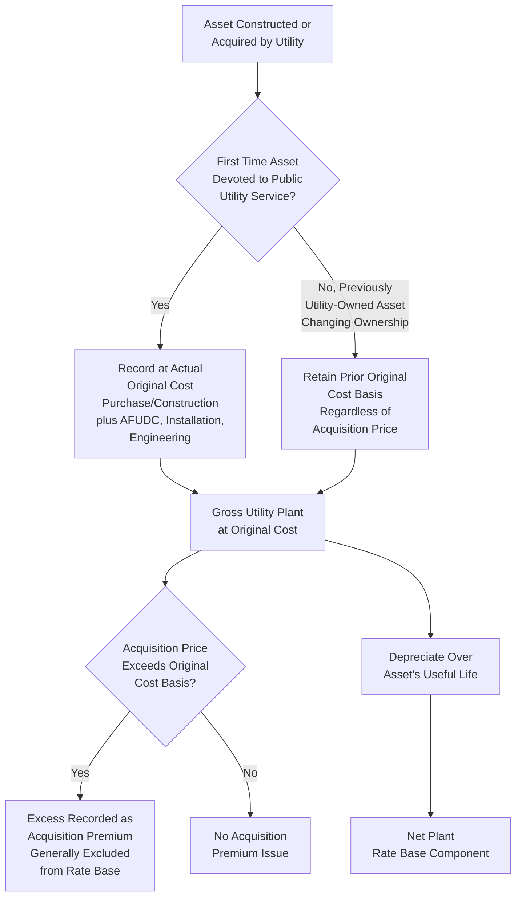

## Original Cost (Historical Cost) Methodology

### Definition and Purpose

Original Cost (Historical Cost) methodology is the dominant asset valuation standard used in U.S. utility ratemaking, under which utility plant is recorded and included in rate base at the actual dollar cost incurred by the entity that first devoted the asset to public utility service. This item examines the methodology's legal and theoretical foundations in depth, providing the valuation-theory grounding for the rate base components already introduced throughout the preceding chapter, and setting up the comparative discussion of alternative valuation methodologies addressed in adjacent items within this chapter.

### Legal and Theoretical Foundation

**Key Points**

- Original cost methodology is rooted in the principle that a utility's investors are entitled to a fair opportunity to recover the actual capital they committed to utility service, plus a reasonable return on that capital — not on some other, potentially inflated or deflated, measure of asset value
- The methodology gained its position as the dominant U.S. approach following a period of significant legal and regulatory debate in the early-to-mid 20th century regarding whether rate base should instead be valued at "fair value" (a blended or reproduction-cost-based standard, discussed in a related item within this chapter)
- The U.S. Supreme Court's decision in *Federal Power Commission v. Hope Natural Gas Co.* (1944) is generally regarded as the pivotal case establishing that regulators have broad discretion in selecting a rate base valuation methodology, so long as the "end result" produces rates that are just and reasonable and allow the utility a reasonable opportunity to earn a fair return — a standard broad enough to permit original cost methodology (among others) without constitutionally mandating any single specific valuation approach

**[Inference]** Because the precise legal weight and continuing interpretation of *Hope Natural Gas* and related precedent is a matter of ongoing judicial and regulatory interpretation that can be refined by subsequent case law, this description reflects generally accepted historical characterization of the case's significance rather than a live, currently litigated legal question, and any argument resting on specific legal interpretation of these cases should be verified against current appellate authority in the relevant jurisdiction.

### Original Cost vs. Alternative Valuation Standards (Brief Comparative Framing)

**Key Points**

- Prior to the mid-20th century, some jurisdictions applied a "fair value" rate base standard (sometimes associated with the Supreme Court's earlier decision in *Smyth v. Ames*, 1898), which considered factors such as reproduction cost new, original cost, and market value of securities in determining rate base
- Original cost methodology displaced fair value approaches in most U.S. jurisdictions in significant part because fair value calculations proved highly volatile, difficult to administer consistently, and prone to producing rate base swings disconnected from a utility's actual invested capital, particularly during inflationary periods when reproduction cost figures could substantially exceed a utility's actual original investment
- A detailed comparative examination of fair value and other alternative rate base valuation methodologies (including their historical development and reasons for their general abandonment in U.S. practice) is addressed in a separate item within this chapter

### Mechanics of Original Cost Determination

**Key Points**

- As established in the plant-in-service item in the preceding chapter, original cost includes the purchase price or direct construction cost, installation labor, engineering costs, freight, applicable sales and use taxes, and capitalized AFUDC, all recorded at the amount actually expended by the utility (or its predecessor in the case of an asset acquired through merger or acquisition) at the time the asset was first devoted to utility service
- Original cost is fixed at the time the asset enters service and does not fluctuate with subsequent changes in replacement cost, inflation, or market value; only additions, retirements, and depreciation subsequently change the recorded gross and net plant balances, as covered in the gross plant and accumulated depreciation items in the preceding chapter

**Example**

A transmission tower constructed in 2005 for $180,000 remains recorded in gross plant at $180,000 (before depreciation) indefinitely, even if the estimated cost to construct an identical replacement tower in the current period is $310,000 due to inflation, materials cost increases, and changed labor rates. Under original cost methodology, rate base and the associated return calculation are based on the $180,000 actually invested, not the $310,000 current reproduction cost.

$$RateBaseInclusion_{OriginalCost} = HistoricalPurchasePrice + CapitalizedAdditionalCosts$$

$$\neq CurrentReplacementCost$$

### Original Cost and Successor Ownership (The "Original Cost to the Person First Devoting to Public Service" Principle)

**Key Points**

- A distinguishing and sometimes counterintuitive feature of original cost methodology is that when utility plant changes ownership — through a merger, acquisition, or sale of utility assets — the original cost basis generally does not reset to the acquisition price paid by the new owner
- Instead, the plant continues to be recorded, for ratemaking purposes, at its original cost to the entity that first dedicated it to public utility service, a principle intended to prevent rate base inflation through successive corporate transactions where each new owner might otherwise claim a higher rate base based on an acquisition premium
- Any difference between the acquisition price paid and the continuing original cost basis (commonly called "acquisition premium" or, in merger accounting terms, goodwill) is generally excluded from rate base, though some jurisdictions permit limited recovery of acquisition premium where the transaction is shown to produce demonstrable customer benefits (cost savings, service improvements) that would not otherwise have occurred

**Example**

Utility A originally constructed a distribution system at a total original cost of $200 million. Utility B later acquires Utility A (and its regulated assets) for a total purchase price of $260 million, reflecting a $60 million acquisition premium above the original cost basis. For ratemaking purposes, the acquired plant generally continues to be included in rate base at the original $200 million original cost basis (adjusted for ongoing depreciation, additions, and retirements since original construction), rather than the $260 million acquisition price, and the $60 million acquisition premium is typically excluded from rate base absent specific commission authorization based on demonstrated customer benefit.

**[Inference]** Because the specific treatment of acquisition premium (full exclusion versus conditional, benefit-based partial recovery) is governed by commission precedent and, in some jurisdictions, specific merger-approval statutes or conditions negotiated as part of a specific transaction's regulatory approval, the applicable treatment for a specific transaction and jurisdiction should be confirmed against that jurisdiction's currently effective merger and acquisition ratemaking rules rather than assumed to follow a single universal approach.

### Original Cost Determination Process Flow

### Advantages of Original Cost Methodology

- **Objectivity and verifiability**: Original cost figures are drawn from actual transaction records, invoices, and accounting entries, providing an objectively verifiable basis for rate base determination, in contrast to reproduction cost or fair value estimates that require subjective appraisal judgment
- **Administrative stability**: Because original cost does not fluctuate with market conditions or inflation, it provides a stable, predictable rate base calculation from case to case, subject only to the additions, retirements, and depreciation activity actually occurring, reducing administrative burden and litigation over asset valuation itself (as distinct from litigation over which specific costs qualify for capitalization, covered in the plant-in-service item)
- **Consistency with investor expectations**: Original cost methodology aligns rate base with the actual capital investors committed, supporting the fundamental ratemaking principle (reinforced by *Hope Natural Gas*) that investors are entitled to a reasonable opportunity to recover their actual investment plus a fair return, rather than a windfall or shortfall based on unrelated market value fluctuations

### Criticisms and Limitations of Original Cost Methodology

- **Understatement during inflationary periods**: Critics have long argued that original cost, by design, does not reflect the current cost of replacing aging infrastructure, potentially understating the utility's true ongoing capital requirements during periods of sustained inflation, and creating a systematic bias toward under-recovery of the utility's actual replacement cost burden over time
- **Potential disincentive for asset replacement**: Because a fully or substantially depreciated asset carries a low remaining rate base value regardless of its current replacement cost, some argue original cost methodology can create a financial disincentive for utilities to proactively replace aging infrastructure before failure, since the rate base (and therefore the return-generating asset) value associated with the replacement may be similar in scale to keeping older, cheaper-to-maintain-on-the-books assets on the system
- **Does not reflect current market value of the enterprise**: Original cost methodology, particularly combined with the successor-ownership principle described above, means that a utility's rate base can diverge substantially from what a willing buyer might pay for the same operating utility system in an arm's-length transaction, a divergence that becomes particularly visible during merger and acquisition transactions

### Relevance to the Rate Base Framework Established in the Prior Chapter

Original cost methodology is the valuation foundation underlying every rate base component examined in the preceding chapter — plant in service, accumulated depreciation, CWIP, AFUDC (which itself is capitalized onto and becomes part of original cost), materials and supplies, and CIAC/CAC deductions are all valued and recorded using the original cost standard described in this item. Understanding original cost as the governing valuation principle clarifies why, for example, AFUDC is added to an asset's capitalized cost (preserving the original cost standard by capturing the actual financing cost incurred) rather than the asset instead being revalued to current replacement cost upon completion.

### Related Topics

- Plant in Service and Gross Utility Plant
- Accumulated Depreciation and Net Plant
- Allowance for Funds Used During Construction (AFUDC)
- Fair Value and Reproduction Cost Valuation Methodologies (Historical Alternatives)
- Used and Useful Standard for Rate Base Inclusion
- Acquisition Premium and Merger-Related Ratemaking Treatment
- *Federal Power Commission v. Hope Natural Gas Co.* and the "End Result" Standard
- Prudence Review and Disallowance Standards