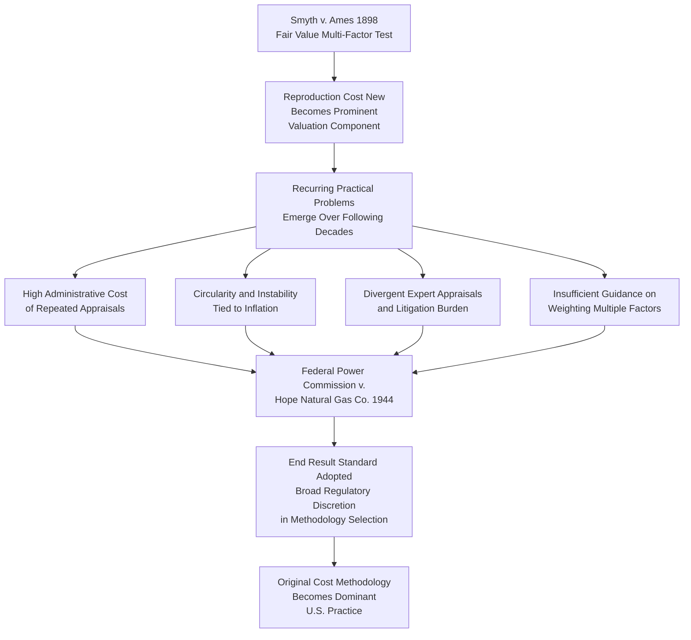

## Fair Value and Reproduction Cost Doctrines

### Definition and Purpose

Fair Value and Reproduction Cost doctrines were the dominant rate base valuation methodologies in U.S. utility regulation prior to the mid-20th century, before being substantially displaced by the original cost methodology examined in the preceding item. This item provides the detailed historical and analytical treatment of these superseded doctrines, explaining both their theoretical rationale and the specific practical and legal difficulties that led to their general abandonment, offering essential comparative context for understanding why original cost methodology became — and remains — the dominant U.S. approach.

### The Fair Value Doctrine

**Key Points**

- The fair value doctrine held that a utility's rate base should reflect the current fair value of its property devoted to public service, rather than the historical dollar amount actually invested
- Rooted in the U.S. Supreme Court's 1898 decision in *Smyth v. Ames*, which articulated a multi-factor test for determining fair value, directing regulators to give weight to several distinct valuation indicators simultaneously
- The doctrine was understood to require regulators to balance competing valuation signals rather than relying on any single measure, reflecting an underlying (and, in retrospect, administratively difficult) assumption that a single "true" value could be derived by synthesizing multiple different valuation approaches

**Smyth v. Ames factors traditionally considered in fair value determinations** (illustrative, as commonly summarized in regulatory and legal treatises):

1. Original cost of construction
2. Current cost of reproducing the property (reproduction cost new)
3. The amount and market value of outstanding bonds and stock
4. Present as compared with original cost of construction
5. Probable earning capacity of the property
6. Operating expenses

### The Reproduction Cost Doctrine

**Key Points**

- Reproduction Cost (sometimes called "reproduction cost new," or when adjusted for age and condition, "reproduction cost new less depreciation") was one of the specific valuation components within the broader fair value framework, but became a particularly prominent and heavily litigated element in its own right
- Reproduction cost estimates the amount it would cost, using then-current prices for labor and materials, to construct a replica of the utility's existing physical plant at the time of the rate proceeding
- Reproduction cost estimates were typically prepared by specialized engineering appraisal firms, involving detailed physical inventories of utility plant and application of current unit-cost pricing to each inventoried item

**Reproduction Cost New Less Depreciation (RCNLD) formula concept**:

$$RCNLD = ReproductionCostNew - AccruedDepreciation_{(based\ on\ condition\ and\ age)}$$

**Example (illustrative of the era's methodology)**

A utility's distribution system, originally constructed over several decades at a cumulative original cost of $15 million, is appraised under reproduction cost methodology at the then-current cost of constructing an identical system using present-day labor and material prices, yielding a reproduction cost new figure of $28 million — nearly double the original cost, reflecting decades of inflation, wage growth, and materials cost increases. After deducting estimated accrued depreciation based on the physical condition and remaining service life of the actual in-place plant, the RCNLD figure might be established at $19 million, a figure the utility would argue should carry substantial weight (or serve as the primary basis) for rate base determination — well above the $15 million original cost figure.

### Why Reproduction Cost and Fair Value Methodologies Were Generally Abandoned

**Key Points**

- Several converging practical, theoretical, and administrative problems led regulators and courts to move away from fair value and reproduction cost methodologies in favor of original cost, culminating in the shift generally associated with the Supreme Court's 1944 decision in *Federal Power Commission v. Hope Natural Gas Co.*, discussed in the preceding item

**Specific criticisms and practical problems**:

1. **Extreme administrative burden and cost**: Conducting a full reproduction cost appraisal required detailed physical inventories and current unit-cost pricing of the utility's entire plant, a labor-intensive and expensive undertaking that had to be substantially repeated in every subsequent rate proceeding as prices continued to change, in contrast to the comparatively simple, records-based original cost approach
2. **Inherent circularity and instability**: Because reproduction cost fluctuates with the same inflationary and economic conditions used to set rates, using reproduction cost as a basis for rate base could produce a circular or unstable relationship between rate base valuation and general price levels, undermining rate predictability and long-term regulatory planning for both utilities and customers
3. **Multi-factor test provided insufficient guidance**: The *Smyth v. Ames* multi-factor approach did not specify the relative weight to be given to each factor, leaving substantial discretion (and consequent unpredictability and litigation) in how a specific commission or court would balance original cost, reproduction cost, market value of securities, and earning capacity in reaching a final fair value determination
4. **Reproduction cost estimates were prone to manipulation and dispute**: Because reproduction cost appraisals depend heavily on assumptions about current unit costs, engineering design choices, and accrued depreciation judgments, utility-sponsored and intervenor-sponsored appraisals in the same proceeding often produced widely divergent results, generating extensive and costly expert testimony disputes
5. **Inflationary bias favoring utility investors during high-inflation periods**: Because reproduction cost typically exceeds original cost during inflationary periods (as illustrated in the example above), reliance on reproduction cost as a significant rate base component tended to systematically increase rate base — and therefore the dollar return investors could earn — purely as a function of general price inflation, disconnected from the utility's actual invested capital, a result increasingly viewed as difficult to justify as inflation became a more prominent economic concern in the early-to-mid 20th century

**[Inference]** Because the historical characterization of why these doctrines were abandoned reflects a synthesis of legal and regulatory-economics scholarship on this transition rather than a single definitive, universally agreed-upon account, and because the relative significance assigned to each contributing factor can vary among legal historians and regulatory economists, this account should be understood as a generally accepted summary rather than an exhaustive or uncontested historical record.

### Comparative Table: Fair Value/Reproduction Cost vs. Original Cost

| Dimension | Fair Value / Reproduction Cost Doctrine | Original Cost Doctrine |
| --- | --- | --- |
| Governing precedent | *Smyth v. Ames* (1898) | *Federal Power Commission v. Hope Natural Gas Co.* (1944) |
| Valuation basis | Current reproduction cost, blended with other factors | Actual historical dollar investment |
| Sensitivity to inflation | High — reproduction cost rises with current prices | Low — fixed at time of original investment |
| Administrative complexity | High — requires periodic physical/engineering appraisal | Lower — relies on existing accounting records |
| Predictability across rate cases | Low — appraisal results could vary significantly | High — original cost figures are stable absent new construction/retirements |
| Current prevalence in U.S. ratemaking | Rare; largely superseded | Dominant standard in most U.S. jurisdictions |

### Doctrinal Transition Flow

### Limited Continuing Relevance

**Key Points**

- While original cost methodology dominates U.S. utility ratemaking, fair value and reproduction cost concepts have not disappeared entirely from all valuation contexts; reproduction cost or replacement cost analysis may still appear in certain limited, non-rate-base contexts, such as insurance valuation, eminent domain/condemnation proceedings involving utility property, or specific statutory valuation requirements in a small number of jurisdictions that have retained fair-value-influenced rate base statutes
- Understanding these doctrines remains valuable primarily as historical and comparative context for the original cost standard, and for recognizing that the choice of rate base valuation methodology is a matter of regulatory policy discretion (per the *Hope Natural Gas* "end result" standard) rather than a single constitutionally compelled approach

**[Inference]** Because a small number of jurisdictions have historically retained fair-value-influenced statutory rate base language, and because such statutory provisions are subject to legislative amendment or judicial reinterpretation, whether any specific jurisdiction currently applies fair value or reproduction cost concepts to any degree should be verified against that jurisdiction's currently effective ratemaking statutes rather than assumed to have been universally and permanently superseded everywhere.

### Related Topics

- Original Cost (Historical Cost) Methodology
- *Federal Power Commission v. Hope Natural Gas Co.* and the "End Result" Standard
- Used and Useful Standard for Rate Base Inclusion
- Rate Base, Expenses, and Return Components Overview
- Plant in Service and Gross Utility Plant
- Cost of Capital: Debt, Equity, and Capital Structure
- Regulatory History and Evolution of U.S. Utility Ratemaking
- Acquisition Premium and Merger-Related Ratemaking Treatment