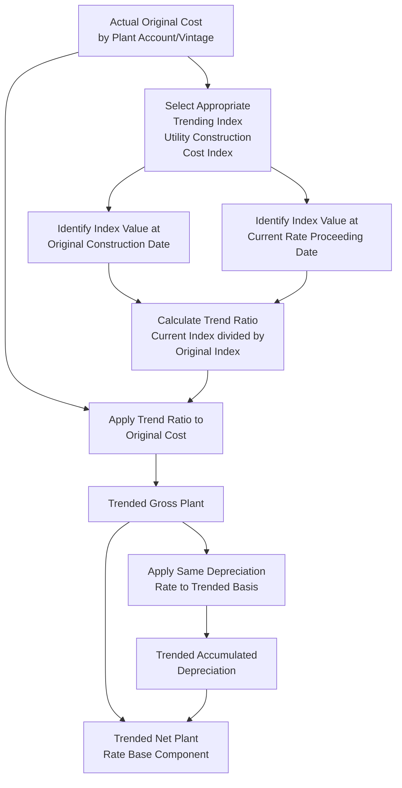

## Trended Original Cost Approaches

### Definition and Purpose

Trended Original Cost is a rate base valuation methodology that begins with an asset's actual original cost (as defined in the original cost methodology item earlier in this chapter) and then applies an inflation index or cost trend factor to restate that historical cost in current-period dollar terms, without conducting a full physical reproduction cost appraisal. This item examines trended original cost as a middle-ground approach positioned between the pure original cost doctrine and the reproduction cost doctrine discussed in the preceding items, most prominently associated with certain water utility rate base practices and specific historical and jurisdictional applications in U.S. ratemaking.

### Conceptual Positioning Relative to Original Cost and Reproduction Cost

**Key Points**

- Pure original cost methodology (examined earlier in this chapter) fixes rate base at the actual historical dollar amount invested, with no adjustment for subsequent inflation or price-level changes
- Reproduction cost methodology (examined in the preceding item) requires a full, current-period physical and engineering appraisal to estimate what it would cost to reproduce the entire plant using today's labor and materials prices
- Trended original cost occupies an intermediate position: it retains original cost as the starting record (avoiding the need for a full physical re-appraisal) but applies a standardized index-based trending factor to approximate the effect of inflation on that original investment, without the extensive engineering appraisal work reproduction cost methodology requires

### Trended Original Cost Formula

$$TrendedOriginalCost = OriginalCost \times \frac{PriceIndex_{current}}{PriceIndex_{atOriginalConstruction}}$$

Commonly used indices for this trending calculation include construction cost indices specific to utility plant categories (such as the Handy-Whitman Index of Public Utility Construction Costs, widely used historically in U.S. utility depreciation and valuation studies) or general producer price indices for relevant materials and labor categories.

**Example**

A water utility's water treatment plant was constructed in 1995 at an original cost of $12 million. A relevant utility construction cost index stood at 145 (index basis) at the time of original construction and stands at 410 at the time of the current rate proceeding. Applying a trended original cost calculation:

$$TrendedOriginalCost = 12{,}000{,}000 \times \frac{410}{145} = 12{,}000{,}000 \times 2.828 = \$33{,}931{,}034$$

Under a pure original cost approach, this asset would remain in rate base at $12 million (less accumulated depreciation); under a trended original cost approach, the trended figure of approximately $33.9 million (less depreciation calculated on the trended basis) would instead serve as the rate base value, producing a substantially larger rate base and correspondingly larger return component than pure original cost would allow.

### Primary Historical and Contemporary Application: Water Utility Ratemaking

**Key Points**

- Trended original cost has historically found its most consistent application in certain U.S. water utility ratemaking contexts, particularly in some state jurisdictions where water utility infrastructure (much of it buried, long-lived, and subject to significant cumulative inflation effects over many decades of service life) has been considered a candidate for trended treatment to address perceived original cost understatement concerns
- The rationale most commonly advanced for applying trended original cost specifically to water utilities centers on the unusually long service lives of core water infrastructure (mains, treatment facilities), which can span 75-100 years or more, creating a potentially larger and more consequential gap between original cost and current-dollar-equivalent investment than is typical for electric or gas utility plant with generally shorter average service lives

**[Inference]** Because the specific jurisdictions currently authorizing trended original cost methodology, and the scope of utility types and asset categories to which it is applied, reflect specific state statutes or long-standing commission practice subject to change, whether and how trended original cost methodology currently applies in any particular jurisdiction should be verified against that jurisdiction's currently effective ratemaking statutes and commission rules rather than assumed to be a generally available or generally prevalent U.S. approach.

### Trending Indices and Methodology Selection

**Key Points**

- The choice of trending index is a significant determinant of the resulting trended value, and different index choices (a general economy-wide inflation measure such as the Consumer Price Index, versus a construction-cost-specific index, versus a utility-specific labor and materials index) can produce materially different trended cost results for the same underlying original cost base
- Utility-specific construction cost indices (such as the historically prominent Handy-Whitman Index, tracking public utility construction costs by category and region) are generally considered more methodologically appropriate for trending utility plant than broad, general-economy inflation indices, since utility construction cost trends (driven by specialized labor, materials such as transformers and specialized piping, and regulatory/environmental compliance costs) do not necessarily move in lockstep with general consumer price inflation
- The trending calculation is typically applied at a granular level — by individual plant account or vintage group, consistent with the group depreciation accounting approach discussed in the accumulated depreciation item in the preceding chapter — rather than as a single blanket trend factor applied to total gross plant, since different plant categories were constructed in different periods and are subject to different underlying cost trend patterns

### Depreciation Treatment Under Trended Original Cost

**Key Points**

- When trended original cost is used as the rate base valuation basis, accumulated depreciation must also be recalculated on the trended basis to maintain internal consistency, rather than continuing to apply accumulated depreciation calculated against the original, untrended cost figures
- This requires recalculating a "trended accumulated depreciation" figure, generally using the same depreciation rate (percentage of original cost, adjusted for net salvage, as discussed in the accumulated depreciation item) applied against the trended gross cost rather than the original untrended gross cost

$$TrendedNetPlant = TrendedGrossPlant - TrendedAccumulatedDepreciation$$

**Example (continuing the water treatment plant illustration)**

If the treatment plant described above has a depreciation rate reflecting 40% of its estimated service life elapsed, the trended accumulated depreciation would be calculated as 40% of the trended gross cost of $33,931,034, or approximately $13,572,414, yielding a trended net plant figure of approximately $20,358,620, compared to a net plant figure under pure original cost of $7,200,000 (40% depreciation applied to the original $12,000,000).

### Comparative Table: Original Cost vs. Trended Original Cost vs. Reproduction Cost

| Dimension | Original Cost | Trended Original Cost | Reproduction Cost |
| --- | --- | --- | --- |
| Starting basis | Actual historical dollar investment | Actual historical dollar investment | Estimated current construction cost |
| Adjustment mechanism | None (fixed at historical amount) | Applied index/trend factor | Full engineering/physical appraisal |
| Administrative burden | Low (uses existing accounting records) | Moderate (requires index selection and application) | High (requires detailed physical inventory and current pricing) |
| Sensitivity to inflation | None | Partial, index-dependent | Full, appraisal-based |
| Prevalence in current U.S. ratemaking | Dominant | Limited, primarily certain water utility contexts | Rare |

### Trended Original Cost Calculation Flow

### Criticisms and Limitations

- **Reintroduces some administrative and litigation complexity**: While less burdensome than a full reproduction cost appraisal, trended original cost still requires selection and defense of a specific trending index and methodology, which can become a point of dispute between utility and intervenor witnesses, partially reintroducing the index-selection and methodology disputes that reproduction cost doctrine was, in part, abandoned for
- **Departure from the "actual investment" principle**: Critics argue that trended original cost, by increasing rate base beyond the utility's actual historical dollar investment, departs from the core original cost principle that investors are entitled to recover their actual invested capital plus a reasonable return — not an inflation-adjusted approximation of what that capital might be worth in current terms
- **Potential rate impact concerns**: Because trended original cost can substantially increase rate base (as illustrated in the water treatment plant example above), and therefore the dollar return component of the revenue requirement, its adoption in place of pure original cost methodology can produce materially higher rates for customers, a consideration regulators weigh carefully when petitioned to adopt or expand trended original cost treatment

### Relevance to the Broader Valuation Methodology Framework

Trended original cost illustrates that the choice of rate base valuation methodology, as established under the *Hope Natural Gas* "end result" standard discussed in the original cost item earlier in this chapter, remains a matter of regulatory policy discretion rather than a single fixed national approach — jurisdictions retain latitude to adopt intermediate or hybrid valuation methodologies suited to particular utility sectors or infrastructure characteristics, provided the resulting rates satisfy the just-and-reasonable, fair-opportunity-to-earn-a-return standard governing utility ratemaking generally.

### Related Topics

- Original Cost (Historical Cost) Methodology
- Fair Value and Reproduction Cost Doctrines
- *Federal Power Commission v. Hope Natural Gas Co.* and the "End Result" Standard
- Accumulated Depreciation and Net Plant
- Plant in Service and Gross Utility Plant
- Used and Useful Standard for Rate Base Inclusion
- Water Utility Ratemaking Considerations
- Depreciation Studies and Survivor Curve Analysis