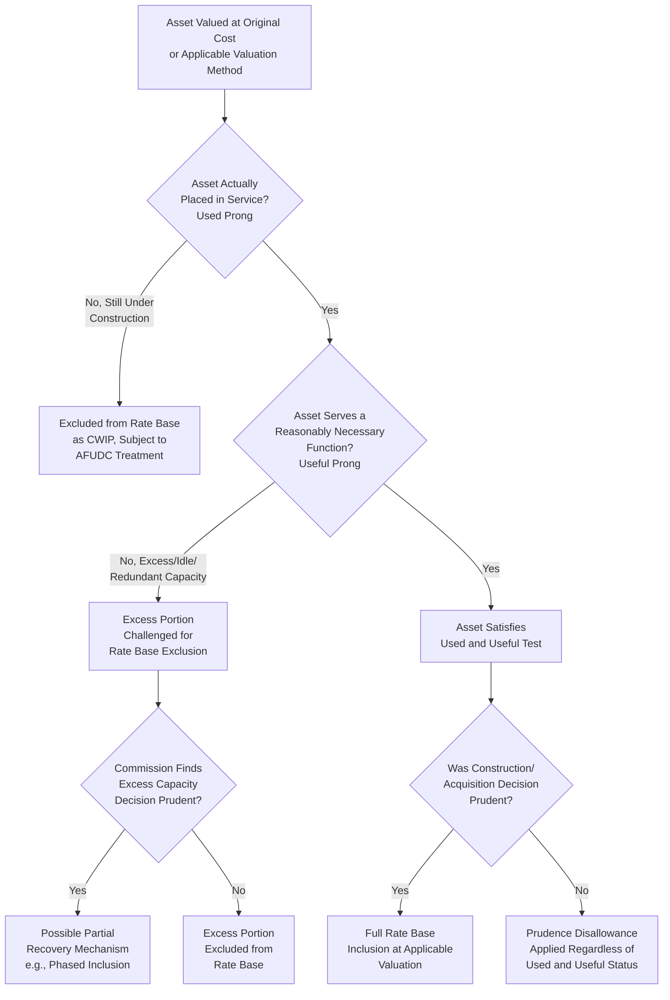

## The Used and Useful Test

### Definition and Purpose

The Used and Useful test is a foundational rate base eligibility principle requiring that, regardless of which valuation methodology (original cost, trended original cost, or historically, reproduction cost) is applied, an asset may be included in rate base only if it is actually serving customers by providing utility service in the ordinary course of business. This item examines the standard in depth, connecting the valuation methodologies covered earlier in this chapter to the threshold eligibility question of which assets may be valued and included in rate base at all.

### Core Principle and Rationale

**Key Points**

- The used and useful standard reflects the fundamental ratemaking principle that customers should pay a return only on capital that is actually providing them service, not on excess, idle, obsolete, or prematurely constructed capacity that provides no current benefit
- Conversely, the standard also protects utility investors by generally ensuring that any asset satisfying the test is entitled to inclusion in rate base and a fair opportunity for return, once the threshold showing of actual service is made
- The standard operates as a gatekeeping requirement applied after an asset's original cost (or other applicable valuation) has been determined, but before that valued asset is finally included in the rate base calculation — a distinct and additional inquiry from the cost determination questions examined throughout this chapter and the preceding chapter

### Components of the Used and Useful Analysis

**Key Points**

- **"Used"**: The asset must be actually placed in service and employed in providing utility service, as opposed to sitting idle, held in reserve without current operational purpose, or still under construction (the CWIP condition, discussed in the preceding chapter's CWIP item, being the paradigm case of an asset not yet "used")
- **"Useful"**: The asset must serve a legitimate, reasonably necessary function in the utility's provision of service — an asset that is technically in service but excessive, redundant, or serving no genuine operational purpose may fail this prong even though it is nominally "used"

**Common categories of used and useful disputes**:

1. **Excess capacity**: Generation, transmission, or treatment capacity built substantially beyond what current or reasonably near-term projected demand requires, where the excess portion may be challenged as not currently useful
2. **Prematurely retired or stranded assets**: Plant retired from service before the end of its expected useful life (e.g., due to a policy-driven early retirement, changed market conditions, or a superseding technology), which by definition is no longer "used," raising the question of whether and how any remaining unrecovered cost may still be recovered (often addressed, where recovery is authorized, through the regulatory asset mechanism discussed in the prior chapter, rather than through ordinary rate base inclusion)
3. **Partially completed or partially utilized projects**: A facility built with modular capacity additions where only a portion of total design capacity is currently needed, raising the question of whether the unused portion should be excluded from rate base until demand grows to utilize it
4. **Standby or reserve equipment**: Backup generation, redundant transmission paths, or reserve treatment capacity maintained for reliability purposes, which utilities typically argue is "useful" for reliability even when not actively operating, while intervenors may challenge the reasonableness of the specific reserve margin maintained

**Example**

A water utility constructs a new treatment plant with a design capacity of 20 million gallons per day (MGD), anticipating future service area growth, but current actual demand only requires 12 MGD of treatment capacity, with the additional 8 MGD not expected to be needed for approximately 15 years based on the utility's own growth projections. An intervenor may argue that the 8 MGD of excess capacity is not currently "useful" and should be excluded from rate base until demand grows to require it, while the utility may argue that constructing to the larger design capacity was a prudent, cost-effective decision (e.g., due to economies of scale in plant construction, or to avoid a more disruptive and costly later expansion) and that the full facility should be includable, particularly if the excess capacity decision was itself found prudent at the time it was made.

### The Interaction Between Used and Useful and Prudence Review

**Key Points**

- Used and useful and prudence review (introduced in the plant-in-service item in the preceding chapter) are related but analytically distinct inquiries: prudence asks whether the decision to construct or acquire the asset was reasonable at the time it was made, based on information then available; used and useful asks whether the asset is, in fact, currently serving customers
- An asset can be prudently constructed yet still fail the used and useful test if circumstances have changed since construction (e.g., anticipated demand growth did not materialize), and conversely, an asset can satisfy the used and useful test (it is, in fact, currently in service and functioning) while still facing prudence challenges regarding excessive construction costs or delays
- Some jurisdictions apply a more forgiving standard where a prudently planned investment that does not immediately prove used and useful (due to unforeseen changes in demand or other circumstances) may still receive some degree of cost recovery, recognizing that requiring perfect demand forecasting as a condition of cost recovery could excessively discourage necessary long-lead-time infrastructure investment

### Used and Useful Analysis Flow

### Jurisdictional Variation in Applying the Standard

**Key Points**

- While the used and useful principle is widely recognized across U.S. utility regulation, its precise application — including how strictly "currently" serving customers is interpreted, what degree of near-term anticipated demand can justify capacity inclusion, and how disputes over excess capacity are resolved — varies considerably among states and among different utility sectors (electric, gas, water)
- Some jurisdictions apply the standard strictly, generally excluding any capacity not currently needed to serve existing demand; others apply a more flexible standard permitting inclusion of capacity reasonably anticipated to be needed within a defined near-term planning horizon, recognizing the long lead times often required for utility infrastructure planning and construction
- Specific statutory or commission-rule modifications to the standard sometimes exist for particular categories of investment where policymakers have determined that strict, narrow used-and-useful application could excessively discourage investment in policy-favored infrastructure categories (for example, certain environmental compliance investments, or infrastructure supporting broader policy objectives such as grid modernization or renewable energy interconnection)

**[Inference]** Because the specific used and useful standard, its strictness of application, and any statutory modifications applicable to particular investment categories are established through individual state statutes and commission precedent that are subject to change, the precise standard and its application in a specific jurisdiction and for a specific utility sector should be confirmed against that jurisdiction's currently effective statutes and commission decisions rather than assumed to follow a single uniform national approach.

### Relevance to the CWIP and AFUDC Framework Established in the Prior Chapter

The used and useful standard provides the underlying rationale for the general default position (discussed in the CWIP item in the preceding chapter) that Construction Work in Progress should be excluded from rate base and instead compensated through AFUDC: an asset still under construction is, by definition, not yet "used," since it is not yet providing service to customers. Jurisdictions that authorize CWIP-in-rate-base treatment for specific project categories are, in effect, creating a deliberate policy exception to the default used-and-useful principle, generally justified by specific countervailing policy goals (financeability of large projects, rate shock mitigation) rather than by an argument that the CWIP itself actually satisfies the used and useful test in the traditional sense.

### Relevance to the Valuation Methodology Framework in This Chapter

Whichever valuation methodology governs a given jurisdiction's rate base determination — original cost, trended original cost, or (historically) reproduction cost, all examined earlier in this chapter — the used and useful test operates as an independent, threshold eligibility filter applied on top of that valuation methodology. An asset must first pass the used and useful test to be eligible for inclusion in rate base at all; only then does the applicable valuation methodology determine the specific dollar amount at which that asset is included.

### Related Topics

- Original Cost (Historical Cost) Methodology
- Trended Original Cost Approaches
- Fair Value and Reproduction Cost Doctrines
- Construction Work in Progress (CWIP)
- Allowance for Funds Used During Construction (AFUDC)
- Prudence Review and Disallowance Standards
- Regulatory Assets and Liabilities in Rate Base
- Excess Capacity and Resource Planning in Utility Regulation