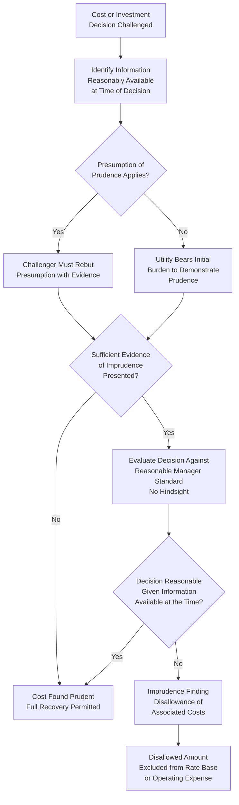

## Prudent Investment Standard and Prudence Reviews

### Definition and Purpose

The Prudent Investment Standard is the legal and regulatory principle governing whether a utility's costs — whether capital expenditures or operating expenses — qualify for recovery through rates, based on whether the decision to incur that cost was reasonable at the time it was made, judged by what was known or reasonably should have been known at that time. This item examines the prudence standard in depth as the third and final threshold eligibility principle addressed in this chapter, completing the framework established by the valuation methodology items and the used and useful test examined earlier in this chapter.

### The Core Prudence Principle: Hindsight Exclusion

**Key Points**

- The defining feature of the prudent investment standard is that it is evaluated prospectively from the perspective of the decision-maker at the time the decision was made, not retrospectively with the benefit of hindsight knowledge unavailable at that time
- This "no hindsight" principle is widely regarded as a foundational element of prudence review, reflecting the recognition that utility management must make significant, often irreversible, long-lead-time investment decisions under uncertainty, and that penalizing reasonable decisions simply because subsequent events revealed a different outcome would create excessive risk aversion and discourage necessary infrastructure investment
- A decision that appears unwise in retrospect (e.g., a plant that experienced cost overruns due to later-discovered site conditions, or a resource decision that proved suboptimal once market conditions changed) is not automatically imprudent; the relevant question is whether the decision was reasonable given the information and circumstances reasonably available at the time it was made

**Example**

A utility decides to construct a new natural gas-fired generating plant based on then-current fuel price forecasts and demand projections. Several years later, after the plant is complete, natural gas prices rise substantially higher than any forecast available at the time of the decision, and electricity demand growth is slower than projected, making the plant's economics look poor in hindsight. Under the no-hindsight prudence principle, the original decision to build the plant is evaluated based on whether it was reasonable given the fuel price forecasts, demand projections, and other information reasonably available and reasonably reliable at the time the decision was made — not based on the plant's economics as they later, unexpectedly, turned out.

### Burden of Proof in Prudence Reviews

**Key Points**

- The allocation of the burden of proof in prudence disputes varies by jurisdiction, but two general frameworks are commonly discussed in regulatory and legal literature:

1. **Presumption of prudence approach**: Costs actually incurred by a utility are presumed prudent, and a party challenging the cost (typically a commission staff or intervenor) bears the burden of coming forward with evidence sufficient to rebut that presumption, after which the burden may shift back to the utility to affirmatively demonstrate prudence
2. **Utility bears the burden approach**: The utility bears the burden, in the first instance, of affirmatively demonstrating that a challenged cost was prudently incurred, without benefit of an initial presumption of prudence

**[Inference]** Because the specific burden of proof framework applied to prudence determinations is established by state statute or commission precedent and can vary meaningfully by jurisdiction and even by type of proceeding within the same jurisdiction, the applicable burden of proof standard for a specific case should be confirmed against that jurisdiction's currently governing law and commission rules rather than assumed to follow a single universal approach.

### Categories of Prudence Review Application

**Key Points**

- Prudence review applies across the full range of utility costs, though it arises with particular frequency and significance in certain recurring categories

**Common categories of prudence disputes**:

1. **Major capital project cost overruns**: Disputes over whether cost overruns on large construction projects (power plants, major transmission lines, large treatment facilities) resulted from imprudent utility management, oversight, or decision-making, as opposed to reasonable, unforeseeable circumstances (unexpected site conditions, force majeure events, regulatory or permitting delays outside the utility's control)
2. **Fuel and purchased power procurement decisions**: Whether a utility's fuel purchasing strategy, hedging decisions, or resource dispatch choices reflected reasonable, prudent management of procurement risk, particularly scrutinized following periods of unusually high or volatile fuel or power costs
3. **Vegetation management and reliability-related maintenance spending**: Whether a utility's maintenance spending levels and practices were reasonable in light of reliability standards and, particularly following major storm events or wildfire incidents, whether specific maintenance practices contributed to or could have prevented service disruptions or safety incidents
4. **Affiliate transactions**: Whether costs charged to a utility by an affiliated company within the same corporate structure (management fees, shared services charges, procurement through an affiliated entity) reflect prudent, arm's-length-equivalent pricing, or represent an imprudent means of shifting costs or profits between regulated and unregulated portions of a corporate enterprise
5. **Merger and acquisition-related costs**: Whether transaction costs, integration costs, or other expenses associated with a utility merger or acquisition were prudently incurred and appropriately allocated between shareholders and ratepayers

### Prudence Review Framework: Key Analytical Questions

A prudence review typically examines several component questions in evaluating a challenged decision or cost:

1. **What information was reasonably available to the decision-maker at the time?**
2. **Did the utility follow reasonable, industry-standard practices and procedures in making the decision (e.g., competitive bidding where appropriate, adequate internal review and approval processes, reasonable risk analysis)?**
3. **Was the decision consistent with actions a reasonable utility manager, facing similar circumstances and information, would have made?**
4. **Were there warning signs or red flags that a reasonably prudent manager should have recognized and acted upon, which were instead ignored or inadequately addressed?**
5. **Did the utility take reasonable steps to mitigate costs or risks once problems or changed circumstances became apparent, even if the original decision was reasonable at the time made?**

### Illustrative Cost Overrun Analysis

**Example**

A utility's transmission line construction project, originally budgeted at $80 million, is ultimately completed at a cost of $110 million, a 37.5% overrun. In the subsequent rate case, a prudence review examines the specific causes of the overrun: $15 million is attributable to unexpected subsurface rock conditions discovered during construction that were not reasonably detectable through standard pre-construction geotechnical surveys (generally supporting a finding of prudence for this portion, since it reflects an unforeseeable circumstance rather than a management failure); $10 million is attributable to a documented, extended permitting delay caused by a third-party regulatory agency's processing backlog outside the utility's control (also generally supporting prudence); and $5 million is attributable to the utility's failure to competitively bid a significant contracted portion of the work, instead awarding it directly to a preferred contractor at above-market rates without adequate documented justification (a circumstance more likely to support an imprudence finding and corresponding disallowance for that specific portion).

$$DisallowedAmount = \sum ImprudentlyIncurredCostComponents$$

In this illustration, a commission applying prudence review principles might disallow recovery of some or all of the $5 million attributable to the non-competitively-bid contract award, while allowing recovery of the remaining overrun attributable to the unforeseeable geotechnical and permitting circumstances.

### Prudence Review Process Flow

### Disallowance Mechanics and Remedies

**Key Points**

- A finding of imprudence typically results in disallowance of the imprudently incurred cost — meaning that cost is excluded from rate base (if a capital cost) or operating expense (if an operating cost) recovery, effectively requiring utility shareholders, rather than ratepayers, to bear that specific cost
- Disallowances may be applied to the full imprudently incurred amount, or in some cases, to only the incremental portion of a cost found to exceed what a prudent level of spending would have produced (for example, disallowing only the portion of a cost overrun attributable to the specific imprudent decision, while allowing recovery of costs that would reasonably have been incurred regardless)
- In cases involving ongoing imprudent management practices (as opposed to a single discrete decision), a commission may also impose broader remedial measures, such as required management or process changes, in addition to the specific cost disallowance

### Relevance to the Broader Valuation and Eligibility Framework in This Chapter

Prudence review operates as the third and final threshold eligibility filter examined in this chapter, complementing the valuation methodology questions (original cost, trended original cost, or historically, reproduction cost) and the used and useful test examined earlier in this chapter. A complete rate base determination requires that a given asset or cost satisfy all three inquiries in sequence: it must be valued using the applicable methodology, it must be used and useful in providing service, and the decision to incur that cost must have been prudent. An asset or cost failing any one of these three tests is subject to exclusion or disallowance, regardless of its status under the other two — for example, a prudently incurred, properly valued asset that has become excess or idle may still fail the used and useful test, just as a used-and-useful, properly valued asset may still face disallowance if the underlying decision to construct or acquire it is found imprudent.

### Related Topics

- The Used and Useful Test
- Original Cost (Historical Cost) Methodology
- Plant in Service and Gross Utility Plant
- Construction Work in Progress (CWIP)
- Regulatory Assets and Liabilities in Rate Base
- Affiliate Transactions and Cost Allocation Standards
- Fuel and Purchased Power Procurement Review
- Burden of Proof Standards in Utility Rate Proceedings