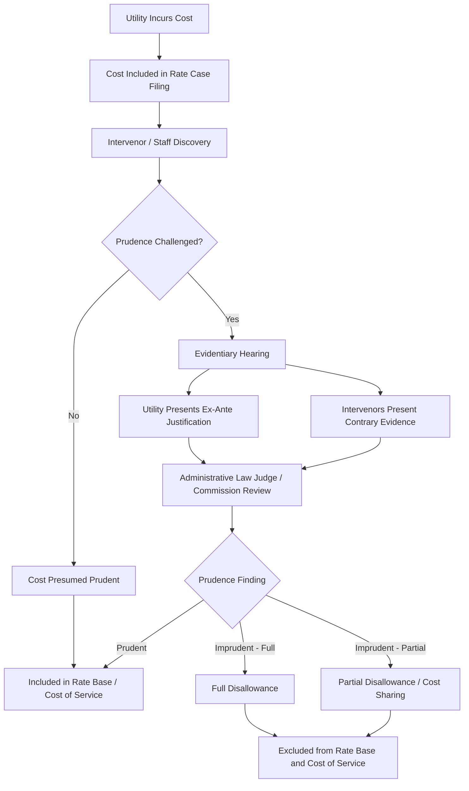

## Disallowances and Imprudence Findings

### Overview

Disallowances and imprudence findings are regulatory determinations that remove specific costs from a utility's rate base or revenue requirement because a regulator concludes the utility failed to act reasonably in incurring, managing, or recording those costs. They function as the primary enforcement mechanism supporting the used and useful standard: while used and useful analysis asks whether an asset provides current service value, prudence review asks whether management decisions leading to that asset (or expense) met the standard of a reasonable utility manager acting under the circumstances known, or reasonably knowable, at the time the decision was made.

**Key Points**

- Disallowance: the regulatory act of excluding a cost from rate base or cost of service
- Imprudence finding: the underlying determination that triggers a disallowance, based on a finding that management conduct fell below the standard of reasonableness
- These are related but distinct: a cost can be disallowed for reasons other than imprudence (e.g., it is not used and useful, or it is explicitly excluded by statute), and a prudence violation can result in penalties beyond simple cost exclusion

### The Prudence Standard

#### Definition

The prudence standard evaluates utility management decisions against what a reasonable utility manager would have done given the facts, circumstances, and information reasonably available at the time the decision was made — not with the benefit of hindsight.

$$\text{Prudent} \iff \text{Decision} \in \{\text{Reasonable actions given ex-ante information}\}$$

#### The "Hindsight Rule" Prohibition

Most U.S. jurisdictions explicitly prohibit hindsight-based prudence review. This principle, most closely associated with the U.S. Supreme Court's reasoning in *Duquesne Light Co. v. Barasch*, 488 U.S. 299 (1989), and widely cited state commission precedent, holds that regulators may not use later-discovered information (e.g., a plant later proved uneconomic, a technology later superseded) to condemn a decision that was reasonable when made.

**Key Points**

- Ex-ante standard: judged at the time of decision, not with knowledge of outcomes
- Burden typically falls on the utility to demonstrate prudence, though allocation varies by jurisdiction
- A presumption of prudence commonly attaches to utility expenditures, rebuttable by evidence in the record
- [Inference] The strength of the prudence presumption (i.e., how much evidentiary weight intervenors must produce to rebut it) varies meaningfully across state commissions and is often shaped by specific case precedent rather than statute

### Legal and Regulatory Basis

#### Federal Framework

- **Federal Power Act (FPA)** Sections 205/206 — govern FERC's authority over wholesale rates and cost recovery for jurisdictional utilities, embedding a "just and reasonable" standard that incorporates prudence review
- **FERC Order No. 490 and successor guidance** — general policy that prudently incurred costs are recoverable absent a specific finding of imprudence

#### State Framework

- State public utility commissions (PUCs) derive prudence review authority from enabling statutes (varies by state) and from the general "just and reasonable rates" mandate common to nearly all state utility codes
- Many states codify specific prudence review procedures for large capital projects (e.g., nuclear plant construction, major pipeline investments) via statute or commission rule

#### Landmark Case Law

| Case | Holding Relevance |
| --- | --- |
| *Duquesne Light Co. v. Barasch* (1989) | Confirms states are not constitutionally required to use any specific ratemaking methodology; prudent investment can be excluded from rate base without due process violation if the exclusion doesn't produce confiscatory overall rates |
| *Federal Power Commission v. Hope Natural Gas Co.* (1944) | Establishes the "end result" doctrine — the overall rate result matters more than the specific methodology used to reach it |
| *Permian Basin Area Rate Cases* (1968) | Reinforces broad regulatory discretion in ratemaking methodology, including prudence-based exclusions |

**Note:** [Unverified] The application of these federal cases to specific state prudence disputes depends heavily on state constitutional and statutory law; state supreme courts have reached varying conclusions on the degree of due process protection owed to utility investment.

### Common Triggers for Imprudence Findings

#### Construction Cost Overruns

The most litigated category, especially for large generation assets (nuclear, large-scale renewables, major transmission).

**Key Points**

- Cost overruns alone do not establish imprudence — a utility can incur overruns due to factors outside its control (regulatory delay, force majeure, market-wide material cost inflation) and remain prudent
- Imprudence findings typically require evidence of specific management failures: poor project oversight, inadequate contractor selection, ignored warning signs, deficient change-order management, or failure to mitigate known risks
- Regulators often engage independent construction monitors or management/prudence auditors for large projects specifically to build a contemporaneous record

#### Fuel Procurement and Dispatch Decisions

- Failure to hedge appropriately, failure to pursue lower-cost fuel sources, or imprudent dispatch of higher-cost generation ahead of lower-cost available capacity
- Fuel adjustment clause (FAC) reconciliation proceedings are a recurring venue for these findings

#### Operations and Maintenance (O&M) Decisions

- Deferred maintenance leading to premature failure or safety incidents
- Staffing or training decisions found to be a proximate cause of outages or incidents

#### Abandoned Plant

- Investments in projects that are cancelled before completion
- Prudence review here asks two separate questions: (1) was the decision to *undertake* the project prudent given information at the time, and (2) was the decision to *abandon* it (and its timing) prudent given information at the time
- Many jurisdictions allow partial recovery of prudently incurred abandoned plant costs even though the asset will never be used and useful, treating this as a prudence exception to the used and useful requirement

#### Affiliate Transactions

- Above-market pricing on goods/services procured from utility affiliates
- Cross-subsidization between regulated and unregulated business lines

#### Cybersecurity, Safety, and Compliance Failures

- [Inference] This category has grown significantly as a share of prudence litigation in the past decade, driven by wildfire liability (particularly in western U.S. jurisdictions), grid cybersecurity requirements, and pipeline safety enforcement following high-profile incidents

### The Prudence Review Process

#### Stages in Detail

1. **Cost incurrence** — utility makes the underlying management decision and records the cost
2. **Filing and disclosure** — cost appears in a rate case, fuel clause filing, or other cost recovery proceeding
3. **Discovery and challenge** — commission staff, consumer advocates, or other intervenors request supporting documentation and may formally challenge prudence
4. **Evidentiary record-building** — often includes expert testimony, contemporaneous internal utility documents (board minutes, engineering memos, risk assessments), and comparison to industry practice
5. **Burden allocation** — the utility generally must produce evidence supporting prudence; once produced, the burden of persuasion to overturn the presumption commonly shifts to challengers, though the ultimate burden of proof allocation is jurisdiction-specific
6. **Commission decision** — full inclusion, full disallowance, or partial disallowance/cost-sharing mechanism
7. **Appeal** — decisions are typically appealable to state courts under an "arbitrary and capricious" or "substantial evidence" standard of review, which is deferential to the commission's factual findings

### Disallowance Mechanics

#### Full vs. Partial Disallowance

- **Full disallowance** — the entire cost is excluded from rate base and/or cost of service; shareholders bear 100% of the disallowed amount
- **Partial disallowance / cost-sharing** — a percentage of the cost is allowed into rates while the remainder is disallowed, often used when imprudence is found for only a portion of the challenged conduct or period

#### Effect on Rate Base

For a disallowed capital investment, the disallowance removes the associated original cost from rate base entirely, meaning no return (rate of return component) and no return of capital (depreciation recovery) is permitted on the disallowed portion.

$$RB_{allowed} = RB_{total} - C_{disallowed}$$

Where $RB_{allowed}$ is the rate base included in the revenue requirement calculation, $RB_{total}$ is total original cost investment, and $C_{disallowed}$ is the imprudently incurred cost excluded by the commission.

#### Effect on Revenue Requirement

$$RR = (RB \times r) + D + O\&M + T$$

Where $RR$ is revenue requirement, $RB$ is allowed rate base, $r$ is the authorized rate of return, $D$ is depreciation expense, $O\&M$ is prudently incurred operating expense, and $T$ is taxes. A disallowance reduces $RB$ (for capital items) and/or $O\&M$ (for expense items) directly, flowing through to a lower authorized revenue requirement.

#### Retroactive vs. Prospective Application

- Disallowances applied in a general rate case are typically prospective (affecting rates going forward) but based on retrospective review of historical cost decisions
- Fuel clause and other reconciliation mechanisms can result in **refunds** — a retroactive true-up where previously collected but imprudently incurred costs must be returned to ratepayers, distinct from a prospective rate base disallowance

### Distinguishing Disallowance from Related Concepts

| Concept | Basis for Exclusion | Timing Focus |
| --- | --- | --- |
| Imprudence disallowance | Management conduct fell below reasonableness standard | Ex-ante — was the decision reasonable when made |
| Used and useful exclusion | Asset does not currently provide service to ratepayers | Ex-post/current — is the asset serving customers now |
| Excess capacity disallowance | Asset is used and useful but sized beyond reasonable need | Combination — reasonableness of sizing decision plus current utilization |
| Regulatory lag / disallowance by delay | Cost recovery timing mismatch, not a merits finding | Procedural, not substantive |
| Statutory cost exclusion | Legislature has categorically excluded a cost type (e.g., lobbying expenses, certain penalties) | N/A — categorical, no prudence inquiry needed |

**Key Points**

- A prudently incurred asset can still fail the used and useful test (e.g., a well-managed plant construction that becomes surplus due to a later, unforeseeable demand forecast revision) — prudence does not guarantee full rate base inclusion
- Conversely, a used and useful asset can still face a partial disallowance if a discrete portion of its cost was imprudently incurred (e.g., prudent plant construction overall, but a specific change order was mismanaged)

### Illustrative Example

**Example**

A vertically integrated utility constructs a new combined-cycle gas plant with an original cost estimate of $800 million. Actual cost at completion is $1.1 billion — a 37.5% overrun. In the subsequent rate case:

- Commission staff engages an independent construction auditor
- The audit finds $200 million of the overrun attributable to industry-wide steel and turbine price inflation (outside utility control) and schedule delay from a permitting dispute with a federal agency (also outside utility control)
- The audit finds $60 million attributable to the utility's failure to lock in turbine pricing despite internal risk memos recommending early procurement, and to change-order mismanagement during the second half of construction
- The remaining $40 million of overrun is contested but the record is inconclusive

**Commission Ruling (illustrative):**

- $1.06 billion is found prudently incurred and included in rate base (the original $800 million plus the $200 million uncontrollable overrun plus the $40 million where evidence was insufficient to rebut the prudence presumption)
- $40 million is disallowed based on the specific findings of failure to hedge and change-order mismanagement
- The plant, once in service, separately passes the used and useful test since it is fully dispatched to serve native load

This illustrates that disallowance and used and useful review operate as sequential, independent filters — a cost must clear both to reach full rate base treatment.

### Diagram: Dual-Filter Rate Base Inclusion Test

<svg xmlns="http://www.w3.org/2000/svg" viewBox="0 0 720 320">
<text x="360" y="28" font-size="16" font-weight="bold" text-anchor="middle" fill="#1a1a1a">Rate Base Inclusion — Dual Filter Test (svg_diagram)</text>
<rect x="30" y="60" width="160" height="60" rx="6" fill="#e8f0fe" stroke="#3b6fd6" stroke-width="1.5" />
<text x="110" y="95" font-size="13" text-anchor="middle" fill="#1a1a1a">Total Cost Incurred</text>
<line x1="190" y1="90" x2="250" y2="90" stroke="#555" stroke-width="1.5" marker-end="url(#arrow)" />
<rect x="250" y="50" width="180" height="80" rx="6" fill="#fff3e0" stroke="#e0913b" stroke-width="1.5" />
<text x="340" y="80" font-size="13" font-weight="bold" text-anchor="middle" fill="#1a1a1a">Filter 1: Prudence</text>
<text x="340" y="98" font-size="11" text-anchor="middle" fill="#333">Was the decision reasonable</text>
<text x="340" y="112" font-size="11" text-anchor="middle" fill="#333">ex-ante?</text>
<line x1="430" y1="90" x2="490" y2="90" stroke="#555" stroke-width="1.5" marker-end="url(#arrow)" />
<rect x="490" y="50" width="180" height="80" rx="6" fill="#fce8e8" stroke="#c0392b" stroke-width="1.5" />
<text x="580" y="80" font-size="13" font-weight="bold" text-anchor="middle" fill="#1a1a1a">Filter 2: Used &amp; Useful</text>
<text x="580" y="98" font-size="11" text-anchor="middle" fill="#333">Does it serve ratepayers</text>
<text x="580" y="112" font-size="11" text-anchor="middle" fill="#333">currently?</text>
<line x1="340" y1="130" x2="340" y2="180" stroke="#555" stroke-width="1.5" marker-end="url(#arrow)" />
<text x="420" y="150" font-size="11" fill="#c0392b">Fails →</text>
<rect x="230" y="180" width="220" height="45" rx="6" fill="#fddede" stroke="#c0392b" stroke-width="1.5" />
<text x="340" y="207" font-size="12" text-anchor="middle" fill="#1a1a1a">Disallowed (Imprudence)</text>
<line x1="580" y1="130" x2="580" y2="180" stroke="#555" stroke-width="1.5" marker-end="url(#arrow)" />
<text x="600" y="150" font-size="11" fill="#c0392b">Fails →</text>
<rect x="470" y="180" width="220" height="45" rx="6" fill="#fddede" stroke="#c0392b" stroke-width="1.5" />
<text x="580" y="207" font-size="12" text-anchor="middle" fill="#1a1a1a">Excluded (Not Used &amp; Useful)</text>
<line x1="580" y1="130" x2="580" y2="260" stroke="#2e7d32" stroke-width="1.5" marker-end="url(#arrowg)" />
<text x="605" y="245" font-size="11" fill="#2e7d32">Passes both →</text>
<rect x="450" y="260" width="240" height="45" rx="6" fill="#e6f4ea" stroke="#2e7d32" stroke-width="1.5" />
<text x="570" y="287" font-size="12" text-anchor="middle" fill="#1a1a1a">Included in Rate Base</text>
</svg>

### Jurisdictional Variation

**Key Points**

- Some states (e.g., historically Florida, Texas) have applied statutory pre-approval mechanisms (Certificates of Public Convenience and Necessity with cost caps) that limit after-the-fact prudence disputes for pre-approved projects
- Some jurisdictions use formal management/performance audits (periodic, independent of rate cases) as a supplementary prudence review tool
- FERC's approach for transmission and wholesale generation under its jurisdiction generally applies similar hindsight-prohibition principles but operates under the FPA's "just and reasonable" standard rather than individual state statutes
- [Unverified] The specific evidentiary thresholds (e.g., "clear and convincing," "preponderance of the evidence") required to sustain an imprudence finding vary by state and are not uniformly codified; utilities and practitioners should consult jurisdiction-specific commission rules and precedent for any active proceeding

### Practical Documentation Implications for Utilities

**Key Points**

- Contemporaneous documentation is the single most important defense against imprudence findings — risk assessments, board approvals, competitive bidding records, and change-order justifications created *at the time* of the decision carry far more evidentiary weight than after-the-fact explanations
- Benchmarking against comparable utility projects/costs is commonly used both offensively (by intervenors) and defensively (by utilities) in prudence litigation
- Internal audit and project management office (PMO) controls on large capital projects are frequently cited in prudence proceedings as evidence of (or failure of) reasonable oversight

**Related Topics**

- Used and Useful Standard — Core Doctrine
- Construction Work in Progress (CWIP) and AFUDC Treatment
- Abandoned Plant Recovery Mechanisms
- Fuel Adjustment Clause Reconciliation Proceedings
- Rate of Return Determination and the *Hope*/*Bluefield* Standards
- Regulatory Asset Treatment for Disallowed Costs
- Management and Performance Audits
- Excess Capacity and Plant Sizing Disputes
- Cost Recovery for Storm and Wildfire-Related Expenditures
- Certificate of Public Convenience and Necessity (CPCN) Pre-Approval Mechanisms