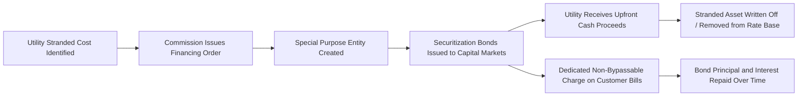

## Excess Capacity and Stranded Asset Treatment

### Overview

Excess capacity and stranded asset treatment address how regulators value rate base investments that exceed current ratepayer need or that have lost economic viability due to market, technological, or regulatory change. These doctrines sit at the boundary of the used and useful standard: excess capacity asks whether *part* of an otherwise-serving asset is oversized relative to need, while stranded asset treatment asks whether an asset that was once fully used and useful has become wholly or partially non-recoverable due to subsequent structural change, most commonly electric industry restructuring/deregulation.

**Key Points**

- Excess capacity: a sizing question — was the asset built larger than a reasonable utility would build given demand forecasts at the time, or has demand since declined below planned levels
- Stranded assets: a viability question — has the asset's cost recovery basis been undermined by market restructuring, environmental regulation, or competitive entry, independent of whether the original investment was prudent or properly sized
- Both doctrines require regulators to allocate the economic burden of a mismatch between rate base and current value between shareholders and ratepayers

### Excess Capacity Doctrine

#### Definition and Test

Excess capacity exists when an asset provides more capability than is reasonably needed to serve current and near-term forecasted demand. Unlike a pure used and useful exclusion (asset provides zero current service), excess capacity analysis is a matter of degree — the asset is partially useful.

$$RB_{allowed} = RB_{total} \times \frac{D_{actual}}{D_{planned}}$$

Where $D_{actual}$ is actual peak demand or utilization served and D_{planned}}
 is the design/planned capacity, subject to commission-specific adjustments for reasonable reserve margin.

#### Reasonable Reserve Margin

Regulators generally accept that utilities must plan with a reserve margin above expected peak demand to maintain reliability. Excess capacity findings typically focus on capacity beyond this reasonable margin, not all unused capacity.

**Key Points**

- Reserve margin standards are frequently set by regional reliability entities (e.g., NERC regional standards, RTO/ISO planning reserve margin requirements) and commissions often defer to these as the benchmark for "reasonable" reserve
- A utility holding capacity within the applicable reliability planning reserve margin is generally treated as used and useful even though that capacity is not dispatched in normal conditions
- Capacity substantially above the applicable reserve standard is more likely to draw an excess capacity challenge

#### Common Fact Patterns

- Demand forecast error — a plant sized for growth projections that did not materialize (e.g., major industrial customer departure, population growth shortfall, unexpected energy efficiency uptake)
- Merger or territory integration — combined utility capacity exceeding combined need post-merger
- Technology-driven demand reduction — distributed generation, demand response, or efficiency programs reducing system peak below original planning assumptions
- Over-building ahead of need — construction lead times for large baseload assets (particularly nuclear) requiring decisions years before in-service, during which demand assumptions can become stale

#### Remedies Applied by Regulators

| Remedy | Mechanism |
| --- | --- |
| Pro-rata rate base exclusion | Exclude the percentage of capacity deemed excess from rate base |
| Deferred inclusion | Phase capacity into rate base as demand grows to absorb it |
| Full exclusion with regulatory asset | Exclude from rate base but permit expensing/amortization recovery outside the standard rate base return mechanism |
| No adjustment (prudence defense) | If demand forecast was reasonable when made (ex-ante), commission may decline to penalize the utility despite current excess |

**Key Points**

- [Inference] The "no adjustment" outcome is closely tied to a successful prudence defense — commissions are generally more reluctant to disallow rate base treatment for excess capacity that resulted from a good-faith, reasonably supported forecast that simply did not materialize, versus capacity that resulted from a forecast the utility should have known was unreliable

### Stranded Asset / Stranded Cost Doctrine

#### Definition

Stranded costs (also "stranded assets" or "stranded investment") are utility investments prudently made under a prior regulatory regime — typically cost-of-service, vertically integrated regulation — that become unrecoverable at market value once that regime changes, most commonly through retail electric restructuring/deregulation that introduces competitive generation markets.

$$SC = RB_{book} - V_{market}$$

Where $SC$ is stranded cost, $RB_{book}$ is the net book value of the asset under traditional rate base accounting, and $V_{market}$ is the asset's value under competitive market conditions (often approximated via market price of the underlying commodity/output, or auction/sale value).

#### Historical Context: Electric Restructuring

During the U.S. electric restructuring wave of the late 1990s, many states unbundled generation from transmission/distribution and opened generation to competition. Utilities that had built generation assets (particularly nuclear plants and long-term power purchase agreements) under cost-of-service regulation faced the risk that competitive market prices would be insufficient to recover full book value.

**Key Points**

- FERC Order No. 888 (1996) required open access to transmission and explicitly addressed stranded cost recovery for wholesale stranded costs resulting from open transmission access
- Most states enacted stranded cost recovery mechanisms (often via securitization) as part of restructuring legislation, recognizing that denying recovery of prudently incurred, previously used-and-useful investment would raise regulatory takings concerns
- [Unverified] The precise stranded cost recovery percentage and mechanism varied significantly by state; some states permitted near-full recovery via ratepayer-backed bonds, while others applied caps or required utilities to bear a negotiated share

#### Securitization as a Recovery Mechanism

Many states addressed stranded costs through **rate reduction bonds** or **securitization**, converting the stranded cost into a bondable, dedicated revenue stream separate from traditional rate base treatment.

**Key Points**

- Securitization typically produces a lower carrying cost than continued rate base recovery because bonds are secured by a statutorily guaranteed, non-bypassable charge, often achieving investment-grade or near risk-free financing rates
- The non-bypassable charge feature is central — it ensures that even customers who switch to a competitive generation supplier still pay their share of legacy stranded costs, since the charge is not tied to specific generation service
- [Inference] This mechanism is widely viewed by practitioners as a rare instance where securitization benefits both shareholders (certainty and faster monetization of an otherwise at-risk asset) and ratepayers (lower total carrying cost versus continued equity-return-based rate base recovery)

#### Modern Stranded Asset Contexts

Stranded asset doctrine has re-emerged in contexts beyond 1990s restructuring:

- **Coal plant retirement acceleration** — early retirement of coal generation driven by environmental regulation, carbon policy, or economics, leaving unrecovered book value
- **Gas system stranding** — proposed "electrification" policies and building decarbonization mandates raising the prospect of stranded gas distribution investment
- **Merchant transmission and PPA buyouts** — contracts or assets rendered uneconomic by market restructuring or renewable energy cost declines

**Example**

A vertically integrated utility retires a coal plant 12 years ahead of its original planned depreciable life due to a state clean energy mandate. Net book value at retirement is $450 million.

- The commission finds the original investment was prudent when made and the asset was used and useful throughout its operating life
- The early retirement is driven by a change in law/policy, not utility imprudence
- The commission authorizes securitization of the $450 million unrecovered balance via ratepayer-backed bonds, removing it from traditional rate base (eliminating equity return recovery) but guaranteeing full principal recovery through the non-bypassable charge
- Ratepayers benefit from the lower securitized financing cost versus continued cost-of-service recovery; shareholders benefit from certainty of full cost recovery despite the asset no longer being used and useful

### Distinguishing the Two Doctrines

| Dimension | Excess Capacity | Stranded Assets |
| --- | --- | --- |
| Root cause | Sizing/demand forecast mismatch | Regime change (restructuring, policy, market) |
| Timing of assessment | Ongoing, can self-correct as demand grows | Often a discrete, one-time write-down event |
| Typical remedy | Rate base exclusion (partial or phased) | Securitization or negotiated recovery mechanism |
| Prudence relevance | High — central to whether exclusion applies | Lower — prudence often conceded; focus shifts to recovery mechanism |
| Used and useful relationship | Direct application of the standard to a portion of an asset | Often treated as an explicit exception/override to the standard |

### Diagram: Excess Capacity vs. Stranded Asset Decision Path

<svg xmlns="http://www.w3.org/2000/svg" viewBox="0 0 760 300">
<text x="380" y="26" font-size="16" font-weight="bold" text-anchor="middle" fill="#1a1a1a">Excess Capacity vs. Stranded Asset Pathways (svg_diagram)</text>
<rect x="300" y="50" width="160" height="50" rx="6" fill="#e8f0fe" stroke="#3b6fd6" stroke-width="1.5" />
<text x="380" y="80" font-size="12" text-anchor="middle" fill="#1a1a1a">Asset in Rate Base</text>
<line x1="340" y1="100" x2="210" y2="140" stroke="#555" stroke-width="1.5" marker-end="url(#a1)" />
<line x1="420" y1="100" x2="550" y2="140" stroke="#555" stroke-width="1.5" marker-end="url(#a1)" />
<rect x="90" y="140" width="240" height="55" rx="6" fill="#fff3e0" stroke="#e0913b" stroke-width="1.5" />
<text x="210" y="163" font-size="12" font-weight="bold" text-anchor="middle" fill="#1a1a1a">Demand Below Design Capacity</text>
<text x="210" y="180" font-size="11" text-anchor="middle" fill="#333">→ Excess Capacity Review</text>
<rect x="440" y="140" width="270" height="55" rx="6" fill="#fce8e8" stroke="#c0392b" stroke-width="1.5" />
<text x="575" y="163" font-size="12" font-weight="bold" text-anchor="middle" fill="#1a1a1a">Regime/Policy Change</text>
<text x="575" y="180" font-size="11" text-anchor="middle" fill="#333">→ Stranded Asset Review</text>
<line x1="210" y1="195" x2="210" y2="240" stroke="#555" stroke-width="1.5" marker-end="url(#a1)" />
<rect x="90" y="240" width="240" height="45" rx="6" fill="#e6f4ea" stroke="#2e7d32" stroke-width="1.5" />
<text x="210" y="267" font-size="11" text-anchor="middle" fill="#1a1a1a">Pro-Rata Exclusion or Deferred Inclusion</text>
<line x1="575" y1="195" x2="575" y2="240" stroke="#555" stroke-width="1.5" marker-end="url(#a1)" />
<rect x="440" y="240" width="270" height="45" rx="6" fill="#e6f4ea" stroke="#2e7d32" stroke-width="1.5" />
<text x="575" y="267" font-size="11" text-anchor="middle" fill="#1a1a1a">Securitization / Negotiated Recovery</text>
</svg>

### Regulatory Takings Considerations

**Key Points**

- Complete disallowance of prudently incurred, previously used-and-useful investment can raise regulatory takings concerns under the Fifth Amendment, as analyzed under the *Hope*/*Duquesne* framework — the focus is on whether the *overall rate structure* is confiscatory, not any single ratemaking element in isolation
- This is a central reason stranded cost recovery mechanisms were widely adopted during restructuring rather than outright disallowance — regulators sought to balance introducing competition with avoiding uncompensated taking of prudent legacy investment
- [Unverified] The degree of constitutional protection for stranded costs specifically (versus rate base treatment generally) has not been definitively settled by the U.S. Supreme Court; most stranded cost recovery frameworks were adopted legislatively/administratively rather than compelled by a specific stranded-cost takings ruling

### Practical Ratemaking Implications

**Key Points**

- Utilities facing potential excess capacity findings typically present updated load forecasts, reserve margin justifications, and evidence of demand-side mitigation efforts (e.g., marketing unused capacity, seeking new load) to support continued rate base inclusion
- Utilities anticipating stranded asset exposure (e.g., from anticipated plant retirements) increasingly seek proactive securitization legislation or pre-approved recovery mechanisms rather than waiting for a contested rate case
- [Inference] The trend toward proactive, legislatively authorized securitization for anticipated stranded costs (rather than litigated stranded cost recovery after the fact) has become more common in recent state energy transition legislation, reducing regulatory uncertainty for both utilities and ratepayer advocates

**Related Topics**

- Used and Useful Standard — Core Doctrine
- Disallowances and Imprudence Findings
- Securitization and Rate Reduction Bonds
- Regulatory Takings and the *Hope*/*Duquesne* Framework
- Coal and Fossil Plant Early Retirement Cost Recovery
- Integrated Resource Planning and Demand Forecasting Standards
- Electric Industry Restructuring and Retail Choice
- Depreciation Rate Design and Remaining Life Methodology