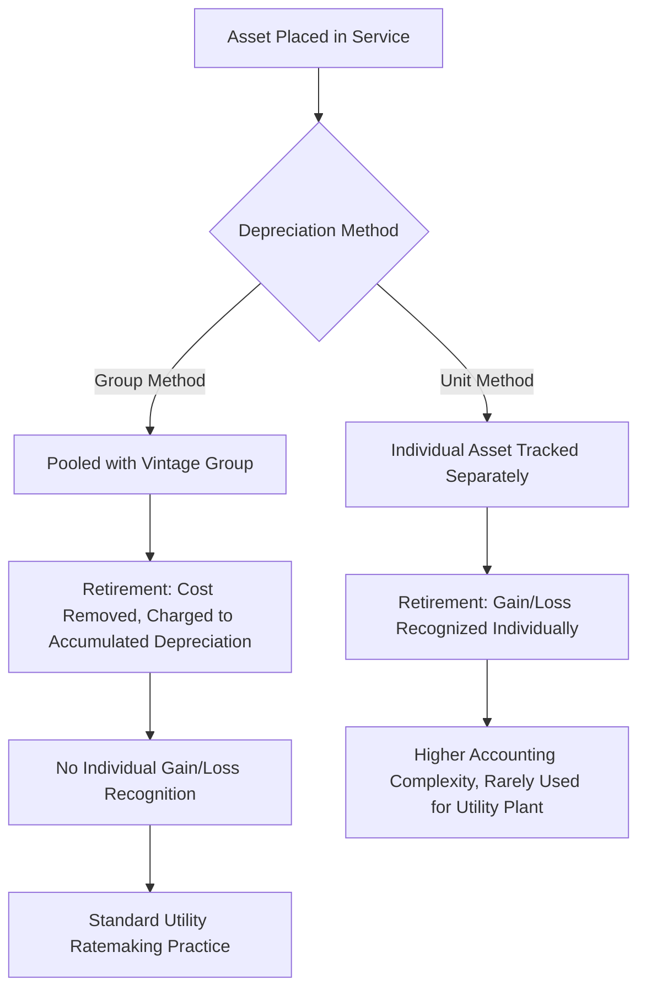

## Straight Line and Group Depreciation Methods

### Overview

Depreciation in utility ratemaking serves a distinct purpose from depreciation in general financial accounting: it is the mechanism by which a utility recovers its original capital investment (return *of* capital) over the asset's service life, separate from the return *on* capital (rate of return applied to net rate base). Straight line depreciation is the dominant method used in utility regulation, and group depreciation is the standard procedural technique for applying straight line depreciation across large populations of similar assets rather than tracking each unit individually.

**Key Points**

- Straight line method: allocates an asset's depreciable cost evenly over its estimated service life
- Group depreciation: a procedural/actuarial technique applying straight line rates to a pooled group of similar assets rather than unit-by-unit
- Together, these form the near-universal depreciation framework used by regulated utilities in the U.S., as required or strongly preferred by most state commissions and FERC Uniform System of Accounts (USOA) rules

### Straight Line Depreciation Method

#### Basic Formula

$$D_{annual} = \frac{C - S}{N}$$

Where $D_{annual}$ is annual depreciation expense, $C$ is original cost (or depreciable base), $S$ is estimated net salvage value (often negative in utility applications, see below), and $N$ is estimated service life in years.

#### Depreciation Rate

$$r_{depr} = \frac{1}{N} \times 100\%$$

The depreciation rate is commonly expressed as a percentage of original cost, applied annually to the asset's book balance in a given account.

#### Net Salvage Value in Utility Depreciation

Unlike general financial accounting, utility depreciation studies typically define **net salvage** as gross salvage value minus cost of removal (COR), and cost of removal frequently exceeds gross salvage for utility plant (e.g., removing old poles, pipe, or transformers costs more than the scrap value recovered).

$$S_{net} = S_{gross} - COR$$

**Key Points**

- When $COR > S_{gross}$, net salvage is negative, which *increases* the depreciable base and therefore *increases* the annual depreciation rate — this is a distinguishing feature of utility depreciation compared to general corporate accounting
- Negative net salvage is common for underground cable, pipeline, and certain substation equipment where regulatory, environmental, or safety-driven removal costs are substantial
- [Inference] The treatment of negative net salvage is one of the more contested issues in depreciation proceedings, since it effectively requires current ratepayers to prefund the future cost of removing assets they are currently using, and intervenors sometimes challenge the COR estimates underlying the calculation

#### Why Straight Line Dominates in Utility Regulation

- **Matching principle for a stable revenue requirement** — produces level or gradually declining depreciation expense, avoiding the front-loaded expense patterns of accelerated methods (declining balance, sum-of-years-digits), which would create rate volatility inconsistent with the gradualism regulators generally favor
- **Consistency with the "original cost less depreciation" rate base valuation standard** established by *Hope* and widely followed — straight line's even allocation aligns naturally with book value rate base methodology
- **Simplicity and auditability** for large-scale utility plant accounting under FERC's Uniform System of Accounts, which prescribes straight line as the standard method for most plant accounts

#### Contrast with Accelerated Methods

| Method | Expense Pattern | Utility Regulatory Use |
| --- | --- | --- |
| Straight line | Level annual expense | Standard/dominant method |
| Declining balance | Front-loaded, declining over time | Rare — occasionally used for tax depreciation, not book/regulatory depreciation |
| Sum-of-years-digits | Front-loaded, declining over time | Essentially unused in utility rate base depreciation |
| Units of production | Variable, tied to output/usage | Occasionally used for specific asset classes (e.g., certain mining-adjacent or metered-life assets) |

**Note:** Accelerated tax depreciation methods (e.g., MACRS under the U.S. Internal Revenue Code) are commonly used for income tax purposes and create book-tax timing differences requiring deferred tax accounting (see Accumulated Deferred Income Taxes), but this is separate from the book/regulatory depreciation method used to set rate base and depreciation expense in the revenue requirement.

### Group Depreciation Method

#### Definition and Rationale

Group depreciation applies a single composite depreciation rate to a pooled group of similar assets (e.g., all wood distribution poles, all overhead conductor, all meters of a given type) rather than calculating depreciation individually for each unit. This is the standard procedural approach because utility plant accounts often contain thousands to millions of individual property units, making unit-level tracking impractical.

**Key Points**

- Group depreciation is not a different depreciation *pattern* from straight line — it is straight line depreciation applied at the pooled-asset level using an average or composite service life
- The technique relies on actuarial/statistical analysis of historical retirement patterns to estimate the average service life and dispersion pattern of the group, rather than tracking each unit's individual life

#### Types of Grouping

| Grouping Type | Description |
| --- | --- |
| Broad group | All assets in a single plant account grouped together (e.g., all distribution transformers) |
| Classified group | Assets subdivided by vintage or sub-characteristic within an account (e.g., transformers by installation decade) |
| Equal life group (ELG) | Assets subdivided into sub-groups sharing a common estimated life, based on statistical dispersion analysis |

**Key Points**

- Equal Life Group procedure is generally regarded as the most statistically refined group method, since it separates a broad account into life-homogeneous sub-groups rather than applying one average life across assets with materially different actual retirement patterns
- [Inference] ELG is more commonly used by larger utilities and in jurisdictions with more sophisticated depreciation study requirements, given the greater data and actuarial analysis burden relative to simpler broad-group averaging

#### Mechanics of Group Depreciation Accounting

1. **Vintage year accounting** — additions are tracked by the year placed in service ("vintage")
2. **Composite/average service life estimation** — derived from an actuarial study of historical retirements (see Depreciation Studies and Survivor Curves)
3. **Group depreciation rate calculation** — a single rate applied to the entire group's surviving balance
4. **Retirement accounting** — when a unit is retired, its original cost is removed from the plant account and charged to accumulated depreciation (not to current expense), consistent with group accounting's core principle that gains/losses on individual unit retirements are absorbed by the reserve, not recognized item by item

$$AccumDepr_{t} = AccumDepr_{t-1} + D_{annual} - Retirements_t + COR_t - S_{gross,t}$$

**Key Points**

- This "no gain/loss on individual retirement" principle is a defining feature of group depreciation accounting: because the group rate already reflects an *average* expected life, some units will retire earlier and some later than average, and these are expected to offset within the group over time
- This differs fundamentally from unit method depreciation (common in general corporate/non-utility accounting), where a gain or loss is recognized on each individual asset disposal

#### Group Method vs. Unit Method Comparison

### The Depreciation Study Process

Group depreciation rates are not set arbitrarily; they are derived through periodic depreciation studies, typically filed with rate cases or on a periodic (e.g., 3-5 year) cycle required by commission rule.

**Key Points**

- Depreciation studies analyze historical retirement data using actuarial survivor curve analysis (commonly Iowa-type curves) to estimate average service life and dispersion for each plant account or sub-group
- Studies produce recommended service lives, net salvage percentages, and resulting depreciation rates, which are then subject to commission review and approval, often contested by intervenors on service life and net salvage assumptions
- [Unverified] The specific statistical methodology accepted (e.g., which Iowa curve family, retirement rate method vs. simulated plant record method) varies by commission and by depreciation consultant practice; there is no single universally mandated actuarial technique across all U.S. jurisdictions

### Illustrative Example

**Example**

A utility's wood distribution pole account has:

- Original cost: $120 million
- Estimated average service life: 40 years
- Estimated gross salvage: 2% of original cost
- Estimated cost of removal: 8% of original cost

**Step 1 — Net salvage:**

$$S_{net} = 2\% - 8\% = -6\%$$

**Step 2 — Depreciable base (as % of original cost):**

$$100\% - (-6\%) = 106\%$$

**Step 3 — Annual straight line group depreciation rate:**

$$r_{depr} = \frac{106\%}{40} = 2.65\%$$

**Step 4 — Annual depreciation expense:**

$$D_{annual} = \$120,000,000 \times 2.65\% = \$3,180,000$$

This $3,180,000 flows into the revenue requirement as the depreciation expense component for this account and simultaneously reduces net rate base each year as accumulated depreciation grows, consistent with straight line group depreciation applied at the pooled account level.

### Diagram: Group Depreciation Data Flow

<svg xmlns="http://www.w3.org/2000/svg" viewBox="0 0 740 320">
<text x="370" y="26" font-size="16" font-weight="bold" text-anchor="middle" fill="#1a1a1a">Group Depreciation Rate-Setting Flow (svg_diagram)</text>
<rect x="30" y="55" width="180" height="55" rx="6" fill="#e8f0fe" stroke="#3b6fd6" stroke-width="1.5" />
<text x="120" y="80" font-size="12" text-anchor="middle" fill="#1a1a1a">Historical Retirement</text>
<text x="120" y="96" font-size="12" text-anchor="middle" fill="#1a1a1a">Data by Vintage</text>
<line x1="210" y1="82" x2="270" y2="82" stroke="#555" stroke-width="1.5" marker-end="url(#gd1)" />
<rect x="270" y="55" width="200" height="55" rx="6" fill="#fff3e0" stroke="#e0913b" stroke-width="1.5" />
<text x="370" y="80" font-size="12" text-anchor="middle" fill="#1a1a1a">Actuarial Survivor Curve</text>
<text x="370" y="96" font-size="12" text-anchor="middle" fill="#1a1a1a">Analysis (Iowa Curves)</text>
<line x1="470" y1="82" x2="530" y2="82" stroke="#555" stroke-width="1.5" marker-end="url(#gd1)" />
<rect x="530" y="55" width="180" height="55" rx="6" fill="#fce8e8" stroke="#c0392b" stroke-width="1.5" />
<text x="620" y="80" font-size="12" text-anchor="middle" fill="#1a1a1a">Est. Average Service</text>
<text x="620" y="96" font-size="12" text-anchor="middle" fill="#1a1a1a">Life and Net Salvage %</text>
<line x1="620" y1="110" x2="620" y2="150" stroke="#555" stroke-width="1.5" marker-end="url(#gd1)" />
<rect x="500" y="150" width="240" height="55" rx="6" fill="#e6f4ea" stroke="#2e7d32" stroke-width="1.5" />
<text x="620" y="175" font-size="12" text-anchor="middle" fill="#1a1a1a">Composite Straight Line</text>
<text x="620" y="191" font-size="12" text-anchor="middle" fill="#1a1a1a">Group Depreciation Rate</text>
<line x1="500" y1="177" x2="230" y2="177" stroke="#555" stroke-width="1.5" marker-end="url(#gd1)" />
<rect x="30" y="150" width="200" height="55" rx="6" fill="#f3e8fd" stroke="#7e3bd6" stroke-width="1.5" />
<text x="130" y="175" font-size="12" text-anchor="middle" fill="#1a1a1a">Commission Review</text>
<text x="130" y="191" font-size="12" text-anchor="middle" fill="#1a1a1a">and Approval</text>
<line x1="130" y1="205" x2="130" y2="250" stroke="#555" stroke-width="1.5" marker-end="url(#gd1)" />
<rect x="30" y="250" width="300" height="55" rx="6" fill="#e6f4ea" stroke="#2e7d32" stroke-width="1.5" />
<text x="180" y="275" font-size="12" text-anchor="middle" fill="#1a1a1a">Applied to Vintage Group Balances</text>
<text x="180" y="291" font-size="12" text-anchor="middle" fill="#1a1a1a">→ Annual Depreciation Expense</text>
</svg>

### Interaction with Rate Base

**Key Points**

- Accumulated depreciation (the reserve built up through annual group depreciation expense) is deducted from gross plant to arrive at net rate base, consistent with the original cost less depreciation valuation standard
- Over- or under-accrued depreciation reserves (where actual retirement experience diverges from the actuarial estimates underlying the group rate) are periodically corrected through depreciation rate true-ups in subsequent studies, rather than through retroactive restatement, since group depreciation is inherently a long-run averaging technique
- [Inference] Because group rates are actuarial estimates rather than asset-specific calculations, some degree of reserve imbalance (surplus or deficiency) relative to theoretical accrual is normal and expected between depreciation study cycles, and is a routine, non-controversial finding addressed in the next scheduled study

**Related Topics**

- Depreciation Studies and Survivor Curve Analysis (Iowa Curves)
- Net Salvage Value and Cost of Removal Estimation
- Accumulated Deferred Income Taxes and Book-Tax Depreciation Differences
- Remaining Life Depreciation Methodology
- Vintage Year Accounting and Plant Sub-Ledgers
- Asset Retirement Obligations (ARO) vs. Regulatory Net Salvage Accrual
- FERC Uniform System of Accounts (USOA) Plant Classifications
- Depreciation Reserve Deficiency and Surplus True-Ups