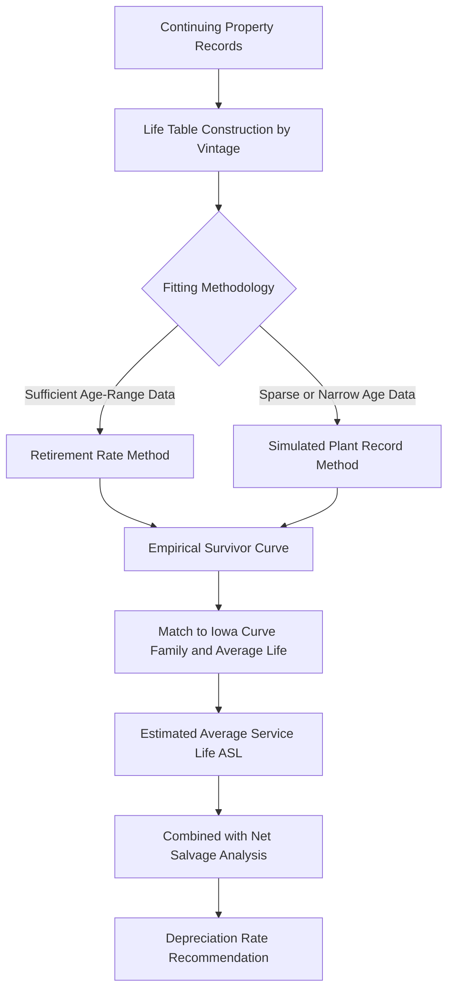

## Depreciation Studies and Life and Survivor Curve Analysis

### Overview

Depreciation studies are the periodic actuarial and statistical analyses utilities perform to estimate the service lives, retirement dispersion patterns, and net salvage values underlying group depreciation rates. Survivor curve analysis — most commonly using the Iowa curve system — is the core statistical technique used within these studies to model how a population of similar assets is retired over time. Together, they provide the empirical foundation that translates raw historical plant records into the depreciation rates applied in rate base and revenue requirement calculations.

**Key Points**

- Depreciation study: the overall periodic engagement (often 3-5 year cycle) producing recommended service lives, net salvage percentages, and depreciation rates by plant account
- Survivor curve analysis: the specific actuarial technique estimating the probability distribution of retirement ages within an asset group
- Both are foundational to group depreciation (see Straight Line and Group Depreciation Methods) and are subject to commission review, contested testimony, and approval as part of rate proceedings

### Purpose and Regulatory Basis

#### Why Depreciation Studies Are Required

- Group depreciation rates cannot be set from engineering judgment alone at scale — they require statistical analysis of actual historical retirement behavior across large populations of similar assets
- Most state commissions and FERC require periodic depreciation studies, either on a fixed cycle (commonly every 3-5 years) or contemporaneously with general rate cases
- Studies create the evidentiary record supporting depreciation rate changes, which are themselves subject to full evidentiary review, cross-examination, and commission approval, similar to other elements of the revenue requirement

**Key Points**

- [Unverified] The specific mandatory filing cycle for depreciation studies is not uniform nationally — it is set by individual state commission rule or statute, and some jurisdictions require a new study with every general rate case rather than on a fixed independent cycle
- FERC requires jurisdictional utilities to file depreciation rate changes supported by a depreciation study for Commission review under its regulations governing accounting and rates

### Components of a Depreciation Study

#### 1. Historical Data Compilation

- Continuing property records (CPR) — the utility's detailed ledger of plant additions and retirements by vintage year and account
- Aggregated into "life tables" showing, for each vintage, how much of the original investment has survived to each subsequent age

#### 2. Service Life Estimation

- Statistical analysis of historical retirement experience to estimate the average service life (ASL) of each account or sub-group
- May be supplemented by engineering judgment, especially for newer accounts with limited retirement history, or accounts undergoing a known technology transition

#### 3. Dispersion/Curve Shape Estimation

- Determination of how retirements are distributed around the average life — whether concentrated near the average (narrow dispersion) or spread widely (broad dispersion)
- This is where Iowa curve analysis is applied (detailed below)

#### 4. Net Salvage Analysis

- Separate statistical/historical analysis of gross salvage and cost of removal as a percentage of original cost, often trended over time given inflation in removal labor costs
- See also Straight Line and Group Depreciation Methods for net salvage mechanics

#### 5. Depreciation Rate Calculation

- Combines estimated remaining life, net salvage, and existing accumulated depreciation reserve to calculate the recommended prospective depreciation rate, typically using either the whole life or remaining life method

### Survivor Curve Analysis: The Iowa Curve System

#### Origin and Structure

The Iowa curves were developed at Iowa State University's Engineering Experiment Station in the 1930s–1950s through empirical study of retirement patterns across many types of industrial and utility property. They remain the dominant survivor curve family used in U.S. utility depreciation practice.

**Key Points**

- Iowa curves are organized into families by **shape** (skewness of the retirement distribution) and **modal position** (where the peak retirement rate falls relative to average life)
- The curve families are commonly denoted by a letter (shape) and number (modal position): **L** (left/early-peaked), **S** (symmetrical), **R** (right/late-peaked), and **O** (origin-peaked), each with numbered sub-variants (e.g., R1 through R5, S0 through S6) indicating how sharply peaked or dispersed the curve is
- A curve is generally expressed in combination with an average life, e.g., "R3-45" denotes an R3-shaped Iowa curve with a 45-year average service life

#### Curve Family Characteristics

| Family | Retirement Pattern | Typical Utility Application |
| --- | --- | --- |
| O (Origin) | Retirements concentrated near installation | Rare; typically short-lived or high-failure-rate items |
| L (Left-modal) | Peak retirement rate before average life | Assets with significant early failure/obsolescence risk |
| S (Symmetrical) | Peak retirement rate at or near average life | Common for many standard plant accounts |
| R (Right-modal) | Peak retirement rate after average life | Common for long-lived infrastructure (poles, conductor, structures) that tend to survive close to or beyond nominal average life before retiring |

**Key Points**

- [Inference] R-type curves are frequently observed and used for core T&D infrastructure accounts (poles, towers, underground conduit) in practice, reflecting that these assets tend to remain in service near or beyond their nominal design life before retirement, though the specific curve selected for any given utility account is always an empirical fitting exercise rather than a fixed assumption

#### Statistical Fitting Methodologies

Two principal methods are used to fit historical retirement data to an Iowa curve and derive the average service life:

**Retirement Rate Method (RRM)**

- Calculates the annual rate of retirement for each age interval directly from historical exposure and retirement data
- Produces an empirical survivor curve that is then matched to the closest-fitting Iowa curve family/shape
- Generally preferred when sufficient historical data exists across a full range of asset ages

**Simulated Plant Record (SPR) Method**

- Iteratively tests different combinations of Iowa curve and average life against the actual historical plant balances, selecting the combination that best reproduces observed account balances over time
- Often used as a cross-check or alternative when retirement data is sparse or a single vintage/age range dominates the available history

#### The Survivor Curve Mathematically

A survivor curve expresses the percentage of an original investment still in service ($S(x)$) as a function of age $x$ (in years, often expressed as a percentage of average life):

$$S(x) = \text{percent surviving at age } x, \quad S(0) = 100\%, \quad S(x_{max}) \to 0\%$$

The average service life is the area under the survivor curve:

$$ASL = \int_{0}^{x_{max}} S(x) \, dx$$

For group depreciation rate purposes under the whole life method, the depreciation rate is then:

$$r_{depr} = \frac{100\% - S_{net}\%}{ASL}$$

Where $S_{net}\%$ is the estimated net salvage percentage (which can be negative, see Straight Line and Group Depreciation Methods).

### Whole Life vs. Remaining Life Depreciation Methods

Depreciation studies typically culminate in a rate recommendation using one of two calculation frameworks:

| Method | Basis | Reserve Deficiency/Surplus Treatment |
| --- | --- | --- |
| Whole life method | Rate based on total average service life, applied prospectively | Any existing reserve imbalance persists/is addressed gradually over remaining life |
| Remaining life method | Rate based on remaining average life given current age and reserve balance | Explicitly amortizes any reserve deficiency or surplus over the remaining life |

**Key Points**

- The remaining life method is more commonly used in current utility practice because it directly reconciles the existing accumulated depreciation reserve to the theoretical reserve implied by the current best-estimate life and salvage assumptions, correcting for past forecast error
- [Unverified] Which method a given commission requires or prefers is jurisdiction-specific; some states have express rules favoring remaining life methodology while others leave the choice to be supported and justified within the depreciation study testimony

### Illustrative Example

**Example**

A utility's underground cable account has the following continuing property record summary after actuarial analysis:

- Historical retirement pattern best fits an **R2** Iowa curve
- Estimated average service life: **50 years**
- Estimated net salvage: **-15%** (cost of removal exceeds gross salvage)
- Current average age of the account: 22 years
- Existing accumulated depreciation reserve: 38% of original cost
- Theoretical reserve at age 22 under the R2-50 curve and -15% net salvage: 41%

**Whole life rate calculation:**

$$r_{depr} = \frac{100\% - (-15\%)}{50} = \frac{115\%}{50} = 2.30\%$$

**Remaining life adjustment:**

Since the existing reserve (38%) is below the theoretical reserve (41%), a 3% reserve deficiency exists. The remaining life method would adjust the prospective rate upward from the pure whole-life rate to recover this deficiency over the remaining estimated life (50 - 22 = 28 years), in addition to the base whole-life accrual, producing a somewhat higher prospective annual rate than the 2.30% whole-life figure alone.

### Litigation and Contested Issues in Depreciation Studies

**Key Points**

- Average service life estimates are frequently contested, particularly for accounts with limited retirement history or undergoing anticipated technology change (e.g., anticipated early retirement of certain generation or metering technology)
- Net salvage percentage estimates, especially negative net salvage trending, are commonly challenged by intervenors as overstating future removal costs
- Curve family/shape selection can materially affect the calculated depreciation rate even holding average life constant, since dispersion shape affects the timing (not just magnitude) of theoretical reserve accrual
- [Inference] Depreciation rate disputes are less visible publicly than major prudence or rate-of-return controversies but can have a comparably significant cumulative revenue requirement impact given they apply across a utility's entire plant base year after year

### Diagram: Iowa Curve Shape Comparison (Conceptual)

<svg xmlns="http://www.w3.org/2000/svg" viewBox="0 0 700 300">
<text x="350" y="24" font-size="16" font-weight="bold" text-anchor="middle" fill="#1a1a1a">Iowa Curve Shapes — Conceptual Comparison (svg_diagram)</text>
<line x1="60" y1="250" x2="640" y2="250" stroke="#333" stroke-width="1.5" />
<line x1="60" y1="250" x2="60" y2="50" stroke="#333" stroke-width="1.5" />
<text x="350" y="278" font-size="12" text-anchor="middle" fill="#333">Age (% of Average Life)</text>
<text x="25" y="150" font-size="12" text-anchor="middle" fill="#333" transform="rotate(-90 25 150)">Percent Surviving</text>
<path d="M 60 55 Q 250 60 350 130 Q 450 220 480 250" fill="none" stroke="#3b6fd6" stroke-width="2.5" />
<text x="500" y="230" font-size="11" fill="#3b6fd6">L-type (early peak)</text>
<path d="M 60 55 Q 300 60 380 150 Q 440 230 470 250" fill="none" stroke="#2e7d32" stroke-width="2.5" />
<text x="490" y="170" font-size="11" fill="#2e7d32">S-type (symmetrical)</text>
<path d="M 60 55 Q 350 58 480 90 Q 560 130 600 250" fill="none" stroke="#c0392b" stroke-width="2.5" />
<text x="440" y="80" font-size="11" fill="#c0392b">R-type (late peak)</text>
<line x1="350" y1="250" x2="350" y2="55" stroke="#999" stroke-width="1" stroke-dasharray="4,4" />
<text x="355" y="265" font-size="10" fill="#666">100% (Avg Life)</text>
</svg>

### Interaction with Group Depreciation and Rate Base

**Key Points**

- The service lives and net salvage percentages produced by depreciation studies feed directly into the group depreciation rates described in the companion topic on Straight Line and Group Depreciation Methods
- Because the accumulated depreciation reserve is deducted from gross plant to determine net rate base, systematic errors in survivor curve fitting (over- or under-estimating average life) directly affect the pace at which capital is returned to the utility and, cumulatively, the accuracy of rate base over time
- [Inference] Utilities and commissions generally treat periodic re-study and rate adjustment as the appropriate corrective mechanism for life/curve estimation error, rather than retroactive restatement, consistent with group depreciation's inherent character as a long-run actuarial averaging process

**Related Topics**

- Straight Line and Group Depreciation Methods
- Net Salvage Value and Cost of Removal Estimation
- Remaining Life vs. Whole Life Depreciation Methodology
- Continuing Property Records and Plant Sub-Ledger Systems
- Depreciation Reserve Deficiency and Surplus True-Ups
- Asset Retirement Obligations (ARO) and Regulatory Accounting Interaction
- Technology-Driven Life Estimate Revisions (e.g., Smart Meter, Grid Modernization Assets)