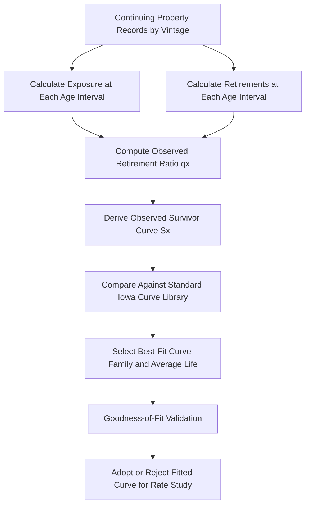

## Iowa Curves and Actuarial Retirement Analysis

### Overview

Iowa curves and actuarial retirement analysis form the statistical core of utility depreciation practice — the specific mathematical toolkit used to convert raw historical property retirement records into defensible estimates of average service life, dispersion pattern, and ultimately depreciation rates. While the prior topic on Depreciation Studies introduced Iowa curves at a survey level, this topic addresses the actuarial mechanics in greater technical depth: how retirement data is structured, how survivor ratios are computed, how curve-fitting is statistically validated, and how the resulting estimates are defended and contested in regulatory proceedings.

**Key Points**

- Actuarial retirement analysis is the broader discipline; Iowa curves are the specific standardized curve family used within it for utility property
- The technique borrows its statistical foundation from mortality/survivorship analysis in actuarial science (life insurance origins) applied to physical property rather than human populations
- Originally developed at Iowa State University's Engineering Experiment Station (Winfrey and others, 1930s), these curves remain the predominant standard cited in North American utility depreciation testimony

### Foundational Concepts

#### The Property Retirement Analogy to Mortality Tables

Actuarial retirement analysis treats a group of installed utility assets analogously to a human cohort in a mortality table: each unit has an "age" from installation, and at each age interval a certain fraction of the surviving population is "retired" (removed from service). The resulting survivor curve is directly analogous to a survivorship curve in life-table actuarial science.

$$q_x = \frac{\text{Retirements during age interval } x}{\text{Exposures at age } x}$$

Where $q_x$ is the retirement ratio (analogous to a mortality rate) at age $x$, calculated from the utility's historical property records.

#### Exposure and Retirement Data Structure

- **Exposure**: the dollar amount (or unit count) of property that was in service and "at risk" of retirement during a given age interval
- **Retirement**: the dollar amount (or unit count) actually removed from service during that interval
- These are compiled from the utility's continuing property records (CPR), organized by vintage (installation year) and tracked through subsequent years to observe at what age each vintage's units are retired

**Key Points**

- Data quality and completeness of the CPR system directly determines the statistical reliability of any actuarial analysis — incomplete retirement unit records are a recurring practical limitation, especially for older vintages or accounts with historically poor record-keeping
- [Unverified] The specific CPR data retention and granularity requirements are not uniformly mandated across jurisdictions; FERC's Uniform System of Accounts establishes general property record requirements, but the practical granularity utilities maintain varies by company and account

### The Iowa Curve Family System in Detail

#### Structure: Shape and Mode

Iowa curves are classified along two dimensions:

1. **Shape/skewness** — denoted by letter: **O** (origin-modal), **L** (left-modal), **S** (symmetrical), **R** (right-modal)
2. **Modal position/peakedness** — denoted by a number (typically 0.5 to 6), indicating how concentrated retirements are around the mode; lower numbers indicate a broader, flatter dispersion, higher numbers indicate a sharper peak

**Key Points**

- The full standard set comprises 18 curves originally developed (with later extensions), covering the practical range of dispersion patterns observed empirically across many types of industrial and utility property in the original Iowa studies
- A curve designation is always paired with an average life to be fully specified, e.g., "S3-35" (S3 shape, 35-year average life) or "R2-50" (R2 shape, 50-year average life)

#### Modal Position and Practical Interpretation

| Position | Interpretation |
| --- | --- |
| O (Origin) | Highest retirement frequency occurs very early in life, near installation |
| L (Left) | Peak retirement frequency occurs before reaching average life |
| S (Symmetrical) | Peak retirement frequency occurs at or very near average life, roughly symmetric dispersion |
| R (Right) | Peak retirement frequency occurs after average life is reached |

**Key Points**

- R-type and S-type curves are the most frequently applied to core long-lived utility infrastructure (poles, conductor, structures, underground facilities) in practice, since these assets typically remain functional up to or beyond nominal design life before retirement
- L-type and O-type curves more commonly apply to assets subject to earlier obsolescence, failure, or technology turnover (e.g., certain communications or metering equipment historically, prior to smart meter deployment cycles)
- [Inference] Curve selection is ultimately always an empirical fitting exercise specific to a utility's own historical data rather than a generic rule tied to asset type — general tendencies exist, but any given utility's actual retirement experience for a specific account governs the analysis

### Actuarial Analysis Methodologies

#### Retirement Rate Method (RRM) — Detailed Mechanics

The RRM constructs an "observed life table" directly from historical exposure and retirement data:

1. For each vintage-age combination, calculate exposure (property surviving to the start of the age interval) and retirements (property retired during that interval)
2. Aggregate exposures and retirements across all vintages for each age interval to build a composite observed retirement ratio $q_x$ at each age
3. Convert retirement ratios into a survivor ratio at each age:

$$S(x) = S(x-1) \times (1 - q_x)$$

4. Compare the resulting empirical survivor curve to the standard Iowa curve family, testing goodness-of-fit across candidate curves and average lives
5. Select the Iowa curve and average life combination that best matches the observed data (commonly by minimizing sum-of-squared-deviations or a similar statistical fit criterion)

#### Simulated Plant Record (SPR) Method — Detailed Mechanics

The SPR method is an alternative/complementary approach that works "backward" from account balances rather than "forward" from individual retirement observations:

1. Simulate a hypothetical plant account balance history, assuming a candidate Iowa curve and average life applied to the utility's actual historical additions
2. Compare the simulated balances to the utility's actual recorded plant balances over the same historical period
3. Iterate across candidate curve/life combinations, selecting the one that minimizes the deviation between simulated and actual balances
4. Particularly useful when an account's retirement history is too sparse (e.g., a relatively new account, or one dominated by a small number of large vintages) to support a statistically robust RRM analysis directly

**Key Points**

- RRM and SPR are not mutually exclusive — many depreciation studies apply both methods to the same account as a cross-check, particularly for material accounts where testimony is likely to be contested
- [Inference] SPR is more frequently relied upon, or given more analytical weight, for accounts where the RRM-derived curve produces a poor statistical fit or implausible life estimate, since SPR's balance-based approach can be less sensitive to certain data gaps than unit-level retirement tracking

#### Goodness-of-Fit and Statistical Validation

- Common validation approaches include visual comparison of observed versus fitted survivor curves and quantitative fit statistics (e.g., sum-of-squared-errors between observed and fitted curve points)
- Depreciation study testimony typically presents both the selected curve/life and the statistical basis for preferring it over reasonable alternative candidates, since curve/life selection is a frequent point of cross-examination
- [Unverified] No single, universally mandated statistical threshold (e.g., a specific minimum R² or maximum error tolerance) governs curve selection across all U.S. jurisdictions; acceptable fit quality is generally a matter of expert judgment and case-specific evidentiary persuasion rather than a fixed regulatory rule

### Interim Survivor Curve and Average Remaining Life Concepts

#### Interim Survivor Curve (ISC)

Used when a vintage group has not yet fully aged out (i.e., is still relatively young), requiring projection of expected future retirement behavior based on the fitted Iowa curve, since actual full-life retirement data does not yet exist for that vintage.

$$ARL(x) = \frac{\int_{x}^{x_{max}} S(t) \, dt}{S(x)}$$

Where $ARL(x)$ is average remaining life at current age $x$, calculated as the remaining area under the survivor curve beyond age $x$, divided by the percent surviving at age $x$.

**Key Points**

- Average remaining life is the direct input to the remaining life depreciation rate calculation (see Depreciation Studies and Life and Survivor Curve Analysis and Straight Line and Group Depreciation Methods)
- For younger vintages, ARL estimation relies more heavily on the fitted Iowa curve's projected future shape than on directly observed retirement data, since limited actual experience exists yet for those ages

### Illustrative Example

**Example**

A utility's steel transmission tower account (installed primarily 1975–1995) is analyzed using the retirement rate method:

- Observed retirement ratios by age interval are compiled from 45 years of continuing property records
- The empirical survivor curve shows minimal retirements before age 40, with retirement frequency accelerating sharply between ages 55-70
- This pattern is statistically matched to an **R4-65** Iowa curve (right-modal, sharply peaked, 65-year average life) using the retirement rate method, with a supporting simulated plant record cross-check confirming a consistent fit
- Because the account's oldest vintage (1975) is currently only 51 years old (as of 2026), the account has not yet fully aged through its projected retirement pattern — an interim survivor curve is applied to estimate average remaining life for vintages that have not yet reached the R4-65 curve's peak retirement zone
- This ARL, combined with net salvage analysis, produces the remaining life depreciation rate recommendation carried into the depreciation study

### Diagram: Actuarial Retirement Analysis Workflow

<svg xmlns="http://www.w3.org/2000/svg" viewBox="0 0 740 340">
<text x="370" y="26" font-size="16" font-weight="bold" text-anchor="middle" fill="#1a1a1a">Actuarial Retirement Analysis — End-to-End Flow (svg_diagram)</text>
<rect x="30" y="55" width="200" height="55" rx="6" fill="#e8f0fe" stroke="#3b6fd6" stroke-width="1.5" />
<text x="130" y="78" font-size="12" text-anchor="middle" fill="#1a1a1a">Vintage-Level Exposure</text>
<text x="130" y="94" font-size="12" text-anchor="middle" fill="#1a1a1a">and Retirement Data</text>
<line x1="230" y1="82" x2="290" y2="82" stroke="#555" stroke-width="1.5" marker-end="url(#ia1)" />
<rect x="290" y="55" width="200" height="55" rx="6" fill="#fff3e0" stroke="#e0913b" stroke-width="1.5" />
<text x="390" y="78" font-size="12" text-anchor="middle" fill="#1a1a1a">RRM / SPR Statistical</text>
<text x="390" y="94" font-size="12" text-anchor="middle" fill="#1a1a1a">Curve Fitting</text>
<line x1="490" y1="82" x2="550" y2="82" stroke="#555" stroke-width="1.5" marker-end="url(#ia1)" />
<rect x="550" y="55" width="160" height="55" rx="6" fill="#fce8e8" stroke="#c0392b" stroke-width="1.5" />
<text x="630" y="78" font-size="12" text-anchor="middle" fill="#1a1a1a">Selected Iowa Curve</text>
<text x="630" y="94" font-size="12" text-anchor="middle" fill="#1a1a1a">+ Average Life</text>
<line x1="630" y1="110" x2="630" y2="150" stroke="#555" stroke-width="1.5" marker-end="url(#ia1)" />
<rect x="500" y="150" width="210" height="55" rx="6" fill="#f3e8fd" stroke="#7e3bd6" stroke-width="1.5" />
<text x="605" y="173" font-size="12" text-anchor="middle" fill="#1a1a1a">Interim Survivor Curve /</text>
<text x="605" y="189" font-size="12" text-anchor="middle" fill="#1a1a1a">Average Remaining Life</text>
<line x1="500" y1="177" x2="260" y2="177" stroke="#555" stroke-width="1.5" marker-end="url(#ia1)" />
<rect x="30" y="150" width="230" height="55" rx="6" fill="#e6f4ea" stroke="#2e7d32" stroke-width="1.5" />
<text x="145" y="173" font-size="12" text-anchor="middle" fill="#1a1a1a">Net Salvage Analysis</text>
<text x="145" y="189" font-size="12" text-anchor="middle" fill="#1a1a1a">(Separate Historical Study)</text>
<line x1="145" y1="205" x2="145" y2="245" stroke="#555" stroke-width="1.5" marker-end="url(#ia1)" />
<line x1="605" y1="205" x2="300" y2="245" stroke="#555" stroke-width="1.5" marker-end="url(#ia1)" />
<rect x="60" y="245" width="480" height="55" rx="6" fill="#e6f4ea" stroke="#2e7d32" stroke-width="1.5" />
<text x="300" y="268" font-size="12" text-anchor="middle" fill="#1a1a1a">Depreciation Rate Recommendation</text>
<text x="300" y="284" font-size="12" text-anchor="middle" fill="#1a1a1a">(Whole Life or Remaining Life Method)</text>
</svg>

### Contested Issues in Actuarial Analysis Testimony

**Key Points**

- Choice of statistical fitting method (RRM vs. SPR) and resulting curve selection is a frequent subject of dueling expert testimony, since a different curve family/life combination can materially shift the depreciation rate even when both candidates achieve a reasonable statistical fit to available data
- Treatment of "mass property" accounts with limited or noisy retirement data (common for newer technology categories) is a recurring challenge, since actuarial confidence is inherently weaker with fewer completed life-cycle observations
- Truncation or exclusion of anomalous retirement events (e.g., a one-time mass retirement due to storm damage, system rebuild, or technology replacement program) from the "normal" retirement pattern used for curve-fitting is a judgment call that intervenors frequently scrutinize
- [Inference] As utilities deploy larger volumes of newer technology (grid modernization equipment, smart devices, certain storage and inverter-based assets) without decades of retirement history behind them, reliance on SPR methods, industry-comparable life studies, and engineering judgment (rather than pure RRM analysis) is likely to remain proportionally more significant for these accounts than for legacy long-lived infrastructure

**Related Topics**

- Straight Line and Group Depreciation Methods
- Depreciation Studies and Life and Survivor Curve Analysis
- Net Salvage Value and Cost of Removal Estimation
- Remaining Life vs. Whole Life Depreciation Methodology
- Continuing Property Records and Plant Sub-Ledger Systems
- Mass Property vs. Unit Property Accounting Treatment
- Technology-Driven Life Estimate Revisions for Grid Modernization Assets