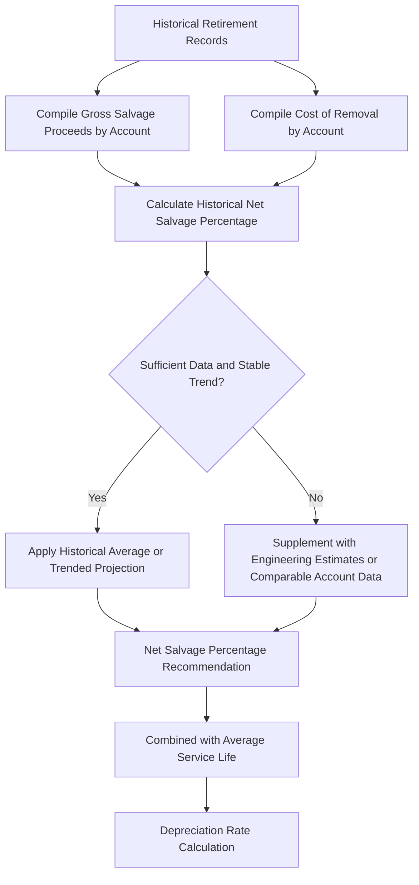

## Net Salvage and Removal Cost Estimation

### Overview

Net salvage and removal cost estimation is the component of depreciation studies that quantifies what happens financially at the end of an asset's service life: the value recovered from disposal (gross salvage) net of the cost incurred to remove it from service (cost of removal, COR). Unlike general corporate accounting where salvage value is typically a modest positive offset to depreciable cost, utility net salvage is frequently negative — removal costs regularly exceed recoverable scrap or resale value — making this analysis a materially significant driver of depreciation rates and a recurring area of regulatory contest.

**Key Points**

- Gross salvage: proceeds recovered from a retired asset (scrap value, resale value, trade-in value)
- Cost of removal (COR): the cost incurred to physically remove, dismantle, or decommission the retired asset, including labor, equipment, hauling, and site restoration
- Net salvage: gross salvage minus cost of removal, which functions as an adjustment to the depreciable base and can be positive or negative
- This topic connects directly to the mechanics introduced in Straight Line and Group Depreciation Methods, where net salvage is shown to increase the depreciable base when negative

### The Net Salvage Formula and Its Effect on Depreciation

$$S_{net} = S_{gross} - COR$$

$$\text{Depreciable Base} = C - S_{net} = C - (S_{gross} - COR) = C + (COR - S_{gross})$$

Where $C$ is original cost. When $COR > S_{gross}$, net salvage is negative and the depreciable base *increases* above original cost — ratepayers effectively prefund a portion of the expected future removal cost through current depreciation expense.

$$r_{depr} = \frac{100\% - S_{net}\%}{ASL}$$

Where $S_{net}\%$ is net salvage expressed as a percentage of original cost (negative when removal costs dominate) and $ASL$ is average service life (see Iowa Curves and Actuarial Retirement Analysis).

**Key Points**

- A negative net salvage percentage directly increases the depreciation rate, since a larger depreciable base is spread over the same estimated life
- This is one of the more consequential yet less publicly visible drivers of depreciation expense — a modest shift in assumed cost-of-removal percentage across a large plant account can move revenue requirement by a material amount

### Why Utility Net Salvage Is Frequently Negative

#### Structural Cost Drivers

- **Labor-intensive removal** — dismantling poles, underground cable, pipeline, and substation equipment typically requires skilled labor, specialized equipment, and safety/traffic control measures that cost more than the scrap value recovered
- **Environmental and regulatory compliance costs** — removal of certain equipment (e.g., PCB-containing transformers historically, treated wood poles, certain pipeline materials) can trigger specific handling, transport, and disposal requirements that add materially to COR
- **Site restoration requirements** — regulatory, franchise, or property owner requirements to restore land, pavement, or rights-of-way to original condition after removal
- **Underground and hard-to-access facilities** — buried cable, conduit, and pipeline often cost more to excavate and remove than their scrap value, particularly in urban or congested rights-of-way

#### Asset Categories Most Prone to Negative Net Salvage

| Asset Category | Typical Driver |
| --- | --- |
| Underground distribution cable/conduit | Excavation labor cost exceeds copper/scrap value |
| Wood distribution poles | Removal, hauling, and disposal cost exceeds negligible scrap value |
| Transmission structures | Heavy equipment and labor cost for dismantling |
| Substation equipment (older) | Handling/disposal requirements for legacy materials |
| Pipeline (gas distribution) | Excavation, safety purging, and abandonment/removal procedures |

**Key Points**

- [Inference] Overhead conductor and certain metallic equipment with meaningful scrap metal value are more likely to show positive or near-zero net salvage than buried or structurally embedded assets, though the specific outcome always depends on utility-specific historical cost experience rather than a fixed rule by asset type

### Net Salvage Estimation Methodology

#### Historical Percentage Analysis

The standard approach analyzes the utility's own historical gross salvage and cost of removal experience, typically expressed as a percentage of the original cost of retired property, over a study period (often 5-10 years or longer, depending on data availability and account activity).

$$S_{net}\%_{historical} = \frac{\sum S_{gross} - \sum COR}{\sum \text{Original Cost of Retirements}} \times 100\%$$

#### Trending and Escalation

Because removal costs tend to rise over time with labor and regulatory cost inflation, many depreciation studies apply a trending adjustment to historical net salvage percentages rather than assuming the historical average will hold unchanged into the future.

**Key Points**

- Net salvage trending typically involves regression or judgmental analysis of how the historical net salvage percentage has moved over successive study periods, then projecting that trend forward for ratemaking purposes
- This trending practice is one of the most frequently contested elements of net salvage testimony — intervenors often argue trended (increasingly negative) projections overstate future removal costs, while utilities argue historical trends reasonably predict continued cost escalation, particularly for labor-intensive removal activities

#### Data Granularity Challenges

- Net salvage percentages are often calculated and applied at the plant account or sub-account level, similar to service life analysis
- For accounts with limited retirement activity during the study period, statistically credible net salvage percentages can be difficult to derive, requiring reliance on broader account groupings, industry comparables, or engineering estimates

### Interaction with Asset Retirement Obligations (ARO)

Net salvage/COR accrual in regulatory depreciation is conceptually related to, but distinct from, Asset Retirement Obligations under general financial accounting standards (ASC 410 in U.S. GAAP), which require recognition of a legal removal obligation liability at fair value when incurred.

**Key Points**

- Regulatory net salvage accrual through depreciation and GAAP ARO liability recognition can produce different book results, since GAAP ARO is triggered by a legal obligation to perform removal (e.g., a lease requirement, environmental law, or license condition) and measured at discounted fair value, while regulatory net salvage is a ratemaking convention spreading expected average removal cost over the asset's service life via the depreciation rate
- Most state commissions require or permit a regulatory offset (typically a regulatory liability or asset) to reconcile GAAP ARO accounting with the traditional regulatory net salvage/depreciation approach, so that rate base and revenue requirement continue to reflect the traditional cost-of-removal-through-depreciation methodology rather than the GAAP fair-value ARO liability directly
- [Unverified] The specific mechanics of this GAAP-to-regulatory reconciliation (which regulatory asset/liability accounts are used, and how differences are trued up) vary by jurisdiction and by the specific FERC or state uniform system of accounts guidance applicable to the utility

### Illustrative Example

**Example**

A utility's underground gas distribution mains account has the following historical retirement experience over a 10-year study period:

- Total original cost of retirements: $40 million
- Total gross salvage recovered (pipe scrap value): $1.2 million
- Total cost of removal (excavation, safety purging, restoration): $6.8 million

**Step 1 — Historical net salvage percentage:**

$$S_{net}\% = \frac{\$1.2M - \$6.8M}{\$40M} \times 100\% = \frac{-\$5.6M}{\$40M} \times 100\% = -14\%$$

**Step 2 — Trending adjustment:**

Analysis of the percentage across three successive 10-year study windows shows the net salvage percentage has moved from -9% to -11% to -14% over roughly 20 years, reflecting rising excavation labor and safety compliance costs. The depreciation study recommends trending this further to **-16%** for the prospective rate-setting period based on continued expected labor cost escalation.

**Step 3 — Effect on depreciable base and rate** (assuming a 55-year average service life for this account):

$$r_{depr} = \frac{100\% - (-16\%)}{55} = \frac{116\%}{55} = 2.11\%$$

Versus a rate of $\frac{100\%}{55} = 1.82\%$ if net salvage were assumed to be zero — illustrating how the negative net salvage assumption increases the annual depreciation rate by roughly 16% relative to a zero-net-salvage baseline.

### Diagram: Net Salvage Impact on Depreciable Base

<svg viewBox="0 0 700 300" xmlns="http://www.w3.org/2000/svg">
<text x="350" y="26" font-size="16" font-weight="bold" text-anchor="middle" fill="#1a1a1a">Net Salvage Effect on Depreciable Base (svg_diagram)</text>

<text x="150" y="60" font-size="13" font-weight="bold" text-anchor="middle" fill="`#1a1a1a`">Positive Net Salvage</text>

<rect x="60" y="80" width="180" height="40" fill="`#e8f0fe`" stroke="`#3b6fd6`" stroke-width="1.5"/>

<text x="150" y="104" font-size="11" text-anchor="middle" fill="`#1a1a1a`">Depreciable Base < Original Cost</text>

<rect x="60" y="130" width="180" height="16" fill="`#c8e6c9`" stroke="`#2e7d32`" stroke-width="1"/>

<text x="150" y="142" font-size="10" text-anchor="middle" fill="`#1a1a1a`">Salvage Proceeds Offset Cost</text>

<text x="550" y="60" font-size="13" font-weight="bold" text-anchor="middle" fill="`#1a1a1a`">Negative Net Salvage</text>

<rect x="440" y="80" width="220" height="40" fill="`#fce8e8`" stroke="`#c0392b`" stroke-width="1.5"/>

<text x="550" y="104" font-size="11" text-anchor="middle" fill="`#1a1a1a`">Depreciable Base > Original Cost</text>

<rect x="440" y="130" width="220" height="16" fill="`#fddede`" stroke="`#c0392b`" stroke-width="1"/>

<text x="550" y="142" font-size="10" text-anchor="middle" fill="`#1a1a1a`">Removal Cost Exceeds Recovery</text>

<line x1="150" y1="120" x2="150" y2="150" stroke="#333" stroke-width="1"/>
<line x1="550" y1="120" x2="550" y2="150" stroke="#333" stroke-width="1"/>

<text x="350" y="200" font-size="12" text-anchor="middle" fill="#333">Both cases: applied ratably over Average Service Life via</text>

<text x="350" y="218" font-size="12" text-anchor="middle" fill="#333">straight line group depreciation rate</text>

<rect x="150" y="240" width="400" height="40" rx="6" fill="#e6f4ea" stroke="#2e7d32" stroke-width="1.5"/>
<text x="350" y="265" font-size="12" text-anchor="middle" fill="#1a1a1a">r = (100% − Net Salvage %) / Average Service Life</text>
</svg>

### Contested Issues and Practical Considerations

**Key Points**

- Net salvage trending methodology (statistical regression vs. judgmental extrapolation vs. holding historical average flat) is one of the most commonly litigated elements of depreciation study testimony, given its direct and compounding effect on depreciation rates across large plant accounts
- Utilities generally bear the burden of supporting both the historical net salvage calculation and any forward-looking trend adjustment with credible data and methodology
- Distinguishing "normal" recurring cost of removal from non-recurring or unusual removal events (e.g., a one-time large-scale pipeline abandonment project) is a frequent analytical and evidentiary issue, since including atypical events in the baseline can skew the average net salvage percentage
- [Inference] As underground and hard-to-access infrastructure continues to represent a growing share of utility investment (particularly undergrounding programs driven by reliability or wildfire mitigation policy), negative net salvage assumptions and their associated depreciation rate impact are likely to remain a persistent and material area of depreciation study analysis and regulatory scrutiny going forward

**Related Topics**

- Straight Line and Group Depreciation Methods
- Depreciation Studies and Life and Survivor Curve Analysis
- Iowa Curves and Actuarial Retirement Analysis
- Asset Retirement Obligations (ARO) and Regulatory Accounting Reconciliation
- Remaining Life vs. Whole Life Depreciation Methodology
- Depreciation Reserve Deficiency and Surplus True-Ups
- Underground Conversion and Infrastructure Hardening Cost Recovery