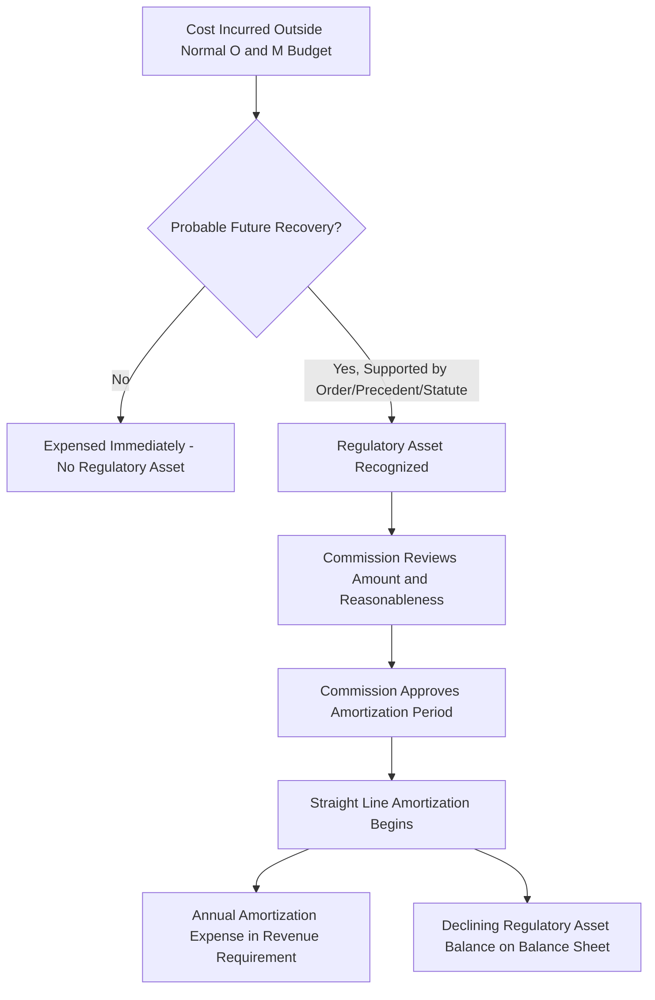

## Amortization of Regulatory Assets

### Overview

Amortization of regulatory assets is the mechanism by which deferred costs recognized under regulatory accounting — items that would typically be expensed immediately under general financial accounting but that regulators permit utilities to defer and recover over time — are systematically recovered through customer rates over an approved period. Where depreciation applies to tangible plant in service, amortization applies primarily to these deferred, often intangible or non-plant, regulatory balances, and follows its own distinct approval and recovery logic.

**Key Points**

- Regulatory asset: a cost the utility has incurred (or is probable to incur) that regulatory accounting permits to be deferred and recovered from ratepayers in future periods, rather than expensed immediately, because future rate recovery is deemed probable
- Regulatory liability: the mirror-image concept — an amount owed back to ratepayers, deferred and amortized as a credit against future revenue requirement
- Amortization: the scheduled, period-by-period recognition of these deferred balances in the revenue requirement, generally on a straight line basis over a commission-approved recovery period

### Regulatory Asset Recognition Framework

#### Accounting Basis: ASC 980 (Regulated Operations)

U.S. GAAP addresses regulatory asset and liability recognition through ASC 980, which permits (and in substance requires, for entities that meet its criteria) recognition of regulatory assets and liabilities when specific conditions are met.

**Key Points**

- ASC 980 recognition generally requires that (1) rates are established by an independent regulator, (2) rates are designed to recover specific costs of providing service, and (3) it is probable that such rates can be charged to and collected from customers
- A cost that would otherwise be expensed under general accounting can instead be capitalized as a regulatory asset when a utility has a reasonable expectation, supported by regulatory precedent, order, or statute, that it will recover that cost from ratepayers in a future period
- [Inference] The "probable of recovery" threshold is the central judgment area in regulatory asset accounting — utilities and auditors must assess, often before a commission has issued a final order, whether recovery is more likely than not, which can require significant judgment for novel or contested cost categories

#### Distinction from Rate Base

Regulatory assets are generally accounted for and amortized separately from traditional plant-in-service rate base treatment, though many jurisdictions do allow a rate base-like carrying charge (return) on regulatory asset balances in addition to amortization of the principal.

| Feature | Plant in Service (Rate Base) | Regulatory Asset |
| --- | --- | --- |
| Nature | Tangible, used-and-useful capital investment | Deferred cost balance, often intangible/non-physical |
| Recovery mechanism | Depreciation over estimated service life | Amortization over a commission-approved recovery period |
| Return component | Standard rate of return on net rate base | Return (carrying charge) often included, but treatment varies by jurisdiction and cost type |
| Approval basis | General used and useful/prudence review | Specific commission order authorizing deferral and recovery period |

### Common Categories of Regulatory Assets

#### Storm Restoration and Major Event Costs

- Costs incurred to restore service after major storms, hurricanes, ice storms, or wildfires, often far exceeding normal O&M budgets in a single year
- Regulators frequently authorize deferral of these costs into a regulatory asset, followed by amortization (often 3-10 years, depending on magnitude and jurisdiction) to avoid a single-year rate spike

#### Deferred Income Tax Regulatory Assets/Liabilities

- Arise from timing differences between book and tax depreciation, and from broader tax law changes (e.g., corporate tax rate changes requiring re-measurement of accumulated deferred income taxes)
- Excess or deficient deferred taxes resulting from federal tax rate changes are commonly amortized to ratepayers over a specified period, sometimes subject to specific IRS normalization rules for accelerated tax depreciation-related amounts

#### Pension and Other Post-Employment Benefit (OPEB) Cost Deferrals

- Differences between pension/OPEB expense recognized under accounting standards (e.g., ASC 715) and amounts actually included in rates are frequently deferred as a regulatory asset or liability and trued up through amortization in subsequent proceedings

#### Rate Case Expense

- The utility's own costs of prosecuting a rate case (legal, consulting, expert witness fees) are commonly deferred and amortized over a period following the case (often matching the expected interval until the next rate case) rather than expensed entirely in the year incurred

#### Environmental Remediation Costs

- Costs associated with legacy environmental cleanup (e.g., former manufactured gas plant sites) are frequently deferred and recovered through a dedicated regulatory asset and amortization schedule, sometimes with associated insurance or third-party recovery offsets

#### Deferred Fuel and Purchased Power Costs

- Under-recovered fuel or purchased power costs from fuel adjustment clause reconciliation are deferred as a regulatory asset and amortized (often over a relatively short period, e.g., 12 months) as part of the next reconciliation cycle

#### COVID-19 and Extraordinary Event Cost Deferrals

- [Unverified] A number of state commissions authorized deferral of incremental bad debt, uncollectible expense, and other pandemic-related costs during 2020-2021 as regulatory assets for subsequent amortized recovery; the specific mechanisms, amounts, and current amortization status vary considerably by jurisdiction and utility, and many of these balances may have already been fully amortized or resolved by the current period

### Amortization Mechanics

#### Straight Line Amortization (Standard Approach)

$$A_{annual} = \frac{RA_{balance}}{N_{amort}}$$

Where $A_{annual}$ is annual amortization expense, $RA_{balance}$ is the approved regulatory asset balance, and $N_{amort}$ is the commission-approved amortization period in years.

**Key Points**

- Straight line amortization is standard for the same reasons straight line depreciation dominates plant recovery: rate stability, simplicity, and consistency with level cost-of-service ratemaking philosophy
- Unlike depreciation, which is tied to physical asset service life and actuarial retirement analysis, the amortization period for a regulatory asset is a **negotiated or commission-determined policy choice**, often balancing rate impact smoothing against intergenerational equity (matching cost recovery timing to the periods benefiting from or causing the cost)

#### Determining the Amortization Period

Common considerations commissions weigh in setting an amortization period include:

- Magnitude of the balance relative to normal rate impact tolerance (larger balances often get longer periods to avoid rate shock)
- Nature of the underlying cost (e.g., storm costs may be tied to the expected interval until the next major storm event, rate case expense to the expected interval until the next rate case)
- Specific statutory or regulatory guidance in the jurisdiction for that cost category
- Utility financial condition and cash flow considerations

#### Carrying Charges on Regulatory Asset Balances

- Many jurisdictions authorize a carrying charge (interest or a rate-of-return-based charge) on the unamortized regulatory asset balance, compensating the utility for the time value of money on deferred cost recovery, conceptually similar to AFUDC on construction work in progress
- **Key Points**
  - The carrying charge rate applied varies by jurisdiction — some use the utility's overall authorized rate of return, others use a specific short-term or long-term debt rate, and some regulatory asset categories are approved without any carrying charge at all
  - [Unverified] Whether a carrying charge is available, and at what rate, for any specific regulatory asset category is jurisdiction- and case-specific; there is no uniform national standard

### Regulatory Liabilities: The Mirror Concept

**Key Points**

- Regulatory liabilities arise when a utility has collected (or is probable to be required to refund) amounts from ratepayers in excess of costs incurred, or has received a benefit (e.g., excess deferred taxes from a tax rate reduction) that must be returned to ratepayers over time
- Common regulatory liability examples include excess accumulated deferred income taxes following a corporate tax rate reduction (e.g., the 2017 U.S. Tax Cuts and Jobs Act reduction from 35% to 21%, which created substantial excess ADIT regulatory liabilities requiring amortization back to ratepayers), and over-recovered fuel costs
- Amortization of regulatory liabilities follows parallel mechanics to regulatory asset amortization, but functions as a *credit* reducing revenue requirement rather than an expense increasing it

### Illustrative Example

**Example**

A utility incurs $180 million in incremental storm restoration costs following a major hurricane, well above its normal annual storm O&M budget of roughly $15 million.

- The utility petitions the commission for authorization to defer the incremental $165 million ($180M actual minus $15M normal budget already embedded in rates) as a regulatory asset
- The commission opens a prudence review of the storm costs (see Disallowances and Imprudence Findings) and disallows $8 million related to documented inefficiencies in contractor mobilization
- The commission approves a regulatory asset of $157 million, to be amortized over 7 years, with a carrying charge equal to the utility's currently authorized weighted average cost of debt

**Annual amortization expense:**

$$A_{annual} = \frac{\$157,000,000}{7} = \$22,428,571$$

This amount is included in the revenue requirement as an amortization expense line item (distinct from depreciation expense on plant) for each of the 7 years, declining the regulatory asset balance to zero at the end of the period, with the carrying charge calculated on the declining unamortized balance throughout.

### Diagram: Regulatory Asset vs. Rate Base Recovery Paths

<svg xmlns="http://www.w3.org/2000/svg" viewBox="0 0 740 300">
<text x="370" y="26" font-size="16" font-weight="bold" text-anchor="middle" fill="#1a1a1a">Regulatory Asset vs. Plant Rate Base Recovery (svg_diagram)</text>
<rect x="40" y="55" width="300" height="45" rx="6" fill="#e8f0fe" stroke="#3b6fd6" stroke-width="1.5" />
<text x="190" y="82" font-size="12" text-anchor="middle" fill="#1a1a1a">Plant in Service (Tangible, Used and Useful)</text>
<rect x="400" y="55" width="300" height="45" rx="6" fill="#fff3e0" stroke="#e0913b" stroke-width="1.5" />
<text x="550" y="82" font-size="12" text-anchor="middle" fill="#1a1a1a">Regulatory Asset (Deferred Cost Balance)</text>
<line x1="190" y1="100" x2="190" y2="140" stroke="#555" stroke-width="1.5" marker-end="url(#ra1)" />
<line x1="550" y1="100" x2="550" y2="140" stroke="#555" stroke-width="1.5" marker-end="url(#ra1)" />
<rect x="60" y="140" width="260" height="45" rx="6" fill="#e6f4ea" stroke="#2e7d32" stroke-width="1.5" />
<text x="190" y="167" font-size="11" text-anchor="middle" fill="#1a1a1a">Depreciation (Iowa Curve-Based Life)</text>
<rect x="420" y="140" width="260" height="45" rx="6" fill="#e6f4ea" stroke="#2e7d32" stroke-width="1.5" />
<text x="550" y="167" font-size="11" text-anchor="middle" fill="#1a1a1a">Amortization (Commission-Set Period)</text>
<line x1="190" y1="185" x2="370" y2="230" stroke="#555" stroke-width="1.5" marker-end="url(#ra1)" />
<line x1="550" y1="185" x2="390" y2="230" stroke="#555" stroke-width="1.5" marker-end="url(#ra1)" />
<rect x="220" y="230" width="300" height="45" rx="6" fill="#f3e8fd" stroke="#7e3bd6" stroke-width="1.5" />
<text x="370" y="257" font-size="12" text-anchor="middle" fill="#1a1a1a">Combined in Revenue Requirement</text>
</svg>

### Contested Issues and Practical Considerations

**Key Points**

- Prudence of the underlying cost remains fully subject to review before a regulatory asset is approved — deferral authorization does not itself concede prudence, and a subsequent prudence disallowance can reduce the regulatory asset balance before amortization begins (as illustrated in the storm cost example above)
- Amortization period length is frequently negotiated in settlement or contested on grounds of rate impact versus cost-causation/intergenerational equity principles
- Regulatory asset balances not yet approved for specific amortization treatment (i.e., pending commission decision) create a risk that recovery may ultimately be denied in whole or part, which is why the ASC 980 "probable of recovery" threshold is closely monitored by utility accounting and audit functions
- [Inference] Regulatory asset and liability balances, particularly excess ADIT amortization schedules and storm cost deferrals, have become an increasingly significant and recurring feature of utility revenue requirements in recent years, given the frequency of major weather events and periodic tax law changes affecting the utility sector

**Related Topics**

- Disallowances and Imprudence Findings
- Straight Line and Group Depreciation Methods
- Accumulated Deferred Income Taxes and Excess ADIT Amortization
- Storm Cost Securitization and Recovery Mechanisms
- Fuel Adjustment Clause Reconciliation Proceedings
- Pension and OPEB Cost Recovery in Rates
- Rate Case Expense Recovery Treatment