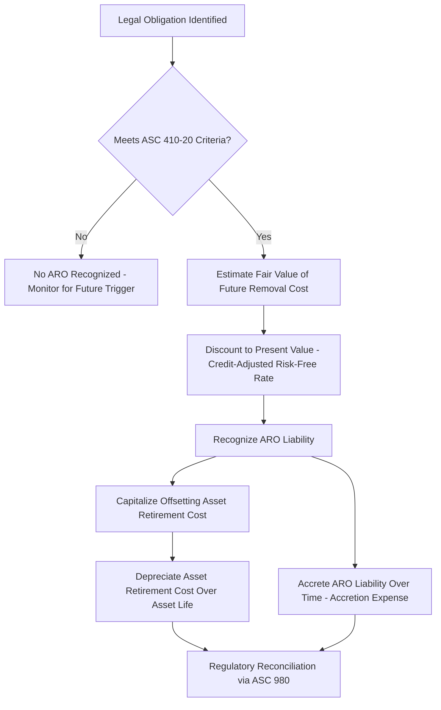

## Asset Retirement Obligations

### Overview

Asset Retirement Obligations (AROs) are legal obligations associated with the retirement of long-lived tangible assets, recognized under U.S. GAAP as a liability at fair value when the obligation is incurred. For regulated utilities, ARO accounting operates alongside — and often in tension with — the traditional regulatory net salvage/cost-of-removal framework embedded in group depreciation, creating a dual accounting structure that regulators reconcile through specific regulatory asset and liability treatment.

**Key Points**

- ARO: a GAAP-defined legal obligation to perform retirement activities (dismantlement, decommissioning, remediation) associated with the retirement of a tangible long-lived asset, recognized under ASC 410-20 (Asset Retirement Obligations)
- Distinct from traditional utility net salvage/cost of removal accrual (see Net Salvage and Removal Cost Estimation), which is a ratemaking convention rather than a GAAP legal-obligation-triggered liability
- The interaction between GAAP ARO accounting and traditional regulatory depreciation/net salvage treatment is addressed through regulatory asset and liability offsets under ASC 980, discussed below

### GAAP Framework: ASC 410-20

#### Recognition Criteria

An ARO must be recognized when:

1. There is a **legal obligation** associated with the retirement of a long-lived asset (arising from statute, regulation, contract, or license condition — not merely a business plan or intent to retire)
2. The obligation results from the **acquisition, construction, development, or normal operation** of the asset
3. The **fair value** of the liability can be reasonably estimated

**Key Points**

- The "legal obligation" requirement is central — a utility's mere expectation or plan to eventually remove an asset does not, by itself, trigger ARO recognition; there must be an enforceable legal duty (e.g., a decommissioning requirement in an operating license, a lease provision requiring restoration, an environmental statute mandating removal)
- Classic examples in the utility sector include nuclear plant decommissioning (required by NRC license conditions), certain easement/right-of-way restoration obligations, and asbestos or other regulated material abatement obligations tied to specific legal requirements

#### Initial Measurement and Recognition

$$ARO_{initial} = FV(\text{estimated future removal cost}) \text{ discounted to present value using a credit-adjusted risk-free rate}$$

Upon initial recognition, the utility records:

- A liability (the ARO) at discounted fair value
- A corresponding increase to the related asset's carrying value (an "asset retirement cost," capitalized as part of the asset)

$$\text{Asset Retirement Cost (capitalized)} = ARO_{initial}$$

#### Subsequent Measurement

- The ARO liability accretes over time (accretion expense) as the discounted liability moves toward its undiscounted future value as the retirement date approaches
- The capitalized asset retirement cost is depreciated over the same period as the associated underlying asset

$$ARO_{t} = ARO_{t-1} \times (1 + r_{credit-adjusted})$$

Where $r_{credit-adjusted}$ is the credit-adjusted risk-free rate used at initial recognition (generally not revised for subsequent changes in the utility's own credit standing, though the estimate of undiscounted cash flows is revised periodically).

### Nuclear Decommissioning as the Primary Utility ARO Application

#### Regulatory and Legal Framework

Nuclear plant decommissioning represents the most significant and most developed ARO application in the utility sector, driven by NRC license requirements mandating that licensees demonstrate financial assurance for eventual plant decommissioning.

**Key Points**

- NRC regulations require licensees to maintain a funded decommissioning trust adequate to cover estimated decommissioning costs, updated periodically based on site-specific decommissioning cost studies
- Nuclear decommissioning trust funding is typically collected from ratepayers over the plant's operating life through a dedicated rate component, separate from and in addition to standard depreciation expense
- [Unverified] The specific decommissioning cost estimation methodology and required funding assurance mechanisms are governed by detailed NRC regulations (10 CFR 50.75 and related provisions); specific dollar estimates are highly site- and reactor-specific and require current regulatory filings to state accurately

#### Decommissioning Trust Fund Accounting

- Contributions to the qualified/non-qualified decommissioning trust are typically treated as a rate base offset or separate revenue requirement component (approaches vary by jurisdiction) rather than flowing through ordinary depreciation expense
- Trust fund investment earnings generally accrue within the trust to help fund the eventual decommissioning cost, subject to specific tax treatment for qualified nuclear decommissioning trusts under Internal Revenue Code provisions

### Reconciling GAAP ARO with Traditional Regulatory Net Salvage

#### The Core Tension

Traditional utility regulatory accounting spreads *expected average* cost of removal across an asset class through the net salvage component of the group depreciation rate (see Net Salvage and Removal Cost Estimation), independent of whether a specific legal obligation exists for any individual asset. GAAP ARO, by contrast, recognizes a discounted liability tied to a *specific legal obligation*, measured at fair value, only when that obligation exists and can be estimated.

**Key Points**

- These two frameworks can produce materially different book entries and timing for the same underlying economic activity (eventual asset removal), even though the ratemaking objective (recovering removal costs from ratepayers over time) is conceptually similar
- Without reconciliation, adopting GAAP ARO accounting directly into rate base and revenue requirement calculations could disrupt the established regulatory net salvage/depreciation methodology that commissions have historically approved

#### The ASC 980 Regulatory Offset Mechanism

Most jurisdictions require or permit regulated utilities to record a regulatory asset or regulatory liability that reconciles GAAP ARO accounting entries back to the traditional regulatory net salvage/depreciation treatment used for ratemaking purposes.

**Key Points**

- The general approach: the utility continues to accrue cost of removal through its traditional group depreciation net salvage component for ratemaking purposes, while separately recognizing the GAAP-required ARO liability, accretion, and asset retirement cost depreciation for financial reporting purposes — with the *difference* between the two approaches captured as a regulatory asset or liability
- This allows the utility's regulatory books (rate base, depreciation expense, revenue requirement) to continue reflecting the commission-approved net salvage methodology, while GAAP financial statements properly reflect the ARO liability as required by accounting standards
- [Inference] This reconciliation approach is widely regarded in utility accounting practice as the standard resolution to the ARO/net-salvage tension, since it preserves the regulator's established ratemaking methodology while satisfying GAAP recognition requirements, though the exact account structure used to record the regulatory offset can vary by utility and jurisdiction

### Comparison: Traditional Net Salvage Accrual vs. GAAP ARO

| Dimension | Traditional Regulatory Net Salvage | GAAP ARO (ASC 410-20) |
| --- | --- | --- |
| Trigger | Statistical/actuarial average across an asset class | Specific identifiable legal obligation |
| Measurement basis | Historical/trended percentage of original cost | Discounted fair value of estimated future cash flows |
| Timing of recognition | Spread ratably via depreciation rate over service life | Recognized in full (as a discounted liability) when obligation is incurred |
| Scope | Applies broadly across most plant accounts via net salvage % | Applies narrowly, only where a specific legal removal obligation exists |
| Primary utility example | Distribution poles, underground cable, general plant | Nuclear decommissioning, specific environmental/contractual obligations |

### Illustrative Example

**Example**

A utility's nuclear generating unit has an NRC license requiring eventual decommissioning. At commercial operation date, the utility performs a site-specific decommissioning cost study estimating undiscounted future decommissioning costs of $1.4 billion, expected to be incurred upon plant retirement in 40 years.

**GAAP ARO recognition (illustrative, using an assumed 5.5% credit-adjusted risk-free discount rate):**

$$ARO_{initial} = \frac{\$1,400,000,000}{(1.055)^{40}} \approx \$164,700,000$$

- The utility recognizes a $164.7 million ARO liability and capitalizes a corresponding asset retirement cost, depreciated over the plant's remaining 40-year license life
- The ARO liability accretes annually toward the full $1.4 billion undiscounted obligation as the retirement date approaches, with accretion expense recognized each year
- Simultaneously, the utility continues collecting decommissioning trust fund contributions from ratepayers under its NRC-driven, commission-approved decommissioning funding schedule (a separate ratemaking mechanism, not identical to the GAAP accretion pattern)
- The difference between the GAAP ARO/accretion/depreciation pattern and the traditional regulatory decommissioning collection schedule is captured in a regulatory asset or liability, ensuring the revenue requirement continues to reflect the commission-approved decommissioning funding methodology rather than the GAAP accretion schedule directly

### Diagram: ARO and Regulatory Reconciliation Structure

<svg xmlns="http://www.w3.org/2000/svg" viewBox="0 0 740 320">
<text x="370" y="26" font-size="16" font-weight="bold" text-anchor="middle" fill="#1a1a1a">ARO / Regulatory Net Salvage Reconciliation (svg_diagram)</text>
<rect x="40" y="55" width="280" height="60" rx="6" fill="#e8f0fe" stroke="#3b6fd6" stroke-width="1.5" />
<text x="180" y="80" font-size="12" text-anchor="middle" fill="#1a1a1a">GAAP ARO Liability</text>
<text x="180" y="96" font-size="12" text-anchor="middle" fill="#1a1a1a">(Discounted Fair Value, ASC 410-20)</text>
<rect x="420" y="55" width="280" height="60" rx="6" fill="#fff3e0" stroke="#e0913b" stroke-width="1.5" />
<text x="560" y="80" font-size="12" text-anchor="middle" fill="#1a1a1a">Traditional Regulatory Net</text>
<text x="560" y="96" font-size="12" text-anchor="middle" fill="#1a1a1a">Salvage / Depreciation Accrual</text>
<line x1="180" y1="115" x2="180" y2="160" stroke="#555" stroke-width="1.5" marker-end="url(#aro1)" />
<line x1="560" y1="115" x2="560" y2="160" stroke="#555" stroke-width="1.5" marker-end="url(#aro1)" />

<text x="180" y="145" font-size="10" text-anchor="middle" fill="#333">Financial Reporting Books</text>

<text x="560" y="145" font-size="10" text-anchor="middle" fill="#333">Ratemaking / Revenue Requirement</text>

<line x1="220" y1="160" x2="480" y2="160" stroke="#999" stroke-width="1" stroke-dasharray="4,4" />
<text x="350" y="150" font-size="10" text-anchor="middle" fill="#666">Difference Captured As:</text>
<rect x="220" y="180" width="300" height="50" rx="6" fill="#f3e8fd" stroke="#7e3bd6" stroke-width="1.5" />
<text x="370" y="203" font-size="12" text-anchor="middle" fill="#1a1a1a">Regulatory Asset or Liability</text>
<text x="370" y="219" font-size="12" text-anchor="middle" fill="#1a1a1a">(ASC 980 Offset)</text>
<line x1="370" y1="230" x2="370" y2="260" stroke="#555" stroke-width="1.5" marker-end="url(#aro1)" />
<rect x="220" y="260" width="300" height="45" rx="6" fill="#e6f4ea" stroke="#2e7d32" stroke-width="1.5" />
<text x="370" y="287" font-size="11" text-anchor="middle" fill="#1a1a1a">Rates Reflect Commission-Approved Methodology</text>
</svg>

### Practical and Contested Issues

**Key Points**

- Decommissioning cost study estimates (particularly for nuclear plants) are periodically updated and can shift materially based on updated engineering estimates, regulatory requirements, and inflation assumptions, requiring corresponding adjustments to both the GAAP ARO liability and the regulatory decommissioning funding schedule
- Discount rate selection for ARO measurement (the credit-adjusted risk-free rate) is a technical accounting judgment area subject to audit scrutiny, distinct from the rate of return used in ratemaking
- Decommissioning trust fund adequacy and investment performance are periodically reviewed by both the NRC (for nuclear) and state/federal ratemaking regulators, since trust underperformance relative to the funding schedule can create future ratepayer or shareholder cost exposure depending on jurisdiction-specific risk allocation rules
- [Inference] As more merchant and regulated nuclear units approach end-of-license or early retirement decisions, and as environmental remediation obligations attached to fossil plant retirements grow, ARO accounting and its regulatory reconciliation is likely to remain a recurring and increasingly significant area of utility accounting and rate case analysis beyond its traditional nuclear-centric application

**Related Topics**

- Net Salvage and Removal Cost Estimation
- Amortization of Regulatory Assets
- Straight Line and Group Depreciation Methods
- Nuclear Decommissioning Trust Fund Ratemaking
- Excess Capacity and Stranded Asset Treatment
- Coal and Fossil Plant Retirement Cost Recovery
- FERC and State Uniform System of Accounts Treatment of AROs