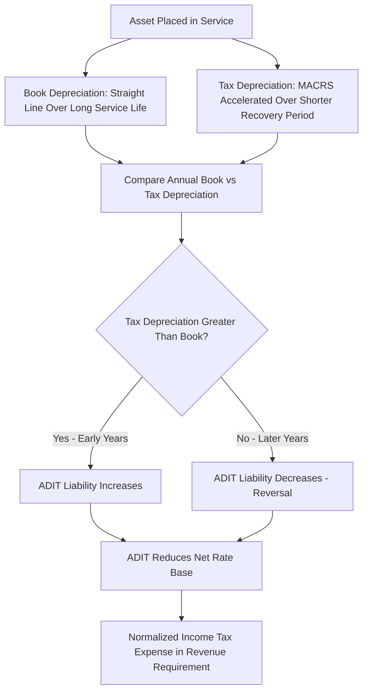

## Book vs. Tax Depreciation Divergence

### Overview

Book vs. tax depreciation divergence refers to the timing differences that arise because utilities depreciate plant on a straight line basis for regulatory/financial reporting (book) purposes while depreciating the same assets on accelerated schedules for federal income tax purposes. This divergence is one of the most consequential and technically distinct areas of utility ratemaking, giving rise to Accumulated Deferred Income Taxes (ADIT), the normalization requirement under the Internal Revenue Code, and a recurring set of true-up and reconciliation issues whenever tax law changes.

**Key Points**

- Book depreciation: straight line, actuarially-based group depreciation used for rate base and revenue requirement purposes (see Straight Line and Group Depreciation Methods)
- Tax depreciation: accelerated depreciation under the Modified Accelerated Cost Recovery System (MACRS), and historically bonus depreciation provisions, used to calculate the utility's actual federal (and often state) income tax liability
- The difference between book and tax depreciation in any given year creates a temporary timing difference, which must be accounted for through deferred income tax accounting and, for utilities, is subject to specific "normalization" rules under federal tax law

### Why the Divergence Exists

#### Different Purposes, Different Rules

- Book depreciation is designed to match the ratemaking objective of gradual, predictable capital recovery aligned with actual asset service life (see Iowa Curves and Actuarial Retirement Analysis)
- Tax depreciation is designed by Congress as an economic policy tool to accelerate capital cost recovery for tax purposes, encouraging investment by allowing faster expense recognition (and therefore deferred tax payment) than the asset's actual economic/book life would suggest

#### MACRS Mechanics (Tax Depreciation)

Under MACRS, most utility plant is assigned to a specific recovery class (commonly 15-year, 20-year, or in some cases other classes depending on asset type) with prescribed accelerated depreciation percentages (typically declining balance switching to straight line), applied regardless of the asset's actual book service life, which is often 30-70+ years for major utility plant.

**Key Points**

- [Unverified] Specific MACRS recovery periods and applicable percentage tables for utility property are prescribed in detail under Internal Revenue Code Section 168 and associated IRS guidance; exact classifications depend on the specific type of utility property and any applicable bonus depreciation elections in effect for the tax year of acquisition, which have changed multiple times through various federal tax legislation
- Bonus depreciation provisions (allowing immediate expensing of a percentage of qualified property cost in the year placed in service) have been enacted, modified, phased out, and reinstated multiple times in recent U.S. tax legislation, creating additional complexity and year-specific analysis requirements

### The Normalization Requirement

#### Statutory Basis

Federal tax law (Internal Revenue Code Section 168(i)(9) and related provisions, along with the broader normalization consistency requirements under IRC Section 168(f)(2) as historically structured) requires utilities that wish to use accelerated tax depreciation to "normalize" the resulting tax benefit for ratemaking purposes, rather than "flow through" the immediate tax savings directly to current ratepayers.

**Key Points**

- Normalization means that for ratemaking purposes, the utility must compute income tax expense as if it were using book (straight line) depreciation, with the difference between actual tax paid (lower, due to accelerated depreciation) and the amount computed on a book basis recorded as a deferred tax liability — not immediately passed through to customers as a rate reduction
- This prevents front-loading the tax benefit entirely to current ratepayers, which would create rate volatility and shift costs inequitably between generations of ratepayers, since the accelerated tax benefit reverses in later years as book depreciation continues while tax depreciation slows
- Violation of normalization rules (i.e., improperly flowing through accelerated tax benefits to current rates) can result in the utility losing eligibility to use accelerated depreciation for tax purposes on the affected property — a significant compliance risk that utilities and commissions both have strong incentive to avoid

#### Why Normalization Matters for Rate Base

Under normalization, the deferred tax liability arising from the book-tax depreciation difference is treated as a **cost-free source of capital** that reduces rate base, since it represents tax dollars the utility has not yet had to pay to the government but has effectively collected from ratepayers through the income tax expense component of the revenue requirement.

$$RB_{net} = RB_{gross} - AccumDepr - ADIT$$

Where $ADIT$ (Accumulated Deferred Income Taxes) is the cumulative balance of deferred tax liability arising from book-tax depreciation (and other) timing differences.

**Key Points**

- ADIT functions similarly to a zero-cost financing source in the rate base formula — since it reduces rate base without requiring a return payment to any capital provider, it lowers the overall revenue requirement compared to a scenario without accelerated tax depreciation
- This is a distinct and separate concept from the regulatory asset/liability amortization discussed in Amortization of Regulatory Assets, though excess or deficient ADIT balances (see below) are themselves amortized similarly to other regulatory assets/liabilities

### Deferred Tax Calculation Mechanics

$$ADIT_{annual\ addition} = (D_{tax} - D_{book}) \times t_{corporate}$$

Where $D_{tax}$ is tax depreciation for the year, $D_{book}$ is book depreciation for the year, and $t_{corporate}$ is the applicable corporate income tax rate.

**Key Points**

- In the early years of an asset's life, $D_{tax} > D_{book}$ (tax depreciation is accelerated relative to straight line book depreciation), so ADIT grows
- In later years of an asset's life, this reverses — $D_{book}$ can exceed $D_{tax}$ as tax depreciation methods complete their accelerated schedule while book straight line depreciation continues over the (typically much longer) book service life — causing ADIT to decline ("reverse") over time
- Over the full life of an asset, cumulative book and tax depreciation converge to the same total depreciable base; only the *timing* differs, which is the defining characteristic of a temporary difference in deferred tax accounting

### Excess and Deficient ADIT: The Tax Rate Change Problem

#### The Core Issue

When the federal corporate income tax rate changes, the previously accumulated ADIT balance — calculated using the *old* tax rate — no longer matches what it would be under the *new* rate, creating "excess" or "deficient" ADIT that must be re-measured and returned to (or collected from) ratepayers.

$$Excess/Deficient\ ADIT = ADIT_{balance} \times \left(\frac{t_{old} - t_{new}}{t_{old}}\right)$$

**Key Points**

- The 2017 U.S. Tax Cuts and Jobs Act (TCJA), which reduced the federal corporate tax rate from 35% to 21%, created substantial excess ADIT balances across the utility sector, since previously accumulated deferred tax liabilities were calculated using the higher 35% rate and now needed to be re-measured at 21%
- Excess ADIT (created when the tax rate decreases) represents a regulatory liability — an amount owed back to ratepayers, since the deferred tax liability that reduced past rate base was larger than actually needed
- Normalization rules impose specific constraints on *how quickly* excess ADIT related to accelerated depreciation (so-called "protected" excess ADIT) can be returned to ratepayers, generally requiring use of the Average Rate Assumption Method (ARAM) or a similar IRS-prescribed method, rather than allowing accelerated flow-through that would itself violate normalization principles
- "Unprotected" excess ADIT (from timing differences not subject to the specific depreciation-related normalization statute) generally affords commissions greater flexibility in setting the amortization period

#### Protected vs. Unprotected Excess ADIT

| Category | Source | Amortization Constraint |
| --- | --- | --- |
| Protected excess ADIT | Accelerated tax depreciation timing differences | Must generally follow IRS-prescribed normalization method (e.g., ARAM); rapid flow-through risks normalization violation |
| Unprotected excess ADIT | Other timing differences (e.g., certain regulatory asset-related, non-depreciation items) | Greater commission discretion on amortization period and method |

### Illustrative Example

**Example**

A utility places a $500 million transmission asset in service. Book depreciation uses a 45-year average service life (straight line); tax depreciation uses a 20-year MACRS recovery period.

**Year 1 (illustrative, simplified):**

- Book depreciation: $500M / 45 = $11.1M
- Tax depreciation (MACRS, accelerated first-year percentage, illustrative): $500M × 7% = $35M
- Book-tax difference: $35M − $11.1M = $23.9M
- At a 21% corporate tax rate: ADIT addition = $23.9M × 21% = **$5.02M**

This $5.02 million reduces net rate base in Year 1 (per the rate base formula above), lowering the revenue requirement relative to a scenario with no accelerated tax depreciation. As the asset ages and MACRS depreciation tapers off while book straight line depreciation continues at a constant $11.1M/year, the annual ADIT additions will shrink and eventually reverse, gradually returning the rate base reduction to zero over the asset's full book life — consistent with the temporary nature of the timing difference.

### Diagram: Book vs. Tax Depreciation Pattern Over Asset Life

<svg xmlns="http://www.w3.org/2000/svg" viewBox="0 0 700 320">
<text x="350" y="24" font-size="16" font-weight="bold" text-anchor="middle" fill="#1a1a1a">Book vs. Tax Depreciation Pattern (svg_diagram)</text>
<line x1="60" y1="260" x2="640" y2="260" stroke="#333" stroke-width="1.5" />
<line x1="60" y1="260" x2="60" y2="50" stroke="#333" stroke-width="1.5" />
<text x="350" y="288" font-size="12" text-anchor="middle" fill="#333">Asset Age (Years)</text>
<text x="25" y="150" font-size="12" text-anchor="middle" fill="#333" transform="rotate(-90 25 150)">Annual Depreciation $</text>
<line x1="60" y1="200" x2="640" y2="200" stroke="#3b6fd6" stroke-width="2.5" />
<text x="520" y="190" font-size="11" fill="#3b6fd6">Book (Straight Line, Level)</text>
<path d="M 60 80 Q 150 90 220 140 Q 300 190 400 210 Q 500 225 640 235" fill="none" stroke="#c0392b" stroke-width="2.5" />
<text x="150" y="70" font-size="11" fill="#c0392b">Tax (MACRS, Accelerated)</text>
<line x1="260" y1="50" x2="260" y2="260" stroke="#999" stroke-width="1" stroke-dasharray="4,4" />
<text x="260" y="270" font-size="10" text-anchor="middle" fill="#666">Crossover Point</text>
<text x="150" y="150" font-size="10" fill="#2e7d32">ADIT Grows</text>
<text x="450" y="245" font-size="10" fill="#e0913b">ADIT Reverses</text>
</svg>

### Interaction with Other Regulatory Accounting Concepts

**Key Points**

- ADIT is distinct from, but calculated in a manner conceptually parallel to, the regulatory asset/liability amortization discussed in Amortization of Regulatory Assets — excess/deficient ADIT specifically is itself typically established as a regulatory liability or asset and amortized over an IRS-compliant or commission-approved period
- The rate base-reducing effect of ADIT is a separate line item from, and generally larger in magnitude for major capital-intensive utilities than, most other regulatory asset/liability balances, making tax law changes (rate changes, bonus depreciation modifications) a recurring and material driver of utility rate case activity
- [Inference] Given the pattern of repeated federal tax legislation affecting bonus depreciation percentages and corporate tax rates over the past decade, utilities and commissions can reasonably expect that ADIT re-measurement and excess/deficient ADIT amortization will remain a recurring feature of utility ratemaking whenever future federal tax law changes occur, rather than a one-time historical issue tied only to the 2017 TCJA

**Related Topics**

- Straight Line and Group Depreciation Methods
- Amortization of Regulatory Assets
- Rate Base Formula and Cost-Free Capital Components
- Normalization Rules and IRS Compliance for Accelerated Depreciation
- Excess and Deficient ADIT Amortization Methodology (ARAM)
- Cost of Capital and Weighted Average Rate of Return Calculation
- Federal Tax Legislation Impacts on Utility Ratemaking