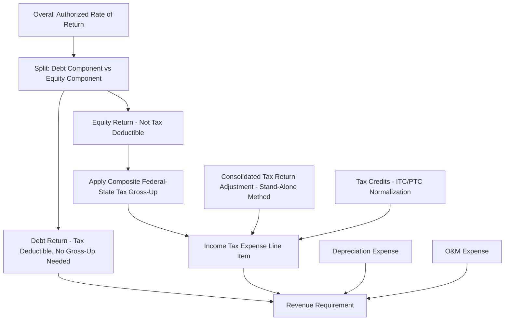

## Federal and State Income Tax in the Revenue Requirement

### Overview

Federal and state income tax represents a distinct cost-of-service component in the utility revenue requirement, calculated separately from operating expenses and the return on rate base, yet directly tied to both through the mechanics of grossing up the equity return for taxes and the interaction with deferred tax accounting. Because utility income tax expense in rates is a *calculated* (pro forma) figure rather than simply the utility's actual reported tax expense, understanding its derivation is essential to understanding the overall revenue requirement formula.

**Key Points**

- Income tax expense in the revenue requirement is calculated on a pro forma, normalized basis reflecting rates in effect and the utility's regulatory capital structure — not necessarily identical to the utility's actual consolidated tax return liability
- Only the equity return component of the overall rate of return generates a tax obligation for ratemaking purposes, since interest on debt is tax-deductible; this asymmetry is the central driver of the income tax "gross-up" calculation
- State income tax treatment varies significantly, since not all states impose a corporate income tax, and among those that do, rates and apportionment rules differ substantially

### The Revenue Requirement Formula and Income Tax's Role

$$RR = (RB \times r) + D + O\&M + T$$

Where $RR$ is revenue requirement, $RB$ is rate base, $r$ is the overall authorized rate of return, $D$ is depreciation expense, $O\&M$ is operating and maintenance expense, and $T$ is income tax expense — the specific focus of this topic.

#### Why Only Equity Return Generates a Tax Component

The overall rate of return $r$ is a weighted average of the cost of debt and the cost of equity:

$$r = (w_d \times k_d) + (w_e \times k_e)$$

Where $w_d$ and $w_e$ are the debt and equity weights in the capital structure, and $k_d$ and $k_e$ are the respective costs of debt and equity.

**Key Points**

- Interest expense on debt ($w_d \times k_d \times RB$) is tax-deductible for income tax purposes, so no additional tax gross-up is needed on this component — the utility's actual interest payment already reflects an after-tax cash cost to the company
- The equity return component ($w_e \times k_e \times RB$) is *not* tax-deductible — dividends and retained earnings are paid from after-tax income — so the utility must collect additional revenue through rates to cover the income tax liability generated by earning that equity return
- This is why the equity return must be "grossed up" for taxes in the revenue requirement calculation, producing the income tax expense line item

### The Income Tax Gross-Up Calculation

#### Basic Formula

$$T = \frac{(RB \times w_e \times k_e)}{1 - t} \times t$$

Where $t$ is the composite (combined federal and state, net of any state tax deductibility effect) statutory income tax rate.

Equivalently, the pre-tax revenue requirement needed to produce a given after-tax equity return is:

$$\text{Pre-tax Equity Return Requirement} = \frac{RB \times w_e \times k_e}{1 - t}$$

$$T = \text{Pre-tax Equity Return Requirement} - (RB \times w_e \times k_e)$$

**Key Points**

- The gross-up formula reflects that a dollar of after-tax equity return requires more than a dollar of pre-tax revenue to produce, since a portion of that pre-tax revenue must be paid out as income tax before the remainder reaches shareholders as the authorized equity return
- The higher the statutory tax rate, the larger the gross-up multiplier and the larger the resulting income tax expense component of the revenue requirement

#### Composite Federal-State Rate Calculation

Because state income taxes are themselves generally deductible for federal income tax purposes, a composite tax rate calculation is used rather than simply adding federal and state statutory rates.

$$t_{composite} = t_{federal} + t_{state} \times (1 - t_{federal})$$

**Key Points**

- This formula reflects that state tax expense reduces federal taxable income (since state tax is a deductible expense for federal purposes), so the state tax's effective incremental burden is reduced by the federal deductibility benefit
- [Unverified] The precise treatment can vary depending on whether a state itself allows a federal tax deduction (a small number of states have historically allowed some form of federal tax deductibility in computing state taxable income, which would require a further iterative or simultaneous equation adjustment); utilities operating in such states typically address this through a more complex iterative gross-up calculation specific to that state's tax code

### State Income Tax Variation

#### States Without Corporate Income Tax

A subset of U.S. states impose no corporate income tax (e.g., Texas, Washington, Nevada, South Dakota, Wyoming — though some of these impose alternative business taxes such as a gross receipts or margin tax that may interact differently with utility ratemaking).

**Key Points**

- [Unverified] The current list of states without a traditional corporate income tax, and the specific alternative tax structures some of these states impose (such as Texas's franchise/margin tax), can change through state legislation; utilities and analysts should verify current state tax law for the specific jurisdiction involved
- In states without a corporate income tax, the composite tax rate calculation collapses to simply the federal statutory rate, since there is no state tax component to gross up

#### Apportionment for Multi-State/Multi-Jurisdictional Utilities

- Utilities operating across multiple states (or with parent/affiliate structures spanning multiple states) generally apportion income for state tax purposes based on formulas involving some combination of property, payroll, and sales/revenue within each state
- For ratemaking purposes, the applicable state tax rate used in a specific jurisdiction's rate case reflects that utility's tax situation as allocated to operations in that state, which can require careful reconciliation with the utility's actual consolidated state tax filings

### Consolidated Tax Return Adjustments

#### The Issue

Many utilities are subsidiaries of larger holding companies that file a consolidated federal (and sometimes state) tax return, potentially combining the utility's taxable income with that of unregulated affiliates. This can create tax savings (e.g., from offsetting affiliate losses against utility income) that would not exist if the utility filed on a stand-alone basis.

**Key Points**

- A significant majority of state commissions require or apply some form of "stand-alone" tax methodology for ratemaking purposes — calculating the utility's income tax expense as if it filed its own separate tax return, regardless of the actual consolidated tax outcome at the parent level
- This stand-alone approach is generally intended to prevent ratepayers from being either advantaged or disadvantaged by the specific tax attributes of unregulated affiliates that have no relationship to utility service, and to avoid the utility's rates being distorted by the parent's broader corporate tax strategy
- [Inference] Consolidated tax adjustment methodology (the specific mechanics of computing a hypothetical stand-alone tax liability, including treatment of net operating losses, tax credits generated by affiliates, and intercompany allocations) is a recurring area of contested testimony in rate cases involving multi-subsidiary utility holding companies, given the inherent complexity of separating a genuinely stand-alone tax position from a consolidated group's actual filed return

### Tax Credits and Their Ratemaking Treatment

#### Investment Tax Credits (ITC) and Production Tax Credits (PTC)

Federal tax credits for qualifying investments (historically for certain utility property, and more prominently for renewable generation investment and production) reduce the utility's actual tax liability, raising the question of how quickly that benefit should flow through to ratepayers.

**Key Points**

- Similar to accelerated depreciation, federal tax law has historically imposed normalization-style requirements on certain investment tax credits for utility property, requiring the benefit to be amortized to ratepayers over time (often over the life of the related asset) rather than flowed through immediately in the year the credit is generated
- [Unverified] The specific normalization requirements applicable to current-generation renewable energy tax credits (including recent legislative changes affecting solar, wind, and storage investment and production tax credits) are subject to detailed and evolving IRS guidance; utilities should consult current tax counsel and IRS regulations for the applicable treatment of any specific credit and vintage

### Illustrative Example

**Example**

A utility has a rate base of $2 billion, a capital structure of 50% debt / 50% equity, a cost of debt of 4.5%, an authorized cost of equity of 10%, a federal statutory tax rate of 21%, and a state statutory tax rate of 6%.

**Step 1 — Composite tax rate:**

$$t_{composite} = 21\% + 6\% \times (1 - 21\%) = 21\% + 4.74\% = 25.74\%$$

**Step 2 — After-tax equity return dollars:**

$$\$2,000,000,000 \times 50\% \times 10\% = \$100,000,000$$

**Step 3 — Pre-tax revenue requirement to produce that after-tax return:**

$$\frac{\$100,000,000}{1 - 0.2574} = \frac{\$100,000,000}{0.7426} \approx \$134,662,000$$

**Step 4 — Income tax expense component:**

$$T = \$134,662,000 - \$100,000,000 = \$34,662,000$$

**Step 5 — Debt return (no gross-up needed):**

$$\$2,000,000,000 \times 50\% \times 4.5\% = \$45,000,000$$

**Combined return and tax components flowing into revenue requirement:**

$$\$45,000,000 \text{ (debt return)} + \$100,000,000 \text{ (equity return)} + \$34,662,000 \text{ (income tax)} = \$179,662,000$$

This combined figure — not merely $RB \times r$ — represents the full pre-tax revenue the utility must collect to cover its cost of capital, illustrating why income tax is calculated as a distinct revenue requirement component rather than embedded silently within the rate of return figure itself.

### Diagram: Tax Gross-Up Effect on Required Revenue

<svg xmlns="http://www.w3.org/2000/svg" viewBox="0 0 700 280">
<text x="350" y="24" font-size="16" font-weight="bold" text-anchor="middle" fill="#1a1a1a">Equity Return Tax Gross-Up (svg_diagram)</text>
<rect x="80" y="60" width="180" height="140" fill="#e8f0fe" stroke="#3b6fd6" stroke-width="1.5" />
<text x="170" y="135" font-size="13" text-anchor="middle" fill="#1a1a1a">After-Tax</text>
<text x="170" y="153" font-size="13" text-anchor="middle" fill="#1a1a1a">Equity Return</text>
<text x="170" y="90" font-size="11" text-anchor="middle" fill="#333">(Shareholders)</text>
<line x1="260" y1="130" x2="320" y2="130" stroke="#555" stroke-width="1.5" marker-end="url(#tx1)" />
<text x="290" y="120" font-size="10" text-anchor="middle" fill="#333">÷ (1−t)</text>
<rect x="320" y="30" width="200" height="170" fill="#fce8e8" stroke="#c0392b" stroke-width="1.5" />
<text x="420" y="55" font-size="12" font-weight="bold" text-anchor="middle" fill="#1a1a1a">Pre-Tax Revenue</text>
<text x="420" y="71" font-size="12" font-weight="bold" text-anchor="middle" fill="#1a1a1a">Requirement</text>
<rect x="335" y="90" width="170" height="90" fill="#e8f0fe" stroke="#3b6fd6" stroke-width="1" />
<text x="420" y="140" font-size="11" text-anchor="middle" fill="#1a1a1a">Equity Return Portion</text>
<rect x="335" y="180" width="170" height="40" fill="#fddede" stroke="#c0392b" stroke-width="1" />
<text x="420" y="204" font-size="11" text-anchor="middle" fill="#1a1a1a">Income Tax Expense</text>

<text x="420" y="240" font-size="11" text-anchor="middle" fill="#333">Larger box = revenue collected from ratepayers</text>

</svg>

### Practical Ratemaking Considerations

**Key Points**

- Income tax expense is recalculated in every rate case based on then-current statutory tax rates, authorized capital structure, and cost of equity — it is not a static figure carried forward, and changes automatically when any of its underlying inputs (equity return, tax rates) change
- Federal or state tax rate legislation changes require utilities to update pro forma income tax expense calculations in pending and future rate cases, and can also trigger the excess/deficient ADIT issues discussed in Book vs. Tax Depreciation Divergence
- The interaction between income tax expense (a revenue requirement component) and ADIT (a rate base deduction) means that tax policy changes typically affect utility rates through two separate channels simultaneously — the current-year gross-up calculation and the deferred tax rate base adjustment
- [Inference] Because income tax is one of the more mathematically involved components of the revenue requirement, and because it interacts directly with capital structure and cost of equity determinations, it is frequently a significant point of detailed cross-examination and expert testimony in general rate cases, even though the underlying statutory tax rates themselves are rarely disputed

**Related Topics**

- Book vs. Tax Depreciation Divergence
- Rate Base Formula and Cost-Free Capital Components
- Cost of Capital and Weighted Average Rate of Return Calculation
- Capital Structure Determination in Rate Cases
- Consolidated Tax Adjustment and Stand-Alone Tax Methodology
- Investment and Production Tax Credit Normalization
- Excess and Deficient ADIT Amortization Methodology