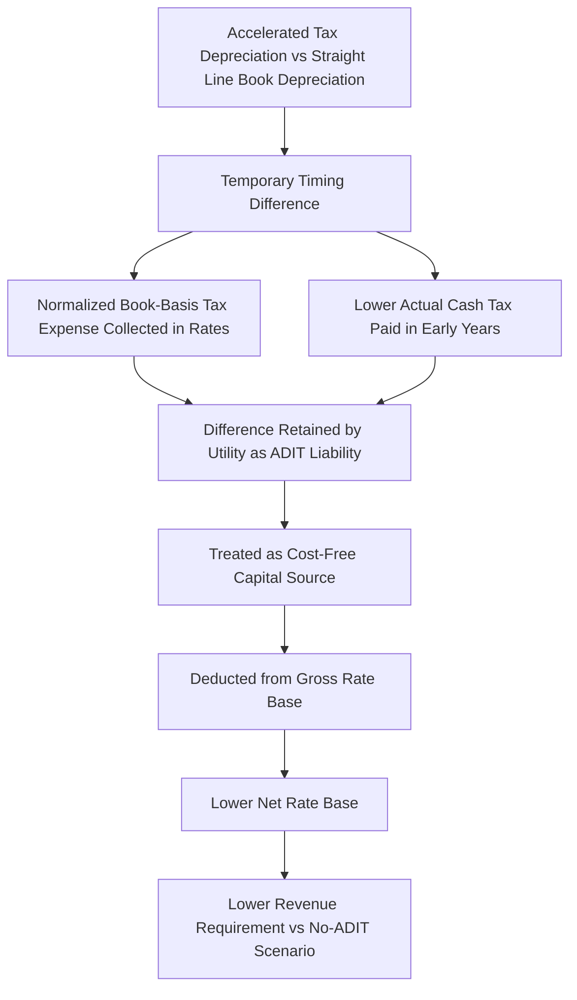

## Accumulated Deferred Income Taxes (ADIT) as a Rate Base Offset

### Overview

Accumulated Deferred Income Taxes (ADIT) function as a rate base offset — a deduction from gross rate base that reflects the cumulative balance of income tax deferred, rather than currently paid, due to timing differences between book and tax accounting. This topic examines ADIT specifically in its rate base mechanics role, building on the book-tax depreciation divergence mechanics introduced earlier and the income tax gross-up calculation covered previously, to explain why ADIT is treated as cost-free capital and how it flows through the rate base formula in practice.

**Key Points**

- ADIT is a balance sheet liability representing cumulative deferred income tax, arising primarily (though not exclusively) from book-tax depreciation timing differences
- In ratemaking, ADIT is deducted from gross rate base because it represents funds the utility has effectively collected from ratepayers (through the income tax expense component of rates) but has not yet remitted to tax authorities, functioning as an interest-free source of capital during the deferral period
- ADIT is distinct from, but interacts with, the income tax gross-up calculation covered in Federal and State Income Tax in the Revenue Requirement — one governs the current-period tax expense in the revenue requirement, the other governs the cumulative deferred balance's effect on rate base

### The Rate Base Formula with ADIT

$$RB_{net} = Plant_{gross} - AccumDepr - ADIT + CWIP_{allowed} + \text{Other Rate Base Components}$$

**Key Points**

- ADIT is subtracted from rate base alongside accumulated depreciation, both functioning to reduce the net "investor-supplied" capital base on which the utility earns its authorized rate of return
- Unlike accumulated depreciation (which reflects return *of* capital already recovered through depreciation expense), ADIT reflects a *financing benefit* — capital the utility has use of without having to raise it from debt or equity investors, since it derives from deferred tax payments rather than return of invested capital

### Why ADIT Is Treated as Cost-Free Capital

#### The Underlying Logic

When a utility uses accelerated tax depreciation, it pays less actual cash income tax in early asset years than the income tax expense embedded in customer rates (which is calculated on a normalized, book-depreciation basis — see Federal and State Income Tax in the Revenue Requirement). The utility retains this cash difference temporarily, functioning economically like an interest-free loan from the government (ultimately funded through the rate mechanism) until the deferred tax reverses in later years.

$$\text{Cash Tax Savings (temporary)} = T_{normalized,book-basis} - T_{actual,tax-basis}$$

**Key Points**

- Because ratepayers have already paid the normalized (book-basis) income tax expense embedded in rates, and the utility has not yet remitted the full corresponding amount to tax authorities, this retained cash effectively substitutes for debt or equity capital the utility would otherwise need to raise
- Since this deferred amount carries no explicit interest or dividend cost to the utility (unlike actual debt or equity), commissions treat it as a "cost-free" or "zero-cost" capital source and remove it from the rate base on which shareholders earn their authorized return, preventing shareholders from earning a return on capital they did not actually have to raise at a cost

#### Consistency with the Normalization Requirement

The ADIT rate base offset mechanism is the ratemaking-side counterpart to the tax normalization requirement discussed in Book vs. Tax Depreciation Divergence: normalization requires the tax *benefit* to be spread over time rather than flowed through immediately, and the rate base offset ensures shareholders do not earn a return on the resulting deferred tax balance while it exists.

### ADIT Balance Sources Beyond Depreciation

While accelerated tax depreciation is the largest and most persistent driver of ADIT for most utilities, other timing differences also contribute to the cumulative balance:

| Source | Nature of Timing Difference |
| --- | --- |
| Accelerated tax depreciation (MACRS/bonus) | Primary driver; addressed in Book vs. Tax Depreciation Divergence |
| Pension and OPEB cost timing differences | Book expense recognition (ASC 715) vs. tax deduction timing often differ |
| Certain regulatory asset/liability items | Book deferral for ratemaking vs. tax treatment of the same underlying cost |
| Bad debt/uncollectible reserve timing | Book allowance method vs. tax specific charge-off method differences |
| Repair vs. capitalization tax elections | Costs capitalized for book purposes but currently deductible for tax purposes under certain IRS repair regulations |

**Key Points**

- [Inference] While depreciation-related ADIT is generally the dominant component of a capital-intensive utility's total ADIT balance given the scale of plant investment relative to other timing-difference categories, the relative magnitude of non-depreciation ADIT sources can vary utility by utility depending on specific tax elections, pension funding status, and regulatory asset portfolio

### Protected vs. Unprotected ADIT (Recap in Rate Base Context)

**Key Points**

- "Protected" ADIT (subject to normalization statute constraints, primarily the depreciation-related component) cannot be rapidly refunded or surcharged to ratepayers outside IRS-prescribed methods without risking normalization violation and loss of accelerated depreciation eligibility — this constrains how quickly excess/deficient ADIT balances (from tax rate changes) can flow through the rate base offset
- "Unprotected" ADIT affords commissions more flexibility in timing adjustments, since it is not subject to the same statutory normalization constraint
- This distinction, introduced in the Book vs. Tax Depreciation Divergence discussion of excess/deficient ADIT, directly affects how quickly a change in the ADIT balance (e.g., from a corporate tax rate change) can be reflected as an adjustment to the rate base offset versus needing to flow through a separate amortized regulatory liability/asset mechanism over a longer, IRS-compliant period

### Illustrative Example

**Example**

A utility's rate base components, before and after the ADIT offset, are as follows:

- Gross plant in service: $3.5 billion
- Accumulated depreciation: $900 million
- Accumulated Deferred Income Taxes (ADIT): $420 million
- Construction Work in Progress (allowed in rate base): $50 million

**Rate base calculation:**

$$RB_{net} = \$3,500,000,000 - \$900,000,000 - \$420,000,000 + \$50,000,000 = \$2,230,000,000$$

**Effect on revenue requirement (illustrative, assuming an 8% overall rate of return):**

Without the ADIT offset, rate base would be $2.65 billion ($2.23B + $420M), producing:

$$\$2,650,000,000 \times 8\% = \$212,000,000 \text{ in return}$$

With the ADIT offset properly applied:

$$\$2,230,000,000 \times 8\% = \$178,400,000 \text{ in return}$$

The $420 million ADIT offset reduces the return component of the revenue requirement by $33.6 million annually in this example — illustrating the material rate base impact of the deferred tax balance and why its accurate calculation and periodic reconciliation is a significant element of every rate case involving a utility using accelerated tax depreciation.

### Diagram: ADIT's Position in the Rate Base Build-Up

<svg xmlns="http://www.w3.org/2000/svg" viewBox="0 0 700 300">
<text x="350" y="24" font-size="16" font-weight="bold" text-anchor="middle" fill="#1a1a1a">Rate Base Build-Up with ADIT Offset (svg_diagram)</text>
<rect x="250" y="50" width="200" height="40" fill="#e8f0fe" stroke="#3b6fd6" stroke-width="1.5" />
<text x="350" y="75" font-size="12" text-anchor="middle" fill="#1a1a1a">Gross Plant in Service</text>
<line x1="350" y1="90" x2="350" y2="120" stroke="#333" stroke-width="1" />
<text x="380" y="108" font-size="12" fill="#c0392b">−</text>
<rect x="250" y="120" width="200" height="40" fill="#fff3e0" stroke="#e0913b" stroke-width="1.5" />
<text x="350" y="145" font-size="12" text-anchor="middle" fill="#1a1a1a">Accumulated Depreciation</text>
<line x1="350" y1="160" x2="350" y2="190" stroke="#333" stroke-width="1" />
<text x="380" y="178" font-size="12" fill="#c0392b">−</text>
<rect x="250" y="190" width="200" height="40" fill="#fce8e8" stroke="#c0392b" stroke-width="1.5" />
<text x="350" y="215" font-size="12" text-anchor="middle" fill="#1a1a1a">ADIT (Cost-Free Capital)</text>
<line x1="350" y1="230" x2="350" y2="255" stroke="#333" stroke-width="1" />
<text x="380" y="248" font-size="12" fill="#2e7d32">=</text>
<rect x="220" y="255" width="260" height="40" fill="#e6f4ea" stroke="#2e7d32" stroke-width="1.5" />
<text x="350" y="280" font-size="12" text-anchor="middle" fill="#1a1a1a">Net Rate Base (Return-Earning)</text>
</svg>

### Practical and Contested Ratemaking Issues

**Key Points**

- ADIT balances must be updated at each rate case to reflect current plant additions, retirements, and the ongoing pattern of book-tax depreciation differences, requiring detailed tax depreciation schedules alongside the book depreciation studies discussed in earlier topics
- Accurate ADIT calculation requires close coordination between a utility's tax department (which tracks actual tax depreciation and tax positions) and its regulatory/rates department (which applies the resulting balance to rate base), and discrepancies or errors in this reconciliation are a recurring area of regulatory audit and discovery in rate cases
- Excess/deficient ADIT from tax rate changes (see Book vs. Tax Depreciation Divergence) requires a separate amortization treatment layered on top of the ongoing rate base offset mechanics described here, since the normalization-protected portion cannot simply be adjusted into the rate base offset immediately
- [Inference] Given the scale of ADIT balances relative to overall rate base for capital-intensive utilities, and the technical complexity of tracking book-tax depreciation differences across decades of vintage plant additions, ADIT calculation and verification is generally regarded by ratemaking practitioners as one of the more specialized and audit-intensive components of a general rate case, often requiring dedicated tax expert testimony separate from the utility's general accounting or engineering witnesses

**Related Topics**

- Book vs. Tax Depreciation Divergence
- Federal and State Income Tax in the Revenue Requirement
- Rate Base Formula and Cost-Free Capital Components
- Excess and Deficient ADIT Amortization Methodology (ARAM)
- Amortization of Regulatory Assets
- Construction Work in Progress (CWIP) and AFUDC Treatment
- Normalization Rules and IRS Compliance for Accelerated Depreciation