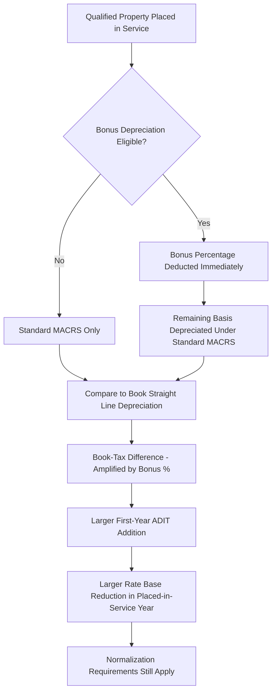

## Bonus Depreciation Effects on ADIT and Rate Base

### Overview

Bonus depreciation is a federal tax provision allowing immediate or highly accelerated expensing of a percentage of qualified property cost in the year an asset is placed in service, materially amplifying the book-tax timing difference beyond standard MACRS depreciation alone. Because bonus depreciation percentages, eligibility rules, and phase-out schedules have been repeatedly enacted, modified, and revised through successive federal tax legislation, it creates a distinctly volatile and legislation-dependent layer within the ADIT and rate base mechanics established in the preceding topics.

**Key Points**

- Bonus depreciation allows a utility to deduct a specified percentage (which has varied between roughly 30% and 100% across different legislative periods) of qualified property's cost immediately in the placed-in-service year, with the remaining basis depreciated under standard MACRS thereafter
- This dramatically front-loads the tax depreciation deduction relative to both standard MACRS and, especially, book straight line depreciation — producing a substantially larger first-year book-tax difference and corresponding ADIT addition than standard MACRS alone would generate
- Bonus depreciation is fully subject to the same normalization requirements discussed in Depreciation Normalization Requirements, since it is itself a form of accelerated depreciation for tax purposes

### Mechanics of Bonus Depreciation

#### Basic Calculation Structure

$$D_{tax,year1} = (C \times Bonus\%) + \left[(C \times (1 - Bonus\%)) \times MACRS_{year1}\%\right]$$

Where $C$ is the qualified property's original cost, $Bonus\%$ is the applicable bonus depreciation percentage for the placed-in-service year, and $MACRS_{year1}\%$ is the standard first-year MACRS percentage applied to the remaining (non-bonus) basis.

**Key Points**

- The remaining basis after the bonus deduction continues to be depreciated under standard MACRS over the asset's normal recovery period
- At a 100% bonus depreciation rate, the entire qualified cost is deducted in the placed-in-service year, and no further tax depreciation remains for that asset in subsequent years
- [Unverified] The specific bonus depreciation percentage applicable in any given tax year depends on the placed-in-service date and the specific federal tax legislation in effect at that time; percentages have changed multiple times over the past two decades and are subject to further legislative modification, so utilities must verify the applicable percentage for any specific asset vintage against current IRC Section 168(k) and related guidance rather than assuming a fixed historical rate

#### Qualified Property Eligibility

- Bonus depreciation eligibility generally depends on statutory definitions of qualified property (typically property with a MACRS recovery period of 20 years or less, along with certain other categories), meaning not all utility plant qualifies
- [Unverified] The precise scope of qualifying utility property, and any utility-specific exclusions or special rules that have existed in various iterations of bonus depreciation legislation, require verification against the specific tax code provisions applicable to the relevant tax year

### Amplified Effect on ADIT

#### Why Bonus Depreciation Produces Larger ADIT Additions

Because bonus depreciation accelerates tax cost recovery even more aggressively than standard MACRS, the gap between tax depreciation and book straight line depreciation (see Book vs. Tax Depreciation Divergence) widens substantially in the placed-in-service year, producing a correspondingly larger ADIT addition in that year.

$$ADIT_{addition,year1} = (D_{tax,year1} - D_{book,year1}) \times t_{composite}$$

**Key Points**

- At higher bonus depreciation percentages, a very large share of an asset's total lifetime tax depreciation is recognized in the first year alone, while book depreciation continues on its long, level, actuarially-based schedule — creating a first-year ADIT spike considerably larger than would occur under standard MACRS without bonus depreciation
- This front-loaded ADIT addition directly reduces net rate base (per the mechanics in Accumulated Deferred Income Taxes (ADIT) as a Rate Base Offset) in the year new plant is placed in service, meaning bonus depreciation-eligible capital additions can produce a materially lower initial rate base impact than the gross plant addition alone would suggest

### Reversal Pattern and Long-Term Rate Base Effect

#### The Eventual Crossover

Just as with standard accelerated depreciation, bonus depreciation's tax benefit is temporary — the total lifetime tax and book depreciation deductions converge to the same amount over the asset's full life. With bonus depreciation, however, the reversal pattern is compressed differently: because most or all tax depreciation may be claimed in year one, tax depreciation drops to near zero (or standard MACRS on a much smaller remaining basis) in subsequent years, while book depreciation continues at its level, long-term straight line rate.

**Key Points**

- This means ADIT begins reversing (declining) much sooner and more steadily after the placed-in-service year under bonus depreciation than under standard MACRS alone, since there is little or no further tax depreciation to keep pace with continuing book depreciation in later years
- [Inference] The practical result is that bonus depreciation shifts the ADIT balance's peak earlier in an asset's life relative to standard MACRS, meaning the rate base reduction benefit, while larger initially, also begins reversing on a more front-loaded timeline — a pattern that becomes particularly relevant when analyzing multi-year rate base projections in rate cases involving utilities with substantial recent capital additions eligible for high bonus depreciation percentages

### Rate Case and Revenue Requirement Implications

#### Test Year Timing Sensitivity

Because bonus depreciation creates such a large first-year ADIT effect, the specific timing of a rate case's test year relative to when eligible capital was placed in service can materially affect calculated rate base, making bonus depreciation-related ADIT a frequently scrutinized item in rate case filings involving utilities with significant recent capital expenditure programs.

**Key Points**

- A utility filing a rate case shortly after placing substantial bonus-depreciation-eligible plant in service will show a correspondingly larger ADIT rate base offset than one filing further into that plant's book life, all else equal, given the front-loaded nature of the bonus deduction
- This creates an interaction between capital expenditure timing, rate case filing timing, and the resulting revenue requirement that both utilities and intervenors routinely analyze and, at times, contest regarding the reasonableness and accuracy of projected or historical ADIT balances used in the test year

#### Legislative Volatility and Forecasting Challenges

**Key Points**

- Because bonus depreciation percentages and eligibility rules have changed multiple times through different federal tax legislation over the past two decades (including full phase-outs and subsequent reinstatements at various percentages), forward-looking rate base and revenue requirement projections that span multiple years can face meaningful uncertainty regarding which bonus depreciation percentage will apply to future capital additions
- [Unverified] The bonus depreciation percentage and phase-out schedule currently in effect, and any scheduled future changes, should be verified against the most current version of IRC Section 168(k) and any subsequent legislative amendments, since this analysis reflects general mechanics rather than a specific current-year percentage
- Utilities operating in states with their own separate corporate income tax regimes must also verify whether that state conforms to federal bonus depreciation treatment or "decouples" from it (requiring a separate state tax depreciation calculation), which can create an additional layer of book-tax-state divergence beyond the federal-only analysis

### Illustrative Example

**Example**

A utility places $300 million of qualified 15-year MACRS property in service, eligible for a (illustrative) 60% bonus depreciation rate in the placed-in-service year. Book depreciation for this asset class uses a 35-year straight line average service life.

**Step 1 — Bonus depreciation deduction:**

$$\$300,000,000 \times 60\% = \$180,000,000$$

**Step 2 — Remaining basis depreciated under standard MACRS (illustrative first-year 15-year MACRS percentage of 5%):**

$$(\$300,000,000 - \$180,000,000) \times 5\% = \$120,000,000 \times 5\% = \$6,000,000$$

**Step 3 — Total year 1 tax depreciation:**

$$\$180,000,000 + \$6,000,000 = \$186,000,000$$

**Step 4 — Year 1 book depreciation:**

$$\$300,000,000 / 35 = \$8,571,429$$

**Step 5 — Book-tax difference and ADIT addition (at a 25.74% composite tax rate, per the earlier example methodology):**

$$(\$186,000,000 - \$8,571,429) \times 25.74\% \approx \$45,674,000$$

This single year's ADIT addition of approximately $45.7 million — compared to what would be a considerably smaller addition under standard MACRS alone without bonus depreciation — illustrates the amplifying effect of bonus depreciation on the rate base offset in the placed-in-service year, directly reducing net rate base and the corresponding return component of the revenue requirement in that period.

### Diagram: Standard MACRS vs. Bonus Depreciation ADIT Impact

<svg xmlns="http://www.w3.org/2000/svg" viewBox="0 0 700 300">
<text x="350" y="24" font-size="16" font-weight="bold" text-anchor="middle" fill="#1a1a1a">MACRS vs. Bonus Depreciation — First-Year ADIT Impact (svg_diagram)</text>
<line x1="60" y1="260" x2="640" y2="260" stroke="#333" stroke-width="1.5" />
<line x1="60" y1="260" x2="60" y2="50" stroke="#333" stroke-width="1.5" />
<text x="350" y="288" font-size="12" text-anchor="middle" fill="#333">Asset Age (Years)</text>
<text x="25" y="150" font-size="12" text-anchor="middle" fill="#333" transform="rotate(-90 25 150)">ADIT Balance</text>
<path d="M 60 250 Q 150 130 250 90 Q 400 130 640 220" fill="none" stroke="#e0913b" stroke-width="2.5" />
<text x="150" y="115" font-size="11" fill="#e0913b">Standard MACRS Only</text>
<path d="M 60 250 L 90 65 Q 250 75 350 140 Q 500 210 640 245" fill="none" stroke="#c0392b" stroke-width="2.5" />
<text x="110" y="55" font-size="11" fill="#c0392b">With Bonus Depreciation</text>

<text x="350" y="270" font-size="10" text-anchor="middle" fill="#666">Bonus produces sharper peak, earlier reversal</text>

</svg>

### Practical Considerations for Utilities and Regulators

**Key Points**

- Utilities with active, large-scale capital investment programs (transmission expansion, generation additions, grid modernization) should expect bonus depreciation-eligible ADIT additions to be a material and closely scrutinized component of rate base calculations whenever bonus depreciation is in effect at meaningful percentages
- Normalization compliance (see Depreciation Normalization Requirements) applies with equal force to bonus depreciation-related ADIT as to standard MACRS-related ADIT — the same protected-status constraints on amortization pace apply if a tax rate change or other event creates excess/deficient bonus-depreciation-related ADIT
- [Inference] Given the historical pattern of repeated legislative changes to bonus depreciation percentages, utilities engaged in multi-year capital planning and rate case forecasting are likely to continue facing meaningful uncertainty regarding the specific ADIT and rate base impact of future capital additions until the applicable tax year's bonus depreciation percentage is legislatively settled, making this an area requiring ongoing coordination between capital planning, tax, and regulatory affairs functions

**Related Topics**

- Book vs. Tax Depreciation Divergence
- Accumulated Deferred Income Taxes (ADIT) as a Rate Base Offset
- Depreciation Normalization Requirements
- Federal and State Income Tax in the Revenue Requirement
- Construction Work in Progress (CWIP) and AFUDC Treatment
- Excess and Deficient ADIT Amortization Methodology (ARAM)
- Federal Tax Legislation Impacts on Utility Ratemaking