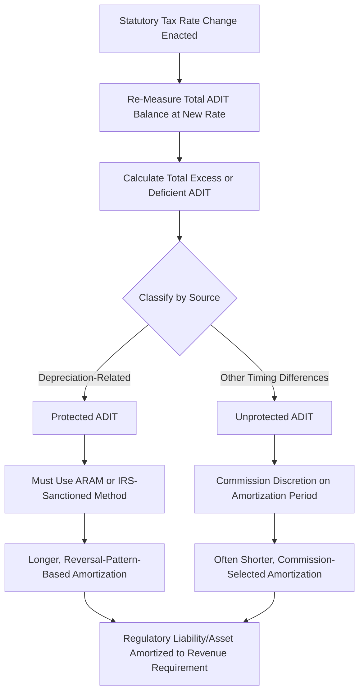

## Excess ADIT from Tax Rate Changes and Amortization Methods

### Overview

Excess ADIT from tax rate changes is the specific, discrete regulatory accounting problem that arises when a federal (or state) statutory income tax rate change requires the re-measurement of a utility's previously accumulated deferred tax liability. This topic consolidates and extends the excess/deficient ADIT concepts introduced across the preceding depreciation and tax topics, focusing specifically on the re-measurement mechanics, the protected/unprotected classification framework, and the amortization methodologies — principally the Average Rate Assumption Method (ARAM) — used to return or collect the resulting balance in a manner consistent with federal normalization requirements.

**Key Points**

- Excess ADIT arises when the statutory tax rate decreases, causing the previously recorded deferred tax liability (calculated at the old, higher rate) to exceed what is needed at the new, lower rate — the excess represents a regulatory liability owed back to ratepayers
- Deficient ADIT arises in the reverse scenario, when the statutory rate increases, requiring additional deferred tax liability and creating a regulatory asset to be collected from ratepayers
- The single most significant historical example is the 2017 U.S. Tax Cuts and Jobs Act (TCJA), which reduced the federal corporate income tax rate from 35% to 21%, generating substantial excess ADIT balances across the U.S. utility sector

### Re-Measurement Mechanics

#### Basic Re-Measurement Formula

$$Excess/(Deficient)\ ADIT = ADIT_{balance,old\ rate} - \left(ADIT_{balance,old\ rate} \times \frac{t_{new}}{t_{old}}\right)$$

Or equivalently:

$$Excess/(Deficient)\ ADIT = ADIT_{balance,old\ rate} \times \left(\frac{t_{old} - t_{new}}{t_{old}}\right)$$

Where $t_{old}$ is the statutory rate in effect when the original deferred tax liability was recorded and $t_{new}$ is the newly enacted statutory rate.

**Key Points**

- Re-measurement is required in the accounting period in which the new tax rate is enacted (not when it becomes effective, if different), consistent with general deferred tax accounting principles under ASC 740, applied to the utility's existing ADIT balance across all underlying temporary differences
- The re-measurement itself is a one-time balance sheet adjustment; the subsequent amortization of the resulting excess or deficient amount to/from ratepayers is the separate, multi-year ratemaking process this topic addresses

### The Protected vs. Unprotected Classification

#### Protected Excess/Deficient ADIT

"Protected" ADIT refers to the portion of the balance attributable to accelerated depreciation timing differences on public utility property — the category directly subject to the depreciation normalization statute discussed in Depreciation Normalization Requirements.

**Key Points**

- Protected excess ADIT cannot be amortized to ratepayers on an accelerated or arbitrary schedule; doing so would violate the normalization requirement and risk the utility's loss of accelerated depreciation eligibility
- The IRS has historically required use of a normalization-compliant method — principally the Average Rate Assumption Method (ARAM) — to amortize protected excess/deficient ADIT, tying the amortization schedule to the reversal pattern of the underlying depreciation timing differences rather than a simple, commission-selected period

#### Unprotected Excess/Deficient ADIT

"Unprotected" ADIT refers to balances arising from timing differences not subject to the depreciation-related normalization statute — for example, certain regulatory asset/liability-related timing differences, some pension/OPEB-related differences, or other miscellaneous temporary differences.

**Key Points**

- Commissions generally have considerably greater flexibility in setting the amortization period for unprotected excess/deficient ADIT, since the federal normalization constraint does not apply to this category
- This flexibility is commonly used by commissions to accelerate the return of unprotected excess ADIT to ratepayers (e.g., over 5 years or less) as a form of more immediate rate relief following a tax rate reduction, while the larger, protected portion follows the longer, ARAM-driven schedule

### The Average Rate Assumption Method (ARAM) in Detail

#### Core Concept

ARAM calculates the appropriate amortization of protected excess/deficient ADIT by reference to the *ratio* of current-period reversals of the underlying temporary differences to the total remaining temporary differences, applied against the excess/deficient balance — effectively spreading the excess/deficient amount in proportion to how the original book-tax depreciation differences are expected to reverse over the remaining life of the related property.

**Key Points**

- Because ARAM ties amortization to the actual expected reversal pattern of the underlying depreciation differences (which, for long-lived utility plant, can extend over several decades), the resulting amortization period for protected excess ADIT is often considerably longer than commissions or ratepayer advocates might otherwise prefer for immediate rate relief purposes
- [Unverified] The precise computational methodology for ARAM, including the specific vintage-by-vintage reversal calculations required and any IRS-approved simplifications or alternative approaches, is technical and governed by current IRS revenue procedures and guidance; utilities typically rely on specialized tax and regulatory accounting expertise to perform this calculation correctly, and the specific current-year IRS guidance should be consulted for implementation

#### Why Simpler Methods Are Generally Not Available for Protected ADIT

**Key Points**

- A straightforward straight line amortization of protected excess ADIT over an arbitrarily selected period (e.g., simply dividing by 10 years) does not, on its own, satisfy the ARAM-based normalization requirement unless that period happens to correspond to the actual underlying reversal pattern, which is uncommon given how depreciation timing differences actually unwind over an asset's book life
- This is a key reason why protected excess ADIT amortization schedules following the TCJA rate reduction varied by utility and by plant vintage mix, rather than converging on a single uniform amortization period across the industry — each utility's ARAM calculation reflects its own specific mix of vintage plant additions and their individual reversal patterns

### Historical Context: The 2017 TCJA as the Primary Case Study

#### Scale and Industry-Wide Effect

The TCJA's reduction of the federal corporate tax rate from 35% to 21% (effective for tax years beginning after December 31, 2017) created excess ADIT re-measurement obligations across essentially the entire U.S. investor-owned utility sector simultaneously, given the near-universal use of accelerated tax depreciation industry-wide.

**Key Points**

- [Unverified] The aggregate industry-wide dollar magnitude of excess ADIT created by the TCJA, and the specific amortization periods ultimately approved across different state jurisdictions, varied considerably by utility size, capital intensity, and vintage plant mix; specific figures for any given utility require reference to that utility's actual rate case filings and commission orders addressing TCJA excess ADIT treatment
- Most state commissions opened dedicated proceedings (separate from, or consolidated with, general rate cases) specifically to address TCJA-related excess ADIT re-measurement and amortization treatment, given the scale and simultaneity of the issue across virtually all rate-regulated utilities following the law's enactment
- FERC similarly addressed excess ADIT treatment for its jurisdictional utilities (transmission and wholesale rates) through related proceedings and policy statements following the TCJA's enactment

### Illustrative Example

**Example**

A utility's ADIT balance prior to a tax rate reduction from 35% to 21% is $800 million, of which $680 million is classified as protected (depreciation-related) and $120 million as unprotected (other timing differences).

**Step 1 — Re-measurement:**

$$Excess\ ADIT_{total} = \$800,000,000 \times \left(\frac{35\% - 21\%}{35\%}\right) = \$800,000,000 \times 40\% = \$320,000,000$$

**Step 2 — Allocation by classification (proportional, illustrative):**

$$Excess\ ADIT_{protected} = \$320,000,000 \times \frac{680}{800} = \$272,000,000$$

$$Excess\ ADIT_{unprotected} = \$320,000,000 \times \frac{120}{800} = \$48,000,000$$

**Step 3 — Amortization treatment:**

- The $272 million protected excess ADIT is amortized using ARAM, calculated to reflect the actual reversal pattern of the utility's underlying plant vintages — in this illustrative case, yielding an amortization period of approximately 22 years, averaging roughly $12.4 million/year (though ARAM produces a schedule based on the reversal pattern, not necessarily a level annual amount)
- The $48 million unprotected excess ADIT is amortized over a commission-selected 5-year period, or approximately $9.6 million/year, providing more immediate rate relief for this smaller, unconstrained portion

This split illustrates how the protected/unprotected classification, more than the total excess ADIT amount itself, determines how quickly ratepayers actually see the benefit reflected in rates.

### Diagram: Excess ADIT Classification and Amortization Timeline

<svg xmlns="http://www.w3.org/2000/svg" viewBox="0 0 720 300">
<text x="360" y="24" font-size="16" font-weight="bold" text-anchor="middle" fill="#1a1a1a">Excess ADIT: Protected vs. Unprotected Timeline (svg_diagram)</text>
<rect x="60" y="55" width="600" height="40" fill="#e8f0fe" stroke="#3b6fd6" stroke-width="1.5" />
<text x="360" y="80" font-size="12" text-anchor="middle" fill="#1a1a1a">Total Excess ADIT (Tax Rate Reduction)</text>
<line x1="240" y1="95" x2="180" y2="130" stroke="#555" stroke-width="1.5" marker-end="url(#ex1)" />
<line x1="480" y1="95" x2="540" y2="130" stroke="#555" stroke-width="1.5" marker-end="url(#ex1)" />
<rect x="40" y="130" width="280" height="40" fill="#fce8e8" stroke="#c0392b" stroke-width="1.5" />
<text x="180" y="155" font-size="12" text-anchor="middle" fill="#1a1a1a">Protected (Depreciation-Related)</text>
<rect x="400" y="130" width="280" height="40" fill="#e6f4ea" stroke="#2e7d32" stroke-width="1.5" />
<text x="540" y="155" font-size="12" text-anchor="middle" fill="#1a1a1a">Unprotected (Other Timing Differences)</text>
<line x1="180" y1="170" x2="180" y2="200" stroke="#555" stroke-width="1.5" marker-end="url(#ex1)" />
<line x1="540" y1="170" x2="540" y2="200" stroke="#555" stroke-width="1.5" marker-end="url(#ex1)" />
<rect x="40" y="200" width="280" height="70" fill="#fddede" stroke="#c0392b" stroke-width="1.5" />
<text x="180" y="225" font-size="11" text-anchor="middle" fill="#1a1a1a">ARAM-Based Schedule</text>
<text x="180" y="243" font-size="11" text-anchor="middle" fill="#1a1a1a">Often 15-25+ Years</text>
<text x="180" y="261" font-size="11" text-anchor="middle" fill="#1a1a1a">(Reversal-Pattern Driven)</text>
<rect x="400" y="200" width="280" height="70" fill="#e6f4ea" stroke="#2e7d32" stroke-width="1.5" />
<text x="540" y="225" font-size="11" text-anchor="middle" fill="#1a1a1a">Commission-Selected Schedule</text>
<text x="540" y="243" font-size="11" text-anchor="middle" fill="#1a1a1a">Often 3-5 Years</text>
<text x="540" y="261" font-size="11" text-anchor="middle" fill="#1a1a1a">(Faster Rate Relief)</text>
</svg>

### Contested and Practical Issues

**Key Points**

- The protected/unprotected classification of specific ADIT sub-balances is itself sometimes a contested analytical question, particularly for less common or ambiguous timing-difference categories that do not clearly fall into either bucket
- Interest or carrying charges on unamortized excess ADIT balances (compensating ratepayers for the time value of money on amounts owed to them, or the utility for deficient ADIT amounts owed by ratepayers) are a further area of variation across jurisdictions, with some commissions applying a carrying charge and others not
- Timing of when excess ADIT amortization begins relative to when a rate case addressing the issue concludes can create a period during which ratepayers have not yet received the amortization benefit reflected in rates, prompting some jurisdictions to apply retroactive tracking mechanisms or interim refund mechanisms to address the gap
- [Inference] Given that federal corporate tax rates have changed multiple times over recent decades and could change again in the future, the protected/unprotected classification framework and ARAM methodology established through TCJA-era proceedings are likely to serve as the template regulators and utilities apply to any future federal tax rate change affecting utility ADIT balances, rather than requiring an entirely novel framework each time

**Related Topics**

- Book vs. Tax Depreciation Divergence
- Accumulated Deferred Income Taxes (ADIT) as a Rate Base Offset
- Depreciation Normalization Requirements
- Bonus Depreciation Effects on ADIT and Rate Base
- Federal and State Income Tax in the Revenue Requirement
- Amortization of Regulatory Assets
- Federal Tax Legislation Impacts on Utility Ratemaking