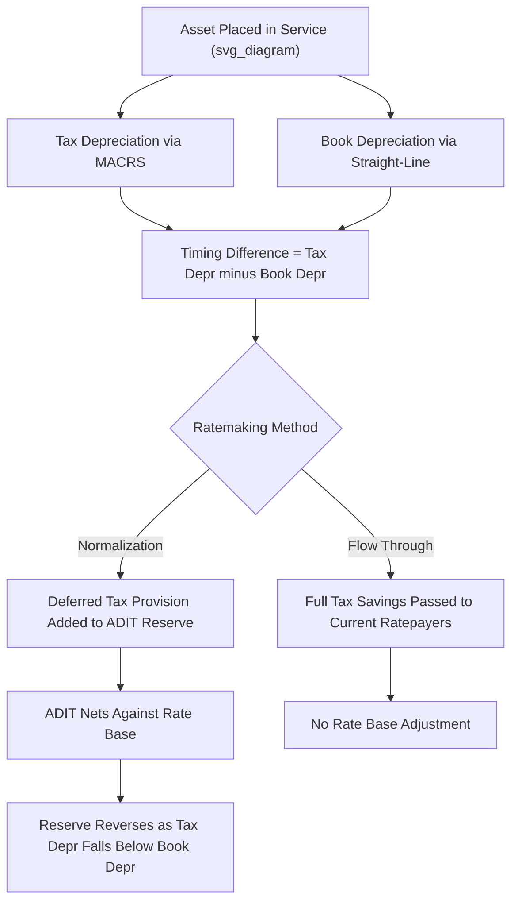

## Flow Through vs. Normalization Accounting

### Overview

Flow through and normalization are the two accounting methods available to regulated utilities for recognizing the income tax effects of "book-tax timing differences" — situations where a cost is deductible for tax purposes in a different period than it is recognized for financial reporting and ratemaking purposes. The choice between these methods governs when the tax benefit of accelerated depreciation (and other timing items) is passed to ratepayers, and it directly shapes the utility's deferred tax reserve, its rate base, and its revenue requirement in any given year.

### Core Definitions

**Flow Through Accounting**

Under flow through, the current tax expense actually paid (or currently payable) is used in calculating the revenue requirement. Any tax savings generated in the current year from a timing difference (e.g., accelerated tax depreciation exceeding book depreciation) are passed directly — "flowed through" — to current ratepayers in the form of lower rates in that same period. No deferred tax liability is recorded for ratemaking purposes.

**Normalization Accounting**

Under normalization, the utility calculates income tax expense for ratemaking using the same depreciation method used for book purposes (typically straight-line), regardless of the accelerated method actually used on the tax return. The difference between the tax actually paid and the tax expense recognized in the revenue requirement is recorded as a deferred income tax liability — Accumulated Deferred Income Taxes (ADIT). This reserve is later drawn down as book and tax depreciation converge, spreading the tax benefit over the life of the asset rather than the year it arises.

### Why the Difference Arises

Timing differences most commonly originate from:

- **Accelerated tax depreciation** (MACRS) vs. straight-line book/regulatory depreciation
- Repair vs. capitalization elections
- Certain construction-period interest and overhead capitalization differences
- Pension and OPEB timing differences
- Bad debt reserve timing

The classic case is depreciation: in early asset years, MACRS produces a larger tax deduction than straight-line book depreciation, so cash taxes paid are lower than "book" tax expense. In later years, this reverses — tax depreciation falls below book depreciation, and cash taxes paid exceed book tax expense.

### Mechanics: Flow Through

**Key Points**

- Revenue requirement includes only the tax currently payable
- No ADIT reserve is built; rate base is not reduced by a deferred tax balance
- Ratepayers in the current period receive the full benefit of the tax deferral immediately
- Creates **inter-generational inequity**: early ratepayers benefit from lower rates; later ratepayers, when tax depreciation reverses and taxable income (and cash taxes) rise, face higher rates to cover the "catch-up"
- Historically associated with rate volatility and the so-called "phantom taxes" problem, where a utility collects tax expense in rates that it never actually pays currently (in normalization) or never collects the true future liability (in flow through)

**Revenue Requirement Formula — Flow Through**

$$RR = O\&M + D_{book} + T_{current} + (RB \times r)$$

Where:

- $O\&M$ = operations and maintenance expense
- $D_{book}$ = book depreciation expense
- $T_{current}$ = actual current tax liability (computed using accelerated tax depreciation)
- $RB$ = rate base (not reduced by ADIT)
- $r$ = allowed rate of return

### Mechanics: Normalization

**Key Points**

- Revenue requirement includes a "normalized" tax expense computed as if book depreciation were used for tax purposes
- The difference between normalized tax expense and actual current tax expense is credited to the ADIT reserve
- ADIT is a **contra-rate base item** — it is subtracted from rate base because it represents cost-free capital effectively supplied by the government (a form of interest-free loan) that the utility uses to fund plant, so ratepayers should not additionally pay a return on that portion
- As the asset ages and tax depreciation reverses below book depreciation, the ADIT balance unwinds (reverses), and the deferred tax expense component becomes negative

**Revenue Requirement Formula — Normalization**

$$RR = O\&M + D_{book} + T_{normalized} + \Delta ADIT + \left[(RB - ADIT) \times r\right]$$

Where:

- $T_{normalized}$ = tax expense calculated using book (straight-line) depreciation
- $\Delta ADIT$ = the deferred tax provision for the period (the "flow" into or out of the reserve)
- $ADIT$ = accumulated deferred tax reserve balance (contra to rate base)

**Deferred Tax Provision**

$$\Delta ADIT = (D_{tax} - D_{book}) \times t$$

Where:

- $D_{tax}$ = tax depreciation for the period
- $D_{book}$ = book depreciation for the period
- $t$ = statutory income tax rate

### Worked Numeric Example

Assume a $10,000,000 asset, statutory tax rate of 21%, book depreciation of $500,000/year (straight-line, 20-year life), and tax (MACRS) depreciation of $1,200,000 in Year 1.

**Step 1 — Timing difference:**

$$D_{tax} - D_{book} = 1{,}200{,}000 - 500{,}000 = 700{,}000$$

**Step 2 — Deferred tax provision:**

$$\Delta ADIT = 700{,}000 \times 0.21 = 147{,}000$$

**Under Flow Through:**

The full $147,000 tax savings reduces current tax expense embedded in rates immediately. Rate base is unaffected — no ADIT is netted out.

**Under Normalization:**

- $147,000 is added to the ADIT reserve (a rate base reduction going forward)
- The revenue requirement includes tax expense as if only $500,000 of depreciation had been taken for tax purposes, meaning the "normalized" current tax expense is $147,000 higher than actual cash taxes paid
- That $147,000 is simultaneously recorded as deferred tax expense, so net tax expense in the revenue requirement equals the normalized amount, while the cash actually goes to reduce the ADIT-funded portion of rate base over time

**Output**

| Item | Flow Through | Normalization |
| --- | --- | --- |
| Current tax expense in rates | Actual cash tax (lower) | Book-based tax (higher) |
| Deferred tax expense in rates | $0 | $147,000 |
| ADIT balance created | None | $147,000 |
| Rate base reduction | None | $147,000 |
| Ratepayer impact (Year 1) | Lower rates now | Smoother, deferred benefit |

### Regulatory and Statutory Constraints (U.S. Context)

**Key Points**

- Section 168(i)(9) of the Internal Revenue Code and associated Treasury Regulations (Reg. §1.167(l)-1 and successor rules) mandate **normalization** as a condition of a utility's eligibility to use accelerated depreciation (MACRS) and, historically, the investment tax credit (ITC), for tax purposes.
- If a regulator orders a utility to flow through the benefits of accelerated depreciation to ratepayers in current rates (a "normalization violation"), the utility can lose its right to use accelerated tax depreciation retroactively, which is a severe financial and compliance consequence — this is why normalization has become the near-universal method for depreciation-related timing differences among rate-regulated utilities.
- The "flow through" method is still permitted, and sometimes required by state statute, for timing differences **not** covered by federal normalization mandates — for example, some state-specific book-tax differences, certain repair deductions, or de minimis items.
- The Tax Cuts and Jobs Act of 2017 (TCJA) reinforced normalization requirements when bonus depreciation was expanded, and the IRS has issued private letter rulings and normalization consistency guidance (e.g., regarding average rate assumption method, "ARAM," for reversing excess ADIT) that utilities must follow precisely.

[Inference] The exact normalization consistency rules and IRS enforcement posture can shift with legislative changes (e.g., future tax reform), so utilities and regulators typically monitor IRS guidance and FERC/state commission orders for updates rather than relying on a static rule set.

### Excess Accumulated Deferred Income Taxes (EDIT/EADIT)

When statutory tax rates change (such as the TCJA reduction from 35% to 21%), previously recorded ADIT balances — computed at the old rate — become "excess" relative to what would be recorded at the new rate.

**Key Points**

- **Protected EDIT**: Related to depreciation timing differences; subject to normalization rules, so it must be returned to ratepayers using IRS-prescribed methods, most commonly the **Average Rate Assumption Method (ARAM)**, over the remaining book life of the underlying assets. Accelerated flow-back can trigger a normalization violation.
- **Unprotected EDIT**: Not subject to the strict normalization statute (e.g., differences unrelated to depreciation); regulators have more discretion on the amortization period and can order faster amortization, direct bill credits, or offsets against other regulatory costs (e.g., storm reserves, rate case expenses).
- The distinction between protected and unprotected EDIT was a major focus of state and FERC proceedings following the TCJA rate change in 2017–2018.

### Mermaid Diagram — Flow of Timing Difference into Rates (svg_diagram)

### SVG Illustration — Rate Base Impact Comparison

<svg xmlns="http://www.w3.org/2000/svg" viewBox="0 0 720 320" font-family="Helvetica, Arial, sans-serif">
<text x="360" y="24" text-anchor="middle" font-size="16" font-weight="bold" fill="#1a1a1a">Rate Base Treatment: Flow Through vs. Normalization (svg_diagram)</text>

<rect x="60" y="60" width="260" height="200" fill="#eef4fb" stroke="#3b6ea5" stroke-width="1.5" rx="6" />
<text x="190" y="85" text-anchor="middle" font-size="14" font-weight="bold" fill="#1f3a5f">Flow Through</text>
<rect x="80" y="105" width="220" height="40" fill="#c9dcef" stroke="#3b6ea5" />
<text x="190" y="129" text-anchor="middle" font-size="12" fill="#1a1a1a">Gross Rate Base</text>
<rect x="80" y="150" width="220" height="30" fill="#dbe9f7" stroke="#3b6ea5" stroke-dasharray="3,3" />
<text x="190" y="169" text-anchor="middle" font-size="11" fill="#555">No ADIT Deduction</text>
<line x1="80" y1="185" x2="300" y2="185" stroke="#1f3a5f" stroke-width="1.5" />
<text x="190" y="205" text-anchor="middle" font-size="12" font-weight="bold" fill="#1a1a1a">Net Rate Base = Gross</text>
<text x="190" y="230" text-anchor="middle" font-size="11" fill="#555">Full return earned</text>
<text x="190" y="248" text-anchor="middle" font-size="11" fill="#555">on entire plant balance</text>

<rect x="400" y="60" width="260" height="200" fill="#fbf3ea" stroke="#b5762c" stroke-width="1.5" rx="6" />
<text x="530" y="85" text-anchor="middle" font-size="14" font-weight="bold" fill="#6b4a1a">Normalization</text>
<rect x="420" y="105" width="220" height="40" fill="#f2ddc0" stroke="#b5762c" />
<text x="530" y="129" text-anchor="middle" font-size="12" fill="#1a1a1a">Gross Rate Base</text>
<rect x="420" y="150" width="220" height="30" fill="#e8c48f" stroke="#b5762c" />
<text x="530" y="169" text-anchor="middle" font-size="11" fill="#5a3d10">Less: ADIT Reserve</text>
<line x1="420" y1="185" x2="640" y2="185" stroke="#6b4a1a" stroke-width="1.5" />
<text x="530" y="205" text-anchor="middle" font-size="12" font-weight="bold" fill="#1a1a1a">Net Rate Base = Gross − ADIT</text>
<text x="530" y="230" text-anchor="middle" font-size="11" fill="#5a3d10">Return earned only on</text>
<text x="530" y="248" text-anchor="middle" font-size="11" fill="#5a3d10">investor-funded portion</text>

<text x="360" y="290" text-anchor="middle" font-size="11" fill="#333">ADIT acts as a zero-cost capital source; normalization excludes it from the return calculation.</text>

</svg>

### Comparative Analysis

**Key Points**

- **Rate stability**: Normalization produces smoother, more gradual rate impacts across the asset's life; flow through can create sharp rate decreases early and rate increases later as the reserve is never built to cushion the reversal.
- **Rate base size**: Normalization results in a smaller net rate base (ADIT is subtracted), which reduces the utility's earnings base and, all else equal, its allowed return dollars; flow through leaves rate base larger.
- **Utility cash flow**: Under normalization, the utility retains cash equal to the deferred tax reserve as a source of internally generated funds (similar to "cost-free" financing) until reversal; under flow through, this financing benefit is not available to the utility since ratepayers capture it immediately.
- **Regulatory compliance**: Normalization is legally mandated for tax depreciation-related benefits under IRC §168(i)(9); flow through in that context risks a normalization violation and loss of accelerated depreciation eligibility.
- **Intergenerational equity**: Normalization is generally viewed as more equitable across customer generations since it matches the tax benefit recognition pattern to the book depreciation pattern (and thus to the pattern of service consumption), whereas flow through can be seen as favoring current ratepayers at the expense of future ones.

### Interaction with Cost of Service and Revenue Requirement Models

In a typical cost-of-service revenue requirement model, the ADIT reserve appears as a rate base offset alongside other reserves (accumulated depreciation, contributions in aid of construction, customer deposits):

$$RB_{net} = Plant_{gross} - AccumDepr - ADIT - CIAC + WorkingCapital$$

Analysts modeling multi-year rate base rollforwards must project:

- Annual tax depreciation (based on the vintage/MACRS schedule of each plant addition)
- Annual book depreciation (based on depreciation study rates)
- The resulting deferred tax provision each year
- The cumulative ADIT balance, net of any EDIT amortization
- The reversal point at which cumulative tax depreciation is exhausted and the reserve begins to decline

[Unverified] The precise year-by-year reversal pattern is asset- and vintage-specific; utilities typically maintain detailed ADIT sub-ledgers by plant vintage and depreciation method to track this accurately, and modeling shortcuts (such as composite reversal curves) may not perfectly match unit-level detail.

### Common Pitfalls in Practice

**Key Points**

- Treating **all** timing differences as automatically eligible for normalization when only depreciation-related and certain other IRS-designated items carry the mandatory normalization requirement
- Failing to separate **protected** vs. **unprotected** EDIT when a statutory rate change occurs, leading to potential normalization violations if protected EDIT is amortized too quickly
- Using an incorrect or outdated ARAM calculation methodology when computing the amortization of protected excess deferred taxes
- Confusing **book-tax normalization** (this topic) with **normalized test-year** concepts (adjusting an historical test year for known and measurable changes) — these are different uses of the word "normalization" in ratemaking
- Omitting the deferred tax component entirely from a simplified revenue requirement model, which understates or overstates rate base depending on the direction of the reserve

### Related Topics

- Accumulated Deferred Income Taxes (ADIT) as a Rate Base Component
- Excess Deferred Income Taxes (EDIT) and the Average Rate Assumption Method (ARAM)
- MACRS and Tax Depreciation Methods for Utility Plant
- Investment Tax Credit (ITC) Normalization Rules
- IRC Section 168(i)(9) Normalization Requirements
- Deferred Tax Asset/Liability Treatment for Net Operating Losses (NOLs) in Rate Base
- Construction Work in Progress (CWIP) and AFUDC Interaction with Deferred Taxes
- Tax Cuts and Jobs Act (TCJA) Rate Base Adjustments
- Depreciation Studies and Book Depreciation Rate Setting
- Working Capital Allowance and Cash Working Capital in Rate Base