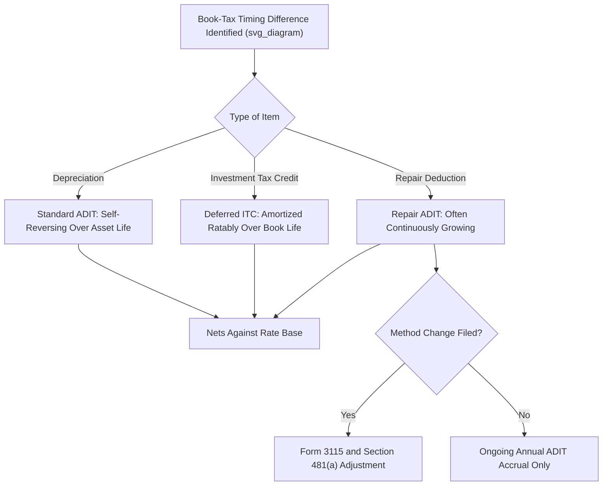

## Deferred Tax Treatment of Credits and Repair Deductions

### Overview

Beyond depreciation timing differences, two other significant categories generate deferred tax assets and liabilities that affect rate base and the revenue requirement: **tax credits** (primarily the Investment Tax Credit and various energy-related credits) and **repair deductions** (costs currently deducted for tax purposes that are capitalized for book/regulatory purposes). Each has distinct normalization requirements, ratemaking treatments, and reversal mechanics that differ meaningfully from ordinary depreciation-based ADIT.

### Part I: Investment Tax Credits (ITC)

#### Background and Statutory Basis

The Investment Tax Credit allows a taxpayer to reduce federal income tax liability by a percentage of the cost of qualifying property in the year it is placed in service. For regulated utilities, IRC §46(f) (as historically enacted) and successor guidance impose **normalization requirements** on the ratemaking treatment of ITC, similar in spirit to the depreciation normalization rules under §168(i)(9).

**Key Points**

- Utilities may not flow through the full benefit of an ITC to ratepayers in the year the credit is generated if they wish to retain eligibility for the credit at all (for older vintage ITC) or must comply with specific amortization normalization if using certain election methods
- Two historical normalization elections existed: the **deferral method** (amortize the ITC over the life of the related property) and the **ratable flow-through method restricted to normalization** — utilities generally use deferral to stay compliant
- Modern equivalents include the Investment Tax Credit for renewable energy property (solar, storage, and offshore wind qualifying facilities under IRC §48/§48E post-Inflation Reduction Act), which carry their own normalization provisions when claimed by rate-regulated utilities

#### Ratemaking Mechanics for ITC

Under the deferral/normalization method:

$$ITC_{deferred} = ITC_{total}$$

The full credit amount is recorded as a **deferred credit** (a liability-side / rate base offset, similar to ADIT) and amortized into income (as a reduction to tax expense) over the book life of the related asset:

$$Annual\ ITC\ Amortization = \frac{ITC_{total}}{Book\ Life\ (years)}$$

This annual amortization amount **reduces tax expense** in the revenue requirement each year, rather than being given entirely to ratepayers in the year the asset is placed in service.

**Rate Base Treatment**

The unamortized ITC balance is typically treated as a **reduction to rate base** (similar to ADIT), because it represents another source of cost-free capital:

$$RB_{net} = Plant_{gross} - AccumDepr - ADIT - Unamortized\ ITC + WorkingCapital$$

**Example**

A utility places a $5,000,000 qualifying asset in service, generating a 10% ITC = $500,000. Book life is 25 years.

- Annual amortization: $500{,}000 / 25 = 20{,}000$ per year
- Year 1 revenue requirement includes a $20,000 reduction to tax expense (not the full $500,000)
- Unamortized ITC balance after Year 1: $480,000, which is netted against rate base
- This balance declines by $20,000 each year until fully amortized in Year 25

**Output**

| Year | Beginning Unamortized ITC | Amortization | Ending Unamortized ITC | Rate Base Offset |
| --- | --- | --- | --- | --- |
| 1 | $500,000 | $20,000 | $480,000 | $480,000 |
| 2 | $480,000 | $20,000 | $460,000 | $460,000 |
| ... | ... | ... | ... | ... |
| 25 | $20,000 | $20,000 | $0 | $0 |

[Inference] Specific commission practice on whether to net ITC against rate base or treat it purely as an income statement amortization item can vary by jurisdiction; some commissions have historically permitted alternative treatments, so utility-specific tariff and settlement history should be checked in practice.

#### Renewable Energy Credits (Post-IRA Considerations)

The Inflation Reduction Act of 2022 expanded and modified energy credit structures (including transferability and direct-pay options for certain entities). [Unverified] The precise interaction between these newer credit monetization mechanisms (e.g., third-party transferability under IRC §6418) and traditional utility normalization requirements is still being clarified through IRS guidance and state commission proceedings, so utilities pursuing these credits should confirm current normalization treatment with tax counsel and their regulator before assuming a specific ratemaking method applies.

### Part II: Repair Deductions

#### Background

"Repair deductions" refer to costs that a utility deducts currently for federal income tax purposes under the tangible property regulations (commonly called the "Repair Regs," Treasury Regulations §1.263(a)-1, -2, and -3, finalized in 2013) but which are **capitalized** for book and regulatory ratemaking purposes as part of plant in service.

**Key Points**

- The Repair Regs establish a framework distinguishing deductible repairs/maintenance from capital improvements, using tests such as the "betterment, restoration, or adaptation" (BRA) standard
- Utilities — particularly in transmission, distribution, and generation plant maintenance (e.g., pole and line work, boiler retubing, turbine overhauls) — often qualify significant portions of routine capital-budget spending as currently deductible repairs under these regulations, even though the same costs are capitalized on the regulatory books
- This creates a **large, recurring, and often one-directional timing difference**: costs deducted immediately for tax but depreciated over decades for book/regulatory purposes

#### Why Repair Deductions Are Different from Depreciation Timing Differences

Unlike standard MACRS-vs-book depreciation differences, which naturally reverse as the asset ages, repair deduction timing differences can behave more like a **continuously growing deferred tax liability** if capital spending patterns are stable or growing, because each year's new repair-eligible capital additions generate a fresh full-year deduction, while the corresponding book capitalization depreciates over a much longer schedule.

**Key Points**

- Because repair deductions are frequently treated as required to be normalized (many state commissions and IRS guidance treat repair-related timing differences similarly to depreciation for normalization purposes when they are tied to depreciable property), most utilities normalize this item rather than flow it through
- [Inference] Some jurisdictions have historically litigated or negotiated whether repair-deduction timing differences must be normalized to the same degree as depreciation; because this determination is fact-specific, utilities generally seek IRS private letter rulings or accounting method change consent (Form 3115) and align ratemaking treatment with tax counsel guidance rather than assuming a uniform national rule.

#### Ratemaking Mechanics for Repair Deductions

The mechanics parallel standard depreciation normalization:

$$\Delta ADIT_{repairs} = (Repair\ Deduction_{tax} - Depreciation_{book,\ same\ assets}) \times t$$

**Example**

A utility spends $8,000,000 in a year on distribution pole/line maintenance activities that qualify as currently deductible repairs under the tangible property regulations. For book/regulatory purposes, this $8,000,000 is capitalized and depreciated over a 35-year composite life (straight-line), generating book depreciation of:

$$8{,}000{,}000 / 35 \approx 228{,}571\ \text{per year}$$

**Step 1 — Timing difference in Year 1:**

$$8{,}000{,}000 - 228{,}571 = 7{,}771{,}429$$

**Step 2 — Deferred tax provision (at 21% statutory rate):**

$$7{,}771{,}429 \times 0.21 \approx 1{,}632{,}000$$

This approximately $1.63 million is added to the ADIT reserve in Year 1 alone, and — because repair-eligible capital spending recurs annually — a similar or larger addition typically occurs in each subsequent year, causing the repair-related ADIT balance to grow substantially over time if capital budgets remain stable or increase.

**Output**

| Component | Amount |
| --- | --- |
| Tax deduction (Year 1 repairs) | $8,000,000 |
| Book depreciation (Year 1, same spend) | $228,571 |
| Timing difference | $7,771,429 |
| Deferred tax provision (21%) | ~$1,632,000 |
| Cumulative ADIT impact | Grows annually with continued repair-eligible capex |

#### Accounting Method Changes and Form 3115

Adopting or revising a repair deduction methodology for tax purposes typically requires filing **IRS Form 3115, Application for Change in Accounting Method**, often under automatic consent procedures published in IRS revenue procedures specific to tangible property regulations. This filing formalizes the shift in the timing of deductions and establishes the "cut-off" or "modified cut-off" method for computing the associated §481(a) adjustment (a one-time catch-up adjustment for the cumulative effect of the method change), which itself becomes a significant one-time deferred tax item requiring careful ratemaking treatment (often amortized over a period set by regulatory order or settlement).

### Comparative Summary: Credits vs. Repair Deductions vs. Standard Depreciation

| Feature | Depreciation Timing Difference | ITC | Repair Deductions |
| --- | --- | --- | --- |
| Normalization mandatory? | Yes (IRC §168(i)(9)) | Yes, for credit-eligible property | Generally yes, in practice, when tied to depreciable property |
| Reversal pattern | Self-reversing over asset life | Amortized ratably over book life | Often continuously growing if capex is stable/growing |
| Rate base treatment | ADIT reduces rate base | Unamortized ITC reduces rate base | ADIT (repairs) reduces rate base |
| One-time catch-up item? | No (routine annual) | No (routine annual per vintage) | Yes, possible §481(a) adjustment on method change |
| Primary authority | Treas. Reg. §1.167(l)-1 / §168(i)(9) | IRC §46(f) / §50(d) history; §48/§48E current | Treas. Reg. §1.263(a)-1 et seq. |

### Mermaid Diagram — Deferred Tax Item Classification (svg_diagram)

### SVG Illustration — ADIT Growth Pattern Comparison

<svg xmlns="http://www.w3.org/2000/svg" viewBox="0 0 720 340" font-family="Helvetica, Arial, sans-serif">
<text x="360" y="22" text-anchor="middle" font-size="15" font-weight="bold" fill="#1a1a1a">Deferred Tax Balance Patterns Over Time (svg_diagram)</text>
<line x1="60" y1="290" x2="670" y2="290" stroke="#333" stroke-width="1.5" />
<line x1="60" y1="290" x2="60" y2="50" stroke="#333" stroke-width="1.5" />
<text x="30" y="170" text-anchor="middle" font-size="11" fill="#333" transform="rotate(-90 30 170)">ADIT Balance</text>
<text x="360" y="315" text-anchor="middle" font-size="11" fill="#333">Time (Asset/Program Life)</text>

<path d="M 80 270 Q 220 90 340 100 T 620 260" fill="none" stroke="#3b6ea5" stroke-width="2.5" />
<text x="480" y="130" font-size="11" fill="#3b6ea5" font-weight="bold">Depreciation ADIT</text>

<path d="M 80 280 L 200 210 L 460 265 L 620 285" fill="none" stroke="#5a9e6f" stroke-width="2.5" />
<text x="200" y="200" font-size="11" fill="#5a9e6f" font-weight="bold">Unamortized ITC</text>

<path d="M 80 285 Q 300 220 460 130 T 620 60" fill="none" stroke="#b5762c" stroke-width="2.5" />
<text x="470" y="100" font-size="11" fill="#b5762c" font-weight="bold">Repair Deduction ADIT</text>
</svg>

### Analytical and Modeling Considerations

**Key Points**

- Repair deduction ADIT should generally be modeled on a **rolling annual accrual basis** tied to the utility's capital budget for repair-eligible categories, not as a single asset-life reversal curve
- ITC amortization schedules should be tracked **by vintage** (each year's placed-in-service ITC has its own amortization schedule based on that vintage's book life)
- When multiple deferred tax categories exist (standard depreciation, ITC, repairs, EDIT), rate base models typically maintain **separate ADIT sub-schedules** and sum them for the total rate base offset:

$$ADIT_{total} = ADIT_{depreciation} + ADIT_{repairs} + Unamortized\ ITC \pm EDIT_{unresolved}$$

- Because repair-deduction ADIT can represent a large and growing rate base offset, some regulators and intervenors scrutinize whether repair deduction methodologies are being applied appropriately (i.e., not over-classifying capital improvements as repairs), since aggressive repair deduction positions increase the deferred tax reserve and reduce the utility's earnings base

### Common Pitfalls in Practice

**Key Points**

- Assuming repair deduction ADIT will "self-reverse" the way depreciation ADIT does — it often will not, absent a decline in capital spending or a change in tax method
- Failing to update ITC amortization schedules by vintage, leading to premature write-off of unamortized ITC balances
- Overlooking the one-time §481(a) catch-up adjustment when a utility first adopts or revises its repair deduction accounting method, which can create a large, non-recurring deferred tax swing requiring specific ratemaking treatment (often normalized and amortized per commission order)
- Treating credit-related and repair-related ADIT as a single undifferentiated "other ADIT" line without separately tracking normalization compliance for each category

### Related Topics

- Flow Through vs. Normalization Accounting (foundational comparison)
- Accumulated Deferred Income Taxes (ADIT) as a Rate Base Component
- Excess Deferred Income Taxes (EDIT) and the Average Rate Assumption Method (ARAM)
- IRC Section 168(i)(9) and §46(f) Normalization Requirements
- Tangible Property Regulations and the Betterment/Restoration/Adaptation (BRA) Test
- Form 3115 and Section 481(a) Accounting Method Change Adjustments
- Investment Tax Credit Transferability Under the Inflation Reduction Act
- MACRS and Tax Depreciation Methods for Utility Plant
- Deferred Tax Asset/Liability Treatment for Net Operating Losses (NOLs) in Rate Base
- Vintage-Based ADIT Modeling in Revenue Requirement Studies