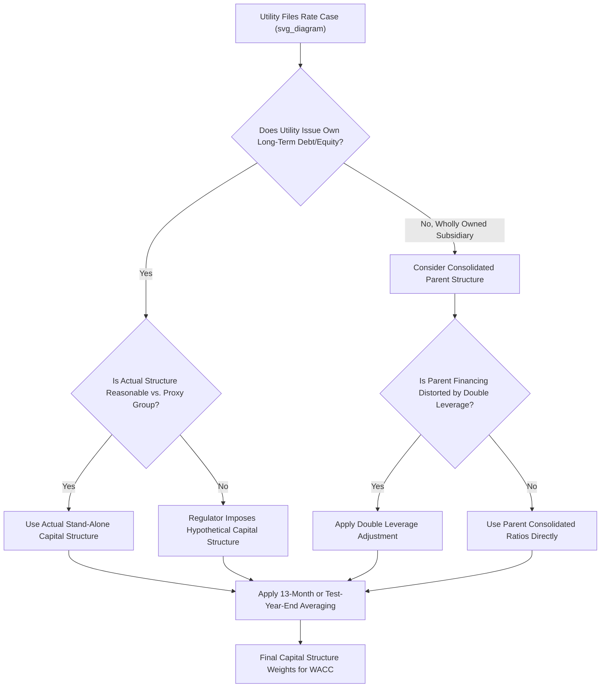

## Determining the Ratemaking Capital Structure

### Overview

The ratemaking capital structure is the mix of debt, preferred equity, and common equity used to calculate a utility's weighted average cost of capital (WACC) for setting rates. Because the capital structure directly determines both the return investors earn and the degree of financial risk embedded in the revenue requirement, its determination is one of the most contested and consequential elements of a rate case. Regulators typically choose between using the utility's **actual capital structure**, a **hypothetical capital structure**, or a **consolidated/parent capital structure**, each with distinct rationale and ratepayer implications.

### Purpose in the Revenue Requirement

Capital structure determines the weights applied to each capital component's cost rate in the overall rate of return calculation:

$$r_{WACC} = \left(\frac{D}{V}\right) \times r_d \times (1 - t) + \left(\frac{P}{V}\right) \times r_p + \left(\frac{E}{V}\right) \times r_e$$

Where:

- $D$ = long-term debt
- $P$ = preferred equity
- $E$ = common equity
- $V = D + P + E$ = total invested capital
- $r_d$ = embedded cost of debt
- $r_p$ = cost of preferred equity
- $r_e$ = allowed return on common equity (ROE)
- $t$ = effective tax rate (debt interest is tax-deductible, so an after-tax adjustment applies to the debt component only)

This $r_{WACC}$ is then applied to rate base to determine the overall return dollars included in the revenue requirement:

$$Return\ Dollars = RB_{net} \times r_{WACC}$$

### Step 1: Establishing the Capital Structure Ratios

#### Actual (Utility-Specific) Capital Structure

**Key Points**

- Most commonly used when the utility issues its own debt and equity securities directly (a "stand-alone" financing entity) and its capital structure is reasonably balanced (i.e., not distorted by unusual financing events)
- Derived from the utility's balance sheet at a test-year-end date or as a 13-month average, reflecting actual long-term debt, preferred stock, and common equity balances
- Short-term debt is typically excluded from the permanent capital structure unless it is used to finance permanent rate base additions (e.g., construction work in progress) on an ongoing basis, in which case some commissions include a normalized level of short-term debt

**Example**

| Component | Balance | % of Total |
| --- | --- | --- |
| Long-term debt | $450,000,000 | 45% |
| Preferred equity | $50,000,000 | 5% |
| Common equity | $500,000,000 | 50% |
| **Total** | **$1,000,000,000** | **100%** |

#### Hypothetical Capital Structure

**Key Points**

- Used when the utility's actual capital structure is considered **unreasonable** for ratemaking purposes — for example, if it is: (a) unusually leveraged (too much or too little debt relative to comparable utilities), (b) distorted by a parent company's financing decisions, or (c) inconsistent with the capital structure used by the proxy group in the cost-of-equity analysis
- Regulators construct a hypothetical structure using industry benchmarks, proxy group averages, or a structure deemed more consistent with the risk profile implied in the authorized ROE
- [Inference] The specific triggers and evidentiary standards for imposing a hypothetical capital structure vary meaningfully by jurisdiction; some commissions apply this only in unusual circumstances (e.g., a highly leveraged holding company allocation) while others use it more routinely as a policy tool, so the applicable state's precedent should be consulted for any specific proceeding.

#### Consolidated or Parent Capital Structure

**Key Points**

- Applied when a utility is a wholly owned subsidiary of a holding company and does not issue its own separately rated long-term debt, or when the subsidiary's stand-alone capital structure is viewed as artificially thin or thick due to intercompany financing arrangements
- The parent's consolidated capital structure (sometimes double-leveraged, discussed below) is used as a proxy for the ratemaking capital structure, adjusted for items unrelated to the regulated utility (e.g., non-utility subsidiaries, goodwill from acquisitions)
- Raises the **double leverage** issue: if the parent itself has borrowed money to invest as equity in the subsidiary, using the parent's consolidated equity ratio without adjustment can overstate the true equity funding available to the regulated subsidiary

### Step 2: The Double Leverage Adjustment

**Key Points**

- Double leverage occurs when a parent holding company issues its own debt and uses the proceeds (combined with its own equity) to purchase common equity in a regulated subsidiary
- From a consolidated perspective, that portion of the subsidiary's "equity" is actually funded by parent-level debt, so treating it as pure equity in the subsidiary's ratemaking capital structure overstates the equity layer and can inflate the revenue requirement (since equity typically costs more than debt)
- The double leverage adjustment reallocates a portion of the parent's debt cost down to the subsidiary's capital structure, effectively lowering the imputed cost of the equity portion attributable to the subsidiary

**Double Leverage Formula (Simplified)**

$$Equity\ Ratio_{adjusted} = \frac{Common\ Equity_{subsidiary}}{Total\ Capital_{subsidiary}} \times \frac{Common\ Equity_{parent}}{Total\ Capital_{parent}}$$

The blended cost of equity used in the subsidiary's WACC can then be derived as a weighted average of the parent's cost of debt and cost of equity, in proportion to how the parent itself financed its investment in the subsidiary.

**Example**

A parent holding company has a consolidated capital structure of 40% debt / 60% equity, with a cost of debt of 5% and cost of equity of 10%. It has invested $600 million as "equity" in its utility subsidiary, funded 40% by parent debt ($240 million) and 60% by parent equity ($360 million).

The blended cost of that $600 million equity investment, from a consolidated risk perspective, is:

$$0.40 \times 5\% + 0.60 \times 10\% = 2\% + 6\% = 8\%$$

Rather than treating the full $600 million as costing the parent's full 10% equity return, double leverage analysis would argue the effective blended cost is 8%, reflecting that some of the subsidiary's "equity" is actually debt-financed at the parent level.

**Output**

| Approach | Equity Cost Applied to $600M | Rationale |
| --- | --- | --- |
| No double leverage adjustment | 10% (full parent ROE) | Treats all subsidiary equity as pure equity capital |
| Double leverage adjustment | 8% (blended) | Reflects parent's actual debt/equity funding mix |

[Inference] Double leverage adjustments are analytically debated and not uniformly applied; some regulators reject the method as understating the risk borne by the subsidiary's equity holders or as inconsistent with standalone financing principles, while others apply it routinely for wholly owned subsidiaries. The applicable treatment is jurisdiction- and case-specific.

### Step 3: Test Period and Averaging Conventions

**Key Points**

- Capital structure is typically measured as of the **end of the test year** or as a **13-month average** (beginning balance plus each of the 12 month-end balances, divided by 13) to smooth out point-in-time financing distortions
- Some jurisdictions use a **5-quarter average** or other averaging conventions specified by statute or commission rule
- Pro forma adjustments may be applied for known and measurable changes in capital structure occurring shortly after the test year (e.g., a planned debt issuance or equity infusion tied to a specific capital project)

### Step 4: Reasonableness Review and Common Adjustments

**Key Points**

- **Off-balance-sheet debt equivalents**: Some commissions impute a debt-like component for long-term purchased power agreements or other contractual obligations with debt-like characteristics, adjusting the equity ratio downward to reflect this "imputed debt"
- **Short-term debt**: Included only if used to finance rate base on a permanent, ongoing basis (as opposed to seasonal working capital needs)
- **Goodwill exclusion**: Acquisition-related goodwill on a parent or subsidiary balance sheet is often excluded from the capital structure used for ratemaking, since it does not represent capital actually invested in used-and-useful utility plant
- **Construction Work in Progress (CWIP) financing**: In some cases, adjustments account for how CWIP is financed (e.g., short-term debt or AFUDC) separately from the permanent capital structure

### Illustrative Comparison of Capital Structure Approaches

| Approach | When Typically Used | Key Risk/Adjustment |
| --- | --- | --- |
| Actual stand-alone | Utility issues own debt/equity, structure is reasonable | None beyond standard test-period averaging |
| Hypothetical | Actual structure is unreasonable or inconsistent with proxy group risk | Requires evidentiary support for chosen ratios |
| Consolidated/parent | Wholly owned subsidiary without independent financing | Double leverage adjustment often applied |

### Mermaid Diagram — Capital Structure Determination Process (svg_diagram)

### SVG Illustration — Capital Structure Weighting in WACC

<svg xmlns="http://www.w3.org/2000/svg" viewBox="0 0 700 300" font-family="Helvetica, Arial, sans-serif">
<text x="350" y="22" text-anchor="middle" font-size="15" font-weight="bold" fill="#1a1a1a">Capital Structure Composition and WACC Weighting (svg_diagram)</text>

<rect x="150" y="50" width="120" height="200" fill="#3b6ea5" stroke="#1f3a5f" />
<text x="210" y="150" text-anchor="middle" font-size="12" fill="#fff">Common Equity</text>
<text x="210" y="168" text-anchor="middle" font-size="11" fill="#fff">50%</text>
<rect x="150" y="250" width="120" height="20" fill="#b5762c" stroke="#6b4a1a" />
<text x="210" y="264" text-anchor="middle" font-size="10" fill="#fff">Preferred 5%</text>
<rect x="150" y="270" width="120" height="0" fill="none" />
<rect x="150" y="270" width="120" height="0" />
<rect x="150" y="250" width="0" height="0" />
<rect x="150" y="270" width="0" height="0" />

<rect x="150" y="270" width="120" height="0" />
<rect x="150" y="230" width="0" height="0" />
<rect x="150" y="130" width="0" height="0" />

<rect x="450" y="50" width="120" height="100" fill="#3b6ea5" stroke="#1f3a5f" />
<text x="510" y="105" text-anchor="middle" font-size="11" fill="#fff">Common Equity 50%</text>
<rect x="450" y="150" width="120" height="20" fill="#b5762c" stroke="#6b4a1a" />
<text x="510" y="164" text-anchor="middle" font-size="9" fill="#fff">Preferred 5%</text>
<rect x="450" y="170" width="120" height="90" fill="#5a9e6f" stroke="#2f5c3c" />
<text x="510" y="220" text-anchor="middle" font-size="11" fill="#fff">Long-Term Debt 45%</text>

<text x="510" y="280" text-anchor="middle" font-size="11" fill="#333">Weights applied to each component's cost rate to derive WACC</text>

</svg>

### Regulatory Precedent Themes

**Key Points**

- Regulators generally aim to balance two competing objectives: (1) preserving the utility's financial integrity and access to capital markets at reasonable cost, and (2) protecting ratepayers from an artificially equity-heavy structure that increases the revenue requirement (since equity returns are taxed and typically cost more than debt)
- Credit rating agency guidance (S&P, Moody's, Fitch) on target debt/equity ratios and imputed debt treatment for power purchase agreements is frequently referenced by both utility and intervenor witnesses in capital structure disputes
- FERC-jurisdictional utilities (transmission, wholesale) often use FERC's own precedent on capital structure reasonableness, which can differ from state commission approaches for the same holding company's distribution or generation subsidiaries

[Unverified] Because capital structure litigation is highly fact-specific and precedent-driven, general principles described here may not predict the outcome in any specific proceeding; current orders from the relevant commission should be consulted for binding guidance.

### Common Pitfalls in Practice

**Key Points**

- Using a point-in-time capital structure snapshot that does not reflect a representative, seasonally-adjusted, or averaged period, leading to distortion from a single unusual financing event
- Failing to reconcile the capital structure used for ratemaking with the capital structure implicitly assumed in the cost-of-equity (ROE) proxy group analysis — a mismatch here creates an internal inconsistency in the overall rate of return
- Ignoring imputed debt from purchased power agreements when the utility relies heavily on long-term contracts with debt-like fixed payment obligations
- Applying double leverage mechanically without considering whether the subsidiary's own credit profile and standalone risk justify a different treatment

### Related Topics

- Weighted Average Cost of Capital (WACC) Calculation Methodology
- Embedded Cost of Debt Determination
- Return on Equity (ROE) Estimation Methods (DCF, CAPM, Risk Premium)
- Proxy Group Selection for Cost of Capital Analysis
- Double Leverage Theory and Regulatory Treatment
- Imputed Debt from Purchased Power Agreements
- Credit Rating Agency Metrics and Regulatory Capital Structure Benchmarks
- Test Year Selection and Averaging Conventions in Rate Cases
- Flow Through vs. Normalization Accounting (tax rate interaction with WACC)
- Construction Work in Progress (CWIP) Financing and AFUDC