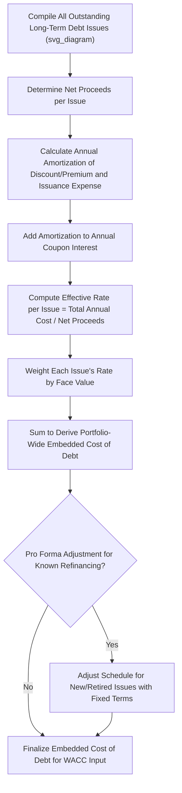

## Embedded Cost of Long Term Debt

### Overview

The embedded cost of long-term debt is the weighted average interest rate a utility actually pays across its entire portfolio of outstanding long-term debt issuances, inclusive of related issuance costs and premiums/discounts. Unlike the cost of equity, which is estimated using market-based models, the embedded cost of debt is a largely mechanical, historically verifiable calculation derived directly from the utility's actual debt instruments. It serves as the $r_d$ input in the WACC calculation and is one of the least contested components of a rate case, though disputes still arise over specific adjustments.

### Core Formula

At the simplest level, the embedded cost of debt is a dollar-weighted average of the effective annual cost of each outstanding debt issue:

$$r_d = \frac{\sum_{i=1}^{n} \left(Face\ Value_i \times Effective\ Rate_i\right)}{\sum_{i=1}^{n} Face\ Value_i}$$

Where each issue's **effective rate** (also called the "effective cost" or "true cost") reflects not just the stated coupon rate, but also the amortization of issuance costs, premiums, and discounts over the life of that specific instrument.

### Step 1: Compiling the Debt Portfolio

**Key Points**

- The utility compiles a schedule (often called an "embedded cost of debt schedule" or "Schedule D" in many rate case filing formats) listing every outstanding long-term debt issuance
- Typical fields per issuance: issue date, maturity date, original principal, net proceeds received, coupon (stated) interest rate, unamortized discount/premium, unamortized issuance expense, and annual amortization of each
- Only **long-term** debt (typically original maturity greater than one year) is included in this schedule; short-term debt/commercial paper is addressed separately (see capital structure discussion)

**Example Debt Portfolio**

| Issue | Principal | Coupon Rate | Net Proceeds | Unamortized Discount | Unamortized Issuance Exp. | Remaining Life |
| --- | --- | --- | --- | --- | --- | --- |
| Series A (2015) | $100,000,000 | 4.25% | $98,500,000 | $500,000 | $1,000,000 | 9 years |
| Series B (2019) | $150,000,000 | 3.75% | $148,200,000 | $800,000 | $1,000,000 | 13 years |
| Series C (2022) | $200,000,000 | 5.10% | $197,000,000 | $1,500,000 | $1,500,000 | 16 years |
| **Total** | **$450,000,000** | — | **$443,700,000** | **$2,800,000** | **$3,500,000** | — |

### Step 2: Computing the Effective Cost per Issuance

**Key Points**

- The **coupon rate** alone understates the true cost of debt because it ignores issuance expenses (underwriting fees, legal costs, printing, rating agency fees) and any original issue discount or premium
- The **effective annual cost** is calculated by annualizing the amortization of these items and adding that to the coupon interest, expressed as a percentage of the **net proceeds** (not face value) — since net proceeds represent the actual capital the utility received to invest in rate base

**Effective Cost Formula (Simplified, Straight-Line Amortization Convention)**

$$r_{d,i} = \frac{\left(Face\ Value_i \times Coupon_i\right) + \dfrac{Unamortized\ Discount_i + Unamortized\ Issuance\ Expense_i}{Remaining\ Life_i}}{Net\ Proceeds_i}$$

**Worked Example — Series A**

- Annual coupon interest: $100{,}000{,}000 \times 0.0425 = 4{,}250{,}000$
- Annual amortization of discount and issuance expense: $(500{,}000 + 1{,}000{,}000) / 9 \approx 166{,}667$
- Total annual effective cost: $4{,}250{,}000 + 166{,}667 = 4{,}416{,}667$
- Effective rate: $4{,}416{,}667 / 98{,}500{,}000 \approx 4.484\%$

**Output**

| Issue | Coupon Rate | Effective Rate (After Amortization) |
| --- | --- | --- |
| Series A | 4.25% | ~4.48% |
| Series B | 3.75% | ~3.85% |
| Series C | 5.10% | ~5.20% |

[Inference] The exact amortization convention (straight-line vs. effective-interest/constant-yield method) can differ by jurisdiction and by the utility's own accounting policy; the effective-interest method is generally considered more precise for GAAP purposes, but many state commissions have historically accepted straight-line approximations for ratemaking schedules due to their simplicity and immaterial difference at typical utility debt scales.

### Step 3: Weighted Average Calculation

Once each issue's effective rate is determined, the portfolio-wide embedded cost of debt is the face-value-weighted average:

$$r_d = \frac{\sum \left(Face\ Value_i \times r_{d,i}\right)}{\sum Face\ Value_i}$$

**Worked Example**

| Issue | Face Value | Effective Rate | Weighted Contribution |
| --- | --- | --- | --- |
| Series A | $100,000,000 | 4.484% | $4,484,000 |
| Series B | $150,000,000 | 3.850% | $5,775,000 |
| Series C | $200,000,000 | 5.200% | $10,400,000 |
| **Total** | **$450,000,000** | — | **$20,659,000** |

$$r_d = \frac{20{,}659{,}000}{450{,}000{,}000} \approx 4.591\%$$

This 4.591% is the embedded cost of long-term debt used in the WACC calculation.

### Step 4: Treatment of Refinancing, Redemption, and Reacquisition Costs

**Key Points**

- When a utility **refinances** existing debt (retires an old issue and replaces it with new debt at different terms), any **unamortized issuance costs, discount, or call premium** on the retired debt typically must be addressed
- Common ratemaking treatments for these "loss on reacquisition of debt" amounts include: (a) immediate write-off against income (rare, since it distorts a single test year), (b) amortization over the remaining life of the original debt, or (c) amortization over the life of the replacement debt — the most common approach, since the refinancing is presumed to generate net savings recovered over a comparable period
- **Call premiums** paid to redeem debt early are generally amortized similarly, spreading the cost over future periods so a single test year is not unduly burdened by the refinancing decision, provided the transaction is prudent (typically evaluated by whether the refinancing produces a net reduction in the effective cost of debt or other public interest benefit)

**Example**

A utility redeems a $50,000,000 issue with 3 years of unamortized issuance costs ($300,000) and unamortized discount ($200,000) remaining, paying a 2% call premium ($1,000,000), in order to refinance at a materially lower coupon rate with new 20-year debt.

- Total unamortized/reacquisition costs to address: $300{,}000 + 200{,}000 + 1{,}000{,}000 = 1{,}500{,}000$
- If amortized over the new debt's 20-year life: $1{,}500{,}000 / 20 = 75{,}000$ per year added to the effective cost calculation of the replacement issue

### Step 5: Variable-Rate and Hybrid Debt Considerations

**Key Points**

- Variable-rate long-term debt (e.g., tied to SOFR or another benchmark) requires either (a) using a test-year-average or current rate as a proxy for the embedded cost contribution of that tranche, or (b) excluding it from the embedded cost schedule and treating it via a rate rider or cost-tracking mechanism if the commission permits
- Some utilities use interest rate swaps to convert variable-rate debt to a synthetic fixed rate; the swap's net settlement cost (or benefit) is typically incorporated into the effective cost calculation for that debt tranche, subject to a prudence review of the hedging strategy
- Convertible or hybrid debt instruments require specific treatment depending on their debt/equity classification for ratemaking purposes, which may differ from their GAAP balance sheet classification

[Unverified] The treatment of interest rate swap gains/losses in the embedded cost of debt calculation varies by jurisdiction and depends heavily on case-specific prudence findings regarding the original hedging decision; no single universal rule applies across all state commissions.

### Test Period and Pro Forma Adjustments

**Key Points**

- Like capital structure, the embedded cost of debt is typically calculated as of the **end of the test year** or averaged over a comparable period, reflecting the debt portfolio actually outstanding
- **Known and measurable** pro forma adjustments are common: if a utility has an upcoming scheduled debt issuance or maturity shortly after the test year with terms already fixed (e.g., a bond already priced but not yet closed), many jurisdictions permit adjusting the embedded cost calculation to reflect that known change, since it avoids using a stale or soon-to-be-outdated cost figure
- Forecasted future issuances **without fixed terms** are generally not includable, since their rate is not yet "known and measurable"

### Mermaid Diagram — Embedded Cost of Debt Calculation Flow (svg_diagram)

### SVG Illustration — Coupon Rate vs. Effective Cost Bridge

<svg xmlns="http://www.w3.org/2000/svg" viewBox="0 0 700 280" font-family="Helvetica, Arial, sans-serif">
<text x="350" y="22" text-anchor="middle" font-size="15" font-weight="bold" fill="#1a1a1a">Bridging Coupon Rate to Effective Cost of Debt (svg_diagram)</text>
<rect x="60" y="80" width="140" height="60" fill="#3b6ea5" stroke="#1f3a5f" rx="4" />
<text x="130" y="115" text-anchor="middle" font-size="12" fill="#fff">Coupon Rate</text>
<text x="130" y="132" text-anchor="middle" font-size="11" fill="#fff">4.25%</text>
<path d="M 200 110 L 250 110" stroke="#333" stroke-width="2" marker-end="url(#arrow1)" />
<rect x="255" y="80" width="180" height="60" fill="#b5762c" stroke="#6b4a1a" rx="4" />
<text x="345" y="108" text-anchor="middle" font-size="11" fill="#fff">+ Amortized Discount</text>
<text x="345" y="124" text-anchor="middle" font-size="11" fill="#fff">+ Amortized Issuance Cost</text>
<path d="M 435 110 L 485 110" stroke="#333" stroke-width="2" marker-end="url(#arrow1)" />
<rect x="490" y="80" width="150" height="60" fill="#5a9e6f" stroke="#2f5c3c" rx="4" />
<text x="565" y="108" text-anchor="middle" font-size="12" fill="#fff">Effective Cost</text>
<text x="565" y="126" text-anchor="middle" font-size="11" fill="#fff">~4.48%</text>

<text x="350" y="180" text-anchor="middle" font-size="11" fill="#333">Effective cost divides total annual cost by NET PROCEEDS, not face value</text>

<text x="350" y="200" text-anchor="middle" font-size="11" fill="#333">— this is why effective cost typically exceeds the stated coupon</text>

</svg>

### Interaction with Other Rate Case Elements

**Key Points**

- The embedded cost of debt feeds directly into the **after-tax WACC**, where only the debt component receives a tax-deduction adjustment (since interest is tax-deductible while equity returns are not): $r_d \times (1-t)$ in the WACC formula
- Interest expense used for **AFUDC (Allowance for Funds Used During Construction)** calculations is often based on the same embedded cost of debt (blended with a cost of equity component for the equity portion of AFUDC), linking this schedule to capitalized construction financing costs
- Some jurisdictions use the embedded cost of debt (or a component of it) as the discount rate for certain **regulatory asset amortization** calculations or **interest on customer deposits/refunds**

### Common Pitfalls in Practice

**Key Points**

- Using **face value** instead of **net proceeds** as the denominator when calculating an issue's effective rate, which understates the true effective cost
- Failing to properly amortize **reacquisition costs** from a prior refinancing, either omitting them entirely or double-counting them across old and new debt schedules
- Applying a stale embedded cost of debt schedule that does not reflect debt issued or retired shortly before the test year, when a known and measurable adjustment would be appropriate
- Mixing short-term and long-term debt in the same weighted-average schedule without properly separating them per the capital structure's treatment of short-term debt
- Ignoring the impact of **interest rate swap** settlements on the effective cost when the utility has active hedging positions tied to its long-term debt

### Related Topics

- Determining the Ratemaking Capital Structure
- Weighted Average Cost of Capital (WACC) Calculation Methodology
- Cost of Preferred Equity Determination
- Allowance for Funds Used During Construction (AFUDC) Mechanics
- Return on Equity (ROE) Estimation Methods (DCF, CAPM, Risk Premium)
- Debt Reacquisition Costs and Refinancing Prudence Review
- Interest Rate Swaps and Hedging Cost Recovery in Rate Cases
- Test Year Selection and Known-and-Measurable Adjustment Standards
- Short-Term Debt and Working Capital Financing in Rate Base
- Credit Rating Agency Metrics and Regulatory Capital Structure Benchmarks