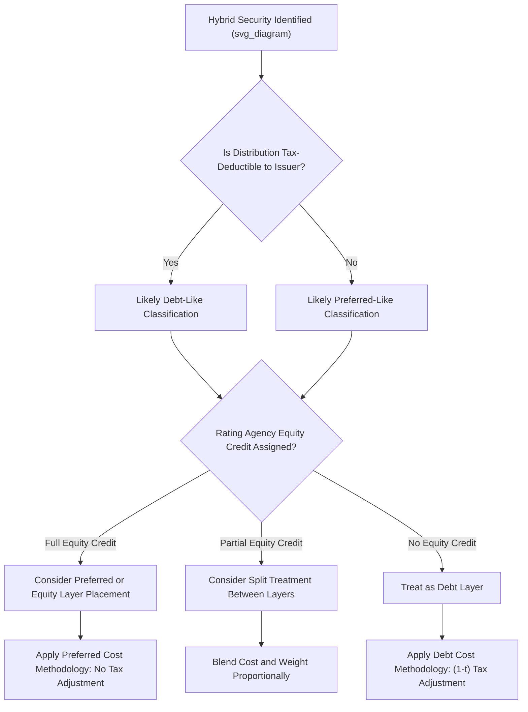

## Cost of Preferred and Hybrid Securities

### Overview

Preferred stock and hybrid securities occupy a position between long-term debt and common equity in a utility's capital structure, carrying fixed or semi-fixed distribution obligations while generally ranking below debt (but above common equity) in liquidation priority. Their cost determination methodology closely parallels the embedded cost of debt calculation, but distinct features — perpetual maturities, dividend (rather than interest) treatment, tax non-deductibility, and hybrid debt/equity characteristics — require specialized handling in rate case cost-of-capital analysis.

### Part I: Traditional Preferred Stock

#### Characteristics Relevant to Ratemaking

**Key Points**

- Preferred dividends are **not tax-deductible** to the issuer (unlike interest on debt), which makes preferred stock a relatively expensive financing source per dollar of after-tax cost, despite often carrying a lower stated rate than common equity
- Preferred stock typically has a **fixed dividend rate**, stated as a percentage of par/stated value, paid before any common dividends
- Most utility preferred stock is **cumulative** (unpaid dividends accrue and must be paid before common dividends resume) and often **callable** after a defined period, giving the issuer refinancing flexibility similar to callable debt

#### Cost Calculation Methodology

The embedded cost of preferred stock mirrors the embedded cost of debt calculation, using the effective cost per issue weighted by the amount outstanding:

$$r_{p,i} = \frac{Annual\ Dividend_i + \dfrac{Unamortized\ Discount_i + Unamortized\ Issuance\ Expense_i}{Remaining\ Life_i \text{ or amortization period}}}{Net\ Proceeds_i}$$

$$r_p = \frac{\sum \left(Par\ Value_i \times r_{p,i}\right)}{\sum Par\ Value_i}$$

**Key Points**

- For **perpetual (non-maturing) preferred stock**, there is no natural "remaining life" over which to amortize issuance costs; common conventions include amortizing over an assumed period (e.g., to the first call date) or, in some jurisdictions, simply including the annual dividend without an issuance cost amortization component if the security is expected to remain outstanding indefinitely
- Because preferred dividends are paid from **after-tax income** (no tax deduction), the cost of preferred is used in the WACC on a straightforward pre-tax basis — no $(1-t)$ adjustment is applied, unlike debt

**Worked Example**

A utility has $50,000,000 par value of 6.00% cumulative preferred stock outstanding, with net proceeds of $49,000,000 and unamortized issuance costs of $500,000, amortized to the first call date in 10 years.

- Annual dividend: $50{,}000{,}000 \times 0.06 = 3{,}000{,}000$
- Annual amortization of issuance cost: $500{,}000 / 10 = 50{,}000$
- Total annual cost: $3{,}000{,}000 + 50{,}000 = 3{,}050{,}000$
- Effective cost: $3{,}050{,}000 / 49{,}000{,}000 \approx 6.224\%$

**Output**

| Component | Amount |
| --- | --- |
| Par value | $50,000,000 |
| Net proceeds | $49,000,000 |
| Stated dividend rate | 6.00% |
| Effective cost of preferred | ~6.22% |

### Part II: Hybrid Securities

#### What Qualifies as "Hybrid"

**Key Points**

- Hybrid securities combine debt-like and equity-like features — common examples include **trust preferred securities**, **junior subordinated notes/debentures**, **convertible preferred stock**, and **mandatory convertible securities**
- Key hybrid characteristics that complicate classification: deferred/optional interest or dividend payment provisions, very long or perpetual maturities, deep subordination in the capital structure, and conversion features into common equity
- Credit rating agencies (S&P, Moody's, Fitch) assign varying degrees of "equity credit" to hybrid instruments based on their specific terms (maturity length, deferability, subordination), and this equity credit classification often influences how regulators treat the instrument for ratemaking capital structure purposes

#### Ratemaking Classification Challenges

**Key Points**

- The central ratemaking question for any hybrid security is: **does it belong in the debt layer, the preferred layer, or a blended treatment** for purposes of both (a) the capital structure ratios and (b) the appropriate cost rate and tax treatment?
- Some commissions look to the security's **accounting classification** (debt vs. equity under GAAP) as a starting point, while others perform an independent functional analysis of the instrument's terms
- **Trust preferred securities**, for example, are typically structured so that interest payments made by the operating company to the trust (and passed through as distributions to trust preferred holders) are **tax-deductible** to the issuer, even though the security carries many preferred-like features (e.g., long maturities, deferability) — this tax deductibility is often a primary reason utilities issue trust preferred rather than traditional preferred stock
- [Inference] Because hybrid security classification is highly instrument-specific and jurisdiction-dependent, no single universal rule determines treatment; utilities typically present detailed instrument terms and rating agency treatment as evidence, and commissions decide classification on a case-by-case basis based on the substance of the instrument's terms.

#### Cost Calculation for Hybrids

Where a hybrid instrument is functionally debt-like and tax-deductible (e.g., trust preferred, junior subordinated notes), the cost calculation follows the **embedded cost of debt methodology**, including the after-tax adjustment in WACC. Where a hybrid instrument is functionally preferred-like and non-deductible, the **preferred stock methodology** (pre-tax cost, no tax adjustment) applies.

**Example — Classification Impact**

A utility issues $100,000,000 of junior subordinated notes at a 7.00% distribution rate, structured to allow interest deductibility.

| Treatment | Cost Rate Used in WACC | Tax Adjustment |
| --- | --- | --- |
| Classified as debt-like hybrid | 7.00% effective cost | $\times (1-t)$ applied |
| Classified as preferred-like (hypothetically) | 7.00% effective cost | No tax adjustment (pre-tax) |

Because the after-tax adjustment lowers the effective WACC contribution when debt tax deductibility applies, the classification decision has a direct and material effect on the revenue requirement:

$$Contribution_{debt-like} = w \times 7.00\% \times (1-t)$$

$$Contribution_{preferred-like} = w \times 7.00\%$$

At a 21% tax rate, the debt-like treatment contributes $7.00\% \times 0.79 = 5.53\%$ to WACC versus the full 7.00% under preferred-like treatment — a meaningful difference multiplied across the entire hybrid tranche.

### Part III: Capital Structure Placement

**Key Points**

- Preferred stock is typically shown as its **own distinct layer** in the capital structure (separate from both debt and common equity), with its own weight and cost rate in the WACC formula
- Hybrid securities may be: (a) placed entirely within the debt layer, (b) placed entirely within the preferred layer, (c) split between layers based on the rating agencies' partial equity credit treatment, or (d) treated as a distinct fourth layer with its own blended cost and weight — the specific approach depends on commission precedent and the specific facts of the instrument
- Some jurisdictions adopt the same **equity credit percentage** used by rating agencies (e.g., a security receiving 50% equity credit from S&P might be split 50/50 between the debt and equity layers for ratemaking purposes), aligning regulatory treatment with market-based credit assessments

### Comparative Summary Table

| Feature | Long-Term Debt | Traditional Preferred | Debt-Like Hybrid | Common Equity |
| --- | --- | --- | --- | --- |
| Tax deductibility of payment | Yes | No | Typically yes | No |
| Maturity | Fixed | Often perpetual | Long/perpetual | None |
| Priority in liquidation | Highest | Middle | Between debt and preferred | Lowest |
| WACC tax adjustment | $(1-t)$ applied | None | $(1-t)$ applied | None |
| Typical cost calculation method | Embedded cost of debt schedule | Embedded cost of preferred schedule | Depends on classification | CAPM/DCF/Risk Premium models |

### Mermaid Diagram — Hybrid Security Classification Decision Flow (svg_diagram)

### SVG Illustration — Capital Structure Layers with Hybrid Placement

<svg xmlns="http://www.w3.org/2000/svg" viewBox="0 0 700 300" font-family="Helvetica, Arial, sans-serif">
<text x="350" y="22" text-anchor="middle" font-size="15" font-weight="bold" fill="#1a1a1a">Capital Structure Layers Including Hybrid Placement (svg_diagram)</text>
<rect x="120" y="50" width="160" height="60" fill="#3b6ea5" stroke="#1f3a5f" />
<text x="200" y="75" text-anchor="middle" font-size="11" fill="#fff">Common Equity</text>
<text x="200" y="93" text-anchor="middle" font-size="10" fill="#fff">No tax adjustment</text>
<rect x="120" y="110" width="160" height="45" fill="#8a6fae" stroke="#5a3d80" />
<text x="200" y="130" text-anchor="middle" font-size="10" fill="#fff">Hybrid (Split Treatment)</text>
<text x="200" y="145" text-anchor="middle" font-size="9" fill="#fff">Partial equity credit</text>
<rect x="120" y="155" width="160" height="45" fill="#b5762c" stroke="#6b4a1a" />
<text x="200" y="175" text-anchor="middle" font-size="11" fill="#fff">Preferred Stock</text>
<text x="200" y="190" text-anchor="middle" font-size="10" fill="#fff">No tax adjustment</text>
<rect x="120" y="200" width="160" height="60" fill="#5a9e6f" stroke="#2f5c3c" />
<text x="200" y="225" text-anchor="middle" font-size="11" fill="#fff">Long-Term Debt</text>
<text x="200" y="243" text-anchor="middle" font-size="10" fill="#fff">(1-t) tax adjustment</text>

<text x="450" y="130" font-size="11" fill="#333">Hybrid securities may sit</text>

<text x="450" y="146" font-size="11" fill="#333">between debt and preferred,</text>

<text x="450" y="162" font-size="11" fill="#333">split per rating agency</text>

<text x="450" y="178" font-size="11" fill="#333">equity credit percentage</text>

</svg>

### Interaction with Overall WACC and Revenue Requirement

**Key Points**

- Each layer's weight (as a % of total capital) and cost rate feed into the full WACC formula:

$$r_{WACC} = w_d \times r_d \times (1-t) + w_p \times r_p + w_h \times r_h \times (adjustment_h) + w_e \times r_e$$

Where $w_h$ and $r_h$ represent the hybrid layer's weight and cost, and $adjustment_h$ reflects whichever tax treatment applies based on classification.

- Misclassifying a hybrid security's tax treatment can materially skew the overall WACC and revenue requirement, making this determination a frequent point of contention between utility witnesses and intervenors in rate cases involving these instruments

### Common Pitfalls in Practice

**Key Points**

- Applying a tax adjustment to traditional preferred stock cost (which is incorrect, since preferred dividends are not tax-deductible)
- Failing to distinguish between GAAP balance sheet classification and the functional, substance-based classification that regulators may apply independently for ratemaking purposes
- Using an arbitrary amortization period for perpetual preferred issuance costs without commission-approved convention or consistency with prior rate case treatment
- Ignoring rating agency equity credit percentages when they could inform a reasonable split treatment for hybrid securities
- Treating all "hybrid" securities identically without examining the specific deferability, subordination, and maturity terms that distinguish one instrument from another

### Related Topics

- Determining the Ratemaking Capital Structure
- Embedded Cost of Long Term Debt
- Weighted Average Cost of Capital (WACC) Calculation Methodology
- Return on Equity (ROE) Estimation Methods (DCF, CAPM, Risk Premium)
- Double Leverage Theory and Regulatory Treatment
- Credit Rating Agency Equity Credit Criteria for Hybrid Securities
- Trust Preferred Securities and Junior Subordinated Debt Structures
- Debt Reacquisition Costs and Refinancing Prudence Review
- Flow Through vs. Normalization Accounting (tax deductibility parallels)
- Convertible Securities and Conversion Feature Valuation