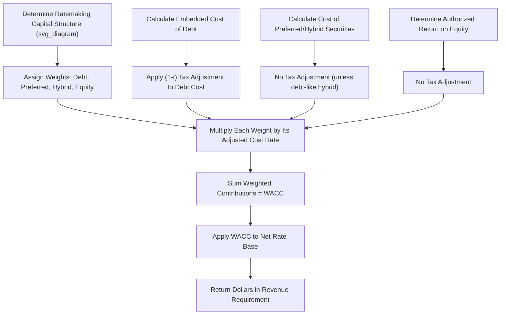

## Weighted Average Cost of Capital (WACC)

### Overview

The Weighted Average Cost of Capital (WACC) is the single blended rate of return applied to a regulated utility's rate base to determine the overall dollar return included in the revenue requirement. It synthesizes the three (or four, when hybrids are present) individual capital component costs — long-term debt, preferred/hybrid securities, and common equity — into one rate, weighted by each component's proportion of the total ratemaking capital structure. WACC is the capstone calculation that draws together capital structure determination, embedded cost of debt, cost of preferred/hybrids, and the authorized return on equity into a single number with direct, dollar-for-dollar revenue requirement impact.

### Core Formula

$$r_{WACC} = w_d \times r_d \times (1-t) + w_p \times r_p + w_h \times r_h + w_e \times r_e$$

Where:

- $w_d, w_p, w_h, w_e$ = the capital structure weights (percentages of total capital) for debt, preferred, hybrid, and common equity respectively, summing to 100%
- $r_d$ = embedded cost of long-term debt
- $r_p$ = cost of preferred stock
- $r_h$ = cost of hybrid securities (tax treatment depends on classification)
- $r_e$ = authorized return on common equity (ROE)
- $t$ = effective composite tax rate (federal plus applicable state)

For a simpler capital structure without hybrids:

$$r_{WACC} = w_d \times r_d \times (1-t) + w_p \times r_p + w_e \times r_e$$

### Why the Tax Adjustment Applies Only to Debt

**Key Points**

- Interest paid on debt is a tax-deductible expense to the utility, so the **after-tax cost** of debt to the company is lower than the stated/effective rate — but because regulatory revenue requirement models typically build in a **separate income tax expense line** already reflecting the tax deduction for interest, the debt component in the WACC calculation is grossed down by $(1-t)$ to avoid double-counting the tax benefit
- Preferred dividends and common equity returns are paid from after-tax income and are not tax-deductible, so no such adjustment applies to those components — they enter the WACC at their full pre-tax cost rate
- This asymmetry is why the tax rate assumption ($t$) is a critical, sometimes contested, input to the WACC calculation, and why the choice of statutory vs. effective composite tax rate can matter

### Step-by-Step Worked Example

**Step 1 — Capital Structure and Component Costs**

| Component | Weight | Cost Rate | Tax Adjustment |
| --- | --- | --- | --- |
| Long-term debt | 45% | 4.591% | $(1 - 0.21) = 0.79$ |
| Preferred stock | 5% | 6.224% | None |
| Common equity | 50% | 9.800% | None |

**Step 2 — Compute Each Weighted, Tax-Adjusted Contribution**

Debt contribution:

$$0.45 \times 4.591\% \times 0.79 \approx 0.45 \times 3.627\% \approx 1.632\%$$

Preferred contribution:

$$0.05 \times 6.224\% \approx 0.311\%$$

Common equity contribution:

$$0.50 \times 9.800\% \approx 4.900\%$$

**Step 3 — Sum the Contributions**

$$r_{WACC} = 1.632\% + 0.311\% + 4.900\% = 6.843\%$$

**Output**

| Component | Weight | Cost Rate | After-Tax Adjustment | Weighted Contribution |
| --- | --- | --- | --- | --- |
| Long-term debt | 45% | 4.591% | ×0.79 | 1.632% |
| Preferred stock | 5% | 6.224% | None | 0.311% |
| Common equity | 50% | 9.800% | None | 4.900% |
| **Total WACC** | **100%** | — | — | **6.843%** |

### Applying WACC to Derive the Revenue Requirement Return Component

Once $r_{WACC}$ is established, it is applied to net rate base to derive the return dollars included in the revenue requirement:

$$Return\ Dollars = RB_{net} \times r_{WACC}$$

**Example**

If net rate base is $2,000,000,000:

$$2{,}000{,}000{,}000 \times 6.843\% = 136{,}860{,}000$$

This $136.86 million represents the total dollar return the utility is authorized to collect from ratepayers to compensate all capital providers (debtholders, preferred holders, and shareholders) for the capital invested in used-and-useful utility plant.

### Grossed-Up WACC for Revenue Requirement Modeling (Alternative Presentation)

**Key Points**

- Some rate case models present a **"pre-tax" or "grossed-up" WACC** that folds the income tax expense associated with earning the equity and preferred return directly into a single composite rate, rather than showing income tax as a separate line item
- This grossed-up approach recognizes that the equity and preferred returns must be "grossed up" for the utility to have enough after-tax income to actually pay those returns, since corporate income tax must be paid on the earnings that fund equity and preferred distributions

**Gross-Up Formula for the Equity and Preferred Layers**

$$r_{e,grossed-up} = \frac{r_e}{(1-t)}$$

**Example**

Using the 9.80% equity cost and 21% tax rate:

$$\frac{9.80\%}{1 - 0.21} = \frac{9.80\%}{0.79} \approx 12.405\%$$

A grossed-up pre-tax WACC would then combine the debt component (at its ungrossed after-tax-adjusted rate) with the grossed-up equity and preferred components — this presentation yields a mathematically equivalent revenue requirement to the standard approach but changes how income taxes appear in the model (embedded in the rate vs. shown as a separate expense line).

[Inference] Whether a jurisdiction uses the standard WACC-plus-separate-tax-expense approach or the grossed-up pre-tax WACC presentation is a matter of established filing convention or commission rule; both are mathematically reconcilable to the same total revenue requirement when applied consistently, so the choice is presentational rather than substantive, provided no double-counting or omission of the tax gross-up occurs.

### Sensitivity of Revenue Requirement to WACC Components

**Key Points**

- Because common equity typically represents the largest share of the capital structure and carries the highest cost rate, **ROE determination has the largest single dollar impact** on the revenue requirement among the WACC inputs, making it the most heavily litigated component in most rate cases
- Small changes in the **equity ratio** (e.g., 50% vs. 52% equity) can have a larger revenue requirement impact than seemingly larger percentage-point changes in the embedded cost of debt, because of the higher cost differential between debt and equity
- The tax rate ($t$) used in the debt tax adjustment also affects the overall WACC; a lower statutory tax rate (as under TCJA) reduces the value of the debt tax shield, slightly increasing the after-tax cost contribution from debt, all else equal

**Illustrative Sensitivity Table**

| Scenario | Equity Weight | ROE | Resulting WACC | Return Dollars (on $2B Rate Base) |
| --- | --- | --- | --- | --- |
| Base case | 50% | 9.80% | 6.843% | $136.86M |
| +2% equity ratio | 52% | 9.80% | ~6.94% | ~$138.8M |
| +50 bps ROE | 50% | 10.30% | ~7.09% | ~$141.9M |
| -50 bps cost of debt | 45% | 9.80% | ~6.66% | ~$133.2M |

[Unverified] The precise sensitivity magnitudes depend on the specific capital structure and cost rates in a given proceeding; the table above illustrates general directional relationships rather than universally applicable figures.

### Mermaid Diagram — WACC Assembly Process (svg_diagram)

### SVG Illustration — WACC Waterfall Contribution

<svg xmlns="http://www.w3.org/2000/svg" viewBox="0 0 720 320" font-family="Helvetica, Arial, sans-serif">
<text x="360" y="22" text-anchor="middle" font-size="15" font-weight="bold" fill="#1a1a1a">WACC Buildup: Weighted Contributions by Component (svg_diagram)</text>
<line x1="60" y1="270" x2="670" y2="270" stroke="#333" stroke-width="1.5" />
<line x1="60" y1="270" x2="60" y2="50" stroke="#333" stroke-width="1.5" />
<text x="30" y="160" text-anchor="middle" font-size="11" fill="#333" transform="rotate(-90 30 160)">Cumulative Rate Contribution (%)</text>

<rect x="100" y="238" width="90" height="32" fill="#5a9e6f" stroke="#2f5c3c" />
<text x="145" y="258" text-anchor="middle" font-size="10" fill="#fff">Debt 1.63%</text>

<rect x="100" y="222" width="90" height="16" fill="#b5762c" stroke="#6b4a1a" />
<text x="145" y="234" text-anchor="middle" font-size="9" fill="#fff">Pref 0.31%</text>

<rect x="100" y="80" width="90" height="142" fill="#3b6ea5" stroke="#1f3a5f" />
<text x="145" y="155" text-anchor="middle" font-size="11" fill="#fff">Equity</text>
<text x="145" y="172" text-anchor="middle" font-size="11" fill="#fff">4.90%</text>

<line x1="250" y1="80" x2="620" y2="80" stroke="#8a1f1f" stroke-width="1.5" stroke-dasharray="5,4" />
<text x="440" y="70" text-anchor="middle" font-size="12" fill="#8a1f1f" font-weight="bold">Total WACC = 6.843%</text>
<rect x="250" y="80" width="90" height="190" fill="none" stroke="#8a1f1f" stroke-width="2" stroke-dasharray="4,3" />
<text x="295" y="200" text-anchor="middle" font-size="10" fill="#8a1f1f">Sum of All</text>
<text x="295" y="214" text-anchor="middle" font-size="10" fill="#8a1f1f">Components</text>
</svg>

### Common Presentation Variants Across Jurisdictions

**Key Points**

- **State commission rate cases**: WACC is typically shown as a single blended after-tax rate applied to rate base, with income tax expense shown separately in the revenue requirement build-up
- **FERC-jurisdictional utilities** (transmission owners, formula rate filings): often present a similar WACC framework but may use FERC-specific tax adjustment conventions, including treatment of any Accumulated Deferred Income Tax (ADIT) offsets to rate base, consistent with FERC's income tax allowance policies
- **Formula rate/annual update mechanisms**: WACC components (particularly the embedded cost of debt) may be updated annually using a defined methodology, without requiring a full litigated rate case, depending on the applicable tariff or formula rate protocol

### Common Pitfalls in Practice

**Key Points**

- Applying the $(1-t)$ tax adjustment to preferred stock or common equity by mistake, which understates their contribution to WACC
- Using inconsistent capital structure weights between the cost-of-equity proxy group analysis and the actual WACC calculation, creating an internal mismatch between the assumed financial risk and the authorized return
- Failing to reconcile a "grossed-up" pre-tax WACC presentation with the separate income tax expense line in the revenue requirement, risking double-counting or omission of the tax gross-up
- Using a stale or unadjusted tax rate assumption after a statutory tax rate change (e.g., post-TCJA), which can materially distort the after-tax cost of debt contribution
- Treating WACC as a static, uncontested figure — while the arithmetic is mechanical, every underlying input (capital structure, embedded cost of debt, cost of preferred, and especially ROE) can be independently litigated, so the "same" WACC formula can produce very different authorized returns across cases

### Related Topics

- Determining the Ratemaking Capital Structure
- Embedded Cost of Long Term Debt
- Cost of Preferred and Hybrid Securities
- Return on Equity (ROE) Estimation Methods (DCF, CAPM, Risk Premium)
- Double Leverage Theory and Regulatory Treatment
- Flow Through vs. Normalization Accounting (tax rate interaction with WACC)
- Grossed-Up Pre-Tax Revenue Requirement Modeling
- FERC Formula Rate Mechanisms and Annual WACC Updates
- Allowance for Funds Used During Construction (AFUDC) Mechanics
- Rate Base Determination and Used-and-Useful Standards