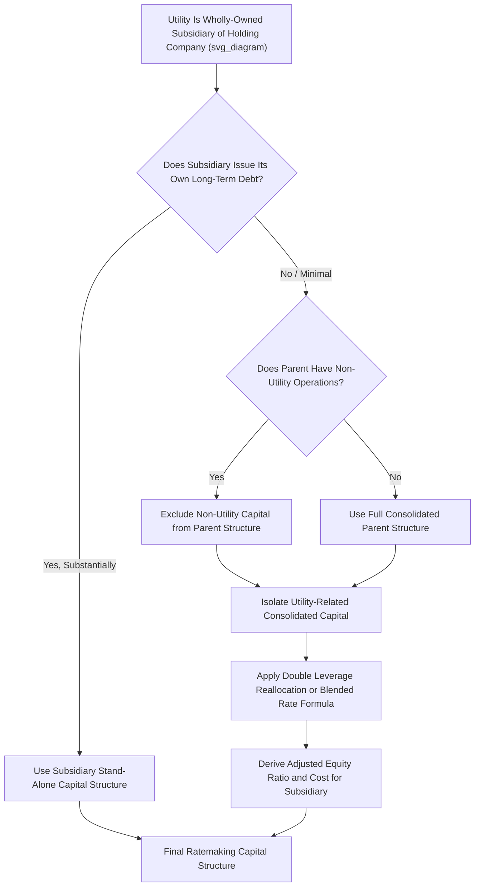

## Double Leverage and Holding Company Capital Structure Issues

### Overview

Double leverage refers to the practice by which a utility holding company issues its own debt at the parent level and downstreams the proceeds — combined with parent equity — as an equity investment in a regulated operating subsidiary. This creates a mismatch between the subsidiary's stand-alone balance sheet (which may show a healthy, mostly equity-funded capital structure) and the true consolidated funding reality (where a portion of that "equity" is actually financed by parent-level debt). Because regulators generally seek to set rates based on the true cost of capital actually supporting utility operations, double leverage raises persistent and often contentious ratemaking questions distinct from — but closely related to — the general capital structure determination.

### The Double Leverage Problem, Conceptually

**Key Points**

- Consider a holding company with a consolidated structure of 40% debt and 60% equity. If it invests $600 million entirely as common equity in its utility subsidiary, the subsidiary's stand-alone books show 100% equity funding for that investment — even though, from a consolidated perspective, 40% of the capital actually originated as parent debt
- If the subsidiary's stand-alone capital structure is used **without adjustment** in a rate case, ratepayers would pay the full common equity return on the entire $600 million, even though the parent itself is paying a much lower debt-level cost of capital on 40% of that funding
- This can result in the utility (and ultimately its parent's shareholders) earning a **return premium** — the spread between the equity return collected from ratepayers and the blended (partially debt-financed) actual cost of that capital to the parent — which is the central ratepayer-protection concern that double leverage adjustments are designed to address

### Structural Preconditions for Double Leverage to Arise

**Key Points**

- The utility must be a **wholly owned (or majority-owned) subsidiary** of a holding company, rather than a stand-alone, independently traded utility
- The parent holding company must itself issue **debt or preferred securities** at the parent level (as opposed to funding all subsidiary investments purely from retained earnings or new common stock issuances)
- The subsidiary typically does **not issue securities directly** into public markets on a scale sufficient to establish a fully independent, market-tested capital structure — though many utility subsidiaries do issue their own long-term debt directly, even while remaining wholly owned

### Double Leverage Adjustment Methodology

#### Basic Formula

The standard double leverage adjustment reallocates the parent's capital structure proportionally onto the equity investment made in the subsidiary:

$$Equity_{adjusted} = Equity_{subsidiary,\ stand-alone} \times \frac{Common\ Equity_{parent}}{Total\ Capital_{parent}}$$

$$Imputed\ Debt = Equity_{subsidiary,\ stand-alone} \times \frac{Debt_{parent}}{Total\ Capital_{parent}}$$

The subsidiary's ratemaking capital structure is then reconstructed using this imputed, adjusted mix rather than its stand-alone book equity balance.

#### Blended Cost of Equity Approach (Alternative Presentation)

Rather than reallocating the balance sheet weights directly, some approaches instead compute a **blended cost rate** applied to the subsidiary's stand-alone equity balance, reflecting the parent's actual funding mix:

$$r_{e,blended} = \left(\frac{Debt_{parent}}{Total\ Capital_{parent}}\right) \times r_{d,parent} + \left(\frac{Equity_{parent}}{Total\ Capital_{parent}}\right) \times r_{e,parent}$$

**Worked Example**

Parent consolidated structure: 35% debt at 5.5% cost, 65% equity at 10.5% cost. Subsidiary shows $800 million in stand-alone common equity funding its rate base.

**Balance Reallocation Approach**

$$Equity_{adjusted} = 800{,}000{,}000 \times 0.65 = 520{,}000{,}000$$

$$Imputed\ Debt = 800{,}000{,}000 \times 0.35 = 280{,}000{,}000$$

**Blended Rate Approach**

$$r_{e,blended} = 0.35 \times 5.5\% + 0.65 \times 10.5\% = 1.925\% + 6.825\% = 8.75\%$$

**Output**

| Approach | Result |
| --- | --- |
| Stand-alone (no adjustment) | $800M equity earning full 10.5% |
| Double leverage — reallocation | $520M equity (10.5%) + $280M imputed debt (5.5%) |
| Double leverage — blended rate | $800M equity earning blended 8.75% |

[Inference] The reallocation and blended-rate approaches are mathematically similar in effect but can diverge slightly depending on how the resulting figures are then integrated into the subsidiary's overall capital structure (i.e., whether the imputed debt layer also affects the debt weight used for the tax-adjustment calculation); the specific mechanical integration method varies by jurisdiction and by the specific order or testimony framework applied in a given case.

### Arguments For and Against Double Leverage Adjustments

**Key Points — Arguments in Favor**

- Prevents ratepayers from paying a full equity return on capital that is, in economic substance, partially debt-financed at the parent level
- Aligns the regulatory cost of capital more closely with the true blended cost of the funds actually deployed into utility rate base
- Discourages holding companies from using upstream leverage strategically to shift risk to the regulated subsidiary while capturing equity-level returns at the parent

**Key Points — Arguments Against**

- The subsidiary's own operations bear its own **business and financial risk** independent of how the parent chooses to finance its investment; critics argue the subsidiary's equity holders (i.e., the parent, in its capacity as sole shareholder) should be compensated based on the subsidiary's own risk profile, not the parent's financing choices
- Double leverage can understate the return needed to maintain the subsidiary's own credit quality and access to capital, particularly if the subsidiary must itself issue debt or attract equity investment (e.g., in a future stock or asset sale) at market rates reflecting its own risk
- Some critics argue the adjustment inappropriately conflates **financing structure** with **cost of capital**, since a parent's decision to use debt for its holding company investment does not necessarily reduce the actual risk borne by the operating subsidiary
- [Inference] The prevailing view on whether double leverage should apply, and how mechanically, differs across state commissions and has evolved over time with changes in holding company structures and financing practices; there is no single national consensus, so this determination is genuinely unsettled and case-specific rather than a matter of established uniform doctrine.

### Mitigating Factors and Common Exceptions

**Key Points**

- **Direct subsidiary debt issuance**: If the utility subsidiary issues its own long-term debt directly (rather than relying solely on parent equity infusions), commissions often use the subsidiary's own actual capital structure rather than a fully double-leveraged parent-based structure, since the subsidiary has established independent market-based financing
- **Investment grade stand-alone credit rating**: If the subsidiary carries its own credit rating from agencies based on stand-alone financial metrics, this is sometimes viewed as evidence that the subsidiary's capital structure is independently reasonable, reducing the case for a double leverage adjustment
- **Non-utility parent operations**: When a parent holding company has substantial non-utility business lines (e.g., unregulated generation, non-utility investments), commissions often adjust the parent's consolidated capital structure to **exclude non-utility assets and their associated financing** before applying any double leverage calculation, to avoid contaminating the utility's ratemaking capital structure with risk and financing attributable to unrelated businesses

### Non-Utility Asset Exclusion Adjustment

When a parent has diversified operations, the double leverage calculation typically requires first isolating the **utility-related** portion of consolidated capital:

$$Capital_{utility-related} = Capital_{consolidated} - Capital_{allocated\ to\ non-utility\ operations}$$

**Example**

A parent has $2,000,000,000 in total consolidated capital, of which $300,000,000 is attributable to an unregulated non-utility subsidiary (e.g., a competitive energy marketing arm). The double leverage calculation would typically be performed only on the remaining $1,700,000,000 utility-related capital base, isolating the relevant debt/equity ratios from that subset rather than the full consolidated balance sheet.

[Unverified] The specific methodology for allocating consolidated capital between utility and non-utility operations (e.g., by net asset value, by revenue, by a negotiated settlement formula) varies significantly by case and is often a contested analytical exercise in its own right.

### Mermaid Diagram — Double Leverage Analytical Flow (svg_diagram)

### SVG Illustration — Double Leverage Fund Flow

<svg xmlns="http://www.w3.org/2000/svg" viewBox="0 0 720 320" font-family="Helvetica, Arial, sans-serif">
<text x="360" y="22" text-anchor="middle" font-size="15" font-weight="bold" fill="#1a1a1a">Double Leverage: Parent Financing Flowing to Subsidiary (svg_diagram)</text>

<rect x="270" y="50" width="180" height="80" fill="#3b6ea5" stroke="#1f3a5f" rx="4" />
<text x="360" y="80" text-anchor="middle" font-size="12" fill="#fff" font-weight="bold">Holding Company</text>
<text x="360" y="98" text-anchor="middle" font-size="10" fill="#fff">35% Parent Debt (5.5%)</text>
<text x="360" y="114" text-anchor="middle" font-size="10" fill="#fff">65% Parent Equity (10.5%)</text>
<path d="M 360 130 L 360 175" stroke="#333" stroke-width="2" marker-end="url(#arrow2)" />
<text x="410" y="155" font-size="10" fill="#333">$800M as</text>
<text x="410" y="168" font-size="10" fill="#333">"equity" investment</text>

<rect x="270" y="180" width="180" height="80" fill="#5a9e6f" stroke="#2f5c3c" rx="4" />
<text x="360" y="205" text-anchor="middle" font-size="12" fill="#fff" font-weight="bold">Utility Subsidiary</text>
<text x="360" y="223" text-anchor="middle" font-size="10" fill="#fff">Books show: 100% Equity</text>
<text x="360" y="239" text-anchor="middle" font-size="10" fill="#fff">Adjusted: 35% Imputed Debt</text>
<text x="360" y="253" text-anchor="middle" font-size="10" fill="#fff">+ 65% True Equity</text>

<text x="580" y="200" font-size="10" fill="`#8a1f1f`">Ratemaking should</text>

<text x="580" y="214" font-size="10" fill="`#8a1f1f`">reflect the true</text>

<text x="580" y="228" font-size="10" fill="`#8a1f1f`">blended funding mix,</text>

<text x="580" y="242" font-size="10" fill="`#8a1f1f`">not the stand-alone</text>

<text x="580" y="256" font-size="10" fill="`#8a1f1f`">book presentation</text>

</svg>

### Interaction with Cost of Equity Analysis

**Key Points**

- Double leverage adjustments are separate from, but interact with, the **cost of equity (ROE) estimation** — the ROE derived from a proxy group of comparable publicly traded utilities is typically applied to the subsidiary's adjusted equity layer, regardless of whether a double leverage reallocation has been performed
- A potential internal inconsistency arises if the proxy group used for ROE estimation consists of stand-alone or lightly-leveraged holding companies while the subject utility's capital structure is adjusted downward for double leverage — analysts and commissions must ensure the risk profile embedded in the ROE proxy group is reasonably consistent with the capital structure actually being used to weight that return

### Common Pitfalls in Practice

**Key Points**

- Applying a double leverage adjustment mechanically without considering whether the subsidiary has substantial independent debt issuance that would make the stand-alone structure more appropriate
- Failing to exclude non-utility parent operations before performing the double leverage calculation, which can improperly import unrelated business risk and financing into the utility's ratemaking capital structure
- Using a stale parent consolidated capital structure that does not reflect recent parent-level financing changes (e.g., a recent equity issuance or debt retirement at the holding company level)
- Overlooking the interaction between double leverage adjustments and the risk profile assumed in the ROE proxy group analysis, creating an inconsistent overall cost of capital
- Treating double leverage as a settled, universally applied doctrine rather than a jurisdiction-specific and fact-specific determination that varies considerably across state commissions

### Related Topics

- Determining the Ratemaking Capital Structure
- Weighted Average Cost of Capital (WACC) Calculation Methodology
- Return on Equity (ROE) Estimation Methods (DCF, CAPM, Risk Premium)
- Proxy Group Selection for Cost of Capital Analysis
- Embedded Cost of Long Term Debt
- Cost of Preferred and Hybrid Securities
- Non-Utility Asset Allocation and Cost Allocation Methodologies
- Credit Rating Agency Metrics and Regulatory Capital Structure Benchmarks
- Holding Company Financing Structures and Affiliate Transaction Rules
- Ring-Fencing Provisions and Utility Subsidiary Financial Independence