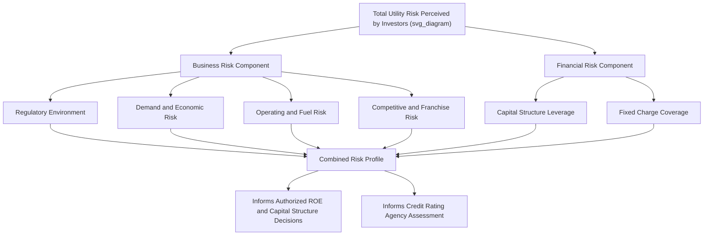

## Business Risk vs. Financial Risk

### Overview

Business risk and financial risk are the two fundamental categories of risk that together determine the overall risk profile investors assign to a utility, and by extension, the return on equity and capital structure that regulators find reasonable. Distinguishing between them is essential in cost-of-capital analysis: business risk arises from the nature of the utility's operations and regulatory environment, while financial risk arises from how those operations are financed (the degree of leverage employed). Regulators, utility witnesses, and intervenors routinely invoke this distinction when evaluating proxy group comparability, capital structure reasonableness, and the overall authorized ROE.

### Defining Business Risk

**Key Points**

- Business risk is the variability in a utility's **operating income and cash flows** arising from factors unrelated to how the company is financed — it would exist even if the utility were financed entirely with equity
- Business risk is largely a function of the **regulatory and operating environment**, not managerial financing choices, though management's operational decisions (e.g., fuel mix, service territory diversification) can influence it

#### Components of Business Risk

**Key Points**

- **Regulatory risk**: The type of ratemaking mechanism (traditional cost-of-service vs. formula rate vs. performance-based ratemaking), the presence or absence of decoupling or revenue-per-customer mechanisms, the frequency and predictability of rate case outcomes, and the general regulatory relationship and track record in a jurisdiction
- **Demand risk**: Exposure to weather variability, economic cycles, industrial customer concentration, energy efficiency and distributed generation adoption trends that can erode load, and price elasticity of demand
- **Operating risk**: Fuel cost volatility (for utilities without full fuel cost pass-through mechanisms), generation fleet composition (e.g., exposure to commodity-sensitive generation vs. regulated wires-only operations), aging infrastructure and reliability risk, and exposure to wildfire, storm, or other catastrophic operational risk
- **Competitive risk**: Exposure to retail choice/competition in restructured markets, franchise renewal risk, and the potential for bypass by large customers (e.g., self-generation)
- **Regulatory lag**: The time delay between when costs are incurred and when they are reflected in rates, which increases earnings volatility and is itself a component of business risk
- **Diversification**: A utility with multiple service territories, customer classes, or regulated business lines (e.g., combined electric and gas operations) may exhibit lower aggregate business risk than a single-service, geographically concentrated utility, all else equal

### Defining Financial Risk

**Key Points**

- Financial risk is the **additional variability in returns to common equity holders** introduced by the use of fixed-obligation financing (debt and preferred stock) in the capital structure — it is entirely a function of financing choices, not operations
- Financial risk arises because fixed charges (interest, preferred dividends) must be paid regardless of operating performance; higher leverage means a larger share of operating income is committed to these fixed obligations before any residual is available to common shareholders, amplifying the variability of what remains
- Financial risk is measurable and controllable by management and regulators (through capital structure decisions), unlike much of business risk which is largely exogenous

#### Financial Leverage Effect on Equity Returns

The relationship can be illustrated by how leverage amplifies the variability of return on equity relative to return on assets (operating return):

$$ROE = ROA + \left(\frac{D}{E}\right) \times (ROA - r_d \times (1-t))$$

Where:

- $ROA$ = return on total assets/capital (reflecting business risk)
- $D/E$ = debt-to-equity ratio (reflecting financial risk/leverage)
- $r_d$ = after-tax cost of debt

**Key Points**

- When $ROA$ exceeds the after-tax cost of debt, leverage **increases** ROE above ROA (positive leverage effect) — but the same mechanism means that when $ROA$ falls below the cost of debt (e.g., in a downturn or after unexpected cost increases), leverage **decreases** ROE by a proportionally larger amount, illustrating how leverage amplifies both upside and downside outcomes
- This amplification effect is why higher-leverage utilities are considered to carry more financial risk even when their underlying business risk (operations) is identical to a lower-leverage peer

**Worked Numeric Example**

Two hypothetical utilities have identical business risk (same ROA of 7%), but different capital structures. After-tax cost of debt is assumed at 4%.

| Utility | Debt/Equity | ROA | Leverage Effect | Resulting ROE |
| --- | --- | --- | --- | --- |
| Utility A (Low Leverage) | 0.50 | 7% | $0.50 \times (7\% - 4\%) = 1.5\%$ | 8.5% |
| Utility B (High Leverage) | 1.50 | 7% | $1.50 \times (7\% - 4\%) = 4.5\%$ | 11.5% |

**Output — Downside Scenario (ROA falls to 3%)**

| Utility | Debt/Equity | ROA | Leverage Effect | Resulting ROE |
| --- | --- | --- | --- | --- |
| Utility A (Low Leverage) | 0.50 | 3% | $0.50 \times (3\% - 4\%) = -0.5\%$ | 2.5% |
| Utility B (High Leverage) | 1.50 | 3% | $1.50 \times (3\% - 4\%) = -1.5\%$ | 1.5% |

This example illustrates that Utility B's ROE swings much more dramatically (from 11.5% down to 1.5%, a 10-point swing) than Utility A's (from 8.5% down to 2.5%, a 6-point swing), for the identical underlying change in operating performance — the additional swing is attributable purely to financial risk/leverage, not business risk.

### The Total Risk Framework

**Key Points**

- Investors and rating agencies evaluate **total risk** as the combination of business risk and financial risk — a utility with low business risk can often support higher financial risk (more leverage) while maintaining the same overall credit quality and required equity return, and vice versa
- This is the conceptual basis for why regulators generally tie capital structure and ROE determinations together: a lower-risk utility (low business risk) might reasonably be allowed a somewhat higher equity ratio without harming credit quality, while accepting a somewhat lower ROE, whereas a higher-business-risk utility might warrant a stronger (more equity-heavy) capital structure specifically to offset that risk and preserve investment-grade credit metrics
- Credit rating agencies formalize this trade-off through their utility rating methodologies (e.g., S&P's business risk/financial risk matrix), which map a combination of business risk profile and financial risk profile (based on credit metrics like funds-from-operations-to-debt) to an implied credit rating

### Illustrative Risk Matrix Concept

|  | Low Financial Risk (Conservative Leverage) | High Financial Risk (Aggressive Leverage) |
| --- | --- | --- |
| **Low Business Risk** (e.g., wires-only, decoupled, stable T&D utility) | Strongest credit profile | Moderate/strong credit profile |
| **High Business Risk** (e.g., competitive generation, high storm/wildfire exposure) | Moderate/strong credit profile | Weakest credit profile |

[Inference] This matrix is a conceptual simplification; actual credit rating agency methodologies incorporate numerous quantitative and qualitative factors beyond this two-axis framework, including specific financial ratio thresholds, regulatory jurisdiction assessments, and company-specific qualitative overlays, so it should be understood as illustrative rather than a precise replication of any specific rating methodology.

### Application in Rate Case Testimony

**Key Points**

- **Proxy group selection for ROE analysis**: Analysts screen comparable companies to ensure similar business risk (e.g., similar regulatory jurisdictions, similar generation/wires mix, similar customer class composition) so that the resulting cost of equity estimate reflects comparable risk to the subject utility
- **Capital structure reasonableness arguments**: A utility may argue for a higher equity ratio by pointing to elevated business risk factors (e.g., wildfire exposure, high capital expenditure programs, weak service territory economic growth) that justify additional equity cushion to preserve financial flexibility and credit quality
- **ROE adjustments for risk differences**: When a utility's business risk is judged to differ from its proxy group (e.g., smaller company size, different regulatory jurisdiction risk, different generation mix), analysts sometimes apply upward or downward adjustments to the raw model-derived cost of equity to account for this differential risk
- Business risk factors are often cited to justify **specific ratemaking mechanisms** (e.g., forward test years, decoupling, cost trackers) intended to reduce regulatory lag and demand-related business risk, which in turn can be used to argue for a correspondingly lower authorized ROE, since risk-reducing mechanisms and required return are conceptually linked

### Mermaid Diagram — Business Risk and Financial Risk Interaction (svg_diagram)

### SVG Illustration — Leverage Amplification Effect on ROE

<svg xmlns="http://www.w3.org/2000/svg" viewBox="0 0 720 320" font-family="Helvetica, Arial, sans-serif">
<text x="360" y="22" text-anchor="middle" font-size="15" font-weight="bold" fill="#1a1a1a">Financial Leverage Amplifies ROE Volatility (svg_diagram)</text>
<line x1="80" y1="270" x2="640" y2="270" stroke="#333" stroke-width="1.5" />
<line x1="80" y1="270" x2="80" y2="50" stroke="#333" stroke-width="1.5" />
<text x="360" y="295" text-anchor="middle" font-size="11" fill="#333">Scenario: Strong ROA (7%) vs. Weak ROA (3%)</text>
<text x="40" y="160" text-anchor="middle" font-size="11" fill="#333" transform="rotate(-90 40 160)">Resulting ROE (%)</text>

<rect x="150" y="130" width="60" height="140" fill="#3b6ea5" stroke="#1f3a5f" />
<text x="180" y="122" text-anchor="middle" font-size="10" fill="#333">8.5%</text>
<text x="180" y="290" text-anchor="middle" font-size="10" fill="#333">A: Strong</text>
<rect x="220" y="234" width="60" height="36" fill="#a9c4de" stroke="#1f3a5f" />
<text x="250" y="226" text-anchor="middle" font-size="10" fill="#333">2.5%</text>
<text x="250" y="290" text-anchor="middle" font-size="10" fill="#333">A: Weak</text>

<rect x="380" y="90" width="60" height="180" fill="#b5762c" stroke="#6b4a1a" />
<text x="410" y="82" text-anchor="middle" font-size="10" fill="#333">11.5%</text>
<text x="410" y="290" text-anchor="middle" font-size="10" fill="#333">B: Strong</text>
<rect x="450" y="248" width="60" height="22" fill="#e8c48f" stroke="#6b4a1a" />
<text x="480" y="240" text-anchor="middle" font-size="10" fill="#333">1.5%</text>
<text x="480" y="290" text-anchor="middle" font-size="10" fill="#333">B: Weak</text>

<text x="360" y="45" text-anchor="middle" font-size="10" fill="#555">Utility B (higher leverage) swings further in both directions</text>

</svg>

### Comparative Summary Table

| Feature | Business Risk | Financial Risk |
| --- | --- | --- |
| Source | Operations, regulation, demand, competition | Capital structure/leverage choices |
| Controllable by management? | Partially (operational choices) | Yes (financing decisions) |
| Controllable by regulator? | Partially (ratemaking mechanism design) | Yes (approved capital structure) |
| Exists with 100% equity financing? | Yes | No |
| Primary analytical tool | Proxy group screening, regulatory jurisdiction assessment | Capital structure analysis, coverage ratios |
| Rating agency lens | Business risk profile assessment | Financial risk profile assessment (credit metrics) |

### Common Pitfalls in Practice

**Key Points**

- Conflating business risk and financial risk when selecting a proxy group — including companies with materially different leverage (financial risk) without adjustment can distort the resulting cost of equity estimate even if business risk is comparable
- Assuming that a lower authorized equity ratio is always appropriate for "safe" utilities without considering whether elevated business risk factors (e.g., wildfire exposure, weak economic growth in service territory) justify a stronger capital structure
- Treating regulatory mechanisms that reduce business risk (e.g., decoupling, trackers) as automatically warranting an ROE reduction without a rigorous, case-specific analysis of the actual risk-reduction magnitude
- Ignoring the leverage amplification effect when comparing ROE outcomes across utilities with different capital structures, which can lead to inappropriate "apples to oranges" comparisons of authorized returns

### Related Topics

- Determining the Ratemaking Capital Structure
- Return on Equity (ROE) Estimation Methods (DCF, CAPM, Risk Premium)
- Proxy Group Selection for Cost of Capital Analysis
- Double Leverage Theory and Regulatory Treatment
- Credit Rating Agency Business Risk/Financial Risk Methodology
- Regulatory Lag and Its Effect on Earned vs. Authorized Returns
- Decoupling and Revenue Stabilization Mechanisms
- Weighted Average Cost of Capital (WACC) Calculation Methodology
- Performance-Based Ratemaking and Risk-Reward Mechanisms
- Wildfire and Catastrophic Event Risk in Utility Cost of Capital