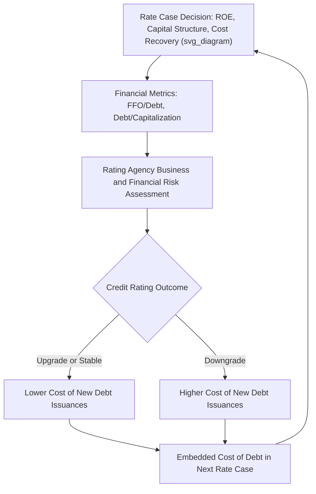

## Credit Ratings and Capital Market Access

### Overview

Credit ratings assigned by nationally recognized statistical rating organizations (S&P Global Ratings, Moody's Investors Service, and Fitch Ratings) are a central input and output in utility cost-of-capital regulation. Ratings both reflect the outcome of regulatory decisions (capital structure, ROE, cost recovery mechanisms) and simultaneously determine the utility's actual cost and availability of capital, creating a feedback loop that regulators, utilities, and financial analysts must navigate carefully in rate case proceedings.

### Why Credit Ratings Matter to Ratemaking

**Key Points**

- A utility's credit rating directly determines its **embedded cost of debt** on new issuances — lower-rated utilities pay higher coupon rates, which flows through to ratepayers via the embedded cost of debt schedule
- Regulatory commissions have a general obligation (rooted in constitutional and statutory principles established in cases such as *Bluefield Water Works* and *Hope Natural Gas*) to authorize a return sufficient to maintain the utility's financial integrity and **ability to attract capital on reasonable terms** — credit ratings serve as an observable, market-validated proxy for whether this standard is being met
- Rating agency methodologies explicitly incorporate assessments of the **regulatory environment's supportiveness**, meaning commission decisions on ROE, capital structure, and cost recovery mechanisms are themselves inputs that rating agencies evaluate when assigning or changing a rating — creating a direct, often-cited linkage between rate case outcomes and subsequent credit metrics

### Rating Agency Methodology Components

#### Business Risk Assessment

**Key Points**

- Rating agencies assess the **regulatory framework** (supportiveness, predictability, cost recovery timeliness), the **competitive position** (service territory economics, customer concentration, generation mix), and **operating risk** (fuel diversity, capital expenditure intensity, exposure to catastrophic events such as wildfires or storms)
- S&P's methodology, for example, evaluates a **regulatory advantage** score combined with an assessment of the "CICRA" (Competitive Position and Industry Risk) factors to derive an overall business risk profile category
- Utilities operating in jurisdictions with mechanisms that reduce regulatory lag (forward test years, formula rates, decoupling, riders/trackers for major cost categories) generally receive more favorable business risk assessments, all else equal

#### Financial Risk Assessment

**Key Points**

- Financial risk is assessed primarily through **credit metrics** derived from financial statements, most importantly ratios such as **Funds From Operations (FFO) to Total Debt** and **Debt to EBITDA** or **Debt to Total Capitalization**
- Common threshold ranges (illustrative, agency- and methodology-version-specific) distinguish financial risk categories:

| Financial Risk Category (Illustrative) | FFO/Debt Range |
| --- | --- |
| Minimal | Above 60% |
| Modest | 45%–60% |
| Intermediate | 30%–45% |
| Significant | 20%–30% |
| Aggressive | 12%–20% |
| Highly Leveraged | Below 12% |

[Unverified] Exact threshold percentages and category labels differ across rating agencies and are periodically revised as methodologies are updated; the ranges above illustrate the general concept of tiered financial risk categorization rather than a specific, currently binding agency table, and current published agency criteria should be consulted for precise, up-to-date thresholds.

#### Combined Rating Determination

The business risk profile and financial risk profile are combined (often via a matrix approach) to derive an anchor credit rating, which may then be adjusted for company-specific qualitative factors (management quality, financial policy, liquidity, parent/subsidiary linkage considerations, and specific event risk).

### FFO-to-Debt Calculation Example

$$FFO = Net\ Income + Depreciation\ \&\ Amortization + Deferred\ Taxes + Other\ Non-Cash\ Items$$

$$FFO/Debt = \frac{FFO}{Total\ Debt}$$

**Worked Example**

A utility reports:

- Net income: $150,000,000
- Depreciation & amortization: $220,000,000
- Deferred tax provision (net): $60,000,000
- Total debt: $1,800,000,000

$$FFO = 150{,}000{,}000 + 220{,}000{,}000 + 60{,}000{,}000 = 430{,}000{,}000$$

$$FFO/Debt = \frac{430{,}000{,}000}{1{,}800{,}000{,}000} \approx 23.9\%$$

**Output**

| Metric | Value | Illustrative Category |
| --- | --- | --- |
| FFO | $430,000,000 | — |
| Total Debt | $1,800,000,000 | — |
| FFO/Debt | ~23.9% | Significant financial risk (illustrative) |

[Inference] This single ratio would not, by itself, determine a rating; agencies weigh it alongside other metrics, qualitative factors, and the business risk assessment, and typically evaluate a multi-year trend rather than a single test-year snapshot.

### Deferred Taxes and ADIT's Effect on Credit Metrics

**Key Points**

- Because deferred tax provisions are added back to net income in calculating FFO (as a non-cash item), the choice between **normalization and flow through** accounting (see the related chapter topic) has a direct effect on reported FFO and therefore on FFO/Debt ratios
- Normalization, by deferring cash tax payments and building an ADIT reserve, tends to **improve near-term FFO and cash flow metrics** relative to flow through, all else equal, because the utility retains cash that would otherwise be paid currently as taxes — this is one of the reasons normalization is often viewed as credit-supportive in addition to being the mandatory tax-compliant method for depreciation-related timing differences

### The Rate Case Feedback Loop

**Key Points**

- **Regulatory input to credit assessment**: Every major rate case decision (authorized ROE, approved equity ratio, treatment of major cost items, approval or denial of trackers/riders) is scrutinized by rating agencies as evidence of the jurisdiction's regulatory supportiveness
- **Credit rating as evidence in rate cases**: Utility witnesses frequently introduce credit rating agency reports and methodology excerpts as evidence supporting requested ROE and capital structure levels, arguing that inadequate authorized returns will lead to credit deterioration, higher embedded borrowing costs, and ultimately higher costs to ratepayers over time
- **Downgrade cost spiral concern**: A cited concern in utility testimony is that insufficient authorized returns can trigger a rating downgrade, which raises the utility's cost of new debt, which in turn increases the revenue requirement in future rate cases — utilities often argue this makes maintaining adequate credit quality a ratepayer interest, not merely a shareholder interest

### Mermaid Diagram — Credit Rating and Rate Case Feedback Loop (svg_diagram)

### SVG Illustration — Rating Agency Methodology Framework

<svg xmlns="http://www.w3.org/2000/svg" viewBox="0 0 720 320" font-family="Helvetica, Arial, sans-serif">
<text x="360" y="22" text-anchor="middle" font-size="15" font-weight="bold" fill="#1a1a1a">Credit Rating Methodology Framework (svg_diagram)</text>
<rect x="60" y="60" width="260" height="180" fill="#eef4fb" stroke="#3b6ea5" stroke-width="1.5" rx="6" />
<text x="190" y="85" text-anchor="middle" font-size="13" font-weight="bold" fill="#1f3a5f">Business Risk Profile</text>
<text x="80" y="112" font-size="11" fill="#333">• Regulatory framework support</text>
<text x="80" y="132" font-size="11" fill="#333">• Competitive position</text>
<text x="80" y="152" font-size="11" fill="#333">• Fuel and generation mix</text>
<text x="80" y="172" font-size="11" fill="#333">• Catastrophic event exposure</text>
<text x="80" y="192" font-size="11" fill="#333">• Cost recovery mechanisms</text>
<text x="80" y="212" font-size="11" fill="#333">• Service territory economics</text>
<rect x="400" y="60" width="260" height="180" fill="#fbf3ea" stroke="#b5762c" stroke-width="1.5" rx="6" />
<text x="530" y="85" text-anchor="middle" font-size="13" font-weight="bold" fill="#6b4a1a">Financial Risk Profile</text>
<text x="420" y="112" font-size="11" fill="#333">• FFO / Total Debt</text>
<text x="420" y="132" font-size="11" fill="#333">• Debt / EBITDA</text>
<text x="420" y="152" font-size="11" fill="#333">• Debt / Total Capitalization</text>
<text x="420" y="172" font-size="11" fill="#333">• Liquidity and coverage</text>
<text x="420" y="192" font-size="11" fill="#333">• Financial policy</text>
<path d="M 320 150 L 400 150" stroke="#333" stroke-width="2" marker-end="url(#arrow3)" />
<text x="360" y="260" text-anchor="middle" font-size="12" font-weight="bold" fill="#8a1f1f">Combined = Anchor Credit Rating</text>
</svg>

### Capital Market Access Considerations

**Key Points**

- **Investment grade threshold**: Maintaining a rating at or above the investment-grade cutoff (typically BBB-/Baa3 or higher across the major agencies) is a widely cited practical objective in utility financial planning, since falling below this threshold can materially restrict the investor base (many institutional investors have mandates restricting purchases to investment-grade securities) and increase borrowing costs substantially
- **Market timing and issuance windows**: Utilities with strong credit profiles generally have greater flexibility to time debt issuances to favorable market conditions, whereas weaker-rated utilities may face more constrained issuance windows or need to accept less favorable terms
- **Equity market access**: Credit quality also affects the utility's (or parent's) ability to raise **common equity** on favorable terms, since equity investors also consider credit trajectory and financial policy when evaluating a utility stock's risk-adjusted return prospects
- **Covenant and collateral implications**: Lower-rated utilities may face more restrictive bond covenants, secured (rather than unsecured) debt requirements, or other structural features that increase complexity and cost

### Regulatory Consideration of Credit Rating Evidence

**Key Points**

- Commissions generally weigh credit rating agency criteria and utility-specific credit metrics as **one input among several** in setting ROE and capital structure, rather than mechanically targeting a specific rating level, since ratemaking must balance ratepayer cost with financial integrity
- Some intervenors argue that utility credit concerns can be overstated in rate case advocacy, noting that utilities generally retain access to capital markets across a wide range of authorized ROE outcomes, and that a purely credit-metric-driven approach to ROE setting could over-compensate equity investors at ratepayer expense
- [Inference] The appropriate weight to give credit rating considerations in any specific rate case is a matter of regulatory judgment and varies by jurisdiction and by panel/commissioner; no universal formula translates a specific credit metric target directly into a specific authorized ROE or equity ratio.

### Common Pitfalls in Practice

**Key Points**

- Treating a single credit metric (e.g., FFO/Debt) in isolation without considering the full business risk and financial risk framework rating agencies actually apply
- Assuming normalization vs. flow through accounting choices are made purely for tax compliance without recognizing their independent effect on reported cash flow credit metrics
- Overstating the direct, mechanical link between a specific rate case outcome and an inevitable rating action, when actual rating decisions depend on sustained multi-year trends and a broad set of qualitative and quantitative factors
- Ignoring how parent holding company credit profile and double leverage considerations can affect the practical capital market access of a wholly owned utility subsidiary, independent of the subsidiary's own stand-alone metrics

### Related Topics

- Determining the Ratemaking Capital Structure
- Weighted Average Cost of Capital (WACC) Calculation Methodology
- Embedded Cost of Long Term Debt
- Business Risk vs. Financial Risk
- Double Leverage Theory and Regulatory Treatment
- Return on Equity (ROE) Estimation Methods (DCF, CAPM, Risk Premium)
- Flow Through vs. Normalization Accounting
- Regulatory Lag and Its Effect on Earned vs. Authorized Returns
- *Bluefield Water Works* and *Hope Natural Gas* Standards for Fair Return
- Decoupling and Revenue Stabilization Mechanisms