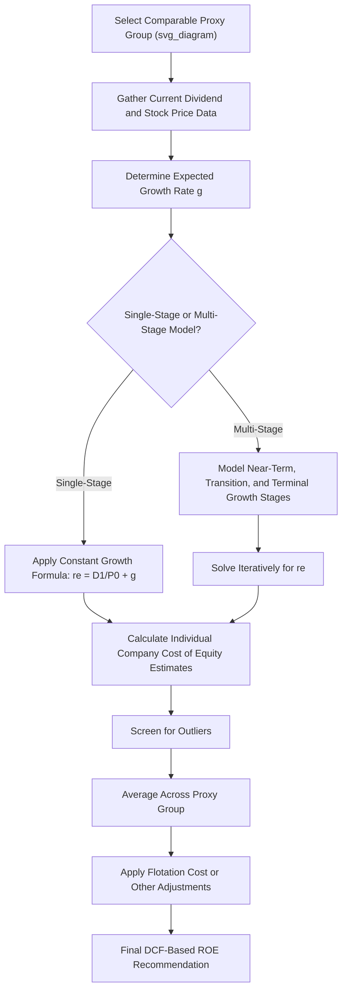

## Discounted Cash Flow (DCF) Models

### Overview

The Discounted Cash Flow (DCF) model is one of the most widely used methodologies for estimating a regulated utility's cost of common equity in rate case proceedings. Rooted in the principle that a stock's current price equals the present value of all expected future dividends, the DCF model — in its most common "constant growth" form — allows analysts to back out the market-implied cost of equity using observable stock prices, dividends, and growth estimates. It is typically presented alongside CAPM and risk premium models as part of a "multi-model" approach to ROE estimation.

### Theoretical Foundation

The DCF model rests on the dividend discount model (DDM), which holds that a stock's price is the present value of all future expected dividends discounted at the investor's required rate of return:

$$P_0 = \sum_{t=1}^{\infty} \frac{D_t}{(1+r_e)^t}$$

Where:

- $P_0$ = current stock price
- $D_t$ = expected dividend in period $t$
- $r_e$ = the investor's required rate of return (cost of equity) — the value being solved for

### The Constant Growth (Gordon) DCF Model

**Key Points**

- Assumes dividends grow at a **constant rate** ($g$) indefinitely, which allows the infinite sum above to collapse into a simple closed-form expression
- This is the most commonly used DCF variant in utility rate cases because regulated utilities, with their relatively stable and predictable dividend policies, are considered reasonably good fits for the constant-growth assumption, at least as a first-order approximation

**Formula**

$$r_e = \frac{D_1}{P_0} + g$$

Where:

- $D_1$ = expected dividend over the next period (next twelve months), often calculated as $D_0 \times (1+g)$
- $P_0$ = current stock price (often averaged over a period to reduce short-term volatility)
- $g$ = expected constant growth rate of dividends

**Key Points**

- The term $D_1/P_0$ is the **dividend yield** component
- The term $g$ is the **growth component**, representing expected capital appreciation
- Together, these represent the two sources of total return an equity investor expects: current income (dividends) and future price appreciation (growth)

### Worked Example — Constant Growth DCF

Assume a proxy utility has:

- Current annual dividend ($D_0$): $2.40
- Current stock price ($P_0$): $60.00
- Expected long-term growth rate ($g$): 5.5%

**Step 1 — Calculate $D_1$:**

$$D_1 = D_0 \times (1+g) = 2.40 \times 1.055 = 2.532$$

**Step 2 — Calculate Dividend Yield:**

$$\frac{D_1}{P_0} = \frac{2.532}{60.00} = 4.22\%$$

**Step 3 — Add Growth Rate:**

$$r_e = 4.22\% + 5.5\% = 9.72\%$$

**Output**

| Component | Value |
| --- | --- |
| Dividend yield ($D_1/P_0$) | 4.22% |
| Growth rate ($g$) | 5.50% |
| **Implied cost of equity ($r_e$)** | **9.72%** |

### Determining the Growth Rate ($g$) — The Central Analytical Challenge

**Key Points**

- The growth rate is the most contested and analytically sensitive input in the DCF model, since even small differences in assumed $g$ produce meaningful differences in the resulting cost of equity estimate
- Analysts typically draw on one or more of the following sources, often averaging or triangulating across methods:

#### Analysts' Consensus Earnings Growth Estimates

**Key Points**

- Most commonly sourced from third-party financial data providers compiling **analyst consensus long-term (3-5 year) earnings-per-share (EPS) growth forecasts**
- Widely used in utility rate case practice because they are readily available, independently sourced (not utility-management-generated), and reflect forward-looking market expectations
- A key theoretical assumption underlying this approach is that, over the long run, dividend growth will track earnings growth once payout ratios stabilize — this is a simplifying assumption that may not hold precisely in shorter time frames if payout ratios are actively changing

#### Historical Growth Rate Analysis

**Key Points**

- Uses historical compound annual growth rates (CAGR) of dividends, earnings, or book value per share over a look-back period (commonly 5 or 10 years)
- Criticized as potentially **backward-looking** and less reflective of current market expectations, though it can serve as a useful sanity check against analyst consensus figures

#### Sustainable Growth Rate ("br + sv") Method

**Key Points**

- A fundamentals-based approach estimating growth as a function of the retention ratio and expected return on equity, plus an adjustment for external equity financing:

$$g = (b \times r) + (s \times v)$$

Where:

- $b$ = earnings retention ratio (1 − dividend payout ratio)
- $r$ = expected return on book equity
- $s$ = expected growth rate in shares outstanding (from new equity issuances)
- $v$ = the value created per share from selling new shares above book value, expressed as a fraction

**Key Points**

- The "$s \times v$" term captures the "external financing" component of growth — the incremental EPS/DPS growth attributable to issuing new equity above book value, which dilutes existing book value per share upward when new shares are sold at a market price exceeding book value
- This method is more analytically complex and data-intensive than using consensus analyst estimates, and is used less frequently as a primary method in contemporary rate case practice, though it remains a recognized alternative or cross-check

[Inference] The relative weight given to analyst consensus estimates versus historical or sustainable growth methods varies by analyst and by jurisdiction; there is no single universally mandated approach, and expert witnesses frequently disagree on which growth rate source is most appropriate in any given proceeding.

### Multi-Stage DCF Models

**Key Points**

- The constant growth assumption can be unrealistic over very long horizons, particularly if near-term analyst growth estimates (3-5 years) diverge substantially from a plausible long-term sustainable growth rate (which, in the long run, cannot indefinitely exceed overall economic growth, since a company cannot grow faster than the economy forever without eventually representing an implausibly large share of it)
- **Two-stage** and **three-stage** DCF models address this by using near-term analyst growth estimates for an initial period, then transitioning (often linearly) to a long-term sustainable growth rate (frequently proxied by long-term GDP growth forecasts) for a terminal/perpetuity stage
- Three-stage models typically include: (1) an initial explicit forecast period using analyst estimates, (2) a transition period during which growth converges toward the long-term rate, and (3) a terminal/perpetuity period at the assumed long-term sustainable growth rate

**Three-Stage DCF Conceptual Structure**

$$P_0 = \sum_{t=1}^{n} \frac{D_t}{(1+r_e)^t} + \frac{TV_n}{(1+r_e)^n}$$

Where dividends $D_t$ grow at the near-term analyst rate during the initial stage, transition gradually during the middle stage, and the terminal value $TV_n$ reflects a constant growth perpetuity at the long-term rate from that point forward.

**Key Points**

- Multi-stage models require solving iteratively (or using a financial calculator/spreadsheet solver) for $r_e$, since the growth rate is not constant throughout, unlike the simple closed-form single-stage formula
- [Inference] Whether single-stage or multi-stage DCF models are preferred, and what specific long-term GDP growth proxy is used in the terminal stage, varies by analyst and jurisdiction; some commissions have historically shown a preference for one approach over the other based on precedent in that jurisdiction.

### Proxy Group Averaging

**Key Points**

- DCF cost of equity is virtually never calculated for a single company; instead, analysts apply the model to a **proxy group** of comparable, publicly traded utilities with similar risk profiles (see the related proxy group selection topic) and average (mean, median, or trimmed mean) the resulting individual company estimates to arrive at a group-level cost of equity recommendation
- Outlier results (implausibly high or low individual company estimates, often caused by unusual dividend policy changes, stock price anomalies, or growth rate estimate distortions) are frequently screened out or given reduced weight before averaging

**Illustrative Proxy Group DCF Results**

| Company | Dividend Yield ($D_1/P_0$) | Growth Rate ($g$) | Implied $r_e$ |
| --- | --- | --- | --- |
| Proxy Co. 1 | 3.8% | 6.0% | 9.8% |
| Proxy Co. 2 | 4.1% | 5.2% | 9.3% |
| Proxy Co. 3 | 4.5% | 4.5% | 9.0% |
| Proxy Co. 4 | 3.5% | 7.0% | 10.5% |
| Proxy Co. 5 | 4.2% | 5.0% | 9.2% |
| **Mean** | — | — | **9.56%** |
| **Median** | — | — | **9.30%** |

### Adjustments and Refinements

**Key Points**

- **Flotation costs**: Some analysts add a small upward adjustment (typically a modest number of basis points) to the DCF result to account for the costs of issuing new common equity (underwriting fees, market pressure effects), on the theory that these costs are a legitimate cost of equity capital that should be recoverable
- **Leverage/size adjustments**: Adjustments may be applied if the subject utility's size, capital structure, or specific risk profile differs meaningfully from the proxy group average
- **Stock price averaging period**: Using a single-day stock price can introduce short-term market noise; many analysts use an average price over a period (e.g., 30, 90, or 180 trading days) to smooth out volatility unrelated to fundamental value

### Mermaid Diagram — DCF Model Estimation Process (svg_diagram)

### SVG Illustration — DCF Return Components

<svg xmlns="http://www.w3.org/2000/svg" viewBox="0 0 700 260" font-family="Helvetica, Arial, sans-serif">
<text x="350" y="22" text-anchor="middle" font-size="15" font-weight="bold" fill="#1a1a1a">DCF Cost of Equity: Two Components of Total Return (svg_diagram)</text>
<rect x="150" y="60" width="150" height="140" fill="#3b6ea5" stroke="#1f3a5f" rx="4" />
<text x="225" y="125" text-anchor="middle" font-size="12" fill="#fff">Dividend Yield</text>
<text x="225" y="145" text-anchor="middle" font-size="13" fill="#fff" font-weight="bold">4.22%</text>
<text x="225" y="220" text-anchor="middle" font-size="10" fill="#333">D1 / P0</text>

<text x="315" y="135" text-anchor="middle" font-size="20" fill="#333">+</text>

<rect x="340" y="90" width="150" height="110" fill="#5a9e6f" stroke="#2f5c3c" rx="4" />
<text x="415" y="140" text-anchor="middle" font-size="12" fill="#fff">Growth Rate</text>
<text x="415" y="160" text-anchor="middle" font-size="13" fill="#fff" font-weight="bold">5.50%</text>
<text x="415" y="220" text-anchor="middle" font-size="10" fill="#333">Expected g</text>

<text x="505" y="135" text-anchor="middle" font-size="20" fill="#333">=</text>

<rect x="530" y="70" width="150" height="130" fill="#b5762c" stroke="#6b4a1a" rx="4" />
<text x="605" y="130" text-anchor="middle" font-size="12" fill="#fff">Cost of Equity</text>
<text x="605" y="150" text-anchor="middle" font-size="14" fill="#fff" font-weight="bold">9.72%</text>
</svg>

### Strengths and Limitations of the DCF Approach

**Key Points — Strengths**

- Relies on directly observable market data (stock prices, dividends) rather than more abstract theoretical constructs
- Well-established, long history of use in utility ratemaking, providing extensive precedent and familiarity among regulators
- Relatively transparent and easy to explain and audit compared to more complex asset pricing models

**Key Points — Limitations**

- Highly sensitive to the growth rate assumption, which is inherently forward-looking and uncertain
- The constant growth assumption may not hold well during periods of unusual dividend policy (e.g., dividend cuts, suspensions, or unusually high growth phases) or market stress
- Can produce anomalous results in low-interest-rate or unusual market environments, where dividend yields and growth rate relationships may not behave as the model's underlying assumptions predict
- Does not directly incorporate broader market risk measures (such as beta or market risk premium) the way CAPM does, which is one reason regulators often examine DCF results alongside CAPM and risk premium models rather than relying on DCF alone

[Unverified] The degree to which any single model (DCF, CAPM, or risk premium) is weighted most heavily in a specific proceeding depends on commission precedent, prevailing market conditions, and the specific facts presented by expert witnesses; no universal weighting formula applies uniformly across jurisdictions.

### Common Pitfalls in Practice

**Key Points**

- Using a single analyst's growth estimate rather than a broader consensus figure, which can introduce idiosyncratic bias
- Applying the constant growth model to a company with a recently cut, suspended, or highly volatile dividend, where the constant-growth assumption is poorly suited
- Failing to screen proxy group results for outliers before averaging, allowing a single anomalous company estimate to skew the overall recommendation
- Mismatching the growth rate time horizon with the model structure (e.g., using a 3-5 year analyst estimate as a perpetual growth rate in a single-stage model without considering whether that rate is sustainable indefinitely)
- Ignoring the interaction between the DCF-derived cost of equity and the capital structure/proxy group risk consistency (see the business risk vs. financial risk topic) when applying the final ROE recommendation

### Related Topics

- Capital Asset Pricing Model (CAPM) for Cost of Equity
- Risk Premium and Bond Yield Plus Risk Premium Methods
- Proxy Group Selection for Cost of Capital Analysis
- Multi-Stage DCF Models and Terminal Growth Rate Assumptions
- Flotation Cost Adjustments to Cost of Equity
- Business Risk vs. Financial Risk
- Weighted Average Cost of Capital (WACC) Calculation Methodology
- Determining the Ratemaking Capital Structure
- *Bluefield Water Works* and *Hope Natural Gas* Standards for Fair Return
- Credit Ratings and Capital Market Access