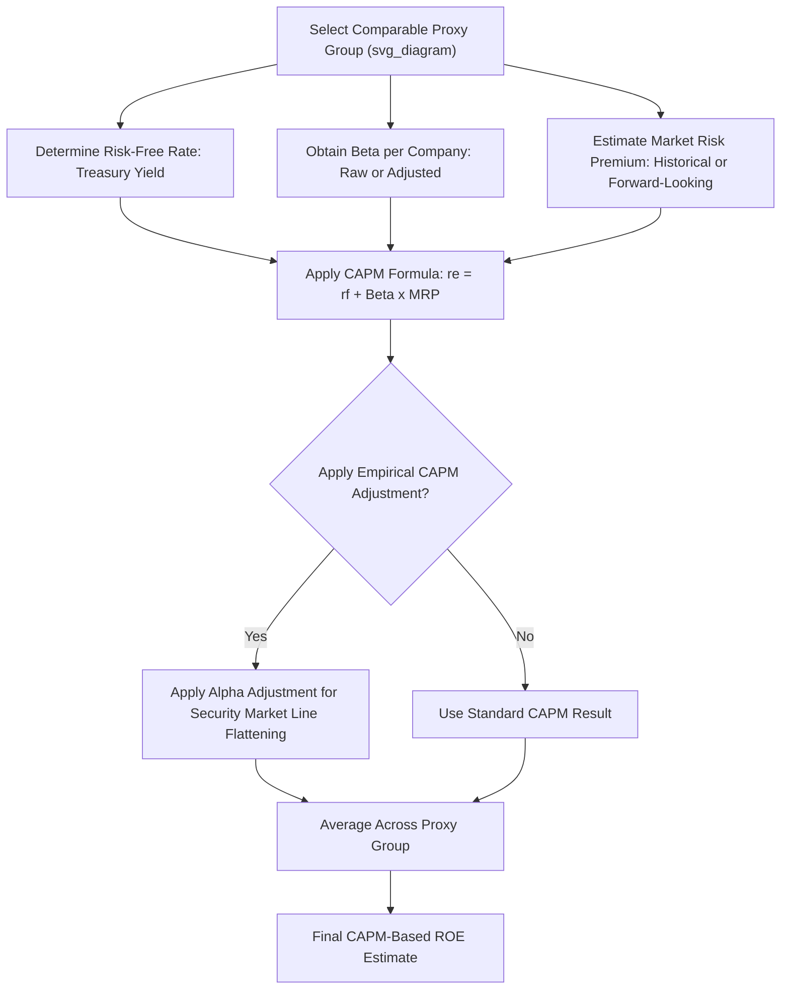

## Capital Asset Pricing Model (CAPM)

### Overview

The Capital Asset Pricing Model (CAPM) is a widely used cost of equity estimation methodology in utility rate cases, grounded in modern portfolio theory. Unlike the DCF model, which derives cost of equity from a company's own dividend and price data, CAPM estimates required return based on a security's systematic (non-diversifiable) risk relative to the overall market, as measured by beta. CAPM is typically presented as a complementary or cross-check methodology alongside DCF and risk premium approaches in a multi-model ROE analysis.

### Theoretical Foundation

CAPM is built on the premise that investors are compensated only for **systematic risk** — the risk that cannot be eliminated through diversification — because diversifiable (company-specific) risk can, in theory, be eliminated by holding a well-diversified portfolio. The model posits a linear relationship between a security's expected return and its sensitivity to overall market movements.

### Core Formula

$$r_e = r_f + \beta \times (r_m - r_f)$$

Where:

- $r_e$ = required/expected return on equity (the cost of equity being estimated)
- $r_f$ = risk-free rate of return
- $\beta$ (beta) = a measure of the security's systematic risk relative to the overall market
- $r_m$ = expected return on the overall market
- $(r_m - r_f)$ = the **market risk premium (MRP)** — the additional return investors require for bearing overall market risk instead of holding a risk-free asset

### Component 1: The Risk-Free Rate ($r_f$)

**Key Points**

- Most commonly proxied using **U.S. Treasury security yields**, with long-term (10-year or 20/30-year) Treasury bond yields generally preferred over short-term Treasury bill rates in utility rate case applications, since the cost of equity is a long-duration required return and should be matched with a similarly long-duration risk-free proxy
- Analysts typically use either a **spot yield** (as of a specific date near the filing) or an **average yield** over a defined period (e.g., 30, 60, or 90 days) to smooth short-term market volatility
- Some analysts use a **forecasted/projected** risk-free rate (drawing on consensus economic forecasts for future Treasury yields) rather than the current spot yield, on the theory that rates approved in a case will be in effect for a future period during which market conditions may differ from the filing date

[Inference] The choice between spot, historical-average, and forecasted risk-free rates is a matter of analyst judgment and jurisdictional precedent; each approach has been used and defended in various proceedings, and no single convention is universally mandated.

### Component 2: Beta ($\beta$)

**Key Points**

- Beta measures the **sensitivity of a stock's returns to overall market returns** — a beta of 1.0 indicates the stock moves, on average, in line with the market; a beta below 1.0 indicates lower volatility than the market (common for regulated utilities, given their relatively stable, regulated cash flows); a beta above 1.0 indicates higher volatility than the market
- Regulated utility betas are typically **below 1.0**, reflecting their defensive characteristics, stable regulated revenue streams, and lower correlation with broader economic cycles compared to the overall market — though the exact value varies by company and by the specific business risk factors discussed in the business risk vs. financial risk topic
- Beta is typically obtained from third-party financial data providers, calculated via regression of a stock's historical returns against a broad market index (commonly the S&P 500) over a specified look-back period (commonly 2 or 5 years of weekly or monthly return data)

#### Raw vs. Adjusted Beta

**Key Points**

- **Raw (historical) beta** is the direct output of the regression analysis on historical return data
- **Adjusted beta** applies a statistical adjustment (most commonly the Blume adjustment) on the theory that betas tend to revert toward the market mean of 1.0 over time; the standard Blume adjustment formula is:

$$\beta_{adjusted} = (0.67 \times \beta_{raw}) + (0.33 \times 1.0)$$

- Many commercial data providers (e.g., Bloomberg, Value Line) publish adjusted betas as their default reported figure, and utility rate case analysts frequently use these adjusted values rather than calculating raw betas independently

**Worked Example**

If a utility's raw historical beta is 0.65:

$$\beta_{adjusted} = (0.67 \times 0.65) + (0.33 \times 1.0) = 0.4355 + 0.33 = 0.7655 \approx 0.77$$

### Component 3: Market Risk Premium ($r_m - r_f$)

**Key Points**

- The market risk premium represents the additional return investors require, on average, for bearing overall market (equity) risk instead of investing in risk-free securities
- Commonly estimated using one of two general approaches: (1) **historical MRP** — the long-run average difference between historical equity market returns and historical risk-free rates over an extended look-back period (often many decades), and (2) **forward-looking/implied MRP** — derived from current market data using a DCF-style approach applied to a broad market index (e.g., applying the DCF formula to the S&P 500's aggregate dividend yield and consensus growth estimates to back out an implied market required return, then subtracting the current risk-free rate)
- Historical MRP estimates are frequently sourced from long-run market return studies; different look-back periods (e.g., since 1926 vs. shorter modern periods) can produce meaningfully different historical MRP estimates
- [Inference] There is ongoing analytical debate regarding whether historical or forward-looking MRP estimates better reflect current investor expectations, and expert witnesses in rate cases frequently present competing MRP estimates derived from different methodologies and time periods, with no single approach universally accepted as superior.

### Worked Example — Full CAPM Calculation

Assume:

- Risk-free rate ($r_f$): 4.20% (based on a recent 30-day average 30-year Treasury yield)
- Adjusted beta ($\beta$): 0.77
- Market risk premium ($r_m - r_f$): 7.00%

**Step 1 — Calculate the Risk Premium Component:**

$$\beta \times (r_m - r_f) = 0.77 \times 7.00\% = 5.39\%$$

**Step 2 — Add the Risk-Free Rate:**

$$r_e = 4.20\% + 5.39\% = 9.59\%$$

**Output**

| Component | Value |
| --- | --- |
| Risk-free rate ($r_f$) | 4.20% |
| Beta ($\beta$, adjusted) | 0.77 |
| Market risk premium ($r_m - r_f$) | 7.00% |
| Beta-adjusted risk premium | 5.39% |
| **Implied cost of equity ($r_e$)** | **9.59%** |

### Empirical CAPM (ECAPM) Adjustment

**Key Points**

- Empirical studies have found that the simple CAPM tends to **overstate required returns for high-beta stocks and understate required returns for low-beta stocks** relative to actually observed market returns — a pattern sometimes called the "beta flattening" or "security market line" empirical anomaly
- Since regulated utilities typically have low betas, this empirical finding suggests standard CAPM may **understate** the true cost of equity for utility stocks specifically, providing a rationale for using an Empirical CAPM (ECAPM) adjustment
- The ECAPM formula introduces an additional constant ($\alpha$) that adjusts the model output toward a flatter security market line:

$$r_e = r_f + \alpha + \beta \times (r_m - r_f - \alpha)$$

Where $\alpha$ is a small positive adjustment factor (commonly cited illustrative values range from approximately 1% to 2%, though the specific value used varies by analyst and study).

**Worked Example — ECAPM with $\alpha = 1.5\%$**

$$r_e = 4.20\% + 1.5\% + 0.77 \times (7.00\% - 1.5\%) = 4.20\% + 1.5\% + (0.77 \times 5.5\%)$$

$$r_e = 4.20\% + 1.5\% + 4.235\% = 9.935\%$$

**Output**

| Model | Resulting Cost of Equity |
| --- | --- |
| Standard CAPM | 9.59% |
| ECAPM (α = 1.5%) | 9.94% |

[Unverified] The appropriate value of the empirical adjustment factor $\alpha$, and whether ECAPM should be used at all in a given proceeding, is a matter of significant analytical and regulatory debate; some commissions have accepted ECAPM adjustments in certain cases while others have rejected them, so the treatment is jurisdiction- and case-specific rather than a settled, universally applied convention.

### Proxy Group Application

**Key Points**

- Like the DCF model, CAPM is applied to each member of a **proxy group** of comparable utilities, with each company's individual beta used alongside a common risk-free rate and market risk premium assumption, and the resulting individual estimates averaged to derive a group-level cost of equity recommendation
- Because the risk-free rate and market risk premium inputs are typically held constant across the proxy group (only beta varies by company), differences in individual company CAPM results are driven primarily by beta differences

**Illustrative Proxy Group CAPM Results**

| Company | Beta (Adjusted) | CAPM Result (rf=4.20%, MRP=7.00%) |
| --- | --- | --- |
| Proxy Co. 1 | 0.75 | 9.45% |
| Proxy Co. 2 | 0.80 | 9.80% |
| Proxy Co. 3 | 0.70 | 9.10% |
| Proxy Co. 4 | 0.85 | 10.15% |
| Proxy Co. 5 | 0.78 | 9.66% |
| **Mean** | **0.776** | **9.63%** |

### Mermaid Diagram — CAPM Estimation Process (svg_diagram)

### SVG Illustration — Security Market Line and CAPM Components

<svg xmlns="http://www.w3.org/2000/svg" viewBox="0 0 700 320" font-family="Helvetica, Arial, sans-serif">
<text x="350" y="22" text-anchor="middle" font-size="15" font-weight="bold" fill="#1a1a1a">Security Market Line: CAPM Risk-Return Relationship (svg_diagram)</text>
<line x1="80" y1="270" x2="620" y2="270" stroke="#333" stroke-width="1.5" />
<line x1="80" y1="270" x2="80" y2="50" stroke="#333" stroke-width="1.5" />
<text x="350" y="295" text-anchor="middle" font-size="11" fill="#333">Beta (Systematic Risk)</text>
<text x="40" y="160" text-anchor="middle" font-size="11" fill="#333" transform="rotate(-90 40 160)">Expected Return</text>

<line x1="100" y1="240" x2="580" y2="80" stroke="#3b6ea5" stroke-width="2.5" />
<text x="500" y="90" font-size="11" fill="#3b6ea5" font-weight="bold">Security Market Line</text>

<circle cx="100" cy="240" r="4" fill="#333" />
<text x="100" y="258" text-anchor="middle" font-size="10" fill="#333">rf = 4.20%</text>
<text x="100" y="228" text-anchor="middle" font-size="9" fill="#333">Beta = 0</text>

<circle cx="270" cy="175" r="5" fill="#5a9e6f" />
<text x="270" y="160" text-anchor="middle" font-size="10" fill="#2f5c3c" font-weight="bold">Utility (β≈0.77)</text>
<text x="270" y="195" text-anchor="middle" font-size="9" fill="#333">re ≈ 9.6%</text>

<circle cx="400" cy="145" r="4" fill="#333" />
<text x="400" y="130" text-anchor="middle" font-size="9" fill="#333">Market: β=1.0</text>

<line x1="100" y1="220" x2="580" y2="100" stroke="#b5762c" stroke-width="2" stroke-dasharray="6,4" />
<text x="480" y="115" font-size="10" fill="#b5762c" font-weight="bold">ECAPM (flatter line)</text>
</svg>

### Strengths and Limitations

**Key Points — Strengths**

- Grounded in well-established financial theory (modern portfolio theory) with a long academic and practical history
- Explicitly incorporates a market-wide risk measure, providing a useful cross-check against the DCF model, which relies solely on company-specific dividend/price data
- Beta is an objectively calculable, third-party-sourced input, reducing (though not eliminating) potential for analyst-specific bias in that component

**Key Points — Limitations**

- Highly sensitive to the market risk premium assumption, which varies substantially depending on the estimation methodology and time period used
- Beta estimates can be unstable over time and sensitive to the specific look-back period and return frequency (weekly vs. monthly) used in the regression
- The simple CAPM's empirically observed tendency to understate returns for low-beta securities (the rationale for ECAPM) suggests standard CAPM may require adjustment specifically for the utility sector, adding a layer of methodological complexity and dispute
- Assumes markets are efficient and investors hold diversified portfolios, assumptions that, while foundational to the theory, are simplifications of actual investor behavior

### Common Pitfalls in Practice

**Key Points**

- Using a short-term Treasury yield as the risk-free rate proxy for a model estimating a long-duration required return, creating a duration mismatch
- Mixing raw and adjusted betas inconsistently across a proxy group, or failing to disclose which beta convention was used
- Applying a historical market risk premium derived from a very long look-back period without considering whether more recent market conditions suggest a different forward-looking premium
- Applying ECAPM adjustments without adequately supporting the specific alpha value chosen, given the lack of a single universally accepted figure
- Treating CAPM results in isolation without cross-referencing DCF and risk premium model results as part of a holistic ROE recommendation

### Related Topics

- Discounted Cash Flow (DCF) Models
- Risk Premium and Bond Yield Plus Risk Premium Methods
- Proxy Group Selection for Cost of Capital Analysis
- Business Risk vs. Financial Risk
- Empirical CAPM (ECAPM) and Security Market Line Adjustments
- Market Risk Premium Estimation: Historical vs. Forward-Looking Approaches
- Weighted Average Cost of Capital (WACC) Calculation Methodology
- Determining the Ratemaking Capital Structure
- *Bluefield Water Works* and *Hope Natural Gas* Standards for Fair Return
- Credit Ratings and Capital Market Access