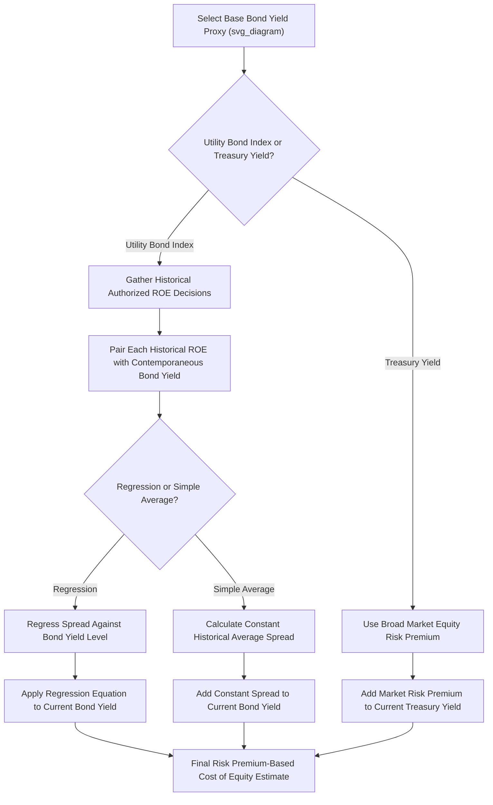

## Risk Premium and Bond Yield Plus Risk Premium Methods

### Overview

The Risk Premium method, and its close variant the Bond Yield Plus Risk Premium (BYPRP) method, estimate a utility's cost of equity by adding an equity risk premium to an observable bond yield — either a broad corporate bond index yield or the utility's own or a proxy group's bond yield. These methods are grounded in the empirical observation that equity returns have historically exceeded bond yields by a reasonably predictable (though not constant) margin, and they are typically presented as a third methodology alongside DCF and CAPM in a multi-model ROE analysis, valued particularly for their simplicity and their direct empirical linkage between authorized ROE outcomes and prevailing interest rate conditions.

### Core Concept

$$r_e = r_d + RP$$

Where:

- $r_e$ = estimated cost of common equity
- $r_d$ = a bond yield proxy (utility bond yield, corporate bond index yield, or Treasury yield, depending on the specific variant)
- $RP$ = the equity risk premium — the additional return equity investors require over the bond yield to compensate for equity's greater risk (residual claim, no fixed payment obligation, greater volatility)

### Variant 1: Utility Bond Yield Plus Risk Premium

**Key Points**

- Uses the yield on a **utility-specific bond index** (e.g., an index of A-rated or Baa-rated utility bonds, often published by financial data providers or derived from a basket of comparable utility bond issuances) as the base rate
- The risk premium is typically derived from **historical analysis of the relationship between authorized ROEs and contemporaneous utility bond yields** across many prior rate case decisions, since this variant is specifically designed to track how equity risk premiums have empirically behaved relative to the utility sector's own cost of debt

#### Historical Inverse Relationship Between Risk Premium and Interest Rates

**Key Points**

- Empirical studies of authorized ROE decisions across many jurisdictions and time periods have generally found that the **equity risk premium tends to move inversely with the level of interest rates** — when bond yields are low, the risk premium tends to be wider, and when bond yields are high, the risk premium tends to be narrower, such that the cost of equity itself moves more gradually than bond yields do
- This finding is typically incorporated into risk premium models through a **regression-based approach**, where historical authorized ROE-minus-bond-yield spreads are regressed against the corresponding bond yield level, producing an equation that predicts the appropriate risk premium for any given current bond yield level, rather than simply assuming a constant historical average spread

**Illustrative Regression Relationship**

$$RP = a + (b \times r_d)$$

Where $a$ is a constant (intercept) and $b$ is a negative coefficient (since the relationship is inverse), estimated from historical regression data of authorized ROE spreads against bond yields.

**Worked Example**

Assume a regression analysis of historical authorized ROE decisions produces:

$$RP = 8.50\% - (0.50 \times r_d)$$

At a current utility bond yield of 5.50%:

$$RP = 8.50\% - (0.50 \times 5.50\%) = 8.50\% - 2.75\% = 5.75\%$$

$$r_e = r_d + RP = 5.50\% + 5.75\% = 11.25\%$$

**Output**

| Component | Value |
| --- | --- |
| Current utility bond yield ($r_d$) | 5.50% |
| Regression-implied risk premium | 5.75% |
| **Implied cost of equity** | **11.25%** |

[Inference] The specific regression coefficients (the $a$ and $b$ values) depend entirely on the historical dataset, time period, and jurisdiction-specific authorized ROE decisions used to estimate them; different analysts using different historical datasets can derive materially different regression equations, making this a frequently disputed element of risk premium testimony.

### Variant 2: Simple Historical Average Risk Premium

**Key Points**

- A simpler, non-regression approach that adds a **constant historical average risk premium** (calculated as the simple average of the spread between authorized equity returns and contemporaneous bond yields over a defined historical period) to the current bond yield
- Criticized as potentially less accurate than the regression approach specifically because it does not account for the empirically observed inverse relationship between interest rate levels and risk premiums — applying a constant historical average spread during periods of unusually high or low interest rates may produce a less reliable estimate than a rate-sensitive regression-based premium

**Worked Example**

If the simple historical average spread between authorized ROEs and utility bond yields over the past 20 years has been 5.00%, and the current bond yield is 5.50%:

$$r_e = 5.50\% + 5.00\% = 10.50\%$$

### Variant 3: Capital Market/Equity Risk Premium Approach (CAPM-Adjacent)

**Key Points**

- A related risk premium approach uses a **broad market equity risk premium** (similar to the CAPM's market risk premium concept) added to a Treasury bond yield, rather than a utility-specific bond yield and utility-specific historical spread
- This variant blurs somewhat into CAPM methodology but is sometimes presented as a distinct, simpler "total market" risk premium approach without incorporating a beta adjustment — effectively assuming a beta of 1.0, or presenting the market-level result as a benchmark/sanity check rather than the utility-specific estimate itself

### Comparing the Variants

| Variant | Base Rate Used | Risk Premium Source | Interest Rate Sensitivity |
| --- | --- | --- | --- |
| Regression-based utility BYPRP | Utility bond index yield | Regression of historical ROE-bond yield spreads | High (explicitly modeled) |
| Simple average utility BYPRP | Utility bond index yield | Constant historical average spread | None (assumes constant spread) |
| Market-level risk premium | Treasury yield | Broad market equity risk premium | Depends on specific construction |

### Data Sources for Historical Authorized ROE Analysis

**Key Points**

- Analysts constructing the historical dataset underlying a regression-based BYPRP model typically compile authorized ROE decisions from **regulatory finance data services** that track rate case outcomes across jurisdictions and time, cross-referenced with the contemporaneous bond yield index level at the time of each decision
- The **look-back period** chosen (e.g., 10, 20, 30+ years of historical authorized ROE data) can materially affect the resulting regression equation, since different historical eras reflect different interest rate regimes, regulatory philosophies, and macroeconomic conditions
- [Unverified] There is no universally agreed-upon "correct" look-back period or data source for this analysis; different expert witnesses in the same proceeding frequently present competing regression results derived from different historical datasets or time windows, and commissions must weigh the reasonableness of each approach's underlying assumptions.

### Worked Comparative Example Across Time Periods

**Key Points**

- Because bond yields fluctuate significantly across economic cycles, the resulting BYPRP cost of equity estimate can vary substantially depending on when the analysis is performed, even if the underlying regression equation itself remains constant

| Interest Rate Environment | Utility Bond Yield | Regression-Implied Risk Premium | Resulting Cost of Equity |
| --- | --- | --- | --- |
| Low-rate environment | 3.50% | 6.75% | 10.25% |
| Moderate-rate environment | 5.50% | 5.75% | 11.25% |
| High-rate environment | 7.50% | 4.75% | 12.25% |

*(Using the illustrative regression $RP = 8.50\% - 0.50 \times r_d$ from the earlier example)*

**Output** — Note that even though the bond yield increases by 4 full percentage points across these scenarios (3.50% to 7.50%), the resulting cost of equity increases by only 2 percentage points (10.25% to 12.25%), illustrating the dampening effect of the inverse risk-premium relationship built into the regression approach.

### Mermaid Diagram — Bond Yield Plus Risk Premium Process (svg_diagram)

### SVG Illustration — Inverse Relationship Between Bond Yields and Risk Premium

<svg xmlns="http://www.w3.org/2000/svg" viewBox="0 0 700 300" font-family="Helvetica, Arial, sans-serif">
<text x="350" y="22" text-anchor="middle" font-size="15" font-weight="bold" fill="#1a1a1a">Risk Premium Narrows as Bond Yields Rise (svg_diagram)</text>
<line x1="80" y1="250" x2="620" y2="250" stroke="#333" stroke-width="1.5" />
<line x1="80" y1="250" x2="80" y2="50" stroke="#333" stroke-width="1.5" />
<text x="350" y="275" text-anchor="middle" font-size="11" fill="#333">Utility Bond Yield (%)</text>
<text x="40" y="150" text-anchor="middle" font-size="11" fill="#333" transform="rotate(-90 40 150)">Rate (%)</text>

<line x1="100" y1="150" x2="580" y2="90" stroke="#3b6ea5" stroke-width="2.5" />
<text x="500" y="80" font-size="11" fill="#3b6ea5" font-weight="bold">Cost of Equity (re)</text>

<line x1="100" y1="220" x2="580" y2="90" stroke="#5a9e6f" stroke-width="2.5" stroke-dasharray="6,3" />
<text x="480" y="130" font-size="11" fill="#2f5c3c" font-weight="bold">Bond Yield (rd, 1:1 reference)</text>

<line x1="200" y1="205" x2="200" y2="135" stroke="#b5762c" stroke-width="2" />
<text x="215" y="170" font-size="10" fill="#b5762c">Wide RP</text>
<line x1="480" y1="98" x2="480" y2="93" stroke="#b5762c" stroke-width="2" />
<text x="495" y="100" font-size="10" fill="#b5762c">Narrow RP</text>
</svg>

### Strengths and Limitations

**Key Points — Strengths**

- Directly and transparently ties the cost of equity estimate to observable, current bond market conditions, providing an intuitive, easy-to-explain methodology
- The regression-based variant explicitly incorporates the empirically documented inverse relationship between interest rates and equity risk premiums, addressing a known limitation of naive constant-spread approaches
- Serves as a useful cross-check against DCF and CAPM results, particularly valuable during periods when DCF growth rate estimates or CAPM market risk premium estimates are themselves unusually volatile or contested

**Key Points — Limitations**

- Regression results are highly sensitive to the choice of historical look-back period and dataset, and can vary substantially between analysts using different historical windows
- Reliance on **historical authorized ROE decisions** as the dependent variable in the regression creates a degree of circularity — the model is calibrated on what regulators have historically decided is a reasonable return, rather than on a purely market-derived required return, which critics argue can perpetuate past regulatory practices (whether appropriate or not) into current estimates
- Simple constant-spread variants do not adjust for changing interest rate environments and may produce stale results if applied without adjustment across different rate regimes

### Common Pitfalls in Practice

**Key Points**

- Applying a constant historical average risk premium without checking whether current interest rate conditions differ substantially from the historical period underlying that average
- Using a regression equation derived from an unrepresentative or outdated historical dataset without testing its continued statistical validity against more recent data
- Conflating the utility-specific bond yield plus risk premium method with the broader market-level CAPM-adjacent risk premium approach, when these rely on materially different data inputs and theoretical justifications
- Presenting risk premium results as fully independent of DCF and CAPM findings, when in practice the underlying data (particularly historical authorized ROE decisions) can itself be influenced by prior DCF and CAPM-based determinations, creating potential circularity across the multi-model approach

### Related Topics

- Discounted Cash Flow (DCF) Models
- Capital Asset Pricing Model (CAPM)
- Proxy Group Selection for Cost of Capital Analysis
- Business Risk vs. Financial Risk
- Weighted Average Cost of Capital (WACC) Calculation Methodology
- Determining the Ratemaking Capital Structure
- Credit Ratings and Capital Market Access
- Multi-Model ROE Reconciliation and Weighting Approaches
- *Bluefield Water Works* and *Hope Natural Gas* Standards for Fair Return
- Historical Authorized ROE Trends by Utility Sector