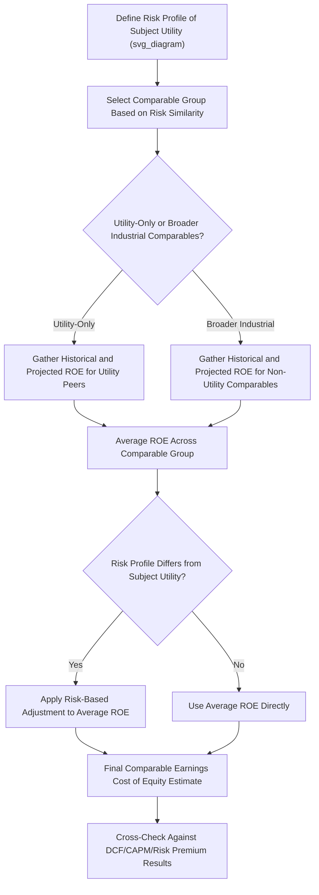

## Comparable Earnings Approach

### Overview

The Comparable Earnings approach estimates a utility's cost of equity by examining the **accounting rates of return** — typically return on book equity — earned by a group of companies with comparable risk characteristics, rather than deriving a market-based required return from stock prices, dividends, or bond yields as the DCF, CAPM, and risk premium methods do. Rooted in the standard of comparable earnings articulated in the U.S. Supreme Court's *Bluefield Water Works* and *Hope Natural Gas* decisions, this method has a long history in utility ratemaking but has become a secondary or corroborative method in most contemporary proceedings, used less frequently as a primary driver of authorized ROE than the market-based models.

### Theoretical and Legal Foundation

**Key Points**

- The comparable earnings approach traces its conceptual roots directly to the fair return standard articulated in *Bluefield Water Works & Improvement Co. v. Public Service Commission of West Virginia* (1923) and *Federal Power Commission v. Hope Natural Gas Co.* (1944), both of which emphasized that a utility's authorized return should be **comparable to returns earned by other businesses with corresponding risks**
- Unlike the market-based models, which estimate the return investors *require* to invest in a security (a forward-looking, market-derived concept), the comparable earnings approach examines the return companies of similar risk actually *earn* on their book investment — an accounting-based, historical or budgeted concept
- This distinction is central to the method's ongoing critique: accounting returns on book equity are influenced by historical cost accounting conventions, management performance, and company-specific circumstances in ways that may not directly correspond to the market-based required return that ratemaking theory otherwise seeks to identify

### Methodology

#### Step 1: Selecting the Comparable Group

**Key Points**

- Unlike DCF/CAPM proxy groups, which are typically restricted to **publicly traded regulated utilities** in similar business lines, comparable earnings analysis has historically drawn on a broader universe of companies, sometimes including **non-utility industrial or commercial companies** selected specifically for having a similar degree of risk (as measured by financial metrics such as earnings volatility, size, and financial leverage) to the subject utility, rather than similarity of industry
- The rationale for including non-utility comparables is rooted in the fair return standard's emphasis on comparability of *risk*, not comparability of *industry* — the argument being that investors allocate capital based on risk-adjusted return expectations across the whole economy, not solely within a single industry
- In practice, many contemporary applications of this method restrict the comparable group to utility or utility-adjacent companies, given practical difficulties in establishing genuine risk comparability with dissimilar industries

#### Step 2: Measuring Historical or Projected Returns on Book Equity

**Key Points**

- The core metric is **return on common equity (ROE)**, calculated using GAAP financial statement data:

$$ROE = \frac{Net\ Income\ Available\ to\ Common\ Shareholders}{Average\ Common\ Equity}$$

- Analysts typically examine ROE over a multi-year historical period (e.g., 5 years) and/or projected/forecasted ROE for the comparable group (drawing on analyst forecasts of future earnings), often averaging across companies and years to smooth out anomalies

**Worked Example**

| Comparable Company | 5-Year Average Historical ROE | Projected ROE (Next 2 Years) |
| --- | --- | --- |
| Comparable Co. 1 | 10.2% | 10.5% |
| Comparable Co. 2 | 9.8% | 10.1% |
| Comparable Co. 3 | 11.0% | 11.2% |
| Comparable Co. 4 | 9.5% | 9.8% |
| Comparable Co. 5 | 10.6% | 10.9% |
| **Average** | **10.22%** | **10.5%** |

**Output**

Based on this illustrative comparable group, the comparable earnings approach would suggest a cost of equity estimate in the range of approximately 10.2% to 10.5%, depending on whether historical or projected returns (or a blend) are emphasized.

#### Step 3: Adjustments for Risk Comparability

**Key Points**

- If the comparable group's overall risk profile (business risk plus financial risk) differs from the subject utility, analysts may apply upward or downward adjustments to the raw average ROE result
- Common adjustment factors include differences in financial leverage (capital structure), size, growth prospects, and specific industry risk factors — conceptually similar to the risk-comparability screening performed in DCF/CAPM proxy group selection, but applied here to accounting return comparisons rather than market-derived return estimates

### Comparison to Market-Based Methods

| Feature | Comparable Earnings | DCF / CAPM / Risk Premium |
| --- | --- | --- |
| Basis of return measure | Accounting return on book equity | Market-derived required return |
| Data source | Financial statements (net income, book equity) | Stock prices, dividends, bond yields, beta |
| Forward-looking or historical? | Primarily historical, sometimes projected | Primarily forward-looking (expectations-based) |
| Comparable group composition | Can include non-utility companies with similar risk | Generally restricted to comparable regulated utilities |
| Circularity concern | High — comparable utilities' ROE is itself often set by regulators | Lower — market prices are independently set |

### The Circularity Critique

**Key Points**

- The most significant and frequently cited criticism of the comparable earnings approach, when applied to a comparable group of **regulated utilities**, is that those companies' book returns on equity are themselves substantially determined by **prior regulatory ROE decisions** in their own rate cases — meaning the method risks measuring "what regulators have previously decided is reasonable" rather than an independently, market-derived required return
- This circularity is less pronounced (though not eliminated) when the comparable group includes genuinely **non-regulated, competitive industry companies**, since those companies' returns are determined by competitive market forces rather than administrative rate-setting — this is part of the historical rationale for including non-utility comparables, despite the practical challenges of establishing genuine risk comparability across dissimilar industries
- [Inference] Because of this circularity concern, many contemporary regulatory proceedings treat comparable earnings as a **secondary, corroborative check** on the results of market-based models (DCF, CAPM, risk premium) rather than as a primary driver of the authorized ROE recommendation, though the specific weight given to this method varies by jurisdiction and by expert witness.

### Mermaid Diagram — Comparable Earnings Methodology Flow (svg_diagram)

### SVG Illustration — Comparable Earnings vs. Market-Based Return Concept

<svg xmlns="http://www.w3.org/2000/svg" viewBox="0 0 720 300" font-family="Helvetica, Arial, sans-serif">
<text x="360" y="22" text-anchor="middle" font-size="15" font-weight="bold" fill="#1a1a1a">Comparable Earnings: Accounting Return vs. Market-Required Return (svg_diagram)</text>
<rect x="60" y="60" width="270" height="180" fill="#eef4fb" stroke="#3b6ea5" stroke-width="1.5" rx="6" />
<text x="195" y="88" text-anchor="middle" font-size="13" font-weight="bold" fill="#1f3a5f">Comparable Earnings</text>
<text x="80" y="115" font-size="11" fill="#333">Input: Net Income / Book Equity</text>
<text x="80" y="138" font-size="11" fill="#333">Source: Financial statements</text>
<text x="80" y="161" font-size="11" fill="#333">Orientation: Historical/accounting</text>
<text x="80" y="184" font-size="11" fill="#333">Risk: Circularity with prior</text>
<text x="95" y="203" font-size="11" fill="#333">regulatory decisions</text>
<rect x="390" y="60" width="270" height="180" fill="#fbf3ea" stroke="#b5762c" stroke-width="1.5" rx="6" />
<text x="525" y="88" text-anchor="middle" font-size="13" font-weight="bold" fill="#6b4a1a">Market-Based Models</text>
<text x="410" y="115" font-size="11" fill="#333">Input: Stock price, dividends, beta</text>
<text x="410" y="138" font-size="11" fill="#333">Source: Capital markets</text>
<text x="410" y="161" font-size="11" fill="#333">Orientation: Forward-looking</text>
<text x="410" y="184" font-size="11" fill="#333">Risk: Growth/beta/MRP</text>
<text x="425" y="203" font-size="11" fill="#333">estimation sensitivity</text>

<text x="360" y="270" text-anchor="middle" font-size="11" fill="#555">Both may be presented together as part of a multi-model ROE analysis</text>

</svg>

### Contemporary Role in Rate Case Practice

**Key Points**

- In most modern utility rate case proceedings, the comparable earnings approach plays a **supporting or corroborative role**, cited to check whether a market-model-derived ROE recommendation falls within a range that is broadly consistent with returns earned by comparable-risk enterprises, rather than serving as the primary quantitative driver of the recommended ROE
- Some jurisdictions and expert witnesses give this method little to no weight, citing the circularity and accounting-distortion concerns discussed above, while others continue to present it as one of several methods considered in reaching a final ROE recommendation
- [Unverified] The specific weight assigned to comparable earnings results, if presented at all, varies considerably by jurisdiction, by expert witness practice, and by the specific facts of a case; no universal convention governs how heavily this method should be weighted relative to DCF, CAPM, and risk premium results.

### Common Pitfalls in Practice

**Key Points**

- Relying exclusively on comparable earnings without adequately addressing the circularity critique when the comparable group consists primarily of regulated utilities
- Failing to establish genuine risk comparability when including non-utility companies in the comparable group, potentially comparing companies with materially different risk profiles despite superficially similar accounting metrics
- Using purely historical ROE data without considering whether recent conditions or strategic changes make historical returns a poor predictor of currently required returns
- Treating comparable earnings as equally weighted with market-based models without considering the qualitative differences in what each method actually measures (accounting return vs. market-required return)
- Ignoring the effect of differing accounting policies, capital structures, or one-time items across the comparable group, which can distort raw ROE comparisons without careful normalization

### Related Topics

- Discounted Cash Flow (DCF) Models
- Capital Asset Pricing Model (CAPM)
- Risk Premium and Bond Yield Plus Risk Premium Methods
- Proxy Group Selection for Cost of Capital Analysis
- Business Risk vs. Financial Risk
- *Bluefield Water Works* and *Hope Natural Gas* Standards for Fair Return
- Multi-Model ROE Reconciliation and Weighting Approaches
- Determining the Ratemaking Capital Structure
- Weighted Average Cost of Capital (WACC) Calculation Methodology
- Credit Ratings and Capital Market Access