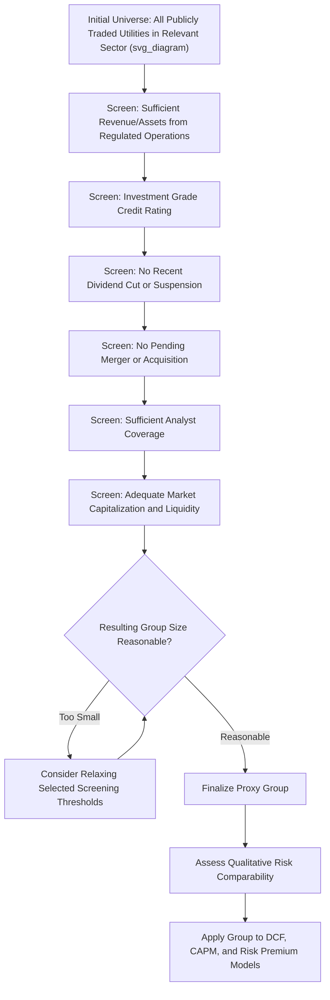

## Proxy Group Selection and Screening Criteria

### Overview

Proxy group selection is the foundational analytical step underlying every market-based cost of equity model discussed in this chapter — DCF, CAPM, and risk premium approaches all require a group of comparable, publicly traded companies to generate market-observable inputs, since the subject utility itself is typically not separately traded (being either wholly owned by a parent or, even if publicly traded, too thinly followed or idiosyncratic to rely on alone). The rigor and defensibility of proxy group screening criteria directly determines the credibility of the resulting cost of equity estimate, making this a frequently litigated methodological battleground in rate case testimony.

### Why Proxy Groups Are Necessary

**Key Points**

- Most regulated utility operating companies are **wholly owned subsidiaries** of holding companies and do not have their own separately traded common stock, making it impossible to directly calculate a company-specific dividend yield, stock price, or beta
- Even when a utility's parent holding company is itself publicly traded, using a **single-company** market-based analysis risks distortion from company-specific events (one-time charges, M&A activity, unusual dividend policy changes, low trading volume/liquidity) that would not affect a broader, diversified group
- A well-constructed proxy group averages out idiosyncratic, company-specific noise while preserving a group-level risk profile that is reasonably representative of the subject utility's own risk characteristics — this is the central objective of the screening process

### General Screening Criteria Categories

#### Industry and Business Line Screens

**Key Points**

- **Primary business classification**: Analysts typically begin with a broad universe of publicly traded companies classified under relevant utility industry codes (e.g., electric utilities, gas distribution utilities, water utilities), often sourced from a financial data provider's industry classification system (such as Value Line's utility industry groupings or a comparable service)
- **Revenue/asset concentration in regulated utility operations**: A common screen requires that a substantial majority (commonly cited thresholds are often in the range of 70%–90%, though the specific percentage varies by analyst) of a candidate company's revenues or assets derive from **regulated utility operations**, to exclude companies with substantial unregulated or non-utility business lines that would introduce dissimilar business risk
- **Same or similar utility type**: For an electric utility rate case, the proxy group is typically restricted to other electric (or combination electric/gas) utilities; a water utility case would use water utility comparables; gas distribution cases use gas distribution comparables — cross-industry substitution (e.g., using electric utilities as proxies for a water utility) is generally avoided absent specific circumstances (such as an insufficient number of same-industry comparables)

#### Financial Condition Screens

**Key Points**

- **Credit rating threshold**: A common screen excludes companies below investment grade (or below a specific rating threshold, such as BBB-/Baa3), since sub-investment-grade companies may reflect financial distress or elevated risk not representative of a financially healthy regulated utility
- **Dividend payment history**: Since the DCF model requires a stable, analyzable dividend history and growth pattern, companies that have **recently cut, suspended, or failed to pay dividends** are commonly excluded, as the constant-growth DCF assumption is poorly suited to such companies
- **No pending mergers or acquisitions**: Companies involved in a pending merger, acquisition, or other significant corporate transaction are frequently excluded, since pending M&A activity can distort stock price behavior (e.g., trading toward a fixed deal price rather than reflecting fundamental dividend/growth expectations) in ways unrelated to the company's standalone cost of equity
- **Sufficient analyst coverage**: Because DCF growth rates typically rely on analyst consensus estimates, companies with **insufficient analyst coverage** (e.g., fewer than a minimum number of covering analysts) are often excluded, since a growth estimate based on very few analysts may be less reliable

#### Data Availability and Liquidity Screens

**Key Points**

- **Market capitalization minimums**: Very small companies may be excluded due to thin trading, greater company-specific volatility, or limited analyst coverage
- **Trading volume/liquidity**: Illiquid stocks (those with low trading volume) can exhibit stale or distorted pricing that undermines the reliability of stock-price-based inputs
- **Sufficient historical data**: Companies without sufficient historical stock price, dividend, or earnings data (e.g., due to a recent IPO or spin-off) may be excluded because certain model inputs (e.g., beta calculation, historical growth analysis) require an adequate data history

### Illustrative Screening Waterfall

**Key Points**

- Analysts typically apply screens sequentially, starting from a broad initial universe and progressively narrowing to a final proxy group, documenting the number of companies eliminated at each screening step for transparency and to allow scrutiny of the screening methodology's reasonableness

**Example Screening Waterfall (Illustrative)**

| Screening Step | Companies Remaining |
| --- | --- |
| Initial universe: All publicly traded electric utilities | 45 |
| Exclude: Less than 70% revenue from regulated electric operations | 32 |
| Exclude: Below investment-grade credit rating | 29 |
| Exclude: Dividend cut or suspension in past 5 years | 25 |
| Exclude: Pending merger or acquisition | 21 |
| Exclude: Insufficient analyst coverage (fewer than 3 analysts) | 16 |
| Exclude: Market capitalization below minimum threshold | 14 |
| **Final Proxy Group** | **14** |

[Inference] The specific thresholds and the order in which screens are applied vary by analyst, by jurisdiction, and by the specific characteristics of the industry being studied (e.g., water utility proxy groups are often necessarily smaller, given fewer publicly traded water utilities, requiring some analysts to relax certain thresholds to maintain an adequately sized group); there is no single universally mandated screening protocol.

### Balancing Group Size and Comparability

**Key Points**

- **Too small a group** risks the same idiosyncratic company-specific distortion problem that proxy groups are meant to solve — if only 3-4 companies remain after screening, a single anomalous company can disproportionately skew the group average
- **Too large or loosely screened a group** risks including companies with meaningfully different risk profiles from the subject utility, undermining the comparability rationale for using market-based proxy data in the first place
- Analysts and commissions generally look for a **reasonable balance**, often citing groups in the range of roughly 8 to 20 companies as providing an adequate sample size while maintaining meaningful risk comparability, though this range is illustrative rather than a fixed rule, and sub-sectors with few publicly traded comparables (such as water utilities) may reasonably use smaller groups

### Domestic vs. International Comparables

**Key Points**

- Most utility rate case proxy groups in the U.S. context are restricted to **domestic (U.S.-listed) utilities**, given differences in regulatory frameworks, currency risk, capital market structures, and accounting standards that can complicate direct comparability with international utilities
- Some analysts have explored including international comparables (particularly for water utilities, where the domestic publicly traded universe is relatively small) as a supplementary or expanded proxy group, though this approach introduces additional complexity in adjusting for currency, regulatory, and market differences
- [Unverified] The acceptance of international comparables varies by jurisdiction and is not a universally adopted practice; some commissions have been receptive to this approach in specific circumstances (such as very small domestic peer universes) while others prefer to remain within a purely domestic comparable set.

### Risk Comparability Beyond Screening Criteria

**Key Points**

- Even after mechanical screening, analysts often perform a qualitative assessment of whether the resulting proxy group's overall **business risk and financial risk profile** (see the related topic) is reasonably comparable to the subject utility, examining factors such as regulatory jurisdiction mix, generation fuel mix, customer class composition, and capital expenditure intensity
- If the subject utility's own risk profile differs meaningfully from the average proxy group company (e.g., due to unusually high wildfire exposure, a particularly capital-intensive multi-year construction program, or unique customer concentration), analysts may apply subsequent risk adjustments to the model outputs rather than attempting to solve for perfect proxy group comparability alone

### Mermaid Diagram — Proxy Group Screening Process (svg_diagram)

### SVG Illustration — Proxy Group Screening Funnel

<svg xmlns="http://www.w3.org/2000/svg" viewBox="0 0 700 320" font-family="Helvetica, Arial, sans-serif">
<text x="350" y="22" text-anchor="middle" font-size="15" font-weight="bold" fill="#1a1a1a">Proxy Group Screening Funnel (svg_diagram)</text>
<polygon points="120,50 580,50 480,110 220,110" fill="#3b6ea5" stroke="#1f3a5f" />
<text x="350" y="85" text-anchor="middle" font-size="11" fill="#fff">Initial Universe: 45 Companies</text>
<polygon points="220,120 480,120 420,170 280,170" fill="#5a86b0" stroke="#1f3a5f" />
<text x="350" y="150" text-anchor="middle" font-size="11" fill="#fff">Regulated Revenue Screen: 32</text>
<polygon points="280,180 420,180 385,225 315,225" fill="#7a9ec6" stroke="#1f3a5f" />
<text x="350" y="207" text-anchor="middle" font-size="10" fill="#fff">Credit + Dividend Screens: 25</text>
<polygon points="315,235 385,235 365,270 335,270" fill="#9cb8d9" stroke="#1f3a5f" />
<text x="350" y="257" text-anchor="middle" font-size="10" fill="#1a1a1a">M&amp;A + Coverage: 16</text>
<rect x="310" y="278" width="80" height="30" fill="#b5762c" stroke="#6b4a1a" />
<text x="350" y="297" text-anchor="middle" font-size="10" fill="#fff">Final: 14</text>
</svg>

### Sensitivity of Model Results to Proxy Group Composition

**Key Points**

- Different expert witnesses in the same proceeding frequently arrive at **different proxy groups**, even when using ostensibly similar screening criteria, due to differences in threshold specifics (e.g., 70% vs. 80% regulated revenue), timing of screens, or data source selection — these differences can produce materially different DCF, CAPM, and risk premium results even before any differences in growth rate, beta, or risk premium assumptions are considered
- This makes proxy group composition itself a frequent subject of cross-examination and rebuttal testimony in contested rate cases, as intervenors and utility witnesses scrutinize each other's screening methodology and resulting company lists for reasonableness and consistency

### Common Pitfalls in Practice

**Key Points**

- Using an unreasonably narrow screening threshold that produces too small a proxy group, increasing vulnerability to single-company distortion
- Failing to document and justify specific threshold choices (e.g., why 75% rather than 70% regulated revenue was chosen), inviting challenges regarding arbitrary or results-driven screening
- Applying screens inconsistently across companies (e.g., excluding one company for a minor pending transaction while retaining another with a similar situation)
- Ignoring qualitative risk comparability after mechanical screening, assuming that passing all quantitative screens guarantees adequate risk comparability with the subject utility
- Failing to update the proxy group for changes since the initial screening date (e.g., a merger announcement or dividend cut occurring between the screening date and the testimony filing date)

### Related Topics

- Discounted Cash Flow (DCF) Models
- Capital Asset Pricing Model (CAPM)
- Risk Premium and Bond Yield Plus Risk Premium Methods
- Comparable Earnings Approach
- Business Risk vs. Financial Risk
- Credit Ratings and Capital Market Access
- Multi-Model ROE Reconciliation and Weighting Approaches
- Determining the Ratemaking Capital Structure
- Small Utility and Limited Comparable Universe Challenges (Water/Gas Sectors)
- *Bluefield Water Works* and *Hope Natural Gas* Standards for Fair Return