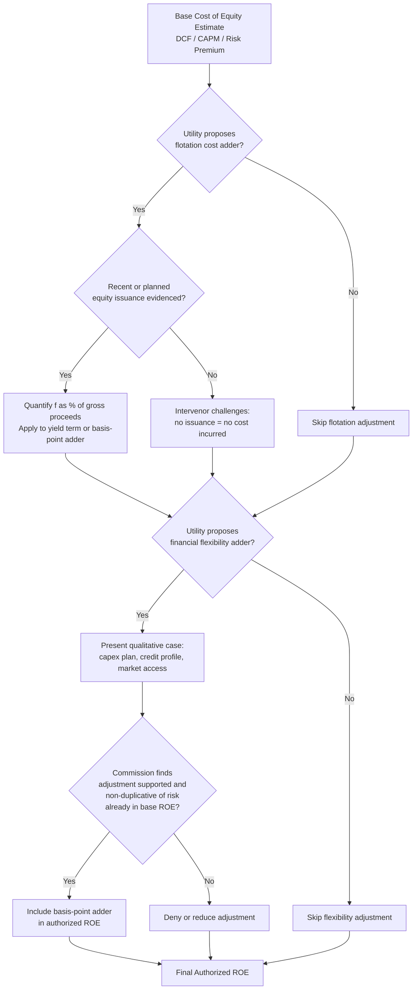

## Flotation Costs and Financial Flexibility Adjustments

### Overview

Flotation costs and financial flexibility adjustments are upward adjustments applied to the bare cost of equity estimate produced by DCF, CAPM, or risk premium methods in a rate case. Both adjustments rest on the same regulatory logic: the authorized return on equity (ROE) must be sufficient not only to compensate investors for the risk of holding the equity, but also to cover the real, unavoidable costs a utility incurs when it actually raises external capital and to preserve the utility's ability to raise capital on reasonable terms in the future. Regulatory commissions in the United States and Canada have historically permitted small basis-point adders (commonly in the range of 10–50 basis points, though this varies by jurisdiction) for one or both adjustments, layered on top of the model-derived ROE before it is applied to rate base.

### Flotation Costs: Definition and Rationale

**Key Points**

- Flotation costs are the direct and indirect costs incurred when a utility issues new common equity securities to the public.
- They include underwriting fees/discounts, legal fees, accounting fees, printing and registration costs, and the indirect cost of "market pressure" (the tendency of a large new issue to depress the stock price temporarily).
- Because these costs reduce the net proceeds actually received by the company relative to the market price of the stock, the DCF or CAPM cost of equity — which is derived from market prices — understates the true cost of raising *new* equity capital.

The core theoretical argument: DCF and CAPM models estimate the return investors require to hold existing shares, which is the cost of *retained earnings* or *existing equity*. When a company sells new shares, it does not receive the full market price per share; the underwriting spread and other issuance costs mean net proceeds are lower than gross proceeds. If the regulator sets rates based only on the market-derived cost of equity, the utility would be unable to earn a return sufficient to offset flotation costs incurred on new issues, and each new equity issuance would dilute existing shareholders' value.

**Example**

$$\text{Adjusted DCF Cost of Equity} = \frac{D_1}{P_0 (1-f)} + g$$

Where $f$ is the flotation cost percentage (e.g., $f = 0.04$ for a 4% flotation cost), $D_1$ is the expected dividend, $P_0$ is the current market price, and $g$ is the expected growth rate. Dividing by $(1-f)$ raises the effective price-adjustment term, which raises the implied cost of equity.

### Mechanics of the Flotation Cost Adjustment

There are two common implementation approaches used by expert witnesses and accepted (with varying frequency) by commissions:

1. **Adjustment to the DCF formula directly.** The dividend yield component $D_1/P_0$ is grossed up by dividing by $(1-f)$, where $f$ is the flotation cost percentage. This directly embeds the flotation cost into the yield term of the Gordon Growth Model, since flotation costs are typically expressed as a percentage of gross issuance proceeds.
2. **Flat basis-point adder.** Many witnesses instead calculate the flotation-cost effect separately (e.g., using a formula that translates $f$ and the frequency of expected future equity issuances into an annualized basis-point equivalent) and then simply add that number (commonly 10–30 basis points) to whatever ROE the DCF/CAPM/risk premium analysis produces, regardless of method.

**Key Points**

- Flotation cost percentages for utility common stock issuances are typically cited in the range of roughly 2%–5% of gross proceeds, though this varies by issue size, market conditions, and flotation method (public offering vs. rights offering vs. dividend reinvestment plan). [Unverified — specific percentages depend on issue-specific underwriting agreements and current capital market conditions.]
- Some jurisdictions permit recovery of flotation costs only for the utility's *most recent* or *reasonably anticipated future* equity issuance, not as a permanent perpetual adder unrelated to actual issuance activity.
- A recurring controversy is whether flotation cost adjustments should apply to a company's *entire* equity balance (including decades of retained earnings on which no flotation cost was ever incurred) or only to the portion of equity actually raised through external issuances. Consumer/intervenor witnesses frequently argue that applying the adjustment to the full equity base substantially overstates the recovery relative to costs actually incurred.

### Regulatory Treatment and Controversy

Flotation cost adjustments are among the most contested elements of ROE testimony. The typical points of dispute:

- **"Costs already recovered" argument**: Opponents argue that flotation costs from *past* issuances were already expensed or capitalized and amortized at the time of issuance (e.g., as a reduction to the proceeds credited to the equity account, or as a deferred charge amortized over time), so applying an ongoing ROE adder for the same costs constitutes double recovery.
- **"No future issuance planned" argument**: If a utility has no imminent plans to issue new common equity (e.g., it is retaining earnings sufficient to fund its equity needs, or is owned by a parent holding company that infuses equity without a public offering), intervenors argue there is no flotation cost to compensate for.
- **Holding company structures**: For a wholly owned utility subsidiary that receives equity infusions from its parent rather than issuing stock to the public, some jurisdictions deny flotation cost adjustments entirely on the theory that no market flotation cost was incurred, while others allow a pass-through of the parent's own flotation costs on a pro-rata basis.
- **Commission acceptance varies widely**: Some commissions accept modest flotation cost allowances as a matter of long-standing practice; others require case-specific proof of actual or reasonably anticipated issuance costs; a minority reject the adjustment outright as speculative or already reflected in the DCF growth rate.

### Financial Flexibility Adjustment: Definition and Rationale

**Key Points**

- The financial flexibility adjustment (sometimes called a "flexibility premium," "market pressure adjustment," or bundled into a broader "ROE adder") compensates the utility for maintaining the financial strength and market access needed to raise capital under adverse or unpredictable market conditions.
- It is conceptually distinct from flotation costs: flotation costs compensate for the *transaction cost* of issuing securities; financial flexibility compensates for maintaining *balance sheet strength and capital-market access* over time, including the ability to issue securities quickly, on short notice, or during unfavorable market windows, without imposing undue dilution or requiring distress pricing.
- Financial flexibility is often justified as necessary to preserve investment-grade credit ratings, support continuous access to both debt and equity markets, and fund large, lumpy capital expenditure programs (e.g., grid modernization, generation replacement, storm restoration) without excessive reliance on any single financing window.

The rationale draws on the broader regulatory principle — traceable to the U.S. Supreme Court's guidance in *Bluefield Water Works* (1923) and *Hope Natural Gas* (1944) — that the authorized return must be sufficient to maintain the utility's credit and to attract capital on reasonable terms. A cost of equity estimate derived purely from a mechanical DCF or CAPM calculation may not, in the judgment of some witnesses and commissions, fully capture the qualitative value of preserving financial flexibility, particularly for utilities facing large, uncertain capital programs or operating in markets subject to periodic dislocation.

### Mechanics and Application

Financial flexibility adjustments are typically applied as:

- A discretionary basis-point adder (commonly 10–50 basis points) added directly to the recommended ROE, justified qualitatively rather than through a specific formula.
- Sometimes merged with, or presented as an alternative label for, the flotation cost adjustment, especially where a witness argues both concerns point in the same direction (i.e., "flotation costs and financial flexibility" is often treated by witnesses as a single combined line-item adjustment rather than two separately quantified components).
- Occasionally justified by reference to the utility's specific circumstances: a heavy near-term capital expenditure plan, a below-average credit rating relative to peers, exposure to storm/catastrophe risk, or a small market capitalization that reduces access to capital markets relative to large-cap peers.

**Key Points**

- Because financial flexibility is inherently qualitative, it is more vulnerable than flotation costs to challenge as unsupported or duplicative of risk already captured in the base ROE estimate (e.g., through the beta used in CAPM, or through comparable-group selection in DCF).
- Commissions that grant such adjustments frequently characterize them as part of the "zone of reasonableness" judgment applied when selecting a specific point estimate from within the range produced by multiple cost-of-equity models, rather than as a mechanically derived formula output.

### Combined Treatment in Rate Case Testimony

In practice, utility ROE witnesses frequently present flotation costs and financial flexibility together as a single supplemental adjustment layered on top of the "base" model results. A typical testimony structure:

1. Estimate cost of equity using DCF (multiple growth rate proxies), CAPM, and/or risk premium/bond-yield-plus-risk-premium methods.
2. Derive a range and a point estimate (often the midpoint or average) from the models.
3. Add a flotation cost adjustment (e.g., 10–20 bps).
4. Add or bundle in a financial flexibility adjustment (e.g., 10–30 bps).
5. Recommend a final authorized ROE that reflects the model output plus the combined adjustment.

**Example**

| Step | Value |
| --- | --- |
| DCF/CAPM average cost of equity | 9.60% |
| Flotation cost adjustment | +0.15% |
| Financial flexibility adjustment | +0.20% |
| Recommended authorized ROE | 9.95% |

Intervenor witnesses (e.g., state consumer advocates, industrial intervenor groups) typically respond by challenging each adjustment individually — disputing the flotation cost percentage assumed, arguing no imminent issuance is planned, and characterizing the financial flexibility adjustment as double-counting risk already reflected in beta, credit spreads, or the selected DCF growth rate.

### Diagram: Layered ROE Build-Up (svg_diagram)

<svg xmlns="http://www.w3.org/2000/svg" viewBox="0 0 720 380">
<rect x="0" y="0" width="720" height="380" fill="#ffffff" />
<text x="360" y="24" text-anchor="middle" font-size="16" font-weight="bold" fill="#1a1a1a">ROE Build-Up: Base Model to Authorized Return (svg_diagram)</text>
<rect x="150" y="290" width="200" height="50" fill="#c9d9f0" stroke="#33487a" stroke-width="1.5" />
<text x="250" y="320" text-anchor="middle" font-size="13" fill="#1a1a1a">Base DCF/CAPM/RP Estimate</text>
<rect x="150" y="230" width="200" height="50" fill="#d9ead3" stroke="#38761d" stroke-width="1.5" />
<text x="250" y="260" text-anchor="middle" font-size="13" fill="#1a1a1a">+ Flotation Cost Adder</text>
<rect x="150" y="170" width="200" height="50" fill="#fff2cc" stroke="#bf9000" stroke-width="1.5" />
<text x="250" y="200" text-anchor="middle" font-size="13" fill="#1a1a1a">+ Financial Flexibility Adder</text>
<rect x="150" y="100" width="200" height="50" fill="#f4cccc" stroke="#a61c1c" stroke-width="1.5" />
<text x="250" y="130" text-anchor="middle" font-size="13" fill="#1a1a1a">= Recommended ROE</text>
<line x1="250" y1="290" x2="250" y2="280" stroke="#555" stroke-width="1.5" marker-end="url(#arrow1)" />
<line x1="250" y1="230" x2="250" y2="220" stroke="#555" stroke-width="1.5" marker-end="url(#arrow1)" />
<line x1="250" y1="170" x2="250" y2="160" stroke="#555" stroke-width="1.5" marker-end="url(#arrow1)" />
<rect x="420" y="130" width="260" height="180" fill="#f9f9f9" stroke="#999999" stroke-width="1" />
<text x="440" y="155" font-size="12" font-weight="bold" fill="#1a1a1a">Contested Points:</text>
<text x="440" y="178" font-size="11" fill="#333333">• Actual vs. past flotation costs</text>
<text x="440" y="198" font-size="11" fill="#333333">• No imminent issuance planned</text>
<text x="440" y="218" font-size="11" fill="#333333">• Applied to full equity vs. new</text>
<text x="440" y="238" font-size="11" fill="#333333">issuance only</text>
<text x="440" y="258" font-size="11" fill="#333333">• Flexibility = double-counted risk?</text>
<text x="440" y="278" font-size="11" fill="#333333">• Qualitative vs. formulaic basis</text>
</svg>

### Decision Logic Across a Rate Case

### Practical Application Example

**Example**

A vertically integrated electric utility is undertaking a multi-year, capital-intensive grid modernization program and anticipates issuing $300 million of new common equity over the next two years (partly through a public offering and partly through its dividend reinvestment plan). Its ROE witness:

1. Estimates flotation costs at 3.5% of gross proceeds for the public offering tranche (based on recent comparable utility issuances) and near-zero for the DRIP tranche.
2. Blends these into a weighted average flotation cost of roughly 2.1% across anticipated issuances.
3. Converts this into an annualized basis-point equivalent of approximately 12 basis points, added to the DCF-derived cost of equity.
4. Separately argues for a 15 basis-point financial flexibility adder, citing the utility's below-median FFO/debt credit metric relative to its proxy group and the scale of upcoming capital expenditures.
5. Recommends a total ROE of base estimate + 27 basis points.

Intervenor testimony in response typically argues that (a) the DRIP tranche should not be blended into the flotation cost calculation since it carries negligible issuance cost, (b) the financial flexibility adjustment duplicates risk already reflected in the utility's beta and credit-spread-based risk premium, and (c) commissions in the same jurisdiction have historically approved smaller adjustments in comparable cases.

### Distinguishing From Other ROE Adjustments

**Key Points**

- Flotation costs and financial flexibility are distinct from a **size premium** (compensating small-cap utilities for higher perceived risk relative to large-cap proxy groups) and from **credit-quality adjustments** (compensating for a utility's specific credit rating relative to the proxy group average), though all four are sometimes lumped together informally as "ROE adders."
- They are also distinct from **stand-alone vs. consolidated capital structure adjustments**, which address capital structure ratios rather than the cost-of-equity rate itself.
- Regulators generally scrutinize whether multiple adders, taken together, risk double-counting the same underlying risk factor multiple times across different line items.

### Conclusion

Flotation cost and financial flexibility adjustments represent the layer of ROE testimony where market-model outputs are translated into a rate that accounts for the real-world friction and strategic considerations of raising equity capital. Flotation costs address a concrete, if often modest and disputed, transaction cost; financial flexibility addresses a more qualitative concern about maintaining capital-market access and credit strength. Both adjustments are frequently contested on evidentiary grounds — whether costs were actually incurred, whether issuance is imminent, and whether the qualitative flexibility rationale duplicates risk already priced into the base cost-of-equity estimate — and their acceptance and magnitude vary substantially by jurisdiction and by the specific facts of each rate case. [Inference — the degree of acceptance and typical basis-point magnitude are drawn from patterns observed across many U.S. state rate case proceedings and secondary regulatory finance literature; specific outcomes are jurisdiction- and case-specific and should be verified against current orders in the relevant jurisdiction.]

**Related Topics**

- DCF Model Growth Rate Selection and Multi-Stage DCF Variants
- CAPM and Empirical CAPM (ECAPM) Adjustments for Utility Beta
- Risk Premium and Bond-Yield-Plus-Risk-Premium Methods
- Proxy Group Selection and Comparability Screens
- Capital Structure Ratemaking: Hypothetical vs. Actual Capital Structure
- Credit Metrics and Their Role in ROE Determination (FFO/Debt, Interest Coverage)
- Size Premium Adjustments for Small-Cap Utility Proxy Groups
- Zone of Reasonableness and Commission Discretion in Setting Point Estimates
- *Hope Natural Gas* and *Bluefield Water Works* Constitutional Standards for Utility Returns