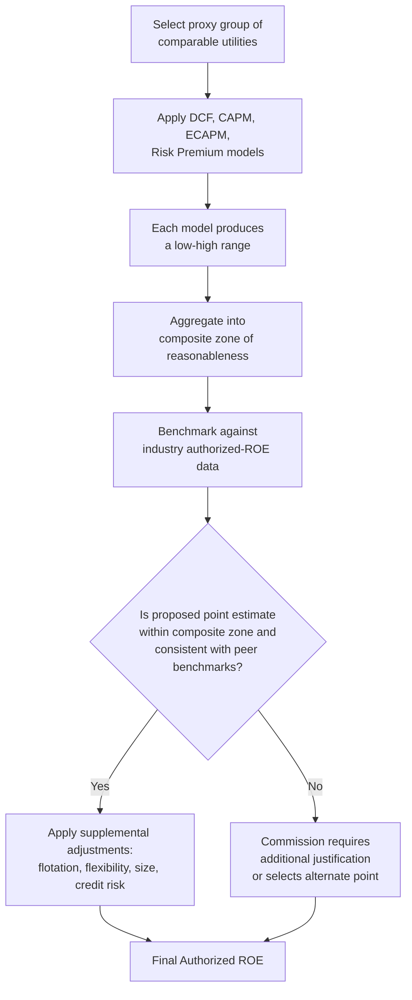

## Zone of Reasonableness and ROE Benchmarking

### Overview

The "zone of reasonableness" is the regulatory concept that a utility's authorized return on equity (ROE) need not be a single, uniquely correct number, but rather a point selected from within a range of results produced by multiple cost-of-equity estimation methods, informed by benchmarking against comparable utilities and by broader financial and economic context. The concept originates in the constitutional standards articulated in *Bluefield Water Works & Improvement Co. v. Public Service Commission of West Virginia* (1923) and *Federal Power Commission v. Hope Natural Gas Co.* (1944), which hold that regulators are not required to use any particular methodology, only to arrive at an overall result that is just and reasonable. ROE benchmarking is the empirical exercise of comparing a utility's proposed or authorized ROE against a proxy group of comparable companies and against sector-wide and industry-wide authorized ROE data, to test whether a specific point estimate falls within a defensible range.

### Legal and Regulatory Foundations

**Key Points**

- *Bluefield* (1923) established that a utility is entitled to a return equal to that generally earned by other businesses of corresponding risk in the same general region, sufficient to maintain financial integrity and attract capital.
- *Hope Natural Gas* (1944) clarified that the regulatory result, not the specific methodology, is what matters — courts do not require any single formula, and reasonable results are protected against challenge "even though the method employed to reach that result may contain infirmities."
- These cases collectively give rise to the "end result" doctrine: a commission may use DCF, CAPM, risk premium, comparable earnings, or a blend of methods, and may select any point estimate within the zone produced by those methods, so long as the *overall* return meets the constitutional standard.
- The zone of reasonableness is therefore not a fixed statistical construct (such as a confidence interval) but a range bounded by the low and high results of the accepted methodologies applied to an appropriately selected proxy group.

### Constructing the Zone: Methodological Inputs

The zone is typically built from the following model outputs, each producing its own range:

1. **DCF (Discounted Cash Flow) results** — using multiple growth rate proxies (analyst consensus estimates, historical growth, sustainable growth $g = br$, or GDP-based long-term growth in multi-stage models), producing a range of single-stage and multi-stage DCF results.
2. **CAPM results** — using multiple risk-free rate proxies (e.g., current 30-year Treasury yield vs. a projected/forecasted yield) and multiple market risk premium estimates (historical realized MRP vs. forward-looking/implied MRP), and sometimes an Empirical CAPM (ECAPM) adjustment for low-beta utility stocks.
3. **Risk premium / bond-yield-plus-risk-premium results** — adding a historical or regression-based equity risk premium to current or projected utility bond yields.
4. **Comparable earnings results** (used less frequently in modern proceedings) — benchmarking against the achieved or expected returns on book equity of comparable non-utility or utility companies.

**Example**

| Method | Low | High |
| --- | --- | --- |
| Single-stage DCF | 8.90% | 9.80% |
| Multi-stage DCF | 9.20% | 10.10% |
| CAPM | 8.70% | 9.90% |
| ECAPM | 9.10% | 10.20% |
| Risk Premium | 9.00% | 10.00% |
| **Composite Zone of Reasonableness** | **8.70%** | **10.20%** |

The witness or commission then typically selects a point estimate near the midpoint of the composite zone, adjusted upward or downward based on company-specific risk factors (financial flexibility, credit metrics, capital expenditure intensity, size, regulatory mechanisms such as decoupling or trackers).

### Proxy Group Selection for Benchmarking

**Key Points**

- Because a target utility's own stock may not have sufficiently liquid or meaningful market data (especially for a wholly owned subsidiary with no publicly traded stock), witnesses construct a proxy group of comparable publicly traded utilities to apply DCF/CAPM/risk premium models.
- Common screens: primary business classified as regulated electric, gas, or water utility (e.g., by SIC/NAICS code or index membership); investment-grade credit rating; a minimum percentage of regulated revenue or operating income; positive and stable dividend history; analyst coverage sufficient to generate consensus growth estimates; absence of pending mergers or major corporate transactions that could distort market pricing.
- Trade-off in proxy group size: a larger group improves statistical reliability but may dilute comparability; a smaller, more tightly screened group improves comparability but increases sensitivity to outliers.
- Witnesses on opposing sides of a rate case frequently propose different proxy groups, which is itself a major driver of disagreement over the resulting zone of reasonableness.

### ROE Benchmarking Against Industry Data

Beyond model-based estimation, benchmarking also involves comparing a proposed or authorized ROE against empirical data on ROEs authorized in other jurisdictions for comparable utility types, often compiled from sources such as regulatory research services tracking authorized returns nationally.

**Key Points**

- Benchmarking data is typically segmented by utility type (electric, gas, water), region, and time period, since authorized ROEs can vary meaningfully across these dimensions due to differences in capital structure, risk profile, and local regulatory philosophy.
- A common rhetorical use of benchmarking in testimony is to argue that a proposed ROE is "consistent with" or "below/above" the national or regional average for comparable utilities, supporting or challenging the reasonableness of the recommendation.
- Benchmarking against *authorized* ROEs (regulatory outcomes) is conceptually distinct from benchmarking against *market-derived* cost of equity (DCF/CAPM outputs); the former reflects other commissions' policy judgments and can lag or lead capital market conditions, while the latter reflects current market pricing. Relying too heavily on authorized-ROE benchmarking risks circularity — anchoring new decisions to past decisions rather than to current capital market evidence. [Inference — this critique is a recurring theme in ROE testimony and regulatory economics literature but is not a universally adopted rule across jurisdictions.]

### Selecting the Point Estimate Within the Zone

**Key Points**

- Commissions generally have broad discretion to select any point within (and in some jurisdictions, in rare cases, marginally outside) the composite zone, provided the choice is supported by record evidence and adequately explained.
- Typical selection approaches: midpoint of the composite range; median of individual model results; average of model midpoints; or a judgmentally selected point informed by qualitative risk factors (credit rating trends, capital expenditure plans, regulatory mechanisms, business risk relative to the proxy group).
- Adjustments layered onto the selected point estimate (e.g., flotation costs, financial flexibility, size premium) are typically applied *after* the zone is established, moving the final recommendation within or, in some contested cases, slightly beyond the composite zone.
- Appellate and judicial review of ROE decisions under the *Hope*/*Bluefield* standard is generally deferential: courts typically ask whether the overall result is just and reasonable and supported by substantial evidence, not whether the commission chose the theoretically "optimal" point within the zone.

### Diagram: Building and Applying the Zone of Reasonableness (svg_diagram)

<svg xmlns="http://www.w3.org/2000/svg" viewBox="0 0 760 420">
<rect x="0" y="0" width="760" height="420" fill="#ffffff" />
<text x="380" y="24" text-anchor="middle" font-size="16" font-weight="bold" fill="#1a1a1a">Zone of Reasonableness Construction (svg_diagram)</text>
<line x1="80" y1="340" x2="680" y2="340" stroke="#333333" stroke-width="2" />
<text x="80" y="360" font-size="11" text-anchor="middle" fill="#333333">8.5%</text>
<text x="380" y="360" font-size="11" text-anchor="middle" fill="#333333">9.5%</text>
<text x="680" y="360" font-size="11" text-anchor="middle" fill="#333333">10.5%</text>
<rect x="140" y="300" width="150" height="18" fill="#c9d9f0" stroke="#33487a" />
<text x="60" y="313" font-size="11" fill="#1a1a1a" text-anchor="end">DCF</text>
<rect x="200" y="270" width="160" height="18" fill="#d9ead3" stroke="#38761d" />
<text x="60" y="283" font-size="11" fill="#1a1a1a" text-anchor="end">CAPM</text>
<rect x="230" y="240" width="150" height="18" fill="#fff2cc" stroke="#bf9000" />
<text x="60" y="253" font-size="11" fill="#1a1a1a" text-anchor="end">Risk Prem.</text>
<rect x="220" y="210" width="170" height="18" fill="#f4cccc" stroke="#a61c1c" />
<text x="60" y="223" font-size="11" fill="#1a1a1a" text-anchor="end">ECAPM</text>
<line x1="220" y1="180" x2="220" y2="330" stroke="#666666" stroke-width="1.5" stroke-dasharray="4,3" />
<line x1="390" y1="180" x2="390" y2="330" stroke="#666666" stroke-width="1.5" stroke-dasharray="4,3" />
<rect x="220" y="170" width="170" height="20" fill="#eeeeee" stroke="#666666" />
<text x="305" y="184" text-anchor="middle" font-size="11" fill="#1a1a1a">Composite Zone</text>
<circle cx="305" cy="150" r="6" fill="#a61c1c" />
<text x="305" y="130" text-anchor="middle" font-size="11" fill="#1a1a1a">Selected Point Estimate</text>
<line x1="305" y1="156" x2="305" y2="170" stroke="#a61c1c" stroke-width="1.5" />

<text x="380" y="405" text-anchor="middle" font-size="12" fill="`#333333`">Authorized ROE = Point Estimate + Adjustments (flotation, flexibility, size, credit)</text>

</svg>

### Decision Flow

### Practical Application Example

**Example**

A gas distribution utility's witness constructs a proxy group of 8 publicly traded gas LDCs, screened for investment-grade ratings and at least 70% regulated revenue. DCF results range 9.0%–9.7%; CAPM (using both current and near-term projected Treasury yields) ranges 8.8%–9.9%; risk premium analysis ranges 9.1%–9.8%. The composite zone is roughly 8.8%–9.9%. The witness benchmarks this against a national dataset showing recently authorized gas utility ROEs averaging approximately 9.6%, and recommends a point estimate of 9.65% — near the top of the composite zone — citing the utility's below-average equity ratio relative to the proxy group and an elevated near-term capital expenditure program. Intervenor testimony counters with a broader, differently screened proxy group producing a lower composite zone (8.5%–9.5%) and recommends a point estimate of 9.15%, arguing the utility's risk profile is average relative to the sector.

### Common Sources of Dispute

**Key Points**

- **Proxy group composition** — the single largest driver of divergent zone estimates between utility and intervenor witnesses.
- **Growth rate and risk-free rate assumptions** — small changes in DCF growth proxies or CAPM risk-free rate assumptions can shift the zone by 50+ basis points.
- **Market risk premium estimation method** — historical realized MRP vs. forward-looking/implied MRP can produce materially different CAPM results, especially during periods of unusually high or low bond yields.
- **Reliance on authorized-ROE benchmarking vs. market-based models** — disputes over whether benchmarking against other commissions' past decisions is a valid input or introduces circularity/lag relative to current capital market conditions.
- **Placement within the zone** — even where parties agree on the composite range, they frequently disagree sharply on where within that range the specific utility's risk profile justifies placement.

### Conclusion

The zone of reasonableness operationalizes the *Hope*/*Bluefield* "end result" doctrine by allowing multiple cost-of-equity methodologies, applied to a carefully selected proxy group, to define a defensible range rather than a single mechanically derived number. ROE benchmarking — both model-based (DCF/CAPM/risk premium) and empirical (comparison to industry-authorized ROE data) — provides the evidentiary basis for selecting and defending a specific point estimate within that range. Because proxy group selection, growth rate assumptions, and risk premium methodology each materially shift the boundaries of the zone, disputes over these inputs, rather than disputes over the underlying legal standard, dominate most contested ROE proceedings. [Inference — the relative weight given to each dispute category varies by jurisdiction and by the specific facts and expert testimony presented in each rate case.]

**Related Topics**

- DCF Model Growth Rate Selection and Multi-Stage DCF Variants
- CAPM and Empirical CAPM (ECAPM) Adjustments for Utility Beta
- Risk Premium and Bond-Yield-Plus-Risk-Premium Methods
- Proxy Group Selection and Comparability Screens
- Flotation Costs and Financial Flexibility Adjustments
- Size Premium Adjustments for Small-Cap Utility Proxy Groups
- Capital Structure Ratemaking: Hypothetical vs. Actual Capital Structure
- *Hope Natural Gas* and *Bluefield Water Works* Constitutional Standards for Utility Returns
- Credit Rating Agency Methodologies and Their Interaction with Authorized ROE