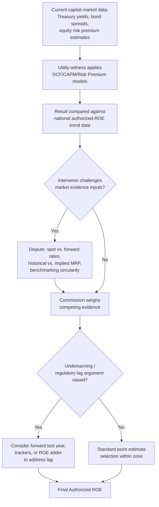

## Authorized ROE Trends and Market Evidence Disputes

### Overview

Authorized ROE trends refer to the historical and current pattern of return-on-equity levels approved by regulatory commissions across rate cases, most comprehensively tracked in the United States by Regulatory Research Associates (RRA), a group within S&P Global Commodity Insights. Market evidence disputes refer to the recurring disagreements between utility witnesses, intervenor witnesses, and commission staff over how current and forward-looking capital market conditions (interest rates, equity risk premiums, credit spreads) should translate into an appropriate authorized ROE, and over whether historical authorized-ROE data itself should be treated as persuasive evidence or as a lagging, potentially circular reference point.

### Historical Trend Pattern

**Key Points**

- Authorized ROEs for U.S. electric and gas utilities declined steadily for roughly two decades through the low-interest-rate environment of the 2010s and into 2021, reaching historical lows around that period.
- The average authorized return on equity for electric utilities was 9.39% in rate cases decided in the first half of 2022, in line with the 9.38% average for full-year 2021. [EFIS](https://efis.psc.mo.gov/Document/Display/53586)
- The average ROE authorized for electric utilities was 9.60% for rate cases decided in 2023, up from the 9.54% average observed in full year 2022, and the average ROE authorized for gas utilities was 9.64% for cases decided in 2023, up from 9.53% in 2022. [S&P Global](https://www.spglobal.com/market-intelligence/en/news-insights/research/underearning-spread-widens-for-gas-electric-utilities-in-roe-analysis)
- Excluding rider cases, the average authorized ROE for electric cases was 9.68% in the first half of 2024, versus 9.66% for full year 2023. [Utah](https://pscdocs.utah.gov/electric/24docs/2403504/336109DPUExhbt3.14MjrEnrgyRtCsDcsns10-17-2024.pdf)
- Excluding rider cases, the average authorized ROE for electric cases was 9.68% in the first half of 2025 versus 9.78% in full year 2024, indicating a drop in the electric authorized ROE compared with the full-year 2024 average, while the average gas authorized return on equity remained unchanged. [KY PSC](https://psc.ky.gov/pscecf/2025-00114/kyle.j.smith124.civ@army.mil/09232025013307/MPG_Copyright_Protected_WP_27.pdf)
- In 2024, the average authorized returns for electric and gas utilities rose moderately compared to 2023, driven by a higher interest rate environment. [KY PSC](https://psc.ky.gov/pscecf/2025-00114/kyle.j.smith124.civ@army.mil/09232025013307/MPG_Copyright_Protected_WP_27.pdf)
- The average authorized ROE for US electric utilities was approximately 9.5–9.7% in 2024–2025, though individual decisions ranged widely, with Florida Power & Light receiving a 10.95% ROE in its November 2025 settlement, one of the highest recent awards. [Ibinterviewquestions](https://ibinterviewquestions.com/guides/energy-investment-banking/regulated-utilities-rate-base-rate-cases-allowed-roe)
- In January 2026, eight base rate cases were completed, with authorized ROEs for the five proceedings that disclosed cost-of-capital parameters ranging from 9.40% in New York to 10.00% in Missouri. [Gabelli](https://gabelli.com/research/utilities-u-s-outlook/)

[Unverified — RRA figures are compiled periodically and subsequent quarters/years may revise or supersede the specific percentages above; consult the current RRA Regulatory Focus release for the most recent data.]

### Structural Drivers of the Trend

**Key Points**

- The multi-decade decline through the 2010s tracked the broader decline in long-term Treasury yields and corporate bond yields, since most cost-of-equity models (CAPM, risk-premium, and to a lesser extent DCF) are anchored to a risk-free rate or bond-yield benchmark.
- The reversal beginning around 2022–2023 tracked the sharp rise in interest rates as central banks tightened monetary policy, raising both the risk-free rate input to CAPM and the utility bond yields used in risk-premium models.
- RRA has found that annual average authorized ROEs in vertically integrated cases, which involve generation, have been about 30 to 65 basis points higher than in distribution-only cases, arguably reflecting the increased risk associated with ownership and operation of generation assets. [EFIS](https://efis.psc.mo.gov/Document/Display/53586)
- Different utility sectors can diverge in timing and magnitude: in the first half of 2020, water utility ROEs averaged 8.82%, compared to a 9.63% average in water utility rate cases completed in 2019 — a steeper decline than seen concurrently in electric and gas, though RRA has attributed some sector-specific swings to small sample sizes and individual outlier decisions rather than a broad structural shift. For electric distribution-only utilities specifically, the average ROE authorized during the first half of 2020 was 9.16%, compared to 9.37% in 2019. [utah](https://pscdocs.utah.gov/electric/20docs/2003504/316341Exh4OCSCross11-10-2020.pdf)[utah](https://pscdocs.utah.gov/electric/20docs/2003504/316341Exh4OCSCross11-10-2020.pdf)
- Settled cases and fully litigated cases can produce different average ROEs in a given period, and the mix between the two (which varies by jurisdiction and year) affects the reported industry average independent of any underlying shift in cost of capital.

### FERC-Authorized ROE as a Distinct Track

**Key Points**

- Federal Energy Regulatory Commission (FERC)-authorized ROEs for interstate transmission owners follow a separate, federally administered methodology and track record from state-authorized retail ROEs, and the two should not be conflated in benchmarking exercises.
- On March 19, 2026, FERC lowered allowed ROEs for New England transmission owners to 9.57%, down from the 10.57% set in 2014. [Gabelli](https://gabelli.com/research/utilities-u-s-outlook/)
- The affected transmission owners were expected to appeal, based on long-standing judicial precedent requiring FERC to set rates of return sufficient to attract capital, and the decision was not expected to be applied prospectively or to other owners because it responded to a 15-year-old complaint/litigation using data from October 2012–March 2013. [Unverified — appeal outcomes and any subsequent FERC or judicial rulings on this matter should be checked against current FERC dockets and appellate filings.] [Gabelli](https://gabelli.com/research/utilities-u-s-outlook/)
- This episode illustrates a recurring market-evidence dispute: whether an ROE calculated using a historically dated data window (in this case, 2012–2013) remains a reasonable and current reflection of the cost of capital at the time of the order (2026), or whether reliance on such data introduces the same "lagging reference point" problem that critics raise about authorized-ROE benchmarking generally.

### Core Market Evidence Disputes

**Key Points**

- **Interest rate trajectory and timing** — parties dispute whether current spot Treasury/bond yields, near-term forward/projected yields, or longer-term historical averages should anchor CAPM and risk-premium calculations, since utility ROE decisions are prospective (setting rates for a future test year) while most market data is necessarily historical or current-spot.
- **Historical vs. forward-looking market risk premium (MRP)** — utility witnesses and intervenors frequently disagree on whether the MRP input to CAPM should be a long-run historical average (often cited in the 5.5%–7% range depending on the data series and time horizon) or an implied/forward-looking MRP derived from current market data (e.g., an implied DCF-based MRP on a broad equity index), with the two approaches sometimes producing materially different CAPM results, especially in periods of unusual bond-yield/equity-valuation relationships. [Unverified — specific MRP magnitude ranges are frequently updated and contested figures in testimony; current filings should be checked for jurisdiction-specific figures.]
- **Inverse relationship between interest rates and equity risk premium** — some academic and consulting-firm research argues that the equity risk premium widens when interest rates are unusually low and narrows when rates are unusually high (a negative correlation), which if incorporated tends to dampen the swing in CAPM-derived cost of equity relative to a simple additive risk-free-rate-plus-fixed-MRP approach; intervenors often contest the magnitude and even the direction of this relationship as applied to a specific proceeding.
- **Use of authorized-ROE benchmarking as evidence** — as discussed in Zone of Reasonableness content, using other commissions' authorized ROEs as a benchmark is criticized by some parties as circular (anchoring to past regulatory decisions rather than current capital markets) and as potentially lagging turning points in interest rates, while defenders argue it provides a useful cross-check against model results that can be distorted by methodology-specific assumptions.
- **DCF growth rate divergence** — analyst consensus long-term growth estimates (commonly used in single-stage DCF) can diverge substantially from GDP-growth-anchored terminal growth rates used in multi-stage DCF, and which growth proxy is "more market-representative" is itself a recurring point of dispute.
- **Flotation costs, financial flexibility, and size premium adders** — as covered in the corresponding chapter items, these supplemental adjustments layered onto model output are contested both individually and in combination, and their cumulative effect can meaningfully influence where a specific case's recommended ROE falls relative to the broader industry trend.
- **State regulatory climate and its effect on the trend line** — RRA maintains a ranking of how constructive each state's regulatory environment is in supporting utilities in earning their allowed ROE, and this ranking has shifted over time — for example, RRA raised California's ranking due to improving treatment of incremental wildfire liabilities and raised Arizona's ranking reflecting constructive recent rate case decisions, while lowering Montana's ranking due to incremental risk from recent rate case developments and lowering Alaska's designation due to the absence of innovative or proactive developments. These jurisdiction-specific shifts mean that national average authorized-ROE trend data can mask significant underlying variation in how "constructive" or restrictive individual state commissions are being. [Gabelli](https://gabelli.com/research/utilities-u-s-2/)

### Underearning as a Related Market Evidence Concept

**Key Points**

- A related and increasingly cited metric is the "underearning spread" — the gap between a utility's authorized ROE and the ROE it actually earns, driven substantially by regulatory lag (the delay between capital investment and rate recovery).
- RRA has observed a widening underearning spread for gas and electric utilities, which utility witnesses often cite as market evidence supporting either a higher authorized ROE or supplemental mechanisms (formula rates, forward test years, trackers) to narrow the gap between authorized and earned returns. [S&P Global](https://www.spglobal.com/market-intelligence/en/news-insights/research/underearning-spread-widens-for-gas-electric-utilities-in-roe-analysis)
- Regulatory lag — the time gap between when a utility incurs costs and when it begins recovering those costs through rates — erodes utility earnings because the utility spends capital without earning its allowed return during the lag period; a utility might invest $2 billion in infrastructure in one year but not receive new rates reflecting that investment until roughly two years later under a traditional historical test-year rate case model. [Unverified — specific lag duration is illustrative and varies by jurisdiction, test-year methodology (historical vs. forward-looking), and case-processing timelines.] [Ibinterviewquestions](https://ibinterviewquestions.com/guides/energy-investment-banking/regulated-utilities-rate-base-rate-cases-allowed-roe)
- This dynamic is frequently invoked in testimony as independent market evidence that nominal authorized ROE trend data overstates the utility's actual realized returns, complicating simple period-over-period trend comparisons.

### Diagram: Authorized ROE Trend and Dispute Drivers (svg_diagram)

<svg xmlns="http://www.w3.org/2000/svg" viewBox="0 0 760 400">
<rect x="0" y="0" width="760" height="400" fill="#ffffff" />
<text x="380" y="24" text-anchor="middle" font-size="16" font-weight="bold" fill="#1a1a1a">Authorized ROE Trend Drivers (svg_diagram)</text>
<line x1="80" y1="300" x2="700" y2="300" stroke="#333333" stroke-width="1.5" />
<line x1="80" y1="60" x2="80" y2="300" stroke="#333333" stroke-width="1.5" />
<text x="40" y="70" font-size="10" fill="#333333">10.6%</text>
<text x="40" y="180" font-size="10" fill="#333333">9.6%</text>
<text x="40" y="295" font-size="10" fill="#333333">8.8%</text>
<polyline points="100,110 180,190 260,240 340,255 420,220 500,200 580,205 660,215" fill="none" stroke="#33487a" stroke-width="2.5" />
<circle cx="100" cy="110" r="3" fill="#33487a" />
<circle cx="180" cy="190" r="3" fill="#33487a" />
<circle cx="260" cy="240" r="3" fill="#33487a" />
<circle cx="340" cy="255" r="3" fill="#33487a" />
<circle cx="420" cy="220" r="3" fill="#33487a" />
<circle cx="500" cy="200" r="3" fill="#33487a" />
<circle cx="580" cy="205" r="3" fill="#33487a" />
<circle cx="660" cy="215" r="3" fill="#33487a" />

<text x="100" y="315" font-size="10" text-anchor="middle" fill="`#333333`">2014</text>

<text x="260" y="315" font-size="10" text-anchor="middle" fill="`#333333`">2019</text>

<text x="340" y="315" font-size="10" text-anchor="middle" fill="`#333333`">2021-22</text>

<text x="500" y="315" font-size="10" text-anchor="middle" fill="`#333333`">2024</text>

<text x="660" y="315" font-size="10" text-anchor="middle" fill="`#333333`">2025-26</text>

<rect x="440" y="60" width="280" height="180" fill="#f9f9f9" stroke="#999999" />
<text x="455" y="80" font-size="12" font-weight="bold" fill="#1a1a1a">Contested Evidence Inputs:</text>
<text x="455" y="100" font-size="10" fill="#333333">• Spot vs. projected risk-free rate</text>
<text x="455" y="118" font-size="10" fill="#333333">• Historical vs. implied MRP</text>
<text x="455" y="136" font-size="10" fill="#333333">• Rate-risk premium inverse relation</text>
<text x="455" y="154" font-size="10" fill="#333333">• Authorized-ROE benchmarking circularity</text>
<text x="455" y="172" font-size="10" fill="#333333">• Regulatory lag / underearning spread</text>
<text x="455" y="190" font-size="10" fill="#333333">• State regulatory climate rankings</text>
<text x="455" y="208" font-size="10" fill="#333333">• Settled vs. fully litigated case mix</text>
</svg>

### Decision Logic in a Rate Case

### Practical Application Example

**Example**

An electric utility files a rate case in a period following a sustained rise in Treasury yields. Its ROE witness argues that CAPM and risk-premium results have risen materially relative to the utility's last authorized ROE three years earlier, and cites the national RRA average trend (e.g., a rise from roughly the mid-9% range to the high-9% range over the intervening years) as corroborating market evidence supporting an increase. Intervenor testimony responds on three fronts: (1) using a longer-run historical MRP rather than a current implied MRP produces a lower CAPM result; (2) the national RRA average partly reflects a different mix of settled versus litigated cases and a shift toward more vertically integrated (generation-owning) utilities in the sample, which mechanically raises the average without reflecting a uniform market-wide increase in the cost of equity; and (3) the utility's own bond spread has not widened proportionally, suggesting credit markets do not perceive a commensurate increase in the utility's risk. The commission's order addresses each point, ultimately selecting a point estimate that reflects a partial but not full pass-through of the market-derived increase, citing both model results and the qualitative reasonableness of the outcome relative to peer utilities.

### Conclusion

Authorized ROE trends reflect the interaction between underlying capital market conditions (interest rates, credit spreads, equity risk premiums) and the accumulated pattern of individual commission decisions, tracked most systematically through data compiled by RRA/S&P Global. After a prolonged decline through the 2010s and into the early 2020s, authorized ROEs rose through 2023–2024 alongside higher interest rates, with more recent data showing signs of leveling or modest divergence by utility type and jurisdiction. Market evidence disputes in individual rate cases center less on the existence of this trend than on which specific inputs — spot versus forward interest rates, historical versus implied risk premiums, and the probative value of authorized-ROE benchmarking itself — should govern the model-based estimation that ultimately produces a jurisdiction- and case-specific authorized ROE. [Inference — the relative weight commissions give to each disputed input varies substantially by jurisdiction, by the specific expert testimony presented, and over time as capital market conditions evolve; current RRA data and recent orders in the relevant jurisdiction should be consulted for case-specific analysis.]

**Related Topics**

- Zone of Reasonableness and ROE Benchmarking
- Flotation Costs and Financial Flexibility Adjustments
- CAPM and Empirical CAPM (ECAPM) Adjustments for Utility Beta
- DCF Model Growth Rate Selection and Multi-Stage DCF Variants
- Risk Premium and Bond-Yield-Plus-Risk-Premium Methods
- Regulatory Lag and the Test Year (Historical vs. Forward-Looking)
- Formula Rates, Trackers, and Riders as Lag-Mitigation Mechanisms
- FERC Cost-of-Capital Methodology for Interstate Transmission Owners
- RRA/S&P Global State Regulatory Climate Rankings