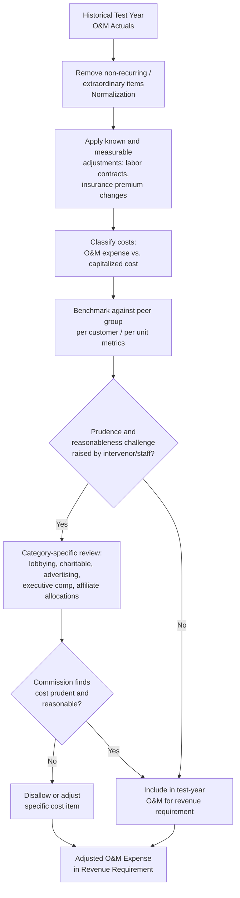

## Operations and Maintenance Expense Review

### Overview

Operations and Maintenance (O&M) expense review is the process by which regulators, utility rate case witnesses, and intervenors examine a utility's recurring operating costs to determine which amounts are properly includable in the revenue requirement used to set customer rates. O&M expense sits alongside depreciation, taxes, and the return component (rate base × ROE) as one of the core building blocks of the revenue requirement formula. Because O&M expenses are recurring and directly flow through to the test-year cost of service, they receive close scrutiny for reasonableness, prudence, and whether costs are properly classified, normalized, and forecast for the rate-effective period.

### Role of O&M in the Revenue Requirement

**Key Points**

- The basic revenue requirement formula is:

$$RR = O\&M + D + T + (RB \times r)$$

Where $RR$ is revenue requirement, $O\&M$ is operations and maintenance expense, $D$ is depreciation expense, $T$ is taxes (income and other), $RB$ is rate base, and $r$ is the authorized rate of return.

- O&M expense is a dollar-for-dollar pass-through in the revenue requirement (unlike rate base items, which only generate a return equal to $RB \times r$), so a $1 increase in allowed O&M produces roughly a $1 increase in revenue requirement, making O&M review economically significant even for moderate-sized cost categories.
- O&M is typically the single largest cost category in a utility's cost of service after depreciation, taxes, and return, and often represents 20%–40% of total revenue requirement depending on utility type and capital intensity. [Unverified — the specific percentage varies substantially by utility type, capital structure, and jurisdiction, and should be confirmed against the specific utility's cost-of-service study.]

### Categories of O&M Expense

**Key Points**

- **Operations expense** — costs of running the system day-to-day: fuel and purchased power (for generation utilities), labor for system operators and dispatchers, customer service and billing, meter reading, administrative and general (A&G) expenses, insurance, and regulatory/compliance costs.
- **Maintenance expense** — costs of sustaining existing plant in serviceable condition: routine repairs, vegetation management (tree trimming for overhead lines), equipment servicing, corrective and preventive maintenance programs, and non-capitalized system inspections.
- **Administrative and General (A&G) expense** — a distinct sub-category often reviewed separately, covering executive compensation, corporate overhead, legal and regulatory affairs, pension and benefits costs, and allocated shared-service costs from an affiliated holding company or service company.
- Distinguishing O&M from capital expenditure is a frequent point of dispute: costs that extend the useful life or increase the capacity of an asset are generally capitalized (added to rate base and depreciated over time), while costs that merely maintain existing service capability are expensed as O&M in the test year. Utilities have an incentive, and regulators scrutinize for the risk, of misclassifying costs between the two categories, since capitalized costs earn a return while expensed costs do not (though they are still recovered dollar-for-dollar).

### Test Year and Normalization Concepts

**Key Points**

- O&M is typically reviewed on the basis of a test year — either a historical test year (actual costs from a completed 12-month period, sometimes adjusted for known and measurable changes) or a forward-looking/future test year (a forecast of costs expected during the rate-effective period), with the choice of test-year methodology governed by state statute or commission practice.
- **Normalization adjustments** remove non-recurring, unusual, or non-representative items from the test-year O&M base so that the resulting revenue requirement reflects ongoing, recurring cost levels rather than a one-time anomaly. Common normalization adjustments include:
  - Removing storm restoration costs that exceed a normal/average level (often addressed instead through a separate storm reserve or rider mechanism).
  - Annualizing partial-year cost changes (e.g., a wage increase that took effect mid-year is annualized to reflect a full year at the new rate).
  - Removing one-time litigation settlements, merger-related costs, or extraordinary write-offs.
  - Adjusting incentive compensation tied to financial metrics (as opposed to safety or operational metrics) to reflect ratepayer versus shareholder cost-sharing principles.
- **Known and measurable adjustments** modify historical test-year O&M for changes that are certain (or reasonably certain) to occur during the rate-effective period but that are not yet reflected in historical actuals — for example, a new labor contract with defined wage increases, a known increase in property insurance premiums, or the addition of a specific new maintenance program.

### Prudence and Reasonableness Review

**Key Points**

- Commissions apply a "prudence" or "reasonableness" standard to O&M expense, generally asking whether costs were incurred in a manner consistent with what a reasonable utility management would have done under the circumstances known or reasonably knowable at the time — not whether hindsight later shows a different decision would have produced a better outcome (the "no retroactive hindsight" principle common in many, though not all, jurisdictions).
- Intervenors and commission staff commonly challenge specific O&M categories through:
  - **Benchmarking analysis** — comparing the utility's O&M per customer, per mile of line, or per unit of some other cost driver against a peer group of similarly situated utilities, flagging categories where the subject utility's costs appear materially above the peer median or average.
  - **Trend analysis** — comparing the utility's O&M growth rate over a multi-year historical period against inflation, customer growth, or other relevant cost drivers, challenging growth that appears to outpace these benchmarks without adequate explanation.
  - **Specific disallowance requests** — targeting individual line items such as executive compensation above a peer-group benchmark, lobbying and industry association dues (often disallowed as not benefiting ratepayers), charitable contributions, advertising (particularly promotional as opposed to safety/informational advertising), and certain incentive compensation tied to shareholder-value metrics.
  - **Affiliate transaction review** — scrutinizing costs charged to the utility by an affiliated service company or unregulated affiliate, testing whether allocated costs are reasonable, properly allocated, and would not have been avoided or reduced through an arm's-length transaction (see cost allocation and affiliate transaction rules, often governed by a specific cost allocation manual).

### Common Categories Subject to Disallowance or Adjustment

**Key Points**

- **Lobbying and industry association dues** — the portion of trade association dues attributable to lobbying activities is commonly disallowed in many jurisdictions on the theory that lobbying benefits shareholders (through favorable legislation/regulation) rather than ratepayers.
- **Charitable contributions and civic/community expenses** — frequently disallowed or capped, on the theory that they are discretionary and primarily benefit corporate goodwill/shareholders rather than being necessary to provide utility service.
- **Advertising** — informational and safety-related advertising (e.g., outage safety messaging, energy efficiency program promotion) is typically allowed, while goodwill/promotional or image advertising is frequently disallowed as not cost-of-service related.
- **Executive compensation** — base salary is typically allowed, but incentive/bonus compensation tied to financial metrics (earnings, stock price) rather than operational or safety metrics is frequently challenged and may be disallowed in whole or in part, on the theory that shareholders rather than ratepayers should bear the cost of incentives tied to shareholder-value creation.
- **Pension and OPEB (Other Post-Employment Benefits) costs** — reviewed for consistency with actuarial standards (e.g., ASC 715/SFAS 87 for pension accounting) and often subject to specific tracking mechanisms or true-up provisions given their volatility.
- **Rate case expense** — the utility's own costs of prosecuting the rate case (outside counsel, expert witnesses, consultants) are typically recoverable but are commonly amortized over multiple years (e.g., 3 years) rather than expensed entirely in the first year, and are sometimes capped or shared between ratepayers and shareholders in a specified ratio.
- **Merger and acquisition-related costs** — transaction costs, severance, and integration costs following a merger are frequently contested, with regulators often requiring a showing that ratepayers receive quantifiable benefits (cost savings, service improvements) commensurate with any costs passed through in rates.

### Affiliate Cost Allocation Review

**Key Points**

- For utilities that are part of a multi-utility holding company structure, a significant share of O&M (particularly A&G) may originate as costs incurred by a centralized service company and allocated across affiliated utilities using an allocation methodology (e.g., a "Massachusetts formula" blending revenue, payroll, and net plant ratios, or other multi-factor allocators).
- Regulators review whether the allocation methodology is reasonable, consistently applied, and whether the allocated costs themselves are prudent and would have been reasonable had the utility incurred them directly rather than through an affiliate.
- A recurring dispute is whether services could have been provided more cheaply by the utility directly or by a competitive third-party vendor, versus the allocated cost of the affiliate service company, sometimes requiring a competitive benchmarking or "market check" analysis.

### Diagram: O&M Review Process Flow

### Diagram: O&M Within the Revenue Requirement Structure (svg_diagram)

<svg viewBox="0 0 720 340" xmlns="http://www.w3.org/2000/svg">
<rect x="0" y="0" width="720" height="340" fill="#ffffff"/>
<text x="360" y="24" text-anchor="middle" font-size="16" font-weight="bold" fill="#1a1a1a">Revenue Requirement Components (svg_diagram)</text>
<rect x="40" y="70" width="150" height="220" fill="#d9ead3" stroke="#38761d" stroke-width="1.5"/>
<text x="115" y="185" text-anchor="middle" font-size="13" fill="#1a1a1a">O&amp;M</text>
<text x="115" y="205" text-anchor="middle" font-size="11" fill="#333333">Operations</text>
<text x="115" y="220" text-anchor="middle" font-size="11" fill="#333333">Maintenance</text>
<text x="115" y="235" text-anchor="middle" font-size="11" fill="#333333">A&amp;G</text>
<rect x="200" y="120" width="130" height="170" fill="#fff2cc" stroke="#bf9000" stroke-width="1.5"/>
<text x="265" y="200" text-anchor="middle" font-size="13" fill="#1a1a1a">Depreciation</text>
<rect x="340" y="150" width="130" height="140" fill="#f4cccc" stroke="#a61c1c" stroke-width="1.5"/>
<text x="405" y="215" text-anchor="middle" font-size="13" fill="#1a1a1a">Taxes</text>
<rect x="480" y="90" width="160" height="200" fill="#c9d9f0" stroke="#33487a" stroke-width="1.5"/>
<text x="560" y="180" text-anchor="middle" font-size="13" fill="#1a1a1a">Return</text>
<text x="560" y="200" text-anchor="middle" font-size="11" fill="#333333">(Rate Base × ROR)</text>

<text x="360" y="320" text-anchor="middle" font-size="12" fill="`#333333`">Revenue Requirement = O&M + Depreciation + Taxes + (Rate Base × Rate of Return)</text>

</svg>

### Practical Application Example

**Example**

A gas distribution utility's historical test-year O&M includes a $2.5 million charge for storm-related emergency repairs (well above its 5-year average of $400,000), a $150,000 charge for trade association dues (of which the association reports 60% relates to lobbying activity), and a $300,000 incentive compensation pool tied 50% to earnings-per-share targets and 50% to safety metrics.

**Output**

- The storm cost is normalized down to the 5-year average of $400,000, with the excess $2.1 million addressed instead through a proposed storm cost reserve/rider mechanism rather than base rates.
- $90,000 (60% of $150,000) of association dues is disallowed as lobbying-related and not of benefit to ratepayers; $60,000 remains includable.
- $150,000 (the 50% EPS-linked portion) of incentive compensation is disallowed as shareholder-benefiting; the $150,000 safety-linked portion remains includable.
- Adjusted O&M reflects these three changes, reducing the utility's requested O&M by approximately $2.19 million relative to the unadjusted historical test-year figure, flowing directly into a lower revenue requirement.

### Conclusion

O&M expense review is a detailed, line-item-intensive process central to setting a utility's revenue requirement, because O&M dollars flow through to rates on a dollar-for-dollar basis rather than earning a return like rate base investments. The review combines mechanical adjustments (normalization for non-recurring items, known-and-measurable adjustments for anticipated cost changes) with substantive prudence review of specific cost categories — lobbying, charitable contributions, advertising, executive incentive compensation, and affiliate-allocated costs chief among them — to determine which costs are properly borne by ratepayers versus shareholders. Because these determinations are highly fact-specific and vary by jurisdiction and case, the treatment of any particular cost category should be verified against the applicable jurisdiction's precedent and current rate case record. [Inference — specific disallowance practices, percentage splits, and normalization conventions vary meaningfully across state commissions and are illustrative rather than universal rules.]

**Related Topics**

- Test Year Selection: Historical vs. Forward-Looking Test Years
- Capitalization vs. Expensing Policy Disputes
- Storm Cost Reserves, Trackers, and Securitization Mechanisms
- Affiliate Transactions and Cost Allocation Manuals
- Rate Case Expense Amortization and Cost-Sharing
- Pension and OPEB Cost Recovery Mechanisms
- Executive Compensation and Incentive Pay Disallowances
- Depreciation Expense and Depreciation Rate Studies
- Revenue Requirement Formula and Rate Base Components