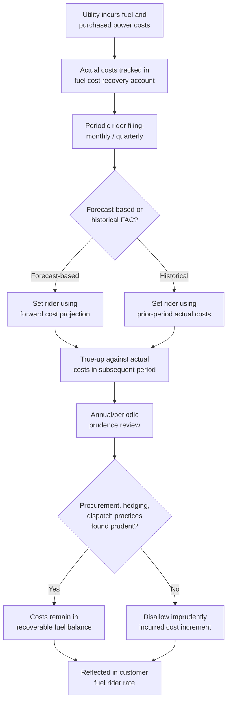

## Fuel and Purchased Power Cost Treatment

### Overview

Fuel and purchased power cost treatment refers to the specialized regulatory mechanisms used to recover a utility's costs of fuel (coal, natural gas, nuclear fuel, oil) consumed in generation and of power purchased from third parties or wholesale markets. Because these costs are large, volatile, and substantially outside a utility's direct control (driven by commodity markets, weather, and dispatch conditions), they are treated differently from ordinary O&M expense in most jurisdictions: rather than being fixed in base rates through a traditional rate case and left there until the next case, fuel and purchased power costs are typically recovered through a separate, more frequently adjusted mechanism.

### Why Fuel Costs Are Treated Separately from Base O&M

**Key Points**

- Fuel and purchased power costs can be highly volatile from month to month and year to year, driven by natural gas and coal commodity prices, weather-driven demand swings, plant outages requiring more expensive replacement power, and wholesale market price spikes.
- If fuel costs were locked into base rates via a traditional rate case (which may not be revisited for several years), the utility would bear substantial commodity price risk that it has limited ability to manage, potentially threatening financial stability; conversely, ratepayers would be overcharged or undercharged relative to actual utility costs for extended periods between rate cases.
- To address this mismatch, most jurisdictions authorize a fuel adjustment clause (FAC), also called a fuel cost adjustment (FCA), energy cost adjustment (ECA), or purchased power cost recovery (PPCR) mechanism, that allows more frequent (often monthly or quarterly) adjustment of the fuel/purchased power component of rates to track actual costs, subject to periodic true-up and regulatory review.

### Fuel Adjustment Clause (FAC) Mechanics

**Key Points**

- A typical FAC operates by comparing actual fuel and purchased power costs incurred during a period against the amount embedded in base rates (or against a prior period's projected/forecasted costs), and adjusting a rate rider (a per-kWh or per-therm surcharge or credit) to true up the difference.
- **Forecast-based (prospective) FACs** set the rider rate based on a forecast of fuel costs for the upcoming period, with subsequent periods reconciling actual costs against the forecast and adjusting the following period's rider to true up any over- or under-collection.
- **Historical (retrospective) FACs** set the rider based on costs actually incurred in a prior period (e.g., the prior month or quarter), lagging actual cost changes by that period length but avoiding forecast risk.
- Most FACs are subject to an annual or periodic prudence review, in which the commission examines the utility's fuel procurement practices, hedging decisions, dispatch decisions, and purchased power contracting to determine whether costs passed through the FAC were prudently incurred (as distinct from a substantive review of the *amount* of the cost, which is largely a pass-through).
- FACs are typically "single-issue" ratemaking mechanisms — they adjust only for fuel/purchased power costs and do not permit consideration of other revenue requirement changes (offsetting cost decreases elsewhere, rate base changes, etc.) within the same proceeding, which is a frequent point of policy debate (see below).

### Components Typically Included in Fuel Cost Recovery

**Key Points**

- **Fuel consumed at utility-owned generation** — coal, natural gas, oil, and nuclear fuel costs, including transportation/transmission costs to deliver fuel to the generating station (e.g., rail transportation for coal, pipeline transportation and storage for gas).
- **Purchased power costs** — costs of energy purchased from third-party generators, power marketers, or wholesale market operators (regional transmission organizations/independent system operators such as PJM, MISO, ERCOT, CAISO, ISO-NE, NYISO, SPP), including capacity payments, energy payments, and ancillary service charges.
- **Fuel-related hedging gains/losses** — realized gains or losses from financial or physical hedges (futures, swaps, options) used to manage fuel price volatility; hedging program prudence (not just outcomes) is often the specific subject of review, since a hedge that loses money can still have been a prudent risk-management decision at the time it was executed.
- **Emissions-related costs** — costs of emissions allowances (e.g., under cap-and-trade programs) or carbon costs, where applicable, tied directly to fuel combustion.
- **Nuclear fuel amortization** — nuclear fuel is typically capitalized and amortized over its consumption cycle (based on burn-up) rather than expensed as consumed like fossil fuel, reflecting its different cost recovery pattern (large upfront cost, extended consumption period across multiple refueling cycles).

### Prudence Review of Fuel Procurement Practices

**Key Points**

- Commissions and intervenors scrutinize whether a utility's fuel procurement strategy (spot market purchases vs. term contracts, coal supply contracts, gas storage utilization, hedging program design) was prudent, applying the same "no retroactive hindsight" prudence standard generally used for O&M review.
- Common areas of review: whether the utility adequately diversified fuel sources and suppliers; whether hedging programs were consistent with a documented risk management policy approved by the utility's board or a risk oversight committee; whether the utility appropriately dispatched its generation fleet in economic merit order; and whether purchased power contracts were competitively procured or otherwise shown to be reasonably priced (via an RFP process or benchmarking against market indices).
- Affiliate fuel supply and purchased power transactions (e.g., purchases from an unregulated generation affiliate within the same holding company) receive heightened scrutiny, often requiring demonstration that pricing is at or below what would have resulted from an arm's-length, competitively bid transaction.
- Disallowances for imprudent fuel procurement, when found, are typically applied to the specific cost increment attributable to the imprudent decision (e.g., the incremental cost of spot-market purchases that could have been avoided through a reasonably available contract), rather than as a blanket percentage disallowance, though approaches vary by jurisdiction.

### Fuel Cost Recovery vs. Base Rate O&M: Ratemaking Policy Tension

**Key Points**

- The existence of a FAC as a "single-issue" mechanism outside the general rate case is a long-standing subject of ratemaking policy debate:
  - **Proponents** argue that isolating fuel cost recovery from the general rate case reduces the utility's exposure to volatile, largely uncontrollable commodity price risk, supports credit quality, and avoids the need for frequent full rate cases solely to true up fuel costs.
  - **Critics** argue that automatic fuel cost pass-through can weaken the utility's incentive to minimize fuel costs (since costs flow through to customers regardless of efficiency), and that "single-issue" ratemaking in general is disfavored because it allows one cost category to be adjusted without a holistic review of whether other costs have moved in an offsetting direction.
- Some jurisdictions address the incentive concern through fuel cost sharing mechanisms, under which the utility retains or absorbs a specified percentage of savings or overruns relative to a benchmark, rather than passing through 100% of actual costs — intended to preserve some efficiency incentive while still mitigating extreme volatility risk. [Unverified — the prevalence and specific sharing percentages of such mechanisms vary by jurisdiction and are not universal.]

### Interaction with Resource Planning and Dispatch

**Key Points**

- Fuel cost recovery mechanisms interact with a utility's integrated resource planning (IRP) process and generation dispatch practices: a utility with a diversified generation portfolio (e.g., a mix of nuclear, coal, gas, and renewables) generally dispatches lower marginal-cost resources first (economic dispatch/merit order), and its fuel cost recovery reflects the blended cost outcome of that dispatch pattern.
- Increased penetration of low or zero marginal-cost renewable generation (wind, solar) can reduce overall fuel and purchased power costs by displacing higher marginal-cost fossil generation, which is generally reflected automatically through the FAC's actual-cost tracking, though the capital cost of the renewable resources themselves is recovered separately through rate base if utility-owned, or through a power purchase agreement (PPA) cost if contracted from a third party.
- PPA costs for purchased renewable or other generation are typically also flowed through the fuel/purchased power cost recovery mechanism (as a purchased power cost) rather than being included in the utility's own rate base, unless the utility has an ownership interest in the underlying asset.

### Diagram: Fuel Cost Recovery Cycle

### Diagram: Fuel Cost Flow Relative to Base Rates (svg_diagram)

<svg xmlns="http://www.w3.org/2000/svg" viewBox="0 0 740 360">
<rect x="0" y="0" width="740" height="360" fill="#ffffff" />
<text x="370" y="24" text-anchor="middle" font-size="16" font-weight="bold" fill="#1a1a1a">Fuel Cost Recovery vs. Base Rates (svg_diagram)</text>
<rect x="40" y="70" width="300" height="240" fill="#c9d9f0" stroke="#33487a" stroke-width="1.5" />
<text x="190" y="95" text-anchor="middle" font-size="13" font-weight="bold" fill="#1a1a1a">Base Rates (General Rate Case)</text>
<text x="60" y="125" font-size="11" fill="#333333">• Non-fuel O&amp;M</text>
<text x="60" y="145" font-size="11" fill="#333333">• Depreciation</text>
<text x="60" y="165" font-size="11" fill="#333333">• Taxes</text>
<text x="60" y="185" font-size="11" fill="#333333">• Return on rate base</text>
<text x="60" y="215" font-size="11" fill="#333333">Set periodically via</text>
<text x="60" y="233" font-size="11" fill="#333333">full rate case</text>
<text x="60" y="265" font-size="11" fill="#333333">Frequency: every</text>
<text x="60" y="283" font-size="11" fill="#333333">1–5+ years</text>
<rect x="400" y="70" width="300" height="240" fill="#fff2cc" stroke="#bf9000" stroke-width="1.5" />
<text x="550" y="95" text-anchor="middle" font-size="13" font-weight="bold" fill="#1a1a1a">Fuel Adjustment Clause (FAC)</text>
<text x="420" y="125" font-size="11" fill="#333333">• Fuel consumed at generation</text>
<text x="420" y="145" font-size="11" fill="#333333">• Purchased power costs</text>
<text x="420" y="165" font-size="11" fill="#333333">• Hedging gains/losses</text>
<text x="420" y="185" font-size="11" fill="#333333">• Emissions cost pass-through</text>
<text x="420" y="215" font-size="11" fill="#333333">Set via periodic rider</text>
<text x="420" y="233" font-size="11" fill="#333333">filing + true-up</text>
<text x="420" y="265" font-size="11" fill="#333333">Frequency: monthly</text>
<text x="420" y="283" font-size="11" fill="#333333">or quarterly</text>
<line x1="340" y1="190" x2="400" y2="190" stroke="#666666" stroke-width="1.5" stroke-dasharray="5,3" />
<text x="370" y="330" text-anchor="middle" font-size="11" fill="#333333">Both combine into total customer bill</text>
</svg>

### Practical Application Example

**Example**

A vertically integrated electric utility's FAC filing for a given quarter shows actual fuel and purchased power costs of $85 million against $78 million embedded in the prior period's rider rate, an under-collection of $7 million. The utility proposes to true up this under-collection through the next quarter's rider. In the associated annual prudence review, an intervenor challenges $3 million of the cost, arguing the utility relied on more expensive spot-market gas purchases during a cold-weather event when a lower-cost interruptible supply contract option was reasonably available. The commission's order finds the utility's actions prudent given the specific operational constraints and reliability considerations at the time (applying the no-retroactive-hindsight standard), and allows full recovery of the $7 million under-collection through the rider, subject to the standard ongoing quarterly reconciliation process.

**Output**

- Rider true-up: $7 million under-collection carried forward and recovered in the subsequent quarter's fuel rider rate, expressed as an adjustment to the per-kWh fuel charge.
- Prudence finding: $3 million challenged cost allowed as prudent based on reliability considerations documented in the record; no disallowance applied.

### Conclusion

Fuel and purchased power cost treatment departs from standard O&M ratemaking because of the scale, volatility, and largely market-driven nature of these costs. Rather than fixing fuel costs in base rates through infrequent general rate cases, most jurisdictions use a fuel adjustment clause or equivalent mechanism that tracks actual costs on a frequent (monthly or quarterly) basis, subject to periodic prudence review of procurement, hedging, and dispatch practices. This structure balances the goal of protecting utility financial stability from commodity price risk against the ratepayer interest in ensuring costs are prudently incurred and efficiently managed, with cost-sharing mechanisms in some jurisdictions used to preserve efficiency incentives that a pure pass-through mechanism might otherwise weaken. [Inference — specific FAC design features (forecast vs. historical basis, true-up frequency, sharing mechanisms) vary substantially by jurisdiction and utility type, and the general architecture described here should be verified against the specific commission's rules and tariffs.]

**Related Topics**

- Fuel Cost Sharing Mechanisms and Efficiency Incentives
- Integrated Resource Planning (IRP) and Generation Dispatch
- Power Purchase Agreement (PPA) Cost Recovery
- Affiliate Fuel Supply and Purchased Power Transaction Review
- Single-Issue Ratemaking Policy Debates
- Nuclear Fuel Capitalization and Amortization
- Hedging Program Prudence Review
- Operations and Maintenance Expense Review
- Regional Transmission Organization (RTO) Market Cost Pass-Through