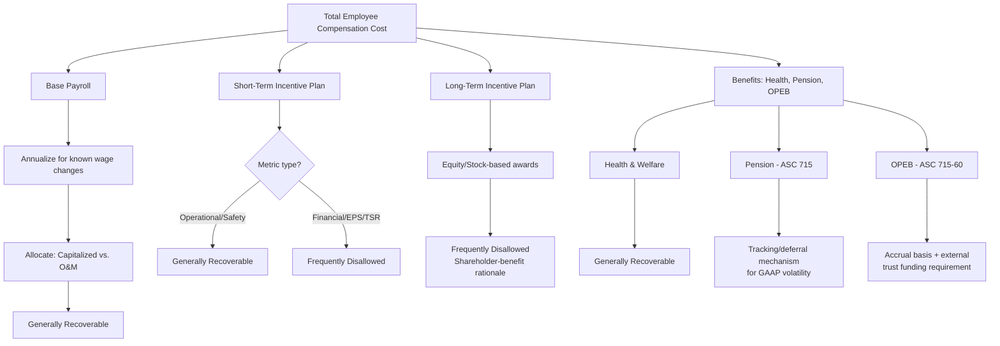

## Payroll, Incentive Compensation, and Benefits Costs

### Overview

Payroll, incentive compensation, and benefits costs represent a significant labor-related component of a utility's O&M and capitalized labor expense, subject to detailed regulatory review because of their size, their sensitivity to management discretion, and the recurring question of whether specific compensation elements primarily benefit ratepayers (and are thus recoverable in rates) or primarily benefit shareholders/employees in a manner unrelated to service delivery (and are thus properly borne by shareholders). This item covers base payroll, short- and long-term incentive compensation, and employee benefit costs including pension and Other Post-Employment Benefits (OPEB), each of which receives distinct regulatory treatment.

### Base Payroll Costs

**Key Points**

- Base payroll (wages and salaries for regular hours worked) is generally the most straightforward labor cost category for regulatory recovery, since it is directly tied to providing utility service and is typically allowed in full, subject to normalization and known-and-measurable adjustments.
- Common adjustments applied to base payroll in a test year:
  - **Annualization** — if a wage increase (e.g., from a union contract or annual merit cycle) took effect partway through the historical test year, the full-year payroll is annualized to reflect the new wage rate for the entire test year, rather than a blended rate.
  - **Vacancy/attrition adjustments** — intervenors frequently adjust payroll downward to reflect a utility's historical vacancy rate or position turnover, arguing that budgeted headcount consistently overstates actual filled positions and thus overstates actual cost.
  - **Capitalized vs. expensed labor allocation** — payroll for employees who split time between capital projects and O&M activities is allocated between rate base (capitalized, generating a return) and O&M expense (dollar-for-dollar recovery) based on time studies or standard allocation factors; the accuracy of this allocation is a recurring audit point, since misallocation toward capital increases both rate base and the associated return.
- Union labor contracts (collective bargaining agreements) provide a documented, "known and measurable" basis for wage increases during the rate-effective period, generally reducing dispute relative to non-union merit-based increases, which are more discretionary and thus more frequently challenged as to reasonableness of the assumed increase percentage.

### Incentive Compensation: Short-Term (Annual) Plans

**Key Points**

- Short-term incentive plans (STIPs), often called annual incentive plans or bonus plans, pay employees (and often executives) a variable amount tied to achievement of specified metrics over a single fiscal year.
- Regulatory review typically bifurcates STIP costs by metric type:
  - **Operational and safety metrics** (e.g., reliability indices such as SAIDI/SAIFI, customer satisfaction scores, safety incident rates, on-time project completion) are generally viewed as benefiting ratepayers directly through improved service quality and are typically allowed for cost recovery.
  - **Financial metrics** (e.g., earnings per share, net income, return on equity, stock price performance, cost reduction targets tied purely to shareholder value) are frequently viewed as primarily benefiting shareholders and are commonly disallowed in whole or in part in many jurisdictions.
- Where a STIP blends both metric types (a common structure — e.g., 50% operational/safety, 50% financial), the disallowance is typically applied on a pro-rata basis matching the financial-metric weighting, though the specific percentage split and methodology vary by jurisdiction and case record.
- Some commissions apply a categorical rule (e.g., "no incentive compensation tied to financial performance is recoverable"), while others conduct a case-specific factual review of each metric's ratepayer benefit. [Unverified — the prevailing approach varies materially by jurisdiction; specific commission precedent should be checked.]

### Incentive Compensation: Long-Term (Equity/LTIP) Plans

**Key Points**

- Long-term incentive plans (LTIPs), typically reserved for executives and senior management, commonly include stock options, restricted stock units (RSUs), performance shares tied to multi-year total shareholder return (TSR) or earnings growth targets, and other equity-based compensation.
- LTIP costs are even more frequently and more completely disallowed than STIP financial-metric components, on the theory that equity-based compensation is inherently designed to align management incentives with shareholder value creation (stock price appreciation, EPS growth) rather than with ratepayer service quality, and thus should be borne entirely by shareholders.
- Some jurisdictions distinguish LTIP compensation from STIP compensation categorically for this reason, applying a bright-line exclusion to LTIP costs regardless of whether any component metric is nominally operational.
- Deferred compensation and supplemental executive retirement plans (SERPs) for senior executives are similarly often excluded from cost of service, following the same shareholder-benefit rationale.

### Employee Benefits: Health and Welfare

**Key Points**

- Group health insurance, dental, vision, life insurance, and disability benefits for the utility's active workforce are generally treated as an ordinary, recoverable cost of employing the workforce needed to provide utility service, subject to reasonableness review of plan design and cost trends relative to industry benchmarks.
- Rapid year-over-year growth in health benefit costs (a common trend across the broader economy) is frequently the subject of trend-based challenges, with intervenors sometimes proposing a normalized growth rate rather than accepting the utility's actual or budgeted cost escalation.

### Pension Costs

**Key Points**

- Pension expense for utilities offering defined-benefit pension plans is calculated under U.S. GAAP standards (historically SFAS 87, now codified in ASC 715), which determine annual pension expense/income based on actuarial assumptions including discount rate, expected long-term return on plan assets, and demographic assumptions (mortality, retirement age, turnover).
- Because ASC 715 pension expense can be volatile and can even turn negative (pension *income*, reducing cost of service) depending on market performance of plan assets and discount rate movements, many jurisdictions employ a pension cost tracking mechanism or deferral mechanism that captures the difference between the ASC 715 book expense and a normalized/traditional actuarial cost, deferring the variance for future rate recovery or refund rather than flowing raw GAAP volatility directly into rates.
- A recurring dispute is whether to use the ASC 715 (mark-to-market-influenced) expense directly, a "traditional" actuarial funding-based cost, or some blended/normalized approach, given that ASC 715 expense can diverge substantially from the utility's actual cash pension contribution in a given year.
- Overfunded pension plans (where plan assets exceed the projected benefit obligation) raise a related and separate ratemaking question: whether "excess" pension assets attributable to prior ratepayer-funded contributions should be reflected as a rate base offset or otherwise shared between ratepayers and shareholders — a matter addressed differently across jurisdictions and often litigated on its own facts.

### Other Post-Employment Benefits (OPEB)

**Key Points**

- OPEB refers primarily to retiree healthcare and other non-pension post-employment benefits, accounted for under ASC 715-60 (formerly SFAS 106), which similarly requires accrual-based expense recognition based on actuarial assumptions about future healthcare cost trends, discount rates, and retiree demographics.
- Regulatory treatment of OPEB historically required a transition from pay-as-you-go cash-basis recovery to full accrual-basis recovery (matching the accounting standard), often requiring a showing that OPEB costs recovered in rates are actually deposited into an irrevocable external trust dedicated to paying retiree benefits, to prevent ratepayers from funding benefits that are not secured against being used for other corporate purposes.
- Because healthcare cost trend assumptions are a major driver of OPEB expense and are inherently uncertain, OPEB cost estimates are subject to significant actuarial judgment and periodic true-up as actual costs and trend rates emerge, often through a tracking mechanism similar to that used for pension costs.

### Diagram: Compensation Cost Recovery Decision Tree

### Diagram: Ratepayer vs. Shareholder Cost Allocation Spectrum (svg_diagram)

<svg xmlns="http://www.w3.org/2000/svg" viewBox="0 0 740 300">
<rect x="0" y="0" width="740" height="300" fill="#ffffff" />
<text x="370" y="24" text-anchor="middle" font-size="16" font-weight="bold" fill="#1a1a1a">Compensation Cost Allocation Spectrum (svg_diagram)</text>
<line x1="60" y1="150" x2="680" y2="150" stroke="#333333" stroke-width="2" />
<text x="60" y="175" font-size="11" text-anchor="middle" fill="#1a1a1a">Fully Ratepayer</text>
<text x="680" y="175" font-size="11" text-anchor="middle" fill="#1a1a1a">Fully Shareholder</text>
<circle cx="120" cy="150" r="7" fill="#38761d" />
<text x="120" y="120" text-anchor="middle" font-size="11" fill="#333333">Base Payroll</text>
<circle cx="240" cy="150" r="7" fill="#38761d" />
<text x="240" y="105" text-anchor="middle" font-size="11" fill="#333333">Health &amp;</text>
<text x="240" y="120" text-anchor="middle" font-size="11" fill="#333333">Welfare Benefits</text>
<circle cx="380" cy="150" r="7" fill="#bf9000" />
<text x="380" y="105" text-anchor="middle" font-size="11" fill="#333333">STIP</text>
<text x="380" y="120" text-anchor="middle" font-size="11" fill="#333333">(Operational Metrics)</text>
<circle cx="480" cy="150" r="7" fill="#e69138" />
<text x="480" y="105" text-anchor="middle" font-size="11" fill="#333333">STIP</text>
<text x="480" y="120" text-anchor="middle" font-size="11" fill="#333333">(Financial Metrics)</text>
<circle cx="600" cy="150" r="7" fill="#a61c1c" />
<text x="600" y="105" text-anchor="middle" font-size="11" fill="#333333">LTIP / Equity</text>
<text x="600" y="120" text-anchor="middle" font-size="11" fill="#333333">Awards</text>
<circle cx="650" cy="150" r="7" fill="#a61c1c" />
<text x="650" y="180" text-anchor="middle" font-size="11" fill="#333333">SERP /</text>
<text x="650" y="195" text-anchor="middle" font-size="11" fill="#333333">Deferred Comp</text>
</svg>

### Practical Application Example

**Example**

A utility's test-year filing includes total executive and employee incentive compensation of $12 million: $4 million in a broad-based STIP weighted 60% operational/safety and 40% net income; $5 million in executive STIP weighted 30% operational and 70% EPS growth; and $3 million in executive LTIP consisting entirely of performance share units tied to three-year relative TSR.

**Output**

- Broad-based STIP: 60% ($2.4 million) allowed as operational/safety-related; 40% ($1.6 million) disallowed as financial-metric-related.
- Executive STIP: 30% ($1.5 million) allowed; 70% ($3.5 million) disallowed.
- Executive LTIP: $3 million (100%) disallowed as equity-based, shareholder-value-aligned compensation.
- Total disallowed: $8.1 million of the original $12 million; $3.9 million remains includable in test-year O&M.

### Conclusion

Payroll, incentive compensation, and benefits costs require regulators to draw a series of fact-specific lines between costs that support delivery of utility service to ratepayers and costs that primarily align management and employee incentives with shareholder value. Base payroll and standard health benefits are generally recoverable with routine normalization adjustments; short-term incentive compensation is typically split between recoverable operational/safety components and disallowed financial-metric components; long-term equity-based incentive compensation is frequently disallowed in its entirety; and pension/OPEB costs require specialized tracking mechanisms to manage the volatility and long-tail nature of actuarially determined benefit obligations. [Inference — the specific disallowance percentages, categorical rules, and tracking mechanism designs vary substantially across jurisdictions and should be confirmed against the applicable commission's precedent and the specific case record.]

**Related Topics**

- Operations and Maintenance Expense Review
- Executive Compensation and Incentive Pay Disallowances
- Pension and OPEB Cost Recovery Mechanisms (ASC 715 / ASC 715-60)
- Capitalized vs. Expensed Labor Allocation Methods
- Affiliate Service Company Cost Allocation
- Rate Case Expense Amortization and Cost-Sharing
- Test Year Normalization and Known-and-Measurable Adjustments
- Shareholder vs. Ratepayer Cost Responsibility Principles