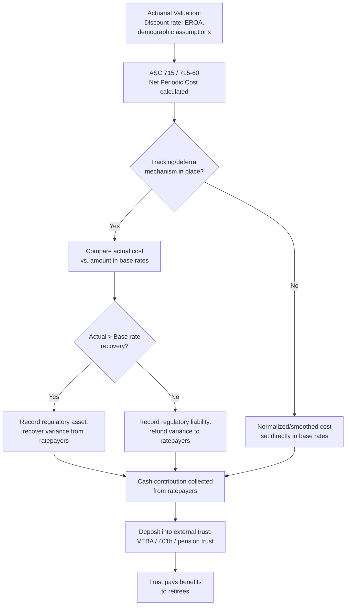

## Pension and Other Post Employment Benefit Expense

### Overview

Pension and Other Post-Employment Benefit (OPEB) expense refers to the accrual-based accounting costs a utility recognizes for defined-benefit retirement obligations to current and former employees, and the specialized ratemaking mechanisms used to recover those costs while managing their inherent actuarial volatility and long-tail funding characteristics. These costs are addressed in detail as a distinct revenue requirement item because their accounting treatment diverges significantly from ordinary O&M expense, their magnitude can shift materially year to year based on capital market performance and actuarial assumption changes, and their proper regulatory treatment involves both an expense recognition question and a separate funding/trust question.

### Accounting Framework: Pension (ASC 715)

**Key Points**

- Pension expense for utilities offering defined-benefit plans is governed by U.S. GAAP under ASC 715 (Compensation—Retirement Benefits), the codification of the standard formerly known as SFAS 87.
- Net periodic pension cost under ASC 715 comprises several components:
  - **Service cost** — the actuarial present value of benefits earned by employees during the current period.
  - **Interest cost** — the increase in the projected benefit obligation (PBO) due to the passage of time, calculated using a discount rate tied to high-quality corporate bond yields.
  - **Expected return on plan assets** — a credit (cost reduction) reflecting the expected long-term rate of return on pension trust assets, which can offset or exceed service and interest cost.
  - **Amortization of prior service cost** — recognition, typically over the remaining service period of affected employees, of the cost of plan amendments that grant retroactive benefits.
  - **Amortization of actuarial gains/losses** — recognition of the cumulative effect of changes in actuarial assumptions (discount rate changes, demographic assumption changes) and asset performance differing from expected return, generally recognized gradually through a "corridor" amortization approach or, under some companies' accounting policy elections, recognized immediately (mark-to-market approach).
- Because the expected-return and actuarial gain/loss components are sensitive to capital market conditions and the utility's plan asset allocation, net periodic pension cost can be volatile from year to year, and in periods of strong asset performance or rising discount rates, may even be negative (i.e., pension income rather than pension expense).

$$NPPC = SC + IC - EROA + AMORT_{PSC} + AMORT_{GL}$$

Where $NPPC$ is net periodic pension cost, $SC$ is service cost, $IC$ is interest cost, $EROA$ is expected return on assets, $AMORT_{PSC}$ is amortization of prior service cost, and $AMORT_{GL}$ is amortization of actuarial gains/losses.

### Accounting Framework: OPEB (ASC 715-60)

**Key Points**

- OPEB, primarily retiree healthcare and life insurance benefits, is governed by ASC 715-60 (formerly SFAS 106), which applies an analogous accrual-based framework to pension accounting but with the added complexity of healthcare cost trend rate assumptions.
- OPEB expense components mirror pension expense structurally (service cost, interest cost, expected return on plan assets if funded, amortization of prior service cost and actuarial gains/losses), but the actuarial present value of the obligation (Accumulated Postretirement Benefit Obligation, or APBO) is additionally sensitive to assumed future healthcare cost inflation trend rates, which have historically been assumed to exceed general inflation and to gradually decline toward an ultimate long-term trend rate over a multi-decade projection period.
- Historically, many utilities funded OPEB on a pay-as-you-go cash basis (paying retiree healthcare claims as incurred) rather than accruing and pre-funding the obligation; the transition to accrual-basis accounting under SFAS 106 (now ASC 715-60) in the early 1990s prompted a parallel ratemaking transition toward accrual-basis cost recovery in most jurisdictions.

### The Rate Recovery vs. Funding Distinction

**Key Points**

- A critical regulatory principle is the distinction between (1) the *amount* of pension/OPEB expense recovered in rates (an accounting/ratemaking question) and (2) whether that recovered amount is actually *funded* into an external trust dedicated to paying benefits (a cash/security question).
- Regulators in most jurisdictions require that amounts collected from ratepayers for OPEB (and often pension) costs be deposited into an irrevocable external trust (e.g., a Voluntary Employee Beneficiary Association (VEBA) trust or 401(h) account for OPEB) rather than retained as general corporate funds, to ensure ratepayer-funded contributions are actually available to pay the benefits for which they were collected and are not available to general creditors or diverted to other corporate purposes.
- This funding requirement addresses a specific ratepayer protection concern: without it, a utility could collect OPEB costs in rates on an accrual basis while continuing to pay benefits on a cash basis, retaining the difference as working capital rather than pre-funding future retiree obligations — a mismatch regulators have generally sought to prevent since the accrual-accounting transition.
- Tax considerations affect trust structuring: contributions to a qualified 401(h) account (a subaccount of a qualified pension plan) or VEBA trust may be tax-deductible, subject to specific Internal Revenue Code limitations on funding levels, making the trust vehicle choice a matter of both ratemaking policy and tax efficiency. [Unverified — specific IRC funding limitation thresholds change periodically and should be verified against current tax law and the utility's specific actuarial funding position.]

### Pension/OPEB Cost Tracking and Deferral Mechanisms

**Key Points**

- Because ASC 715 and ASC 715-60 expense can diverge substantially from the amount embedded in base rates (set at a point in time using assumptions that quickly become outdated as discount rates and asset returns fluctuate), many jurisdictions authorize a pension/OPEB cost tracking mechanism or balancing account.
- Typical mechanism structure: the utility records the variance between actual ASC 715/715-60 book expense and the amount included in base rates as a regulatory asset (if actual expense exceeds base rate recovery) or regulatory liability (if actual expense is less than base rate recovery), to be recovered from or refunded to ratepayers in a future period, often through a periodic rider or in the next general rate case.
- This tracking approach avoids two problems: (1) flowing raw, volatile GAAP-driven expense directly into current rates, which could create sharp rate swings unrelated to any change in the utility's actual service costs, and (2) allowing base rates to remain stale relative to the utility's actual, often-updated actuarial expense for extended periods between rate cases.
- Some jurisdictions instead use a "normalized" or smoothed pension cost (e.g., based on a longer-term average expected return assumption or a traditional funding-based actuarial cost rather than the full mark-to-market-influenced ASC 715 figure) directly in base rates, without a separate tracking mechanism, accepting some divergence from GAAP expense in exchange for rate stability.

### Overfunded and Underfunded Plan Status Disputes

**Key Points**

- **Underfunded plans** (where the projected benefit obligation exceeds plan assets) raise the question of how to treat required or elected additional cash contributions to improve funded status — whether such contributions should be recovered in rates directly (often through the tracking mechanism described above) or reflected only through the ASC 715 expense recognition, which may not fully capture near-term cash funding needs.
- **Overfunded plans** (where plan assets exceed the obligation) raise a more contested question: whether "excess" pension assets — particularly where the historical over-funding is attributable to ratepayer-funded contributions collected in rates over prior decades — should be reflected as an offset to rate base (reducing the amount on which the utility earns a return) or otherwise shared between ratepayers and shareholders.
- Jurisdictions and specific case outcomes vary considerably on the overfunded-asset question, with some treating pension trust assets as entirely outside rate base (a "hands-off" approach reflecting the assets' dedicated purpose and ERISA-related restrictions on employer reversion) and others requiring some form of rate base offset or sharing mechanism where a clear ratepayer-funding nexus is established. [Inference — this remains one of the more jurisdiction-specific and fact-dependent areas of utility ratemaking, and any generalization should be checked against the applicable jurisdiction's precedent.]

### Key Actuarial Assumptions Subject to Review

**Key Points**

- **Discount rate** — typically tied to current yields on high-quality (AA-rated or equivalent) long-term corporate bonds matched to the duration of expected benefit payments; regulators and intervenors review whether the utility's selected discount rate and yield curve methodology are reasonable and consistent with prevailing market conditions at the measurement date.
- **Expected long-term return on plan assets** — reviewed against the plan's actual asset allocation (equities, fixed income, alternatives) and historical/prospective capital market return assumptions; an aggressive return assumption reduces current-period expense (and thus reduces near-term rates) but risks larger catch-up adjustments if actual returns fall short over time.
- **Mortality and demographic assumptions** — updated periodically based on published mortality tables (e.g., Society of Actuaries tables), affecting the projected duration of benefit payments.
- **Healthcare cost trend rate (OPEB-specific)** — the assumed near-term and long-term annual growth rate of healthcare costs, a particularly significant and historically volatile assumption for OPEB obligation sizing, given the multi-decade cost trend projections involved.

### Diagram: Pension/OPEB Cost Recovery Flow

### Diagram: Pension Funded Status and Ratemaking Treatment (svg_diagram)

<svg xmlns="http://www.w3.org/2000/svg" viewBox="0 0 740 320">
<rect x="0" y="0" width="740" height="320" fill="#ffffff" />
<text x="370" y="24" text-anchor="middle" font-size="16" font-weight="bold" fill="#1a1a1a">Pension Funded Status Treatment (svg_diagram)</text>
<rect x="60" y="60" width="280" height="220" fill="#f4cccc" stroke="#a61c1c" stroke-width="1.5" />
<text x="200" y="85" text-anchor="middle" font-size="13" font-weight="bold" fill="#1a1a1a">Underfunded Plan</text>
<text x="200" y="115" text-anchor="middle" font-size="11" fill="#333333">PBO &gt; Plan Assets</text>
<text x="80" y="150" font-size="11" fill="#333333">• Additional cash contributions</text>
<text x="80" y="170" font-size="11" fill="#333333"> needed to improve funded status</text>
<text x="80" y="200" font-size="11" fill="#333333">• Tracking mechanism captures</text>
<text x="80" y="220" font-size="11" fill="#333333"> funding need vs. base rate level</text>
<text x="80" y="250" font-size="11" fill="#333333">• Regulatory asset recorded</text>
<rect x="400" y="60" width="280" height="220" fill="#d9ead3" stroke="#38761d" stroke-width="1.5" />
<text x="540" y="85" text-anchor="middle" font-size="13" font-weight="bold" fill="#1a1a1a">Overfunded Plan</text>
<text x="540" y="115" text-anchor="middle" font-size="11" fill="#333333">Plan Assets &gt; PBO</text>
<text x="420" y="150" font-size="11" fill="#333333">• Disputed: rate base offset</text>
<text x="420" y="170" font-size="11" fill="#333333"> vs. hands-off treatment</text>
<text x="420" y="200" font-size="11" fill="#333333">• ERISA reversion restrictions</text>
<text x="420" y="220" font-size="11" fill="#333333"> limit employer access</text>
<text x="420" y="250" font-size="11" fill="#333333">• Jurisdiction-specific outcomes</text>
</svg>

### Practical Application Example

**Example**

A utility's pension plan shows a net periodic pension cost of $8 million for the current test year, compared to $5 million embedded in current base rates from the last general rate case (set three years earlier, when discount rates were higher and expected asset returns had not yet been revised downward). Under the jurisdiction's pension tracking mechanism, the utility records a $3 million regulatory asset representing the under-recovered variance. Simultaneously, the utility's OPEB plan shows an APBO that increased due to an updated healthcare cost trend assumption, raising net periodic OPEB cost by $1.2 million relative to base rates, similarly tracked as a regulatory asset. In the next rate case, the utility proposes recovering the accumulated $4.2 million regulatory asset balance over an amortization period (e.g., 3–5 years) while simultaneously resetting base rates to reflect the current $9.2 million combined pension/OPEB cost level going forward, subject to actuarial assumption review by intervenors.

**Output**

- Regulatory asset balance: $4.2 million (pension $3.0 million + OPEB $1.2 million), proposed for amortized recovery.
- Reset base rate pension/OPEB level: $9.2 million annually, subject to review of discount rate, EROA, and healthcare trend assumptions.

### Conclusion

Pension and OPEB expense occupies a distinct position in revenue requirement analysis because its accounting basis (ASC 715 / ASC 715-60) is inherently actuarial and volatile, diverging from the smoother, more predictable cost patterns of ordinary O&M. Effective regulatory treatment separates the expense recognition question from the funding/trust question, generally requiring that ratepayer-collected amounts be deposited into a dedicated external trust, and frequently employs a tracking or deferral mechanism to reconcile volatile GAAP-basis expense against more stable embedded base rate levels. The treatment of overfunded plan assets remains one of the more jurisdiction-specific and contested areas within this topic, reflecting the tension between ratepayers' historical funding contributions and the legal and practical restrictions on employer access to trust assets. [Inference — specific mechanism design, trust vehicle selection, and overfunded-asset treatment vary substantially across jurisdictions and should be verified against the applicable commission's current rules and precedent.]

**Related Topics**

- Payroll, Incentive Compensation, and Benefits Costs
- Regulatory Assets and Liabilities: Recognition and Amortization
- Rate Base Treatment of Trust Assets and Offsets
- Operations and Maintenance Expense Review
- Test Year Normalization and Known-and-Measurable Adjustments
- Deferred Tax and Accumulated Deferred Income Tax (ADIT) Treatment
- Actuarial Assumption Review in Rate Case Proceedings
- ERISA Trust Structuring for Utility Benefit Plans