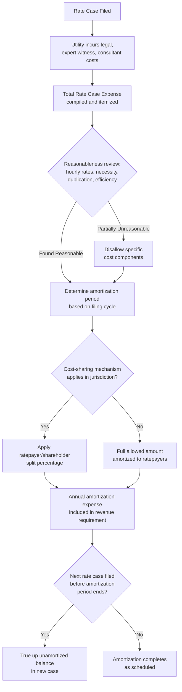

## Rate Case Expense and Its Recovery

### Overview

Rate case expense refers to the costs a utility incurs in preparing, prosecuting, and litigating a rate case before its regulatory commission — including outside legal counsel, expert witness fees, consultant costs, and related administrative expenses. Because a rate case is itself an extraordinary, non-recurring proceeding (relative to the utility's ordinary day-to-day operations), the costs of conducting it are treated as a distinct revenue requirement item, subject to specific amortization, reasonableness review, and, in some jurisdictions, cost-sharing rules distinct from ordinary O&M expense treatment.

### Components of Rate Case Expense

**Key Points**

- **Outside legal counsel** — fees for the law firm(s) representing the utility in the rate case proceeding, including case preparation, discovery responses, hearing representation, and brief writing.
- **Expert witness fees** — compensation paid to consultants and expert witnesses who prepare testimony and exhibits on cost of capital/ROE, depreciation, cost of service/allocation studies, revenue requirement calculations, and other specialized subject matter areas.
- **Consultant and support staff costs** — costs of accounting, engineering, or other consulting firms supporting case preparation, including data compilation, modeling, and exhibit preparation.
- **Administrative and filing costs** — printing, filing fees, transcript costs, notice and publication costs (e.g., statutorily required customer notice of the rate case filing), and internal utility staff time dedicated to rate case preparation (sometimes tracked separately as internal labor cost rather than as "rate case expense" per se).
- **Intervenor funding contributions** — in some jurisdictions, utilities are required or choose to fund a portion of intervenor (e.g., consumer advocate or low-income intervenor group) expert witness and legal costs, which may itself be treated as a component of recoverable rate case expense or handled through a separate intervenor compensation mechanism.

### Why Rate Case Expense Receives Distinct Treatment

**Key Points**

- Rate case expense is inherently non-recurring in the sense that it is incurred in discrete, lumpy amounts tied to the timing of specific rate case filings, rather than being a smooth, continuous operating cost like routine O&M.
- If a rate case expense of, for example, $3 million (an amount that might be incurred once every several years) were expensed entirely in the single test year in which the rate case was litigated, it would create an artificial spike in that year's O&M relative to the more typical, lower level of ongoing rate case-related activity, distorting the revenue requirement calculated from that test year.
- To smooth this effect, rate case expense is typically amortized over a period corresponding to the expected interval until the utility's next rate case (commonly 2–5 years, depending on the utility's typical rate case filing frequency and jurisdictional practice), rather than expensed in full in the single test year.
- This amortization approach parallels other capitalized-and-amortized regulatory treatments (e.g., storm cost deferrals) in spreading a lumpy cost over the period it is expected to benefit or relate to.

### Amortization Methodology

**Key Points**

- The amortization period is typically set based on the utility's historical rate case filing frequency, a policy-based standard period set by the commission (e.g., a presumed 3-year cycle), or a case-specific estimate of when the utility expects to file its next rate case.
- Amortization is generally calculated on a straight-line basis: total allowed rate case expense divided by the amortization period, producing an annual amortization amount included in the test-year revenue requirement.
- If a subsequent rate case is filed earlier than the assumed amortization period (e.g., a 3-year assumed period but the utility files again in year 2), any unamortized balance from the prior case is typically addressed in the new case — either by accelerating recovery of the remaining balance or by adjusting the go-forward amortization schedule.
- Some jurisdictions use a rate case expense reserve or tracking account, accumulating actual costs as incurred and recovering them prospectively through the amortization mechanism established in the subsequent rate case, rather than requiring the utility to estimate costs prospectively within the current case.

### Reasonableness Review of Rate Case Expense

**Key Points**

- Because rate case expense is the cost of the utility's own advocacy in the very proceeding determining its rates, it receives particular scrutiny for reasonableness, given the inherent tension between the utility's interest in mounting a vigorous case and the ratepayer interest in not funding excessive or duplicative litigation costs.
- Common review points:
  - **Reasonableness of hourly rates** for outside counsel and expert witnesses, benchmarked against rates charged in comparable proceedings or by comparable professionals.
  - **Necessity and non-duplication of experts** — whether the number and scope of expert witnesses retained was reasonably necessary, or whether certain areas of testimony were duplicative across multiple witnesses.
  - **Efficiency of case management** — whether the case was litigated efficiently (e.g., appropriate use of settlement negotiations to narrow issues, avoiding unnecessarily protracted discovery disputes) as opposed to costs driven by inefficient or contentious case management.
  - **Comparison to prior case costs** — benchmarking the current case's costs against the utility's own prior rate case costs (adjusted for inflation and case complexity) as a reasonableness check.
- Some commissions require a specific itemized showing (invoices, time records) supporting rate case expense, rather than accepting a lump-sum estimate, particularly where costs are unusually large relative to prior cases or industry norms.

### Cost-Sharing and Cap Mechanisms

**Key Points**

- Some jurisdictions apply a cost-sharing mechanism under which a specified percentage of rate case expense (e.g., 50%) is borne by shareholders rather than fully passed through to ratepayers, intended to create some disincentive against excessive litigation spending and to reflect that the utility, as the case proponent, derives a direct benefit from a successful outcome.
- Other jurisdictions apply a dollar cap or a per-case expense ceiling, beyond which costs are disallowed absent a specific showing of extraordinary circumstances justifying the excess.
- Where a rate case is unusually contentious or prolonged due to circumstances substantially attributable to the utility's own litigation conduct (as opposed to reasonable exercise of its due process rights), some commissions have applied targeted disallowances to costs found attributable to that conduct. [Unverified — the prevalence and structure of cost-sharing/cap mechanisms vary considerably by jurisdiction, and specific rules should be verified against the applicable commission's practice.]

### Interaction with Settlement vs. Fully Litigated Proceedings

**Key Points**

- Rate cases resolved through negotiated settlement among the utility, commission staff, and intervenors often (though not always) involve lower rate case expense than fully litigated proceedings, since settlement can avoid the cost of full evidentiary hearings, cross-examination, and briefing on contested issues.
- Some settlement agreements include an explicit negotiated rate case expense amount (sometimes itself a point of negotiation within the broader settlement), which may differ from what a fully litigated determination of reasonable rate case expense would have produced.
- This dynamic creates an indirect incentive structure: parties may weigh the marginal cost of continued litigation on a specific issue against the potential revenue requirement benefit of prevailing on that issue, factoring in that unresolved litigation itself generates additional recoverable rate case expense.

### Diagram: Rate Case Expense Amortization Timeline

### Diagram: Rate Case Expense Smoothing Effect (svg_diagram)

<svg xmlns="http://www.w3.org/2000/svg" viewBox="0 0 740 320">
<rect x="0" y="0" width="740" height="320" fill="#ffffff" />
<text x="370" y="24" text-anchor="middle" font-size="16" font-weight="bold" fill="#1a1a1a">Rate Case Expense: Unsmoothed vs. Amortized (svg_diagram)</text>
<line x1="60" y1="260" x2="680" y2="260" stroke="#333333" stroke-width="1.5" />
<line x1="60" y1="60" x2="60" y2="260" stroke="#333333" stroke-width="1.5" />
<text x="30" y="90" font-size="10" fill="#333333">\$3M</text>
<text x="30" y="260" font-size="10" fill="#333333">\$0</text>
<rect x="90" y="80" width="40" height="180" fill="#a61c1c" opacity="0.8" />
<text x="110" y="275" text-anchor="middle" font-size="10" fill="#333333">Yr 1</text>
<rect x="150" y="250" width="40" height="10" fill="#a61c1c" opacity="0.3" />
<text x="170" y="275" text-anchor="middle" font-size="10" fill="#333333">Yr 2</text>
<rect x="210" y="250" width="40" height="10" fill="#a61c1c" opacity="0.3" />
<text x="230" y="275" text-anchor="middle" font-size="10" fill="#333333">Yr 3</text>
<text x="150" y="50" font-size="11" fill="#a61c1c" text-anchor="middle">Unsmoothed: full expense in Year 1</text>
<rect x="380" y="200" width="40" height="60" fill="#38761d" opacity="0.8" />
<text x="400" y="275" text-anchor="middle" font-size="10" fill="#333333">Yr 1</text>
<rect x="440" y="200" width="40" height="60" fill="#38761d" opacity="0.8" />
<text x="460" y="275" text-anchor="middle" font-size="10" fill="#333333">Yr 2</text>
<rect x="500" y="200" width="40" height="60" fill="#38761d" opacity="0.8" />
<text x="520" y="275" text-anchor="middle" font-size="10" fill="#333333">Yr 3</text>
<text x="460" y="50" font-size="11" fill="#38761d" text-anchor="middle">Amortized: \$1M/year over 3 years</text>
</svg>

### Practical Application Example

**Example**

A mid-sized electric utility's rate case incurs the following costs: $1.4 million in outside legal counsel, $900,000 in expert witness fees across four testimony areas (ROE, depreciation, cost allocation, and revenue requirement), $300,000 in supporting consultant work, and $150,000 in filing, notice, and printing costs, for a total of $2.75 million. An intervenor challenges the expert witness costs, arguing that two of the four experts covered substantially overlapping subject matter and that a single, appropriately scoped witness could have addressed both areas for approximately $500,000 less.

**Output**

- Commission finds the legal, consultant, and administrative costs ($1.85 million) reasonable and fully recoverable.
- Commission finds $400,000 (a partial reduction, less than the full $500,000 challenged) of expert witness cost duplicative and disallows that amount, allowing $500,000 of the original $900,000 expert witness cost.
- Total allowed rate case expense: $2.35 million ($2.75 million − $400,000 disallowance).
- Amortization: $2.35 million amortized over a 3-year assumed filing cycle = approximately $783,333 per year included in the test-year revenue requirement.

### Conclusion

Rate case expense recovery balances the utility's legitimate need to fund competent representation in a proceeding that determines its financial results against the ratepayer interest in not subsidizing excessive, duplicative, or inefficiently managed litigation costs. The near-universal practice of amortizing rate case expense over a multi-year period — rather than expensing it entirely in the test year in which it was incurred — smooths what would otherwise be a lumpy, non-representative cost spike, while reasonableness review of specific cost components (hourly rates, witness necessity, case management efficiency) and, in some jurisdictions, shareholder cost-sharing or expense caps, provide additional checks on the magnitude of costs passed through to customers. [Inference — amortization periods, cost-sharing percentages, and specific review standards vary considerably across jurisdictions and should be confirmed against the applicable commission's current rules and precedent.]

**Related Topics**

- Operations and Maintenance Expense Review
- Test Year Normalization and Known-and-Measurable Adjustments
- Intervenor Compensation and Funding Mechanisms
- Regulatory Assets and Liabilities: Recognition and Amortization
- Settlement Negotiation Dynamics in Rate Case Proceedings
- Zone of Reasonableness and ROE Benchmarking
- Storm Cost Reserves, Trackers, and Securitization Mechanisms
- Expert Witness Testimony Standards in Utility Rate Cases