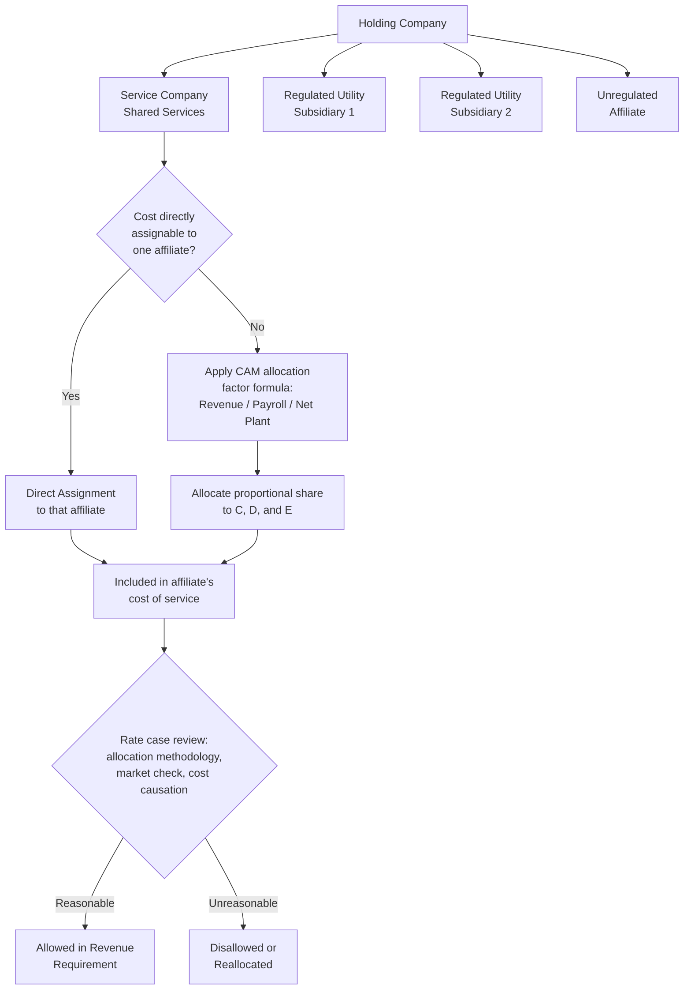

## Affiliate Transactions and Cost Allocation Manuals

### Overview

Affiliate transactions and cost allocation manuals address how costs are identified, priced, and allocated when a regulated utility is part of a multi-entity corporate family — typically a holding company structure with one or more regulated utility subsidiaries, an unregulated affiliate or centralized service company, and sometimes non-utility businesses. Because transactions between a utility and its affiliates are not conducted at arm's length in the same way as transactions with unrelated third parties, regulators require detailed disclosure, allocation methodology, and pricing rules — most commonly codified in a Cost Allocation Manual (CAM) — to ensure ratepayers bear only their fair share of shared costs and are not subsidizing unregulated affiliate operations or bearing costs that would not have been reasonably incurred in an arm's-length transaction.

### Why Affiliate Transactions Require Special Scrutiny

**Key Points**

- In a holding company structure, common costs — corporate overhead, information technology, human resources, legal, accounting, treasury, executive management — are frequently centralized in a service company (sometimes called a "shared services" entity) and allocated across multiple affiliated operating utilities and, in some structures, unregulated affiliates.
- Because the utility and its affiliates share common ownership and management, transactions between them lack the independent, adversarial price negotiation that characterizes arm's-length third-party transactions, creating risk that costs could be shifted inappropriately between regulated and unregulated operations, or allocated in a manner that burdens ratepayers with costs that primarily benefit unregulated affiliates or shareholders.
- The core regulatory concerns are typically framed as:
  - **Cost shifting** — the risk that costs properly attributable to unregulated or less-regulated affiliates are allocated to (or retained by) the regulated utility, inflating the utility's cost of service and revenue requirement.
  - **Cross-subsidization** — the risk that the regulated utility, with its guaranteed rate-based cost recovery, effectively subsidizes the unregulated affiliate's operations, competitive position, or investment activities.
  - **Non-arm's-length pricing** — the risk that services or goods provided between affiliates are priced above (when the utility is the buyer) or below (when the utility is the seller) what an arm's-length transaction would have produced.

### Cost Allocation Manuals (CAMs): Purpose and Structure

**Key Points**

- A Cost Allocation Manual is a formal document, typically filed with and approved by the relevant regulatory commission(s), that describes the methodology a holding company system uses to allocate shared and common costs among its regulated and unregulated affiliates.
- Typical CAM contents include:
  - **Organizational structure** — description of the holding company, its regulated and unregulated subsidiaries, and the service company (if any) providing shared services.
  - **Direct assignment rules** — costs that can be specifically identified as benefiting a single affiliate (e.g., a piece of equipment used only by one utility) are directly assigned to that affiliate rather than allocated using a general formula.
  - **Allocation factors and formulas** — for costs that benefit multiple affiliates but cannot be directly assigned (e.g., general corporate overhead, centralized IT systems), the CAM specifies allocation factors — commonly a weighted combination of revenue, payroll/labor, and net plant investment (sometimes called the "Massachusetts formula" or a similar multi-factor allocator), or other cost-causative drivers such as headcount, square footage, or transaction volume.
  - **Affiliate pricing standards** — rules governing the price charged for goods and services transferred between affiliates, often requiring pricing at the lower of fully distributed cost (when the utility is the buyer) or fair market value (when the utility is the seller), consistent with a "lower of cost or market" or similarly asymmetric pricing standard designed to protect ratepayers in either direction of the transaction.
  - **Books and records requirements** — requirements for maintaining separate accounting records sufficient to audit and verify the allocation methodology's actual application.
  - **Code of conduct provisions** — in many jurisdictions, the CAM is paired with or incorporates a code of conduct governing interactions between the regulated utility and unregulated affiliates, including restrictions on information sharing, employee sharing, and joint marketing that could otherwise create unfair competitive advantages for the unregulated affiliate.

### Common Allocation Methodologies

**Key Points**

- **Direct assignment** — the preferred method wherever feasible, since it ties cost recovery directly to the affiliate actually causing or benefiting from the cost, minimizing allocation-related disputes.
- **Massachusetts formula (or similar three-factor formula)** — a widely used multi-factor allocator blending each affiliate's relative share of total system revenue, payroll, and net plant investment (often equally weighted, e.g., one-third each), on the theory that a blended measure better approximates relative "size" or cost-causation across dissimilar affiliates than any single factor alone.
- **Single-factor allocators** — for costs more clearly tied to a specific driver (e.g., allocating IT help-desk costs based on number of employees or number of devices supported, or allocating fleet costs based on vehicle count), a single factor tied to that driver may be used instead of a blended formula.
- **Negotiated or specific-purpose allocators** — for certain cost categories (e.g., allocation of a specific shared software license), a specifically negotiated or usage-based allocator may be used rather than a general formula.
- Whichever methodology is used, regulators generally require the allocator to be applied consistently over time (to prevent selective/opportunistic switching between allocators to produce favorable results in different periods) and to be periodically reviewed for continued reasonableness as the underlying business mix evolves.

### Affiliate Pricing Standards

**Key Points**

- A widely used asymmetric pricing standard structures pricing to protect ratepayers regardless of transaction direction:
  - When the **utility purchases** goods or services from an affiliate, pricing is generally capped at the lower of the affiliate's fully distributed cost or the fair market price, preventing the affiliate from marking up costs charged to the (rate-of-return-regulated) utility.
  - When the **utility sells** goods or services to an affiliate, pricing is generally set at the higher of fully distributed cost or fair market price, preventing the utility from underpricing services in a way that effectively subsidizes the unregulated affiliate at ratepayer expense.
- This "lower of cost or market" (for purchases) / "higher of cost or market" (for sales) structure is a common regulatory design pattern, though specific formulations and terminology vary across jurisdictions. [Unverified — the precise pricing standard terminology and its universality across jurisdictions should be verified against the specific CAM or tariff provisions applicable to a given utility.]

### Regulatory Review and Audit of Affiliate Transactions

**Key Points**

- In a rate case, affiliate-allocated costs (particularly A&G costs allocated from a service company) are subject to the same prudence and reasonableness review applied to other O&M, but with an added layer of scrutiny specific to affiliate relationships:
  - **Allocation methodology verification** — confirming the CAM's allocation factors were correctly calculated and applied to actual affiliate financial and operational data for the test year.
  - **"Market check" or competitive benchmarking** — testing whether services provided by the affiliate could have been obtained more cheaply from an unaffiliated third party, sometimes through benchmarking against market rates for comparable services or requiring periodic competitive bidding for certain categories of shared services.
  - **Cost causation review** — testing whether costs allocated to the utility genuinely relate to services that benefit the utility's regulated operations, as opposed to costs primarily benefiting the parent holding company, an unregulated affiliate, or shareholders generally (e.g., costs related to the parent's investor relations activities, M&A pursuit costs for unregulated ventures, or costs of managing the unregulated affiliate's separate business lines).
  - **Books and records audits** — periodic or rate-case-specific audits of the service company's books, often conducted by commission staff or an independent auditor, to verify compliance with the approved CAM.
- Multi-state holding companies with utility subsidiaries in several jurisdictions face the added complexity of coordinating CAM compliance and allocation consistency across multiple state commissions, each of which may have its own specific CAM-related rules, audit requirements, and approval processes.

### Diagram: Affiliate Cost Allocation Structure

### Diagram: Affiliate Pricing Direction Standard (svg_diagram)

<svg xmlns="http://www.w3.org/2000/svg" viewBox="0 0 740 300">
<rect x="0" y="0" width="740" height="300" fill="#ffffff" />
<text x="370" y="24" text-anchor="middle" font-size="16" font-weight="bold" fill="#1a1a1a">Affiliate Pricing Standards (svg_diagram)</text>
<rect x="60" y="70" width="290" height="180" fill="#c9d9f0" stroke="#33487a" stroke-width="1.5" />
<text x="205" y="95" text-anchor="middle" font-size="13" font-weight="bold" fill="#1a1a1a">Utility Purchases from Affiliate</text>
<text x="80" y="130" font-size="11" fill="#333333">Price capped at:</text>
<text x="80" y="155" font-size="12" font-weight="bold" fill="#1a1a1a">LOWER of</text>
<text x="80" y="180" font-size="11" fill="#333333">Fully Distributed Cost</text>
<text x="80" y="200" font-size="11" fill="#333333">or Fair Market Value</text>
<text x="80" y="225" font-size="10" fill="#666666">Prevents affiliate markup</text>
<text x="80" y="240" font-size="10" fill="#666666">burdening ratepayers</text>
<rect x="390" y="70" width="290" height="180" fill="#d9ead3" stroke="#38761d" stroke-width="1.5" />
<text x="535" y="95" text-anchor="middle" font-size="13" font-weight="bold" fill="#1a1a1a">Utility Sells to Affiliate</text>
<text x="410" y="130" font-size="11" fill="#333333">Price floored at:</text>
<text x="410" y="155" font-size="12" font-weight="bold" fill="#1a1a1a">HIGHER of</text>
<text x="410" y="180" font-size="11" fill="#333333">Fully Distributed Cost</text>
<text x="410" y="200" font-size="11" fill="#333333">or Fair Market Value</text>
<text x="410" y="225" font-size="10" fill="#666666">Prevents underpricing that</text>
<text x="410" y="240" font-size="10" fill="#666666">subsidizes unregulated affiliate</text>
</svg>

### Practical Application Example

**Example**

A holding company's service company allocates $40 million of centralized corporate overhead (IT, HR, legal, executive management) across three affiliates using the Massachusetts formula: Utility A (60% of system revenue, 55% of payroll, 65% of net plant), Utility B (30%/35%/30%), and an unregulated energy services affiliate (10%/10%/5%). Applying equal one-third weighting to each factor, Utility A's blended allocation percentage is approximately 60%, resulting in an allocated cost of $24 million. An intervenor challenges $2 million of the allocated IT costs, presenting evidence that this amount relates specifically to software licensing used exclusively by the unregulated energy services affiliate's customer-facing sales platform, arguing it should have been directly assigned rather than allocated through the general formula.

**Output**

- Commission reviews the software licensing usage data and finds the intervenor's evidence persuasive that the cost is specifically identifiable to the unregulated affiliate.
- $2 million is reclassified from the general allocation pool to direct assignment to the unregulated affiliate, removing it from the shared cost base before formula allocation.
- Utility A's revised allocated share of the remaining $38 million shared cost pool, still at approximately 60%, is approximately $22.8 million — a reduction of $1.2 million from the original $24 million allocation (reflecting both the removed $2 million and the reduced base to which the 60% factor is applied).

### Conclusion

Affiliate transactions and cost allocation manuals provide the regulatory framework for ensuring that shared costs within a multi-entity utility holding company structure are allocated fairly, transparently, and without cross-subsidization between regulated and unregulated operations. A well-constructed CAM combines direct assignment wherever feasible, a consistently applied multi-factor allocation formula for genuinely shared costs, and asymmetric pricing standards that protect ratepayers regardless of whether the utility is buying from or selling to an affiliate. Ongoing regulatory scrutiny — through rate case review, market-check benchmarking, cost causation analysis, and periodic audits — is necessary because the absence of arm's-length price negotiation between affiliates creates structural risk of cost-shifting that would not exist in ordinary third-party transactions. [Inference — specific CAM requirements, allocation formula weightings, and audit practices vary by jurisdiction and holding company structure, and should be verified against the applicable commission's approved CAM and current rules.]

**Related Topics**

- Operations and Maintenance Expense Review
- Payroll, Incentive Compensation, and Benefits Costs
- Fuel and Purchased Power Cost Treatment (Affiliate Fuel Supply)
- Holding Company Structures and Ring-Fencing Provisions
- Code of Conduct Rules for Regulated/Unregulated Affiliate Interactions
- Rate Case Expense and Its Recovery
- Multi-Jurisdictional Utility Regulation and Coordination
- Books and Records Audit Standards in Utility Regulation