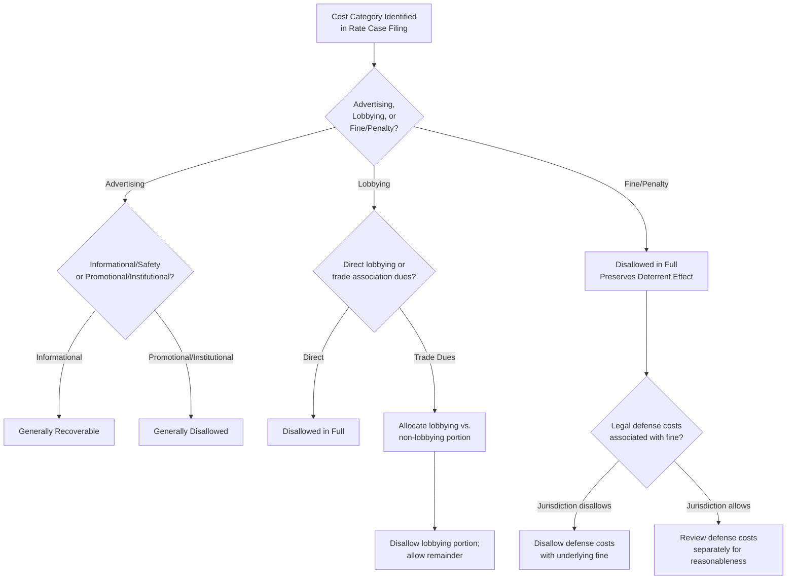

## Disallowed Expense Categories: Advertising, Lobbying, Fines

### Overview

Disallowed expense categories refer to specific types of utility costs that regulatory commissions routinely exclude, in whole or in part, from the revenue requirement used to set customer rates — even though the costs were actually incurred by the utility. These categories are addressed distinctly from general O&M reasonableness review because the disallowance rationale rests less on whether the cost was prudently incurred in an operational sense, and more on a categorical policy judgment that certain cost types simply do not belong in cost of service, regardless of prudence, because they primarily benefit shareholders, are punitive by design, or represent activities that ratepayers should not be compelled to fund. Advertising, lobbying, and fines/penalties are the three most commonly litigated categories, though the underlying principle extends to other similar cost types.

### General Principle: Ratepayer Benefit Test

**Key Points**

- The unifying analytical framework across these categories is often referred to as a "ratepayer benefit" test: costs that provide a direct, demonstrable benefit to ratepayers (e.g., through improved safety, reliability, or reduced future costs) are generally recoverable, while costs that primarily benefit shareholders, corporate image, competitive positioning of unregulated affiliates, or that are inherently punitive in nature, are generally excluded.
- This principle is distinct from ordinary prudence review (which asks whether a decision was reasonable given the information available at the time) — a cost can be entirely prudently incurred from a business management perspective and still be categorically disallowed for ratemaking purposes because it fails the ratepayer benefit test.
- Disallowance under this framework typically applies regardless of whether the utility is later shown to have benefited financially or reputationally from the expenditure, since the focus is on who bears the cost's benefit, not on whether the expenditure was well-executed.

### Advertising Expense

**Key Points**

- Advertising costs are generally bifurcated into categories with different ratemaking treatment:
  - **Informational/operational advertising** — messaging that serves an operational or safety purpose directly benefiting ratepayers, such as outage notification procedures, gas leak safety awareness ("if you smell gas, leave and call"), energy efficiency program promotion, demand response program enrollment, or billing/rate change notifications required by regulatory or statutory mandate. This category is generally recoverable.
  - **Promotional/goodwill advertising** — messaging intended to build brand image, corporate goodwill, or promote increased consumption of the utility's product (historically more relevant during periods when utilities sought to grow sales volumes), is generally disallowed on the theory that it primarily benefits shareholders through enhanced corporate reputation or increased sales rather than providing a ratepayer service benefit.
  - **Institutional/image advertising** — advertising focused on general corporate reputation, community sponsorship messaging, or positioning relative to competitors/regulators (sometimes relevant in the context of pending legislative or regulatory matters), is similarly generally disallowed.
- Commissions applying this framework typically require the utility to itemize advertising costs by category and provide sufatingcient detail to distinguish informational content from promotional or institutional content, since a single advertising campaign or budget line item can sometimes blend elements of multiple categories.
- Energy conservation and demand-side management advertising occupies a special, generally favorable category in most jurisdictions, since messaging encouraging reduced consumption or program participation is viewed as aligned with broader public policy goals (energy efficiency, peak demand reduction) and directly benefiting ratepayers through potential bill savings and system-wide cost avoidance.

### Lobbying and Political Activity Expense

**Key Points**

- Lobbying expense — costs associated with efforts to influence legislation, regulation, or governmental policy — is broadly disallowed across most jurisdictions on the theory that legislative and regulatory outcomes primarily affect the utility's business environment and shareholder interests (e.g., favorable tax treatment, rate design flexibility, permitting timelines) rather than directly benefiting ratepayers in the current period.
- This disallowance principle parallels federal tax law treatment under Internal Revenue Code Section 162(e), which similarly disallows a tax deduction for lobbying expenditures, reflecting a broader public policy view that governmental influence activities should not receive the ordinary tax or ratemaking treatment afforded to legitimate business operating costs.
- **Trade association dues** present a specific and recurring complication: a utility's membership dues paid to an industry trade association (e.g., Edison Electric Institute, American Gas Association, or state-level utility associations) typically fund a mix of activities, some clearly lobbying-related (direct legislative advocacy) and others arguably operational or educational (industry technical standards development, safety training, benchmarking studies, conferences).
  - Trade associations frequently provide member utilities (or regulators can independently determine) an allocation percentage representing the portion of dues attributable to lobbying activity, which is then disallowed, with the remaining non-lobbying portion potentially recoverable.
  - Some jurisdictions apply a more categorical, higher-than-reported disallowance percentage on the theory that self-reported lobbying allocations by trade associations tend to understate the true lobbying-related share of dues.
- Direct utility lobbying costs — in-house government affairs staff compensation, outside lobbyist retainers, and related travel/entertainment expenses — are typically disallowed entirely, distinct from the mixed treatment applied to trade association dues.
- Costs of utility participation in a specific rate case or regulatory proceeding (rate case expense) are treated separately from lobbying expense (see the corresponding chapter item), since participating in an adjudicative regulatory proceeding regarding the utility's own rates is generally viewed as a distinct, and generally recoverable (subject to reasonableness and amortization), activity from legislative/political lobbying.

### Fines and Penalties

**Key Points**

- Fines and penalties imposed on a utility by a governmental or regulatory authority — for regulatory violations, environmental violations, safety violations, or other legal infractions — are almost universally disallowed from cost of service, reflecting a strong and widely shared regulatory policy principle that ratepayers should not bear the cost of penalties imposed specifically because of the utility's own violation of legal or regulatory requirements.
- The rationale is distinctly different from the "ratepayer benefit" framing applied to advertising and lobbying: fines are disallowed not because they fail to benefit ratepayers, but because allowing recovery would undermine the deterrent purpose of the penalty itself — if ratepayers rather than shareholders bore the cost of fines, the utility would have reduced financial incentive to avoid the violative conduct in the first place.
- This principle typically extends to:
  - Civil penalties assessed by state or federal regulatory agencies (e.g., environmental regulators, pipeline safety regulators, electric reliability organizations) for specific violations.
  - Penalties imposed by the utility's own rate-setting commission for performance failures under a performance-based ratemaking or service quality metric framework (distinct from, though sometimes confused with, general fines).
  - Settlement payments in lieu of a formal fine, where the settlement is understood to be resolving allegations of a legal or regulatory violation.
- A frequently litigated boundary question is how to treat **legal defense costs** incurred in contesting a fine, penalty, or enforcement action — some jurisdictions disallow defense costs alongside the underlying fine on the theory that both arise from the same violative conduct, while others allow reasonable defense costs (particularly where the utility is ultimately found not to have violated the relevant requirement) as distinct from the penalty itself. [Unverified — treatment of legal defense costs in this context varies by jurisdiction and by the specific facts and outcome of the underlying enforcement matter.]
- Some jurisdictions distinguish between penalties that are purely punitive in nature and cost-based charges that happen to be labeled as a "penalty" but that actually reflect a specific, quantifiable cost to the system (e.g., certain interconnection or market-rule penalties in RTO/ISO tariffs that function more like a cost-recovery true-up than a punitive sanction) — the latter category may receive different treatment upon a specific showing of its non-punitive character.

### Related and Adjacent Disallowed Categories

**Key Points**

- **Charitable contributions and civic/community sponsorships** — frequently disallowed alongside advertising and lobbying on similar ratepayer-benefit grounds, though some jurisdictions permit limited recovery of charitable contributions tied to specific ratepayer-assistance programs (e.g., low-income energy assistance fund contributions) as distinct from general corporate philanthropy.
- **Country club dues, entertainment, and similar executive perquisites** — commonly disallowed as personal benefit items unrelated to utility service delivery.
- **Merger and acquisition pursuit costs for unregulated transactions** — costs of pursuing corporate transactions unrelated to the regulated utility's operations are generally disallowed as shareholder-benefiting costs, distinct from the treatment of merger-related costs that do relate to the regulated utility itself (which receive separate, often more favorable, review tied to a ratepayer benefit showing).

### Diagram: Disallowance Decision Framework

### Diagram: Disallowed vs. Recoverable Spectrum (svg_diagram)

<svg xmlns="http://www.w3.org/2000/svg" viewBox="0 0 740 300">
<rect x="0" y="0" width="740" height="300" fill="#ffffff" />
<text x="370" y="24" text-anchor="middle" font-size="16" font-weight="bold" fill="#1a1a1a">Disallowed Expense Spectrum (svg_diagram)</text>
<line x1="60" y1="150" x2="680" y2="150" stroke="#333333" stroke-width="2" />
<text x="60" y="175" font-size="11" text-anchor="middle" fill="#1a1a1a">Generally Recoverable</text>
<text x="680" y="175" font-size="11" text-anchor="middle" fill="#1a1a1a">Universally Disallowed</text>
<circle cx="120" cy="150" r="7" fill="#38761d" />
<text x="120" y="110" text-anchor="middle" font-size="11" fill="#333333">Safety/Informational</text>
<text x="120" y="125" text-anchor="middle" font-size="11" fill="#333333">Advertising</text>
<circle cx="260" cy="150" r="7" fill="#93c47d" />
<text x="260" y="110" text-anchor="middle" font-size="11" fill="#333333">Non-Lobbying Portion</text>
<text x="260" y="125" text-anchor="middle" font-size="11" fill="#333333">of Trade Dues</text>
<circle cx="400" cy="150" r="7" fill="#e69138" />
<text x="400" y="110" text-anchor="middle" font-size="11" fill="#333333">Promotional /</text>
<text x="400" y="125" text-anchor="middle" font-size="11" fill="#333333">Institutional Advertising</text>
<circle cx="520" cy="150" r="7" fill="#cc4125" />
<text x="520" y="110" text-anchor="middle" font-size="11" fill="#333333">Direct Lobbying</text>
<text x="520" y="125" text-anchor="middle" font-size="11" fill="#333333">Expense</text>
<circle cx="640" cy="150" r="7" fill="#a61c1c" />
<text x="640" y="110" text-anchor="middle" font-size="11" fill="#333333">Fines &amp;</text>
<text x="640" y="125" text-anchor="middle" font-size="11" fill="#333333">Penalties</text>
</svg>

### Practical Application Example

**Example**

A gas utility's test-year filing includes: $500,000 in advertising, of which $300,000 covers gas leak safety and appliance safety messaging and $200,000 covers a "community partner" brand-image campaign; $180,000 in trade association dues, with the association reporting 45% of dues fund lobbying activities; and a $750,000 civil penalty paid to a state pipeline safety regulator following a documented compliance violation, plus $220,000 in legal defense costs incurred contesting the penalty amount (though not contesting the underlying violation finding).

**Output**

- Advertising: $300,000 (safety-related) allowed; $200,000 (brand-image campaign) disallowed.
- Trade association dues: $81,000 (45% of $180,000) disallowed as lobbying-related; $99,000 allowed.
- Civil penalty: $750,000 disallowed in full, consistent with the near-universal principle against ratepayer funding of penalties.
- Legal defense costs: In a jurisdiction that disallows defense costs alongside the underlying fine, the full $220,000 is also disallowed; in a jurisdiction that reviews defense costs separately, the $220,000 may be evaluated for reasonableness independent of the penalty disallowance (with the outcome depending on the specific facts and jurisdictional standard).
- Total clearly disallowed in this example: at least $1,031,000 ($200,000 + $81,000 + $750,000), with the $220,000 legal defense cost treatment dependent on jurisdiction-specific rules.

### Conclusion

Advertising, lobbying, and fines/penalties represent categorically disallowed or presumptively disallowed expense types that regulators exclude from cost of service based on policy principles distinct from ordinary prudence review. Informational and safety advertising, along with the non-lobbying portion of trade association dues, generally remain recoverable, while promotional/institutional advertising, direct lobbying expense, and fines/penalties are broadly excluded — the latter specifically to preserve the deterrent function of regulatory and legal penalty regimes. Because the precise line-drawing (particularly for mixed-purpose advertising campaigns, trade association allocation percentages, and legal defense cost treatment) is fact-intensive and varies by jurisdiction, utilities preparing rate case filings typically itemize these cost categories carefully to support the recoverable portion and anticipate scrutiny of the excluded portion. [Inference — specific disallowance percentages, categorical rules, and treatment of edge cases such as legal defense costs vary considerably across jurisdictions and should be verified against the applicable commission's current precedent.]

**Related Topics**

- Operations and Maintenance Expense Review
- Affiliate Transactions and Cost Allocation Manuals
- Payroll, Incentive Compensation, and Benefits Costs
- Rate Case Expense and Its Recovery
- Performance-Based Ratemaking and Service Quality Penalty Mechanisms
- Demand-Side Management and Energy Efficiency Program Cost Recovery
- Shareholder vs. Ratepayer Cost Responsibility Principles
- Regulatory Compliance and Enforcement Frameworks