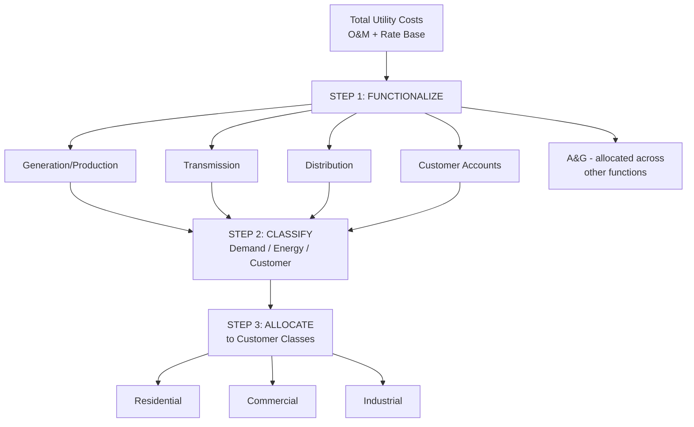

## Functionalization of Utility Costs

### Overview

Functionalization is the first analytical step in a utility cost of service study, in which the utility's total costs (both O&M and rate base/investment) are organized into broad functional categories corresponding to the major stages of providing utility service — generation, transmission, distribution, and customer-related functions (for electric utilities), or analogous categories for gas and water utilities. Functionalization precedes classification (organizing costs by cost-causation type — demand, energy, and customer-related) and allocation (assigning classified costs to specific customer classes), forming the first of the three sequential steps commonly summarized as "functionalize, classify, allocate" in cost of service methodology.

### Purpose and Position in the Cost of Service Study

**Key Points**

- Functionalization organizes the utility's chart-of-accounts-level costs (which are typically recorded for financial accounting and regulatory reporting purposes, following a uniform system of accounts such as the FERC Uniform System of Accounts for electric utilities) into functional groupings that reflect the physical and operational stages of delivering utility service.
- This functional reorganization is necessary because financial accounting categories (e.g., "Account 364 – Poles, Towers, and Fixtures") do not by themselves indicate which customer classes should bear the associated cost; functionalization provides the structural bridge between raw accounting data and the subsequent classification and allocation steps that ultimately assign costs to specific rate classes (residential, commercial, industrial).
- The three-step cost of service sequence is commonly summarized as:
  1. **Functionalize** — group costs by functional category (generation, transmission, distribution, customer accounts, etc.).
  2. **Classify** — within each functional category, further divide costs by cost-causation type (demand-related, energy-related, customer-related).
  3. **Allocate** — assign the classified costs to specific customer classes using allocation factors appropriate to each cost classification.

### Standard Functional Categories for Electric Utilities

**Key Points**

- **Generation (Production)** — costs of owning and operating generating plants (fuel, O&M, capital investment in generating facilities) or, for utilities that do not own generation, costs of purchased power used to serve retail load.
- **Transmission** — costs of the high-voltage transmission system that moves bulk power from generating sources (or from the transmission grid interconnection point) to distribution substations; for utilities within an RTO/ISO, transmission costs may be further subdivided between costs recovered through FERC-jurisdictional transmission rates and costs recovered through state-jurisdictional retail rates.
- **Distribution** — costs of the lower-voltage system that delivers power from distribution substations to individual customers, including distribution substations, primary and secondary lines, transformers, and service drops.
- **Customer Accounts** — costs of billing, metering, meter reading, customer service call centers, and collections activities.
- **Customer Service and Informational** — costs of customer education, energy efficiency program administration, and informational (non-promotional) advertising, sometimes combined with or kept distinct from Customer Accounts depending on the specific chart of accounts and cost of service study convention.
- **Administrative and General (A&G)** — corporate overhead costs (executive management, legal, accounting, human resources) that support all functions and are typically allocated across the other functional categories using a specified allocator (e.g., labor-related A&G allocated based on the labor costs of each function) rather than being treated as a separate end-use functional category in the final allocation to customer classes.

### Analogous Functionalization for Gas and Water Utilities

**Key Points**

- **Gas utilities** typically functionalize costs into categories such as production/gathering (if applicable), transmission (long-distance pipeline transport), storage (underground gas storage facilities used to manage seasonal demand variation), distribution (local delivery mains and services), and customer accounts.
- **Water utilities** typically functionalize costs into categories such as source of supply (wells, reservoirs, water rights), treatment (purification and treatment plant costs), transmission/supply mains (large-diameter mains moving treated water from treatment facilities toward distribution areas), distribution (local mains, hydrants, meters), and customer accounts.
- The underlying logic is consistent across utility types: functional categories track the physical stages of moving the utility's product (electricity, gas, or water) from its source to the end customer, since different functional stages often exhibit different cost-causation characteristics relevant to the subsequent classification step (e.g., generation/production costs often have different demand vs. energy cost drivers than distribution costs).

### Functionalization of Rate Base vs. O&M

**Key Points**

- Functionalization applies to both O&M expense and rate base (plant investment), since both must ultimately be allocated to customer classes.
- Plant investment is functionalized based on the FERC Uniform System of Accounts (for electric utilities) or analogous state/industry account structures, with specific plant accounts pre-designated to specific functions (e.g., Account 353 "Station Equipment" is a transmission-function account; Account 364 "Poles, Towers, and Fixtures" is typically a distribution-function account).
- O&M expense functionalization generally follows the same functional structure as the associated plant, since operating and maintaining a particular category of plant (e.g., transmission lines) generates O&M costs properly functionalized to that same category (e.g., transmission O&M).
- Depreciation expense, property taxes, and the return component (rate base × ROE) are similarly functionalized following the functional assignment of the underlying plant investment on which they are calculated.

### Functionalization Challenges and Disputes

**Key Points**

- **Multi-use or joint-use plant** — some plant serves multiple functions simultaneously (e.g., a substation that includes both transmission-level and distribution-level equipment, or general plant such as vehicles and office buildings used across multiple functions), requiring a sub-allocation or split between functions before the classification and allocation steps can proceed; this split is sometimes performed using engineering studies, capacity ratios, or other technical bases.
- **Transmission/distribution boundary disputes** — the precise voltage or equipment threshold distinguishing "transmission" from "distribution" plant can be a contested technical and regulatory question, particularly significant because transmission costs for utilities within RTO/ISO structures may be subject to FERC jurisdiction and cost recovery through FERC-approved transmission rates, while distribution costs remain within state retail jurisdiction — making the functional boundary a jurisdictional as well as a cost-allocation question.
- **A&G cost functionalization method** — because A&G costs support all functions rather than being tied to a single function, the specific method used to allocate A&G across functions (e.g., allocation based on each function's share of labor costs, or based on each function's share of total O&M excluding A&G) can materially affect the functionalized cost totals ultimately flowing into the classification and allocation steps, and is itself a frequent subject of expert testimony disagreement.
- **New and evolving cost categories** — emerging cost categories such as distributed energy resource integration costs, grid modernization/smart grid investments, or cybersecurity costs may not map cleanly onto traditional generation/transmission/distribution functional categories, requiring case-specific determinations or evolving industry conventions as these cost categories become more prevalent.

### Diagram: Functionalization as the First Step in Cost of Service

### Diagram: Electric Utility Functional Categories Along the Delivery Chain (svg_diagram)

<svg xmlns="http://www.w3.org/2000/svg" viewBox="0 0 760 300">
<rect x="0" y="0" width="760" height="300" fill="#ffffff" />
<text x="380" y="24" text-anchor="middle" font-size="16" font-weight="bold" fill="#1a1a1a">Functional Categories: Generation to Customer (svg_diagram)</text>
<rect x="30" y="120" width="150" height="80" fill="#c9d9f0" stroke="#33487a" stroke-width="1.5" />
<text x="105" y="165" text-anchor="middle" font-size="12" fill="#1a1a1a">Generation</text>
<rect x="210" y="120" width="150" height="80" fill="#d9ead3" stroke="#38761d" stroke-width="1.5" />
<text x="285" y="165" text-anchor="middle" font-size="12" fill="#1a1a1a">Transmission</text>
<rect x="390" y="120" width="150" height="80" fill="#fff2cc" stroke="#bf9000" stroke-width="1.5" />
<text x="465" y="165" text-anchor="middle" font-size="12" fill="#1a1a1a">Distribution</text>
<rect x="570" y="120" width="150" height="80" fill="#f4cccc" stroke="#a61c1c" stroke-width="1.5" />
<text x="645" y="155" text-anchor="middle" font-size="12" fill="#1a1a1a">Customer</text>
<text x="645" y="172" text-anchor="middle" font-size="12" fill="#1a1a1a">Accounts</text>
<line x1="180" y1="160" x2="210" y2="160" stroke="#333333" stroke-width="2" marker-end="url(#arrowF)" />
<line x1="360" y1="160" x2="390" y2="160" stroke="#333333" stroke-width="2" marker-end="url(#arrowF)" />
<line x1="540" y1="160" x2="570" y2="160" stroke="#333333" stroke-width="2" marker-end="url(#arrowF)" />
<rect x="230" y="230" width="300" height="40" fill="#eeeeee" stroke="#666666" />
<text x="380" y="255" text-anchor="middle" font-size="11" fill="#333333">A&amp;G allocated across all four functions</text>
</svg>

### Practical Application Example

**Example**

An electric utility's cost of service study begins with total O&M and rate base costs of $500 million, functionalized as follows based on FERC Uniform System of Accounts mapping: $180 million to generation (fuel, purchased power, generation O&M and plant), $60 million to transmission plant and O&M, $150 million to distribution plant and O&M, $40 million to customer accounts, and $70 million in A&G costs requiring further allocation across the other four functions based on each function's relative share of labor costs (generation 35%, transmission 10%, distribution 40%, customer accounts 15%).

**Output**

| Function | Direct Functionalized Cost | A&G Allocation (based on labor share) | Total Functionalized Cost |
| --- | --- | --- | --- |
| Generation | $180M | $24.5M (35% × $70M) | $204.5M |
| Transmission | $60M | $7.0M (10% × $70M) | $67.0M |
| Distribution | $150M | $28.0M (40% × $70M) | $178.0M |
| Customer Accounts | $40M | $10.5M (15% × $70M) | $50.5M |
| **Total** | **$430M** | **$70M** | **$500M** |

These functionalized totals then proceed to the classification step, where each function's costs are further divided into demand-related, energy-related, and customer-related components before allocation to specific customer classes.

### Conclusion

Functionalization provides the foundational organizing structure for a cost of service study, translating utility accounting data into functional categories that mirror the physical stages of delivering utility service. This step is a necessary prerequisite to classification and allocation, since the cost-causation characteristics relevant to fairly allocating costs among customer classes typically differ across functions (generation, transmission, distribution, customer accounts). While functionalization is often treated as a relatively mechanical, less-contested step compared to classification and allocation, disputes can still arise around joint-use plant splits, the transmission/distribution boundary (particularly where FERC and state jurisdiction intersect), and the specific method used to allocate shared A&G costs across functions. [Inference — specific functionalization conventions, account mappings, and A&G allocation methods vary by utility type, jurisdiction, and the specific cost of service study methodology adopted in a given proceeding.]

**Related Topics**

- Classification of Costs: Demand, Energy, and Customer Components
- Allocation of Costs to Customer Classes
- FERC Uniform System of Accounts
- Transmission vs. Distribution Jurisdictional Boundary Issues
- Administrative and General Expense Allocation Methods
- Marginal Cost of Service Studies
- Rate Design and Class Cost Allocation Factors
- Joint-Use and Common Plant Cost Splitting Methodologies