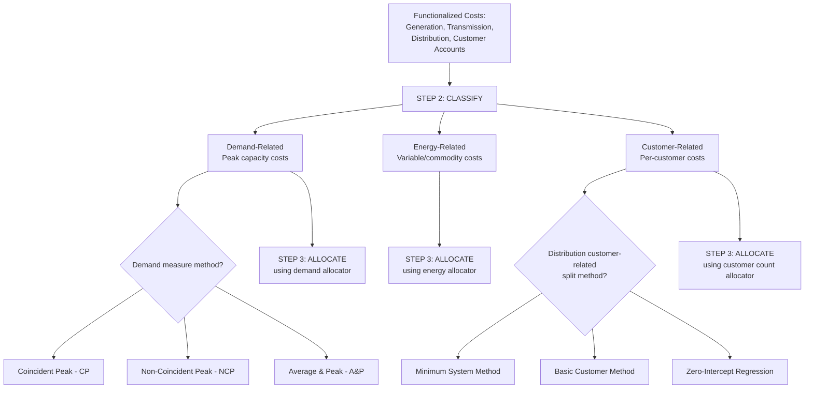

## Classification into Demand, Energy, and Customer Components

### Overview

Classification is the second step in a utility cost of service study, following functionalization and preceding allocation. Within each functional category (generation, transmission, distribution, customer accounts), classification further divides costs according to the underlying cost-causation driver: whether a cost varies with a customer's peak demand (capacity requirements), with the volume of energy consumed, or with the number of customers served (regardless of usage level). This demand/energy/customer classification framework determines which allocation factors are appropriate to use in the third step (allocation to customer classes), since each classification category is properly allocated using a different type of allocator.

### The Three Classification Categories

**Key Points**

- **Demand-related (capacity-related) costs** — costs driven by the need to have sufficient capacity available to meet customers' peak demand requirements, regardless of how much energy is actually consumed over time. These costs are generally fixed with respect to the quantity of energy delivered but vary with the capacity needed to serve peak load. Examples: generation capacity (plant sized to meet system peak plus reserve margin), transmission and distribution line and transformer capacity (sized to carry peak load without overload), and the demand-related portion of substation equipment.
- **Energy-related (variable/commodity) costs** — costs that vary directly with the quantity of energy (kWh, therms, gallons) produced, transported, or delivered, largely independent of peak demand levels. Examples: fuel costs, variable O&M costs tied to generation output, and line losses (energy lost in transmission and distribution proportional to the energy flowing through the system).
- **Customer-related costs** — costs driven by the number of customers served, largely independent of both peak demand and energy consumption levels. Examples: metering equipment, meter reading, billing, customer service call centers, service drops/connections, and a portion of distribution costs related to minimum system requirements needed to connect any customer regardless of usage level.

### Classification Within Each Functional Category

**Key Points**

- **Generation/Production function** — historically classified predominantly as demand-related (capacity costs to meet peak) and energy-related (fuel and variable O&M costs to produce energy), with minimal customer-related classification; the specific demand/energy split within generation is often determined using a peak responsibility method (e.g., the costs of generating capacity are classified as demand-related based on the utility's reserve margin and peak-serving role) or, in some methodologies, an average-and-peak or probability-of-loss-of-load approach.
- **Transmission function** — predominantly classified as demand-related, since transmission capacity is generally sized to meet peak power flow requirements, though some jurisdictions apply an energy-related classification to a portion of transmission costs (e.g., reflecting line losses) or use alternative methodologies specific to transmission cost classification.
- **Distribution function** — a mix of demand-related costs (distribution lines and transformers sized to serve peak local demand) and customer-related costs (service drops, meters, and the "minimum system" concept — see below); distribution is often the functional category with the most contested classification methodology because the demand/customer split can materially shift cost responsibility between high-usage and low-usage customer classes.
- **Customer Accounts function** — predominantly classified as customer-related (billing, metering, customer service), since these costs are driven by the existence of a customer account rather than by that customer's demand or energy usage level, though metering costs are sometimes further sub-classified based on meter type/complexity if usage-related metering equipment (e.g., interval meters for large commercial/industrial customers) differs in cost from standard residential metering.

### The Minimum System Method for Distribution Classification

**Key Points**

- A recurring and historically contested methodology issue in distribution cost classification is the "minimum system" (or "zero-intercept") method versus alternative approaches for splitting distribution costs between demand-related and customer-related classifications.
- The **minimum system method** posits that even a hypothetical customer with zero demand would still require some minimum-sized distribution infrastructure (e.g., a minimum-gauge conductor, a minimum-capacity transformer) simply to be connected to the system; the cost of this hypothetical minimum-sized system is classified as customer-related, while the incremental cost of larger-than-minimum equipment (needed to serve actual demand levels above the hypothetical minimum) is classified as demand-related.
- Critics of the minimum system method argue that no customer actually has zero demand, so the entire premise of a "minimum system" sized for zero demand is a hypothetical construct that tends to classify a disproportionately large share of distribution costs as customer-related, which in turn (through the allocation step) tends to shift more cost responsibility toward high-usage customers relative to low-usage customers within a rate class, or across residential customers with different usage levels.
- Alternative methods include the **basic customer method** (classifying only the cost of the actual smallest standard equipment size used across the system as customer-related, without hypothesizing an even smaller "minimum" system) and various **zero-intercept regression approaches** (using statistical regression of the relationship between distribution plant investment and customer counts across different equipment sizes to estimate the customer-related cost intercept).
- The choice among these methods is one of the most litigated technical issues in electric and gas distribution cost of service studies, since it can shift tens of millions of dollars of cost responsibility between residential and non-residential classes, or between high-usage and low-usage residential customers, depending on the method selected. [Unverified — the specific magnitude of cost-shifting varies by utility size and system characteristics and should be verified against the specific cost of service study at issue.]

### Demand Classification Methodologies

**Key Points**

- Within demand-related cost categories, the specific method used to measure "demand" for classification and subsequent allocation purposes varies, including:
  - **Coincident peak (CP) demand** — a customer class's contribution to the system's peak demand at the moment the system peak occurs, capturing the class's actual responsibility for the capacity that must be available at that critical moment.
  - **Non-coincident peak (NCP) demand** — each customer class's own individual peak demand, regardless of whether that peak occurs at the same time as the system peak, sometimes used for distribution-level facilities that must be sized to serve each customer's own peak even if that peak does not coincide with the system peak.
  - **Average and peak (A&P) methods** — blending average demand (related to energy) and peak demand (related to capacity) in a weighted combination intended to reflect that generation capacity serves both baseload/average energy needs and peak capacity needs.
- The selection among CP, NCP, and blended methods is itself a significant point of dispute in classification and allocation methodology, since different customer classes (e.g., residential vs. industrial) often have different peak timing relative to the system peak, and the choice of demand measure can materially affect each class's calculated cost responsibility.

### Energy Losses and Their Classification

**Key Points**

- Line losses (energy lost as heat during transmission and distribution) are generally classified as energy-related, since loss quantities scale with the amount of energy flowing through the system rather than with peak capacity requirements per se, though some methodologies incorporate a demand-related loss component reflecting that losses increase disproportionately (roughly with the square of current) as load approaches capacity limits.
- Losses are typically expressed as a loss factor or percentage applied to allocate a share of total system losses to each customer class based on that class's energy consumption (adjusted for the class's voltage level of service, since losses differ between transmission-level, primary distribution-level, and secondary distribution-level delivery points).

### Diagram: Classification Framework Applied Across Functions

### Diagram: Minimum System vs. Basic Customer Method (svg_diagram)

<svg xmlns="http://www.w3.org/2000/svg" viewBox="0 0 740 320">
<rect x="0" y="0" width="740" height="320" fill="#ffffff" />
<text x="370" y="24" text-anchor="middle" font-size="16" font-weight="bold" fill="#1a1a1a">Distribution Classification Methods (svg_diagram)</text>
<line x1="80" y1="260" x2="680" y2="260" stroke="#333333" stroke-width="1.5" />
<line x1="80" y1="60" x2="80" y2="260" stroke="#333333" stroke-width="1.5" />
<text x="30" y="65" font-size="10" fill="#333333">Cost</text>
<text x="650" y="280" font-size="10" fill="#333333">Demand (kW)</text>
<line x1="80" y1="200" x2="680" y2="90" stroke="#38761d" stroke-width="2" />
<text x="500" y="110" font-size="11" fill="#38761d">Actual system cost vs. demand</text>
<line x1="80" y1="230" x2="680" y2="90" stroke="#a61c1c" stroke-width="2" stroke-dasharray="6,3" />
<circle cx="80" cy="230" r="5" fill="#a61c1c" />
<text x="130" y="245" font-size="11" fill="#a61c1c">Minimum System intercept</text>
<text x="130" y="260" font-size="10" fill="#a61c1c">(hypothetical zero-demand system)</text>
<circle cx="80" cy="200" r="5" fill="#38761d" />
<text x="130" y="195" font-size="11" fill="#38761d">Basic Customer intercept</text>
<text x="130" y="210" font-size="10" fill="#38761d">(smallest actual equipment size)</text>

<text x="380" y="300" text-anchor="middle" font-size="11" fill="`#333333`">Gap between intercepts = disputed customer-related cost classification</text>

</svg>

### Practical Application Example

**Example**

A distribution utility's functionalized distribution costs total $180 million. Applying a minimum system study, the utility's consultant determines that a hypothetical minimum-sized distribution system (smallest conductor gauge, smallest transformer size) would cost $70 million, classified as customer-related, with the remaining $110 million classified as demand-related. An intervenor's expert instead applies a basic customer method using the smallest equipment size actually deployed anywhere on the system (which is larger than the hypothetical "minimum" gauge used in the minimum system study), producing a customer-related classification of only $45 million, with the remaining $135 million classified as demand-related.

**Output**

| Method | Customer-Related | Demand-Related |
| --- | --- | --- |
| Minimum System | $70M (38.9%) | $110M (61.1%) |
| Basic Customer | $45M (25.0%) | $135M (75.0%) |

Because customer-related costs are typically allocated equally per customer (favoring high-usage customers who "share" this fixed cost across more usage) while demand-related costs are allocated based on class demand contribution (which tends to burden higher-demand classes more heavily), the minimum system method's higher customer-related classification in this example would generally shift more cost responsibility toward the allocation method used for the customer-related pool, with the practical class-level rate impact depending on the specific allocator applied in the subsequent allocation step.

### Conclusion

Classification into demand, energy, and customer components provides the analytical bridge between functionalized costs and the allocation factors ultimately used to assign costs to specific customer classes. While the broad conceptual categories are relatively uncontroversial, the specific methodologies used to perform the classification — particularly the minimum system method versus alternative approaches for splitting distribution costs, and the choice among coincident peak, non-coincident peak, or blended demand measures — are among the most heavily litigated technical issues in utility rate cases, given their potential to materially shift cost responsibility among customer classes. [Inference — the magnitude of cost-shifting associated with different classification methodologies is case- and system-specific, and the prevailing methodology in any given jurisdiction should be verified against current commission precedent and cost of service study practice.]

**Related Topics**

- Functionalization of Utility Costs
- Allocation of Costs to Customer Classes
- Minimum System vs. Basic Customer Method Debates
- Coincident Peak vs. Non-Coincident Peak Demand Allocators
- Marginal Cost of Service Studies
- Rate Design and Inclining/Declining Block Rate Structures
- Line Loss Studies and Loss Factor Development
- Class Cost of Service Study Litigation Standards