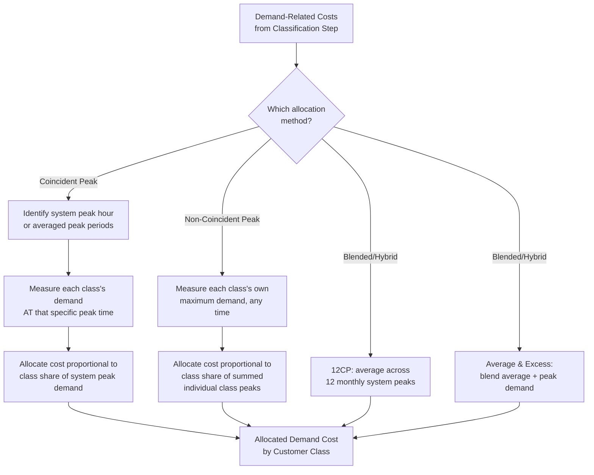

## Peak Demand Allocation Methods: Coincident and Non-Coincident

### Overview

Peak demand allocation methods are the specific techniques used in the third step of a cost of service study — allocation — to assign demand-related (capacity) costs across customer classes based on each class's measured or calculated demand. Because demand-related costs (generation and transmission capacity, and much of distribution capacity) are driven by the need to serve peak load, the choice of *which* peak, and *whose* demand at that peak, to use as the allocation basis materially affects how much cost responsibility each customer class bears. The two foundational approaches are coincident peak (CP) allocation and non-coincident peak (NCP) allocation, with several hybrid and blended methods developed to address the limitations of each.

### Coincident Peak (CP) Allocation

**Key Points**

- Coincident peak allocation assigns demand-related costs to customer classes based on each class's contribution to the system's peak demand at the specific moment the system as a whole reaches its peak — that is, each class's demand *coincident with* the system peak hour (or, in some methodologies, an average of several system peak hours or days).
- The underlying rationale: generation and transmission capacity must be sized to meet the system's peak load, so the classes whose demand is highest precisely when the system as a whole peaks are the classes actually "causing" the need for that capacity; a class with high demand at a time when the system is not at its peak does not, under this logic, drive the capacity requirement.
- CP allocation is computationally derived by identifying the hour (or averaged set of hours) of system peak demand from load research or metering data, then determining each customer class's average demand during that specific hour (based on class-level load research samples, interval metering data, or load profile studies), then allocating total demand-related costs in proportion to each class's share of total system demand at that coincident peak hour.

$$\text{Class Allocation}_i = \frac{D_{i,CP}}{\sum_j D_{j,CP}} \times \text{Total Demand-Related Cost}$$

Where $D_{i,CP}$ is class $i$'s demand at the system coincident peak hour.

- CP allocation is generally viewed as the theoretically preferred method for allocating capacity costs that are driven by system peak requirements (e.g., generation reserve margin planning, which is explicitly based on system peak plus reserve), since it most directly ties cost responsibility to the cost-causing event.

### Non-Coincident Peak (NCP) Allocation

**Key Points**

- Non-coincident peak allocation assigns costs based on each customer class's own individual maximum demand, regardless of when that maximum occurs relative to the system peak — i.e., each class's own peak, even if different classes peak at different times of day, week, or season.
- The underlying rationale: certain facilities, particularly at the distribution level, must be sized to serve each individual customer class's own peak demand at whatever time it occurs, since the local distribution equipment serving that class must handle that class's peak load regardless of whether it coincides with the broader system peak.
- NCP allocation is computationally straightforward relative to CP allocation, requiring only each class's own maximum demand (readily available from billing/metering data for demand-metered customers, or from load research sampling for classes without universal demand metering) without needing to identify or coordinate a specific system peak hour across all classes.
- NCP allocation tends to allocate a larger share of costs to classes with sharp, narrow demand peaks (even if those peaks are off-system-peak), and is generally considered more appropriate for facilities sized to each customer's or class's own demand requirements (e.g., a distribution transformer serving a specific group of customers) rather than for system-wide capacity resources.

### Comparison: When CP vs. NCP Is More Appropriate

**Key Points**

- **Generation and bulk transmission capacity** — generally considered more appropriately allocated using CP methods, since generation capacity planning (reserve margins, capacity adequacy requirements) is explicitly driven by expected system peak demand, not by the sum of each individual class's own independent peaks (which, if simply added together, would substantially overstate the actual capacity needed, since not all classes peak simultaneously).
- **Local distribution facilities** (e.g., a distribution transformer or line segment serving a specific, geographically concentrated set of customers) — sometimes considered more appropriately allocated using NCP methods, or a localized coincidence factor specific to that facility, since the facility must be sized to handle the peak demand of the specific customers it serves, which may not align with the utility-wide system peak.
- A recurring debate is whether distribution-level demand-related costs (as classified in the classification step) should use system CP, a localized coincidence-adjusted measure, or NCP, given that distribution facilities are numerous and dispersed across the system with varying degrees of coincidence with the system peak; some cost of service studies apply different demand allocators to different distribution sub-functions based on this consideration.

### Hybrid and Blended Methods

**Key Points**

- **Average and Excess (A&E) demand method** — allocates costs based on a blend of each class's average demand (reflecting an energy-related component of capacity need) and "excess" demand (the difference between the class's peak and average demand, reflecting the class's specific contribution to the system's peaking characteristics), intended to recognize that generation capacity serves both a baseload/average energy-carrying function and a peak-serving function.
- **Peak and Average (P&A) method** — a related blended approach weighting cost allocation between each class's peak demand and average demand, conceptually similar to the Average and Excess method but structured slightly differently in its computational weighting.
- **12 Coincident Peak (12CP) method** — rather than using a single system peak hour, this method uses the coincident peak demand from each of the twelve monthly system peaks over a year, averaging each class's contribution across all twelve monthly peaks, intended to smooth the potential distortion of relying on a single peak hour (which might be an outlier) and to better reflect a utility's need for capacity across all seasons rather than only the single annual peak season.
- **4CP, 3CP, and other N-coincident-peak variants** — similar averaging approaches using a different number of peak periods (e.g., the four seasonal peaks, or peaks during specific months when system risk is highest), used in some jurisdictions and by FERC in certain wholesale transmission cost allocation contexts.
- The choice among single-peak CP, 12CP, or other blended/multi-period methods reflects a tension between administrative simplicity (single peak) and capturing a more representative, less outlier-sensitive measure of each class's actual capacity responsibility across the full range of system conditions (multi-period averaging).

### Load Research and Data Requirements

**Key Points**

- Accurate CP and NCP allocation depends on reliable load research — statistically sampled or fully metered interval demand data by customer class, since most residential and small commercial customers historically have not had individual demand metering (only energy/kWh metering), requiring statistical load research studies to estimate class-level demand patterns.
- The increasing deployment of advanced metering infrastructure (AMI) with interval-level data collection has improved the granularity and reliability of class-level (and in some cases individual-customer-level) demand data available for CP/NCP allocation purposes, gradually reducing reliance on smaller statistical load research samples in jurisdictions with high AMI penetration. [Unverified — the degree to which AMI has actually supplanted traditional load research sampling in cost of service studies varies by utility and jurisdiction and should be confirmed against current practice.]
- Load research sample design, sample size adequacy, and the statistical confidence level of resulting class load profiles are themselves subject to technical review and can be a source of dispute regarding the reliability of the demand data underlying the CP/NCP allocation.

### Diagram: CP vs. NCP Allocation Logic

### Diagram: System Peak vs. Individual Class Peaks (svg_diagram)

<svg xmlns="http://www.w3.org/2000/svg" viewBox="0 0 760 340">
<rect x="0" y="0" width="760" height="340" fill="#ffffff" />
<text x="380" y="24" text-anchor="middle" font-size="16" font-weight="bold" fill="#1a1a1a">Coincident vs. Non-Coincident Peak Timing (svg_diagram)</text>
<line x1="60" y1="280" x2="700" y2="280" stroke="#333333" stroke-width="1.5" />
<text x="700" y="300" font-size="10" fill="#333333">Time of Day</text>
<line x1="60" y1="60" x2="60" y2="280" stroke="#333333" stroke-width="1.5" />
<text x="20" y="65" font-size="10" fill="#333333">Demand</text>
<path d="M60,240 Q200,220 300,120 Q380,80 450,150 Q550,240 700,200" fill="none" stroke="#33487a" stroke-width="2.5" />
<text x="380" y="60" font-size="11" fill="#33487a">System Total Demand</text>
<line x1="330" y1="80" x2="330" y2="280" stroke="#a61c1c" stroke-width="1.5" stroke-dasharray="5,3" />
<text x="330" y="300" text-anchor="middle" font-size="10" fill="#a61c1c">System Peak Hour</text>
<circle cx="330" cy="95" r="5" fill="#38761d" />
<text x="330" y="325" text-anchor="middle" font-size="10" fill="#38761d">Class A: CP = peak at this hour</text>
<circle cx="600" cy="195" r="5" fill="#e69138" />
<line x1="600" y1="195" x2="600" y2="280" stroke="#e69138" stroke-width="1.5" stroke-dasharray="3,2" />
<text x="600" y="140" text-anchor="middle" font-size="10" fill="#e69138">Class B: own peak</text>
<text x="600" y="155" text-anchor="middle" font-size="10" fill="#e69138">(off-system-peak) = NCP</text>
</svg>

### Practical Application Example

**Example**

A utility allocates $200 million of demand-related generation and transmission cost across two classes: Residential (which peaks sharply on hot summer afternoons, coincident with the system peak) and Industrial (which runs a relatively flat, near-continuous load profile with a slightly lower but very steady demand around the clock).

**Output**

| Allocation Method | Residential Share | Industrial Share | Rationale |
| --- | --- | --- | --- |
| Coincident Peak (CP) | 65% ($130M) | 35% ($70M) | Residential demand is highest exactly when system peaks |
| Non-Coincident Peak (NCP) | 50% ($100M) | 50% ($100M) | Each class's own peak counted independently; Industrial's steady near-peak-level load year-round raises its NCP share relative to its CP share |
| 12CP (monthly average) | 60% ($120M) | 40% ($80M) | Smooths the single-peak-hour CP result across twelve months, moderating the extreme summer-peak-driven CP result |

Because generation capacity in this example is genuinely built to meet the coincident system peak (driven predominantly by residential air conditioning load), CP-based methods are generally considered more cost-causation-consistent for this cost category, while NCP would shift more cost responsibility onto Industrial despite Industrial's demand not being the primary driver of the system's peak capacity requirement.

### Conclusion

Coincident peak and non-coincident peak allocation represent the two foundational approaches to assigning demand-related costs among customer classes, differing in whether cost responsibility is tied to each class's demand at the moment of system peak (CP) or to each class's own independent maximum demand regardless of timing (NCP). CP methods are generally favored for system-wide capacity resources (generation, bulk transmission) whose sizing is explicitly driven by coincident system peak planning, while NCP and localized coincidence-adjusted methods may be more appropriate for distribution facilities sized to serve specific, geographically concentrated customer groups. Hybrid methods such as 12CP and Average-and-Excess address specific limitations of single-peak-hour CP measurement, and the underlying reliability of any of these methods depends on the quality of the load research or interval metering data used to measure class-level demand. [Inference — the specific allocation method or combination of methods used in a given jurisdiction is determined by commission precedent and case-specific expert testimony, and can materially affect which customer classes bear a greater or lesser share of demand-related costs.]

**Related Topics**

- Classification into Demand, Energy, and Customer Components
- Functionalization of Utility Costs
- Allocation of Costs to Customer Classes
- Load Research Methodology and Sample Design
- Advanced Metering Infrastructure (AMI) and Interval Data Applications
- Average and Excess Demand Allocation Method
- FERC Transmission Cost Allocation Methodologies
- Marginal Cost of Service Studies