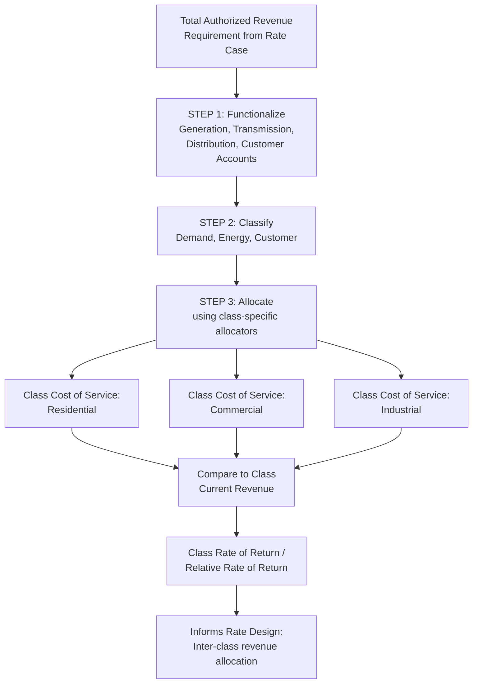

## Embedded Cost of Service Study Methodology

### Overview

Embedded Cost of Service (ECOS) study methodology is the dominant approach used in utility ratemaking to allocate a utility's total authorized revenue requirement — as determined using historical or forward-looking test-year actual/embedded (booked) costs — among customer classes. "Embedded cost" refers to the utility's actual, historically incurred (or currently authorized) costs as recorded in its regulatory accounts, in contrast to marginal cost of service studies, which instead measure the cost of serving one additional increment of demand or customers. An embedded cost of service study takes the total revenue requirement established in a rate case and, through the sequential functionalize-classify-allocate process, determines the class-specific cost of service that supports rate design and the assessment of whether each class's current or proposed rates recover a "fair share" of total costs.

### Position Within the Rate Case Process

**Key Points**

- An embedded cost of service study is typically performed after the total system-wide revenue requirement has been established (via the return on rate base, O&M, depreciation, and tax components discussed elsewhere in the ratemaking process) but before final rate design is set.
- The study's output — the cost of service allocated to each customer class — provides the benchmark against which each class's current revenue (under existing rates) and proposed revenue (under proposed rates) are compared, typically expressed as a "rate of return" or "relative rate of return" by class, indicating whether a class is over-contributing or under-contributing relative to the embedded cost it causes.
- This comparison directly informs rate design decisions: classes found to be paying less than their embedded cost of service (i.e., earning a below-system-average rate of return under current rates) are often targeted for larger proposed rate increases (subject to gradualism or rate-shock mitigation principles), while classes paying more than their embedded cost of service may receive smaller increases or even decreases.

### The Three-Step ECOS Process

**Key Points**

- **Step 1 — Functionalization**: total system costs (O&M, depreciation, taxes, return) are organized into functional categories (generation, transmission, distribution, customer accounts) based on the utility's chart of accounts, as detailed in the Functionalization chapter item.
- **Step 2 — Classification**: within each functional category, costs are further divided into demand-related, energy-related, and customer-related components based on cost causation, as detailed in the Classification chapter item.
- **Step 3 — Allocation**: classified costs are assigned to specific customer classes using allocation factors appropriate to each classification — demand-related costs allocated using coincident peak, non-coincident peak, or blended demand allocators; energy-related costs allocated based on each class's share of total energy consumption (kWh, therms, or gallons); and customer-related costs allocated based on each class's number of customers (weighted for equipment differences where applicable).
- The result of this three-step process is a fully allocated cost of service by customer class, summing functionalized-and-classified-and-allocated generation, transmission, distribution, and customer accounts costs (plus A&G allocated across functions) into a single total embedded cost figure for each class.

### Key Outputs of an ECOS Study

**Key Points**

- **Class cost of service** — the total embedded cost (O&M + depreciation + taxes + return) attributed to each customer class.
- **Class rate of return** — the return the utility actually earns from each class under current rates, calculated by subtracting each class's allocated O&M, depreciation, and tax costs from that class's current revenue, then dividing the remainder by that class's allocated rate base, yielding a class-specific rate of return comparable to the system average authorized rate of return.
- **Relative rate of return (or "revenue-to-cost ratio")** — each class's rate of return expressed as an index relative to the system average (e.g., a class earning a 110% relative rate of return is earning 10% above the system average return, indicating that class is currently paying more than its embedded cost of service relative to other classes).
- These outputs are the primary evidentiary basis cited by parties in rate design testimony arguing for or against specific inter-class revenue allocation and rate design proposals.

### Embedded Cost vs. Marginal Cost Methodologies

**Key Points**

- Embedded cost studies measure the utility's actual historical/authorized costs and allocate the *entire* revenue requirement (100% of authorized costs) among classes; marginal cost studies instead estimate the incremental cost of serving one additional unit of demand or one additional customer, without regard to whether that marginal cost sums to the total authorized revenue requirement.
- Embedded cost methodology is used nearly universally as the primary basis for setting overall class revenue allocation in U.S. utility rate cases, since it directly ties to the revenue requirement that must actually be collected from customers in aggregate; marginal cost studies are more commonly used as a supplementary analytical tool informing rate design (e.g., time-of-use rate differentials, or evaluating whether current rates send efficient price signals) rather than as the primary determinant of aggregate class revenue responsibility.
- Some jurisdictions and rate design philosophies advocate blending embedded and marginal cost signals (e.g., using marginal cost information to inform the design of time-differentiated rates within a class, while using embedded cost allocation to determine the class's aggregate revenue target), reflecting a long-standing academic and regulatory debate about the proper role of each methodology.

### Historical vs. Forward-Looking Test Year in ECOS Studies

**Key Points**

- Consistent with the broader test-year methodology used to establish the overall revenue requirement, an ECOS study is typically performed on the same test-year basis (historical, historical-with-adjustments, or forward-looking/future test year) as the underlying rate case, since class load research, customer counts, and cost functionalization/classification data must correspond to the same period as the revenue requirement being allocated.
- Load research data used in the demand allocation step (see Peak Demand Allocation Methods chapter item) is sometimes drawn from a different, often longer, historical period than the specific test year, given the cost and lead time required to conduct statistically valid load research studies; this can create a methodological question of whether load research vintage should be updated with each rate case or can reasonably be relied upon across multiple rate cases until materially outdated.

### Common Disputes in ECOS Studies

**Key Points**

- **Choice of demand allocator** (CP vs. NCP vs. 12CP vs. Average-and-Excess) — as detailed in the Peak Demand Allocation Methods chapter item, this choice can shift tens of millions of dollars of cost responsibility between residential and non-residential classes.
- **Distribution cost classification methodology** (minimum system vs. basic customer vs. zero-intercept regression) — as detailed in the Classification chapter item, this choice affects the demand/customer split within distribution costs.
- **Class definition and consolidation** — disputes over whether specific customer sub-groups (e.g., large commercial vs. small commercial, or specific rate schedules serving unique customer types such as electric vehicle charging or agricultural irrigation) should be treated as separate classes with distinct cost allocation, or consolidated into broader existing classes.
- **Treatment of special contracts and negotiated rates** — large individual customers served under negotiated or special contract rates (common for very large industrial loads) raise questions about how those customers' costs and revenues should be reflected in the broader ECOS study relative to standard-tariff customers in the same general class.
- **Multiple competing ECOS studies in a single case** — it is common in litigated rate cases for the utility, commission staff, and one or more intervenors to each present their own ECOS study using different methodological choices at each of the three steps, requiring the commission to select among (or synthesize elements from) competing studies in its final order.

### Diagram: Embedded Cost of Service Study Structure

### Diagram: Embedded vs. Marginal Cost Approach (svg_diagram)

<svg xmlns="http://www.w3.org/2000/svg" viewBox="0 0 740 300">
<rect x="0" y="0" width="740" height="300" fill="#ffffff" />
<text x="370" y="24" text-anchor="middle" font-size="16" font-weight="bold" fill="#1a1a1a">Embedded vs. Marginal Cost Methodology (svg_diagram)</text>
<rect x="60" y="70" width="290" height="180" fill="#c9d9f0" stroke="#33487a" stroke-width="1.5" />
<text x="205" y="95" text-anchor="middle" font-size="13" font-weight="bold" fill="#1a1a1a">Embedded Cost Study</text>
<text x="80" y="125" font-size="11" fill="#333333">• Uses actual/authorized</text>
<text x="80" y="143" font-size="11" fill="#333333"> historical booked costs</text>
<text x="80" y="170" font-size="11" fill="#333333">• Allocates 100% of</text>
<text x="80" y="188" font-size="11" fill="#333333"> revenue requirement</text>
<text x="80" y="215" font-size="11" fill="#333333">• Primary basis for class</text>
<text x="80" y="233" font-size="11" fill="#333333"> revenue allocation</text>
<rect x="390" y="70" width="290" height="180" fill="#fff2cc" stroke="#bf9000" stroke-width="1.5" />
<text x="535" y="95" text-anchor="middle" font-size="13" font-weight="bold" fill="#1a1a1a">Marginal Cost Study</text>
<text x="410" y="125" font-size="11" fill="#333333">• Estimates cost of next</text>
<text x="410" y="143" font-size="11" fill="#333333"> increment of demand/customer</text>
<text x="410" y="170" font-size="11" fill="#333333">• Does not necessarily sum</text>
<text x="410" y="188" font-size="11" fill="#333333"> to total revenue requirement</text>
<text x="410" y="215" font-size="11" fill="#333333">• Supplementary tool for</text>
<text x="410" y="233" font-size="11" fill="#333333"> rate design/price signals</text>
</svg>

### Practical Application Example

**Example**

An electric utility's ECOS study allocates its $600 million total revenue requirement across three classes, yielding the following results under current rates:

| Class | Allocated Cost of Service | Current Revenue | Relative Rate of Return |
| --- | --- | --- | --- |
| Residential | $320M | $290M | 85% (under-recovering) |
| Commercial | $200M | $215M | 112% (over-recovering) |
| Industrial | $80M | $95M | 122% (over-recovering) |

**Output**

- The study indicates Residential is currently paying below its embedded cost of service (85% relative rate of return), while Commercial and Industrial are paying above their embedded cost of service.
- In rate design, this typically supports a proposal to allocate a larger proportional revenue increase to the Residential class and a smaller increase (or no increase) to Commercial and Industrial, subject to gradualism principles limiting how quickly any single class's rates can move toward full cost-of-service parity in a single rate case.
- The specific pace of any such "rate of return convergence" (moving each class's relative rate of return closer to 100%) is itself a rate design policy judgment, balancing cost-causation accuracy against rate stability and bill-impact considerations for the affected class.

### Conclusion

Embedded cost of service study methodology provides the standard analytical framework for translating a utility's total authorized revenue requirement into class-specific cost responsibility, through the sequential functionalize-classify-allocate process. Its outputs — class cost of service and relative rate of return — serve as the principal evidentiary basis for inter-class revenue allocation decisions in rate design, distinguishing this approach from marginal cost studies, which serve a more limited, price-signal-oriented supplementary role. Because each of the three underlying steps involves methodological choices subject to genuine technical debate and materially different cost-allocation outcomes, it is common for multiple parties in a single rate case to present competing ECOS studies, requiring the commission to weigh competing methodologies in reaching its final order on class revenue allocation. [Inference — the specific methodological choices favored in any given jurisdiction reflect that jurisdiction's accumulated commission precedent and are subject to ongoing litigation and potential change as system characteristics and regulatory priorities evolve.]

**Related Topics**

- Functionalization of Utility Costs
- Classification into Demand, Energy, and Customer Components
- Peak Demand Allocation Methods: Coincident and Non-Coincident
- Marginal Cost of Service Studies
- Rate Design and Inter-Class Revenue Allocation
- Gradualism and Rate Shock Mitigation Principles
- Special Contracts and Negotiated Industrial Rate Treatment
- Class Cost of Service Study Litigation Standards