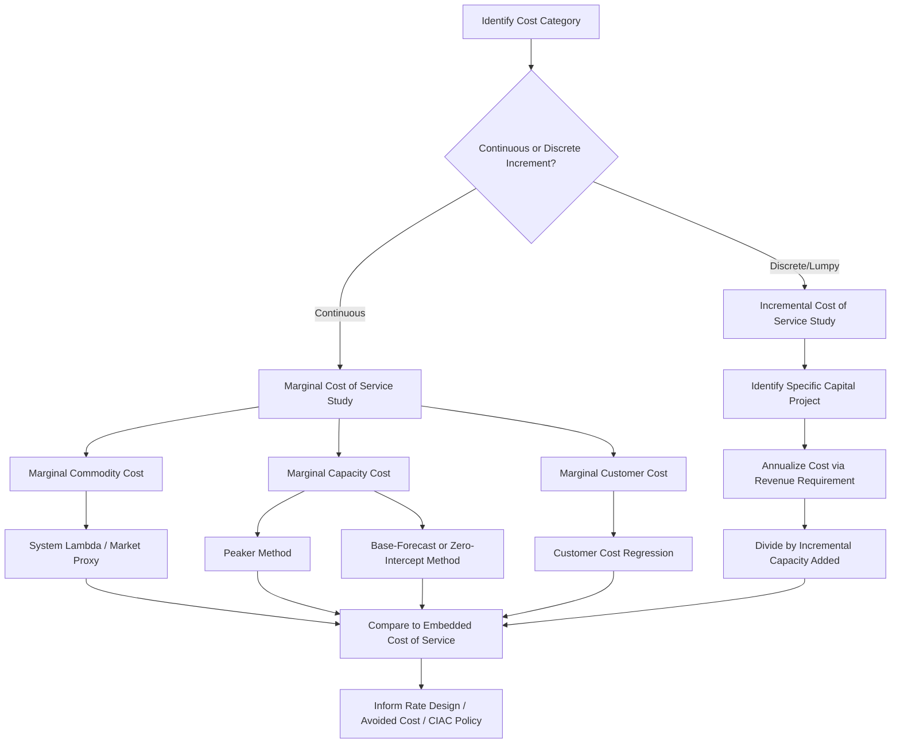

## Marginal and Incremental Cost of Service Studies

### Overview

Marginal Cost of Service (MCOS) and Incremental Cost of Service (ICOS) studies are analytical frameworks used in utility ratemaking to estimate the cost of providing service based on changes in output, demand, or customer count, rather than relying solely on historical embedded (average) costs. These studies are typically prepared as a companion or alternative to embedded Cost of Service Studies (COSS) and inform decisions on rate design, resource planning, and the economic efficiency of pricing signals sent to customers.

Marginal cost is the cost of producing one additional unit of output (e.g., one more kWh, one more Mcf, one more gallon) or serving one additional customer. Incremental cost, closely related but distinct, refers to the cost of a discrete, often lumpy, block of additional capacity, load, or customers — such as the cost of adding a new generating unit, a new water treatment module, or connecting a new subdivision.

### Purpose and Regulatory Context

**Key Points**

- Embedded COSS allocates historical (sunk) costs recorded in the utility's books; MCOS/ICOS instead estimates forward-looking, causally-driven costs.
- Regulators use MCOS/ICOS to test whether embedded-cost-based rates send efficient price signals (i.e., whether rates approximate the cost of serving the marginal customer or marginal unit of consumption).
- MCOS studies are foundational to efficient rate design principles articulated in traditional utility economics, including the work of Bonbright, Kahn, and the National Association of Regulatory Utility Commissioners (NARUC) manuals.
- ICOS is commonly used where costs are added in discrete "chunks" (e.g., a new substation, a new well field) rather than continuously, making a smooth marginal cost derivative impractical.
- These studies support decisions on: rate design (inclining/declining block rates, time-of-use rates), avoided cost calculations (e.g., PURPA Section 210 avoided cost rates), distributed energy resource (DER) compensation, and interconnection/extension policies.

### Marginal Cost of Service: Conceptual Foundation

Marginal cost, in the economic sense, is expressed as:

$$MC = \frac{\partial TC}{\partial Q}$$

where $TC$ is total cost and $Q$ is output (units of energy, water, or customers).

In utility applications, this derivative is rarely available directly from accounting data, so MCOS studies approximate marginal cost using engineering and statistical techniques applied to a utility's actual or planned investment and operating cost data.

**Categories of Marginal Cost**

Utility MCOS studies typically decompose total marginal cost into three functional components, mirroring the classical embedded cost functionalization:

1. **Marginal Generation/Supply Cost (Commodity Cost)** — the cost of producing or procuring the next unit of energy or the commodity itself (e.g., marginal fuel and purchased power cost for electric utilities, marginal water supply cost for water utilities).
2. **Marginal Capacity Cost (Demand-Related)** — the cost of the next increment of capacity needed to meet peak demand (generation capacity, transmission capacity, treatment plant capacity).
3. **Marginal Customer Cost** — the cost of connecting and maintaining an additional customer regardless of usage level (meters, service drops, billing, customer service).

### Marginal Energy/Commodity Cost

This component captures the variable cost of producing or acquiring the next unit of output.

**Electric Utilities**: Often estimated using the system lambda (short-run marginal cost of dispatch) or, more commonly in rate cases, a proxy such as the market price of energy or the fuel and variable O&M cost of the marginal (most expensive dispatched) generating unit for each hour or load period.

**Water Utilities**: Marginal cost of water supply reflects the variable cost of treatment chemicals, pumping energy, and raw water acquisition per additional gallon.

**Gas Utilities**: Marginal commodity cost approximates the cost of the next unit of gas supply, typically proxied by the spot or city-gate price.

[Inference] The specific proxy chosen (short-run dispatch cost vs. long-run avoided cost of new supply) materially affects study results and is often a point of contention in regulatory proceedings; commissions in different jurisdictions have adopted different conventions.

### Marginal Capacity Cost

Marginal capacity cost estimates the cost of the next unit of capacity needed to reliably serve peak demand. Two principal methodologies dominate:

**1. Peaker Method (Electric)**

Uses the annualized capital cost of a hypothetical or actual combustion turbine (peaking unit) as the proxy for marginal generation capacity cost, since peakers are the technology typically built to meet incremental peak demand:

$$MCC_{gen} = \frac{CRF \times Capital\ Cost_{peaker}}{kW\ capacity}$$

where $CRF$ is the capital recovery factor based on the utility's cost of capital and the asset's economic life.

**2. Transmission and Distribution (T&D) Marginal Capacity Cost**

Estimated via one of two standard engineering-economic approaches:

- **Average-of-Base-Year and Forecast-Year (or "Base-Forecast") Method**: Compares planned T&D capital expenditures over a forecast period to the corresponding forecasted load growth, yielding a $/kW cost of incremental capacity.
- **Zero Intercept (Minimum System) Method**: Statistically fits a cost curve to actual plant investment by size of equipment (e.g., cost per foot of distribution line by conductor size) and extrapolates the line to zero capacity; the "intercept" is interpreted as the customer-related cost, and the slope represents the demand-related marginal cost per unit of capacity.

**Water/Wastewater Utilities**: Marginal capacity cost is typically derived from the incremental cost of the next planned treatment plant expansion, well field, or storage facility, divided by its added capacity (often expressed in $/gallon of peak-day or maximum-day capacity).

### Marginal Customer Cost

Marginal customer costs are the costs that vary with the number of customers rather than usage or demand — typically including:

- Meter reading, billing, and customer service costs
- Meter capital costs (annualized)
- Service drop/connection costs

These are usually estimated via a **statistical cost analysis of investment by customer class**, such as regressing distribution investment against the number of customers served, or applying the zero-intercept method described above where the slope-independent (fixed) portion represents customer-related cost.

### Incremental Cost of Service Studies

ICOS differs from MCOS primarily in scale and granularity of the cost increment being measured. Where MCOS attempts to estimate a continuous marginal cost function, ICOS evaluates the cost of a specific, discrete increment of new investment or service obligation — often tied to a known, planned capital project.

**Common Applications**

- **Cost of serving a new large customer or subdivision**: Determines whether the revenue from a new customer covers the incremental cost of extending service (used in main extension policies and contribution-in-aid-of-construction, or CIAC, determinations).
- **Cost of a specific generation or capacity addition**: Used to evaluate avoided cost payments to qualifying facilities (QFs) under PURPA, or to price long-term power purchase agreements.
- **Cost of a specific treatment plant or pipeline expansion**: Allocates the annualized cost of a discrete water/wastewater capital project to the specific class or customer group driving the need for the expansion.

**Methodology**

1. Identify the specific incremental investment (e.g., a new substation, a plant expansion, a new water tower).
2. Determine the capacity or output added by that specific investment.
3. Annualize the capital cost using a revenue requirement approach (return, depreciation, taxes) or a capital recovery factor.
4. Divide by the incremental capacity/output to derive an incremental unit cost ($/kW, $/gallon, $/customer).
5. Compare this incremental unit cost to the embedded average cost or to the price/revenue the incremental customer or class will pay, to assess cost-causation and cross-subsidization.

### Comparison: Embedded vs. Marginal/Incremental Cost Studies

| Attribute | Embedded (Average) COSS | Marginal/Incremental COS |
| --- | --- | --- |
| Cost basis | Historical (sunk) recorded costs | Forward-looking, causally-driven costs |
| Time orientation | Backward-looking (test year) | Forward-looking (next unit/increment) |
| Primary use | Revenue requirement allocation, rate-of-return recovery | Rate design efficiency, avoided cost, DER/interconnection pricing |
| Typical output | Class-level allocated cost of service and rate of return | $/kWh, $/kW, $/customer marginal or incremental cost signals |
| Regulatory role | Primary basis for setting overall rates in most jurisdictions | Supplementary/diagnostic tool; occasionally a direct pricing basis (e.g., avoided cost) |

### Illustrative Numerical Example

Consider a simplified electric distribution system where the utility plans $50,000,000 in incremental distribution capital investment over a 5-year forecast period to accommodate 250,000 kW of forecast peak load growth.

$$MCC_{distribution} = \frac{\$50{,}000{,}000}{250{,}000\ kW} = \$200/kW$$

Annualizing this at a capital recovery factor of 12% (reflecting cost of capital and asset life):

$$Annual\ MCC = \$200/kW \times 0.12 = \$24/kW\text{-}year$$

This $24/kW-year marginal distribution capacity cost can then be compared to the embedded distribution demand cost per kW derived from the traditional COSS to assess whether current class-level demand charges are aligned with forward-looking cost causation.

### Process Flow Diagram

### Cost Component Structure (svg_diagram)

<svg xmlns="http://www.w3.org/2000/svg" viewBox="0 0 760 420">
\<style\>
.title { font: bold 16px sans-serif; fill: #1a1a2e; }
.box { fill: #eef2f9; stroke: #2c3e6b; stroke-width: 1.5; }
.boxlabel { font: bold 13px sans-serif; fill: #1a1a2e; }
.sub { font: 11px sans-serif; fill: #333; }
.arrow { stroke: #2c3e6b; stroke-width: 1.5; marker-end: url(#arrow); }
\</style\>
<text x="380" y="25" text-anchor="middle" class="title">Marginal Cost of Service — Component Structure (svg_diagram)</text>
<rect x="290" y="45" width="180" height="45" rx="6" class="box" />
<text x="380" y="72" text-anchor="middle" class="boxlabel">Total Marginal Cost</text>
<line x1="380" y1="90" x2="140" y2="140" class="arrow" />
<line x1="380" y1="90" x2="380" y2="140" class="arrow" />
<line x1="380" y1="90" x2="620" y2="140" class="arrow" />
<rect x="50" y="140" width="180" height="55" rx="6" class="box" />
<text x="140" y="163" text-anchor="middle" class="boxlabel">Marginal Commodity</text>
<text x="140" y="180" text-anchor="middle" class="sub">Fuel, purchased power,</text>
<text x="140" y="192" text-anchor="middle" class="sub">variable O&amp;M</text>
<rect x="290" y="140" width="180" height="55" rx="6" class="box" />
<text x="380" y="163" text-anchor="middle" class="boxlabel">Marginal Capacity</text>
<text x="380" y="180" text-anchor="middle" class="sub">Generation, T&amp;D</text>
<text x="380" y="192" text-anchor="middle" class="sub">capacity additions</text>
<rect x="530" y="140" width="180" height="55" rx="6" class="box" />
<text x="620" y="163" text-anchor="middle" class="boxlabel">Marginal Customer</text>
<text x="620" y="180" text-anchor="middle" class="sub">Meters, billing,</text>
<text x="620" y="192" text-anchor="middle" class="sub">service drops</text>
<line x1="140" y1="195" x2="140" y2="240" class="arrow" />
<line x1="380" y1="195" x2="380" y2="240" class="arrow" />
<line x1="620" y1="195" x2="620" y2="240" class="arrow" />
<rect x="40" y="240" width="200" height="50" rx="6" class="box" />
<text x="140" y="262" text-anchor="middle" class="sub">System lambda /</text>
<text x="140" y="277" text-anchor="middle" class="sub">market price proxy</text>
<rect x="280" y="240" width="200" height="50" rx="6" class="box" />
<text x="380" y="262" text-anchor="middle" class="sub">Peaker method /</text>
<text x="380" y="277" text-anchor="middle" class="sub">Zero-intercept method</text>
<rect x="520" y="240" width="200" height="50" rx="6" class="box" />
<text x="620" y="262" text-anchor="middle" class="sub">Customer count</text>
<text x="620" y="277" text-anchor="middle" class="sub">regression analysis</text>
<line x1="380" y1="290" x2="380" y2="330" class="arrow" />
<rect x="230" y="330" width="300" height="55" rx="6" class="box" />
<text x="380" y="353" text-anchor="middle" class="boxlabel">Comparison to Embedded COSS</text>
<text x="380" y="370" text-anchor="middle" class="sub">Rate design and pricing signal evaluation</text>
</svg>

### Common Empirical Techniques

**Regression-Based Approaches**

- Statistical cost functions relate historical plant investment to load growth or customer counts.
- Zero-intercept regression: $Investment = a + b(Size)$, where $a$ approximates customer-related cost and $b$ approximates demand-related marginal cost per unit of capacity.

**Engineering-Based Approaches**

- Uses actual planned construction costs for specific facility classes (e.g., cost per mile of feeder line by voltage class) rather than statistical inference from historical accounts.
- Often preferred where planning data is granular and reliable, since it avoids the statistical noise embedded in historical average cost data.

**Hybrid Approaches**

- Combine engineering unit costs (e.g., standard cost of a distribution transformer) with system-level load forecasts to estimate the probability-weighted marginal cost of capacity across the system.

[Inference] The choice between regression-based and engineering-based approaches is jurisdiction- and utility-specific; state commissions in the U.S. have historically shown a preference split, with some (e.g., in the water and gas sectors) favoring simpler embedded-cost proxies over full marginal cost studies due to data and modeling burden.

### Regulatory and Practical Limitations

- **Data Intensity**: MCOS/ICOS studies require granular, forward-looking planning data (load forecasts, capital budgets by facility type) that may not be readily available or auditable to the same standard as historical accounting records.
- **Revenue Reconciliation**: Marginal cost-based rates do not automatically recover the utility's authorized revenue requirement; a reconciliation or "true-up" mechanism (e.g., Ramsey pricing, or scaling marginal costs to match required revenues) is typically needed.
- **Litigation Risk**: Because marginal cost estimates involve significant modeling judgment (choice of proxy technology, discount rate, load forecast), they are frequently contested in rate case proceedings by intervenors and Commission Staff.
- **Behavioral Response Uncertainty**: [Inference] The effectiveness of marginal-cost-based price signals in changing customer behavior depends on price elasticity of demand, which varies by customer class and is not always empirically well-established for a given utility's specific service territory.

### Application to Ratemaking Outcomes

**Example**

A state public utility commission may direct that:

- Class revenue allocation continue to be based on the embedded COSS (ensuring full revenue requirement recovery), while
- Rate design within each class (e.g., setting the customer charge vs. volumetric charge split, or setting time-of-use rate differentials) be informed by the MCOS results to improve economic efficiency and price signal accuracy.

This dual-track approach — embedded costs for revenue allocation, marginal costs for rate design — is a widely observed regulatory compromise between full cost recovery and economic efficiency objectives.

### Related Topics

- Embedded Cost of Service Studies and Functionalization/Classification Methods
- Long-Run vs. Short-Run Marginal Cost Estimation
- Avoided Cost Methodology under PURPA Section 210
- Time-of-Use and Critical Peak Pricing Design
- Contribution-in-Aid-of-Construction (CIAC) and Line Extension Policy
- Zero-Intercept and Minimum System Methods in Customer Cost Classification
- Ramsey Pricing and Efficient Rate Design under Revenue Constraints
- Distributed Energy Resource (DER) Compensation and Marginal Cost-Based Net Metering Alternatives