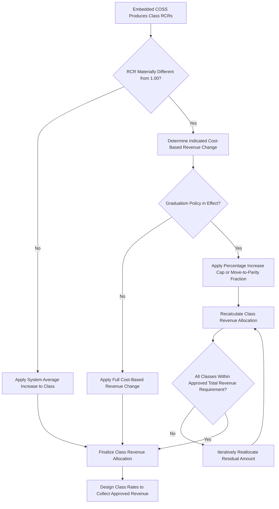

## Class Revenue to Cost Ratios and Rate Gradualism

### Overview

Class Revenue to Cost Ratio (RCR), also referred to as the rate of return index or cost coverage ratio, is a diagnostic metric produced from an embedded Cost of Service Study (COSS) that measures how closely the revenue collected from a given customer class aligns with the cost allocated to serve that class. Rate gradualism is the companion regulatory policy principle governing how quickly and by how much RCRs are permitted to move toward unity (1.00) when a commission adjusts class revenue allocations in a rate case, in order to avoid rate shock to over- or under-recovering classes.

Together, these two concepts form the bridge between the technical output of a Cost of Service Study and the practical, policy-driven decision of how a commission actually spreads an approved revenue requirement increase or decrease across customer classes.

### The Revenue to Cost Ratio: Definition and Calculation

The RCR for a given class is calculated as:

$$RCR_{class} = \frac{Revenue_{class}}{Cost\ of\ Service_{class}}$$

where:

- $Revenue_{class}$ is the revenue currently collected from the class at present rates (test-year billed revenue), and
- $Cost\ of\ Service_{class}$ is the fully allocated cost of service assigned to that class from the embedded COSS (using the utility's or Staff's/intervenor's chosen classification and allocation methodology).

An equivalent formulation expresses the ratio in terms of achieved rate of return:

$$RCR_{class} = \frac{ROR_{class}}{ROR_{system}}$$

where $ROR_{class}$ is the class-specific rate of return achieved at current rates and $ROR_{system}$ is the overall authorized or achieved system average rate of return.

**Interpretation**

- $RCR = 1.00$: The class pays exactly its allocated cost of service (parity).
- $RCR > 1.00$: The class is over-recovering — it pays more than its allocated cost, effectively subsidizing other classes.
- $RCR < 1.00$: The class is under-recovering — it pays less than its allocated cost, effectively being subsidized by other classes.

### Illustrative Numerical Example

| Class | Test-Year Revenue ($M) | Allocated Cost of Service ($M) | RCR |
| --- | --- | --- | --- |
| Residential | $120 | $140 | 0.857 |
| Small Commercial | $60 | $58 | 1.034 |
| Large Commercial/Industrial | $90 | $75 | 1.200 |
| Street Lighting | $5 | $4.5 | 1.111 |
| **Total System** | **$275** | **$277.5** | **0.991** |

In this example, Residential is under-recovering (RCR of 0.857), while Large Commercial/Industrial is significantly over-recovering (RCR of 1.200), indicating a cross-subsidy flowing from large commercial/industrial customers toward residential customers under current rates.

### Why RCRs Diverge from Unity

**Key Points**

- **Historical rate design inertia**: Rates evolve incrementally over many rate cases; a class's RCR can drift from parity over time even if it started near 1.00.
- **Methodological choices in the COSS**: The classification (demand vs. energy vs. customer) and allocation method (e.g., coincident peak vs. non-coincident peak, average and excess demand) directly affect each class's allocated cost, and different methods can produce different RCRs for the same class.
- **Policy-driven deviations**: Commissions may intentionally price certain classes (e.g., low-income residential, economic development rates for large industrials) away from strict cost causation for social or economic policy reasons.
- **Load factor differences**: Classes with poor load factors (high peak demand relative to average energy use, such as many residential classes) tend to impose higher demand-related costs per unit of energy sold, which can produce RCRs below unity if legacy rate design under-recovers demand costs through volumetric energy charges.
- **Declining Block Rate Legacy**: [Inference] In utilities with legacy declining-block rate structures inherited from earlier regulatory eras, class RCR divergence can partly reflect rate design choices made under different cost structures than exist today.

### Rate Gradualism: Purpose and Rationale

Rate gradualism is the regulatory principle that any revenue requirement change approved in a rate case should not be allocated to customer classes strictly and immediately in proportion to their calculated cost of service deviation, but should instead be phased in over time or subject to a maximum permissible rate of change per class per rate case.

**Key Points**

- **Rate shock avoidance**: A class with an RCR far below 1.00 (e.g., 0.75) would, under strict cost-of-service pricing, face a large single-step rate increase to reach parity; gradualism caps this increase.
- **Customer and political acceptability**: Large, sudden bill increases generate customer backlash, bill payment difficulties, and political pressure on regulators; gradualism smooths the transition.
- **Predictability for planning**: Both utilities and large customers benefit from predictable, incremental rate changes rather than volatile shifts tied purely to COSS results, which can themselves vary materially between rate cases due to methodology or load research updates.
- **Statutory or Commission Precedent Constraints**: Many jurisdictions have adopted formal or informal caps (e.g., "no class shall receive more than X% or Y times the system average percentage increase") as standing rate design policy.

### Common Gradualism Mechanisms

**1. Percentage Increase Caps ("Rate Increase Bands")**

The most common mechanism. The commission establishes a band around the system average percentage increase, such as:

$$\Delta\%_{class} \leq k \times \Delta\%_{system}$$

where $k$ is a multiplier (commonly in the range of 1.5 to 2.0) applied to the system average approved percentage increase, capping how much larger any single class's increase can be relative to the system average.

**2. Absolute Percentage Caps**

A flat ceiling (e.g., no class increase greater than 10% in a single rate case), independent of the system average increase.

**3. Move-to-Parity Fraction ("Partial Cost of Service Adjustment")**

Rather than moving each class fully to its cost-based revenue requirement, the commission approves movement of only a fraction (e.g., 25% or 50%) of the gap between current revenue and cost-based revenue in each rate case:

$$Revenue_{class}^{new} = Revenue_{class}^{current} + f \times (Cost_{class} - Revenue_{class}^{current})$$

where $f$ is the movement fraction (e.g., $f = 0.5$ moves the class halfway to full cost parity).

**4. Minimum/Maximum RCR Bands**

The commission establishes a target RCR range (e.g., 0.95 to 1.05) and adjusts class revenues only enough to bring RCRs within that band, rather than exactly to 1.00.

### Numerical Illustration of Gradualism Application

Continuing the earlier example, assume the commission approves a system average revenue increase of 5% and applies a gradualism cap of $k = 1.5$ (i.e., no class may receive more than 7.5% increase) along with a 50% move-to-parity approach for classes below the cap.

| Class | Current Revenue ($M) | Indicated COS-Based Increase | Capped/Gradualism-Adjusted Increase | Approved Revenue ($M) |
| --- | --- | --- | --- | --- |
| Residential | $120 | +16.7% (to reach cost parity) | +7.5% (capped) | $129.0 |
| Small Commercial | $60 | +(-3.3%) | 0% (floor applied; system avg still requires some increase) | ~$61.5 (system-average applied) |
| Large Commercial/Industrial | $90 | -16.7% (indicated decrease) | Increase still applied, but minimal (e.g., +1%) | $90.9 |
| Street Lighting | $5 | -10% (indicated decrease) | Small increase applied | $5.1 |

[Inference] The exact mechanics of how a "floor" is applied to classes with indicated cost-based decreases (i.e., whether such classes receive zero increase, a small increase, or an actual decrease) vary significantly by jurisdiction and are often a heavily litigated component of rate spread proceedings.

### Gradualism Decision Process

### RCR Convergence Under Gradualism (svg_diagram)

<svg xmlns="http://www.w3.org/2000/svg" viewBox="0 0 700 380">
\<style\>
.title { font: bold 15px sans-serif; fill: #1a1a2e; }
.axis { stroke: #333; stroke-width: 1.5; }
.gridline { stroke: #ddd; stroke-width: 1; }
.parity { stroke: #888; stroke-width: 1.5; stroke-dasharray: 6,4; }
.resline { stroke: #c0392b; stroke-width: 2.5; fill: none; }
.lgline { stroke: #2980b9; stroke-width: 2.5; fill: none; }
.lbl { font: 12px sans-serif; fill: #333; }
.legend { font: 11px sans-serif; fill: #333; }
\</style\>
<text x="350" y="25" text-anchor="middle" class="title">Class RCR Convergence Toward Parity Under Gradualism (svg_diagram)</text>
<line x1="80" y1="320" x2="620" y2="320" class="axis" />
<line x1="80" y1="60" x2="80" y2="320" class="axis" />
<line x1="80" y1="190" x2="620" y2="190" class="parity" />
<text x="630" y="194" class="lbl">1.00 (parity)</text>

<text x="60" y="325" text-anchor="end" class="lbl">0.70</text>

<text x="60" y="255" text-anchor="end" class="lbl">0.85</text>

<text x="60" y="190" text-anchor="end" class="lbl">1.00</text>

<text x="60" y="125" text-anchor="end" class="lbl">1.15</text>

<text x="60" y="65" text-anchor="end" class="lbl">1.30</text>

<text x="140" y="340" text-anchor="middle" class="lbl">Case 1</text>

<text x="300" y="340" text-anchor="middle" class="lbl">Case 2</text>

<text x="460" y="340" text-anchor="middle" class="lbl">Case 3</text>

<text x="580" y="340" text-anchor="middle" class="lbl">Case 4</text>

<polyline points="140,255 300,235 460,215 580,200" class="resline" />
<circle cx="140" cy="255" r="4" fill="#c0392b" />
<circle cx="300" cy="235" r="4" fill="#c0392b" />
<circle cx="460" cy="215" r="4" fill="#c0392b" />
<circle cx="580" cy="200" r="4" fill="#c0392b" />
<polyline points="140,125 300,150 460,170 580,185" class="lgline" />
<circle cx="140" cy="125" r="4" fill="#2980b9" />
<circle cx="300" cy="150" r="4" fill="#2980b9" />
<circle cx="460" cy="170" r="4" fill="#2980b9" />
<circle cx="580" cy="185" r="4" fill="#2980b9" />
<line x1="420" y1="60" x2="440" y2="60" class="resline" />
<text x="445" y="64" class="legend">Residential (below parity, rising)</text>
<line x1="420" y1="78" x2="440" y2="78" class="lgline" />
<text x="445" y="82" class="legend">Large C&amp;I (above parity, falling)</text>
</svg>

### Relationship to Interclass Subsidization

RCR analysis is the primary tool regulators use to identify and quantify interclass subsidization:

- The total dollar magnitude of subsidy flowing to an under-recovering class equals $Cost_{class} - Revenue_{class}$ (a positive number when RCR < 1.00).
- The sum of all classes' dollar deviations from parity nets to approximately zero (subject to minor reconciliation items), since the system as a whole must recover the full authorized revenue requirement.
- Persistent, large subsidies (e.g., RCR below 0.80 or above 1.20 sustained over multiple rate cases) are often cited by intervenors as evidence that gradualism policy, while protecting rate shock, is perpetuating structurally inefficient and inequitable rate design.

### Practical and Policy Tensions

**Key Points**

- **Efficiency vs. Equity/Stability Trade-off**: Strict, immediate cost-based rate spread maximizes allocative efficiency (Bonbright's cost-causation principle) but conflicts with rate stability and gradual change objectives (also a recognized Bonbright ratemaking criterion).
- **Cumulative Effect Across Rate Cases**: Because gradualism caps limit movement per case, a class may take multiple rate cases (potentially spanning many years) to reach cost parity, during which time cost allocation results themselves may shift due to changing load patterns, new COSS methodologies, or system growth.
- **Interaction with Rate Design Within a Class**: Even after class revenue is set, the RCR analysis does not dictate how that revenue is collected from individual rate schedules or blocks within the class (e.g., customer charge vs. volumetric charge); that separate rate design step can itself reintroduce or mask intra-class subsidies.
- **Methodology Sensitivity**: [Inference] Because RCRs are highly sensitive to the underlying COSS classification and allocation methodology chosen (e.g., 12 Coincident Peak vs. 12 Coincident Peak and 1 Non-Coincident Peak demand allocators), parties in a rate case often present competing COSS studies yielding different RCRs for the same classes, making the gradualism debate inseparable from the underlying cost study methodology dispute.

### Typical Regulatory Presentation Format

Utilities and Commission Staff typically present RCR and gradualism analysis in rate case testimony via a "revenue allocation" or "rate spread" exhibit, showing for each class:

1. Present rates: test-year revenue, allocated cost of service, RCR
2. Proposed rates: indicated cost-based revenue requirement, resulting cost-based RCR
3. Gradualism-adjusted proposed revenue: capped or phased increase, resulting adjusted RCR
4. A narrative justification tying the gradualism approach to prior Commission precedent, statutory rate design principles, or settlement agreements from previous cases

### Related Topics

- Embedded Cost of Service Study Classification and Allocation Methods
- Bonbright's Principles of Public Utility Rates
- Revenue Requirement Determination and Overall Rate of Return
- Rate Design Within Classes: Customer, Demand, and Energy Charge Structures
- Interclass and Intraclass Subsidization Analysis
- Settlement Agreements and Multi-Year Rate Plans in Rate Spread Determination
- Marginal Cost of Service as an Alternative Rate Design Benchmark
- Low-Income and Special Rate Class Policy Considerations